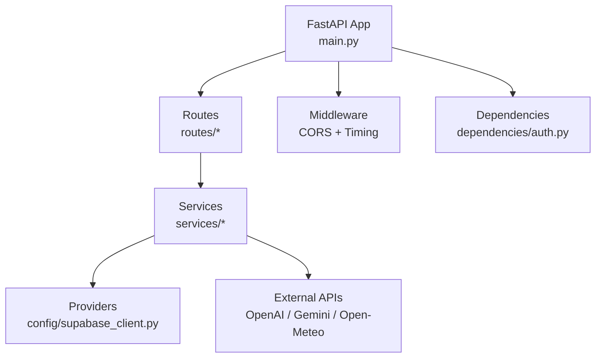
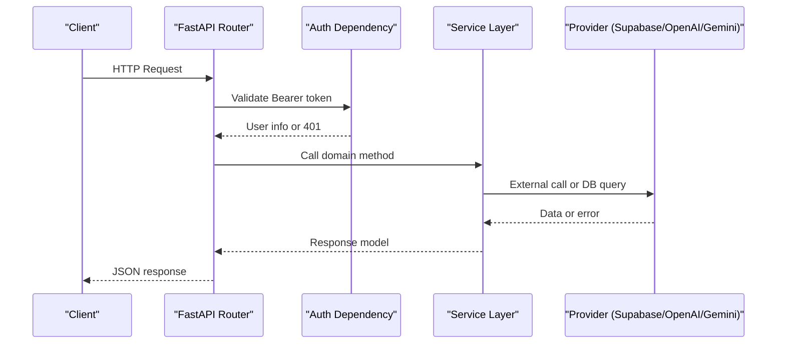
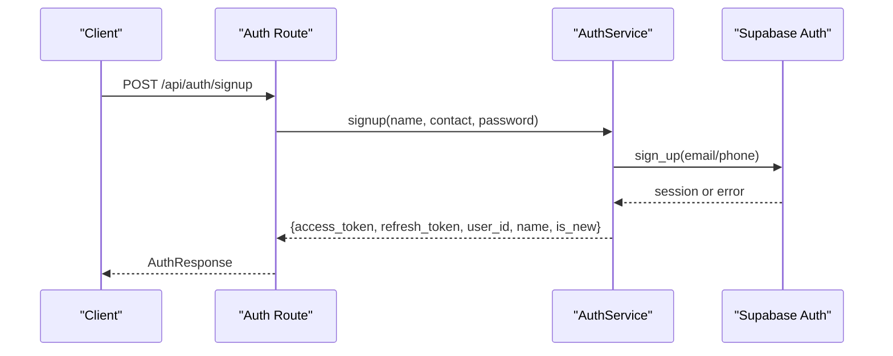
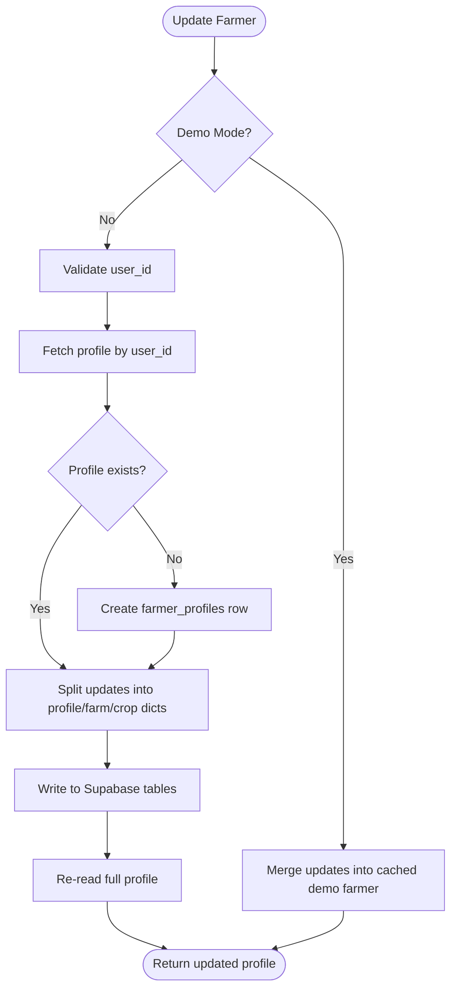
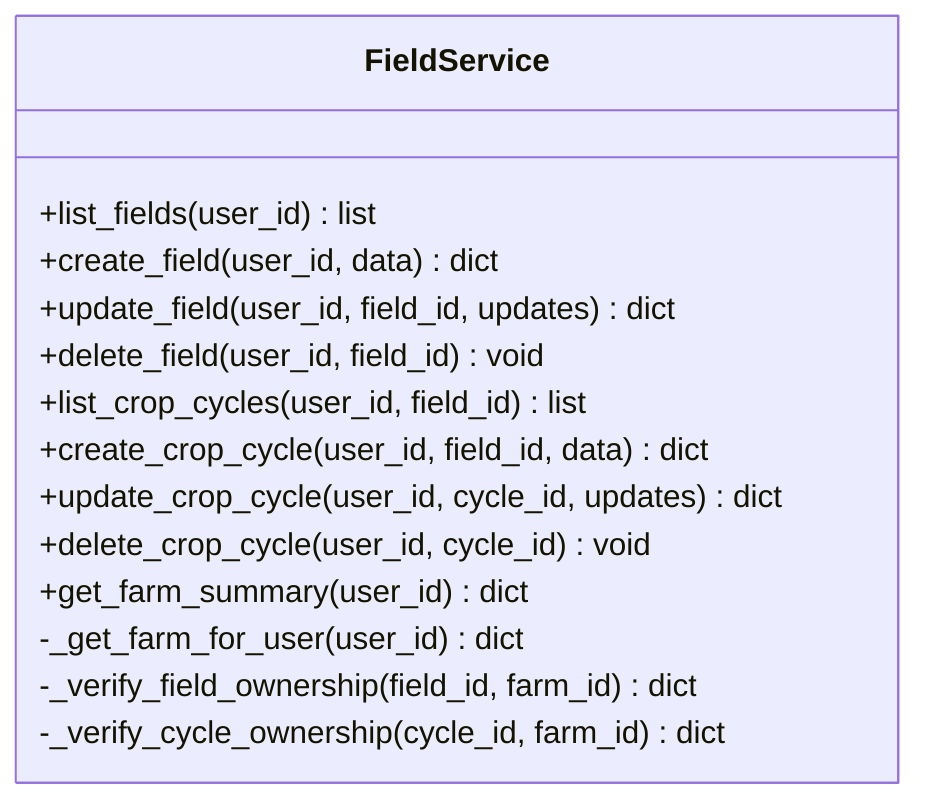
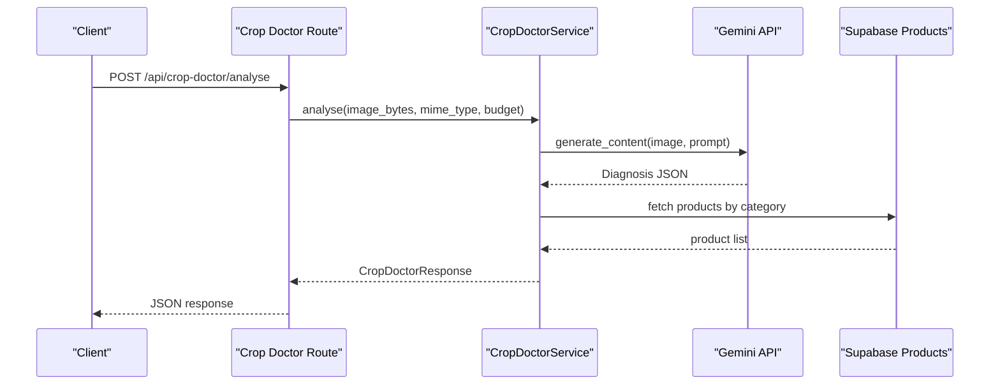
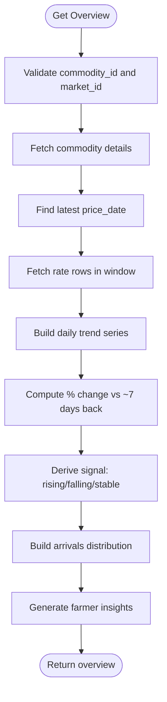
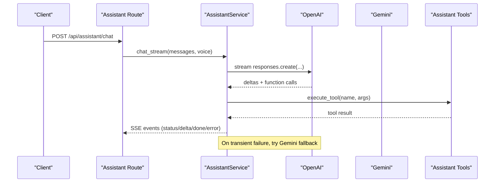
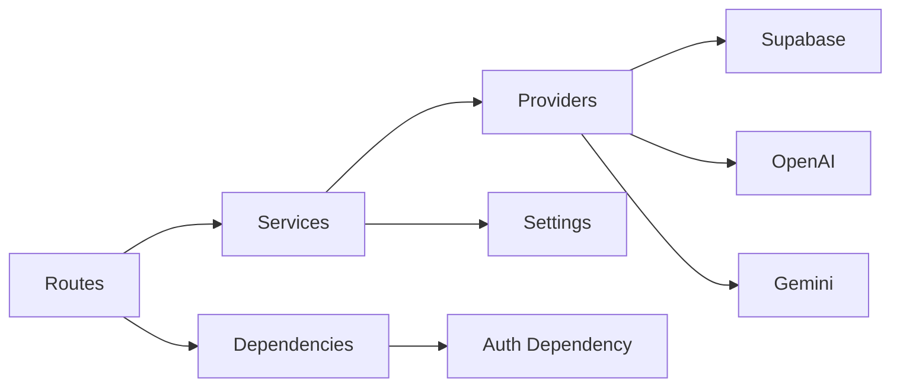

# Backend Services

<cite>
**Referenced Files in This Document**
- [main.py](file://Backend/main.py)
- [settings.py](file://Backend/config/settings.py)
- [supabase_client.py](file://Backend/config/supabase_client.py)
- [auth.py](file://Backend/routes/auth.py)
- [farmer.py](file://Backend/routes/farmer.py)
- [field.py](file://Backend/routes/field.py)
- [crop_doctor.py](file://Backend/routes/crop_doctor.py)
- [market.py](file://Backend/routes/market.py)
- [support.py](file://Backend/routes/support.py)
- [assistant.py](file://Backend/routes/assistant.py)
- [auth_service.py](file://Backend/services/auth_service.py)
- [farmer_service.py](file://Backend/services/farmer_service.py)
- [field_service.py](file://Backend/services/field_service.py)
- [crop_doctor_service.py](file://Backend/services/crop_doctor_service.py)
- [market_service.py](file://Backend/services/market_service.py)
- [support_service.py](file://Backend/services/support_service.py)
- [assistant_service.py](file://Backend/services/assistant_service.py)
- [assistant_tools.py](file://Backend/services/assistant_tools.py)
- [auth_dependency.py](file://Backend/dependencies/auth.py)
</cite>

## Table of Contents
1. Introduction
2. Project Structure
3. Core Components
4. Architecture Overview
5. Detailed Component Analysis
6. Dependency Analysis
7. Performance Considerations
8. Troubleshooting Guide
9. Conclusion
10. Appendices

## Introduction
This document explains the backend services for Green Flora’s FastAPI application. It focuses on the modular service layer that follows a Route → Service → Provider pattern, documents each core service (authentication, farmer management, field operations, crop doctor, market data, and assistant), and describes dependency injection, middleware configuration, request/response handling, error handling strategies, Pydantic validation, logging, external integrations (Supabase, Open-Meteo, OpenAI, Gemini), configuration management, environment variables, and security measures (CORS, authentication middleware, input sanitization).

## Project Structure
The backend is organized by feature with clear separation:
- Routes define HTTP endpoints and delegate to services.
- Services encapsulate business logic and coordinate providers (database, external APIs).
- Providers include Supabase client, OpenAI/Gemini clients, and weather/market tools.
- Configuration is centralized via settings and environment variables.
- Dependencies provide reusable FastAPI components like authentication.

**Diagram sources**
- [main.py:15-47](file://Backend/main.py#L15-L47)
- [supabase_client.py:16-47](file://Backend/config/supabase_client.py#L16-L47)

**Section sources**
- [main.py:1-57](file://Backend/main.py#L1-L57)

## Core Components
- Authentication service: handles signup/login/token refresh/logout and user lookup via Supabase Auth.
- Farmer service: reads/updates farmer profiles with auto-provisioning and demo-mode fallbacks.
- Field service: manages fields and crop cycles with ownership checks and demo-mode behavior.
- Crop Doctor service: image analysis via Gemini, product matching from Supabase, budget-aware recommendations, low-cost actions.
- Market service: serves AMIS-ingested market data with caching, trend computation, signals, and insights.
- Support service: returns active government support records with short TTL caching.
- Assistant service: central AI orchestration using OpenAI as primary provider and Gemini as fallback; includes speech-to-text and text-to-speech, tool execution, and streaming SSE events.

**Section sources**
- [auth_service.py:32-193](file://Backend/services/auth_service.py#L32-L193)
- [farmer_service.py:51-491](file://Backend/services/farmer_service.py#L51-L491)
- [field_service.py:89-788](file://Backend/services/field_service.py#L89-L788)
- [crop_doctor_service.py:118-435](file://Backend/services/crop_doctor_service.py#L118-L435)
- [market_service.py:47-653](file://Backend/services/market_service.py#L47-L653)
- [support_service.py:40-95](file://Backend/services/support_service.py#L40-L95)
- [assistant_service.py:106-926](file://Backend/services/assistant_service.py#L106-L926)

## Architecture Overview
The application uses a layered architecture:
- Routes are thin and validate inputs via Pydantic schemas.
- Services implement domain logic and interact with providers.
- Providers abstract external systems (Supabase, OpenAI, Gemini, Open-Meteo).
- Middleware adds CORS and request timing headers.
- Dependencies inject authenticated user context into routes.

**Diagram sources**
- [auth_dependency.py:36-101](file://Backend/dependencies/auth.py#L36-L101)
- [auth_service.py:32-193](file://Backend/services/auth_service.py#L32-L193)
- [main.py:21-47](file://Backend/main.py#L21-L47)

## Detailed Component Analysis

### Authentication Service
Responsibilities:
- Signup with email or phone, login, token refresh, logout, and user lookup.
- Raises specific exceptions for known errors and service unavailability.
- Validates contact type and stores metadata (name) in user_metadata.

Error handling:
- Maps service exceptions to HTTP status codes in routes.
- Logs warnings for failures and provides friendly messages.

Request/response flow:
- Routes accept Pydantic requests and return Pydantic responses.
- Protected endpoints use dependency injection to extract user info.

**Diagram sources**
- [auth.py:68-77](file://Backend/routes/auth.py#L68-L77)
- [auth_service.py:51-92](file://Backend/services/auth_service.py#L51-L92)

**Section sources**
- [auth_service.py:24-193](file://Backend/services/auth_service.py#L24-L193)
- [auth.py:45-132](file://Backend/routes/auth.py#L45-L132)
- [auth_dependency.py:36-101](file://Backend/dependencies/auth.py#L36-L101)

### Farmer Management Service
Responsibilities:
- Get/update farmer profile with auto-provisioning when missing.
- Demo mode returns seeded data; live mode queries Supabase.
- Splits flat updates into per-table writes (profiles, farms, crops).

Data integrity:
- Enforces required user_id in live mode.
- Auto-provisions farmer_profiles and farms lazily.

**Diagram sources**
- [farmer_service.py:97-208](file://Backend/services/farmer_service.py#L97-L208)

**Section sources**
- [farmer_service.py:51-491](file://Backend/services/farmer_service.py#L51-L491)
- [farmer.py:50-161](file://Backend/routes/farmer.py#L50-L161)

### Field Operations Service
Responsibilities:
- CRUD for fields and crop cycles with farm ownership verification.
- Demo mode maintains in-memory caches; live mode enforces ownership and persists to Supabase.
- Links crop cycles to crops table and resolves crop names/stages.

Ownership checks:
- Ensures fields and crop cycles belong to the authenticated user’s farm.

**Diagram sources**
- [field_service.py:89-788](file://Backend/services/field_service.py#L89-L788)

**Section sources**
- [field_service.py:89-788](file://Backend/services/field_service.py#L89-L788)

### Crop Doctor Service
Responsibilities:
- Analyze uploaded images via Gemini to produce structured diagnosis.
- Match products from Supabase based on problem type and keywords.
- Apply farmer budget to filter/rank recommendations.
- Provide low-cost fallback actions when paid options do not fit.

External integration:
- Uses Gemini API key from settings; raises runtime error if not configured.

**Diagram sources**
- [crop_doctor_service.py:131-165](file://Backend/services/crop_doctor_service.py#L131-L165)
- [crop_doctor_service.py:171-258](file://Backend/services/crop_doctor_service.py#L171-L258)
- [crop_doctor_service.py:264-339](file://Backend/services/crop_doctor_service.py#L264-L339)

**Section sources**
- [crop_doctor_service.py:118-435](file://Backend/services/crop_doctor_service.py#L118-L435)

### Market Data Service
Responsibilities:
- Serve commodities and market overview with caching and pagination.
- Compute representative prices, trends, change percentages, signals, and insights.
- Ensure data integrity: never fabricate values; return empty states when data is unavailable.

Caching:
- Commodities and markets maps cached with TTL to reduce database load.

**Diagram sources**
- [market_service.py:158-343](file://Backend/services/market_service.py#L158-L343)
- [market_service.py:398-468](file://Backend/services/market_service.py#L398-L468)

**Section sources**
- [market_service.py:47-653](file://Backend/services/market_service.py#L47-L653)

### Government Support Service
Responsibilities:
- Return active government support record with short TTL caching.
- Returns None when no active record exists; False data_available when Supabase is not configured.

**Section sources**
- [support_service.py:40-95](file://Backend/services/support_service.py#L40-L95)

### Assistant Service
Responsibilities:
- Central AI orchestration with OpenAI as primary provider and Gemini as fallback.
- Streaming chat via SSE events with status, delta, done, and error types.
- Tool execution for weather, market data, and agricultural products search.
- Speech-to-text and text-to-speech using OpenAI models.
- Localized greeting generation with caching and fallbacks.

Provider strategy:
- Primary: OpenAI Responses API with function tools and web search.
- Fallback: Gemini Flash with Google Search grounding and function calling.
- Utility: gpt-4o-mini for cheap tasks (greeting, entity extraction).

**Diagram sources**
- [assistant_service.py:175-287](file://Backend/services/assistant_service.py#L175-L287)
- [assistant_service.py:293-425](file://Backend/services/assistant_service.py#L293-L425)
- [assistant_service.py:431-540](file://Backend/services/assistant_service.py#L431-L540)

**Section sources**
- [assistant_service.py:106-926](file://Backend/services/assistant_service.py#L106-L926)
- [assistant_tools.py:1-200](file://Backend/services/assistant_tools.py#L1-L200)

## Dependency Analysis
Components and their relationships:
- Routes depend on services for business logic.
- Services depend on providers (Supabase, OpenAI, Gemini).
- Dependencies inject authentication context into routes.
- Settings centralize configuration and environment variables.

**Diagram sources**
- [main.py:41-47](file://Backend/main.py#L41-L47)
- [auth_dependency.py:36-101](file://Backend/dependencies/auth.py#L36-L101)
- [settings.py:48-123](file://Backend/config/settings.py#L48-L123)

**Section sources**
- [main.py:15-47](file://Backend/main.py#L15-L47)
- [settings.py:48-123](file://Backend/config/settings.py#L48-L123)

## Performance Considerations
- Caching: Market and support services cache frequently accessed data with short TTLs to reduce database load.
- Pagination: Market service paginates large datasets to avoid memory spikes.
- Demo mode: In-memory caches for demo data improve responsiveness during development.
- Timeouts: Supabase client configured with explicit timeouts; AI services use configurable timeouts for streaming and audio.
- Logging: All services log warnings and exceptions for observability.

[No sources needed since this section provides general guidance]

## Troubleshooting Guide
Common issues and resolutions:
- Authentication service not configured: Ensure SUPABASE_URL and SUPABASE_SERVICE_KEY are set; routes return 503 when unavailable.
- Invalid or expired token: Dependency raises 401; instruct users to re-authenticate.
- Database not configured: Farmer and field services raise RuntimeError; set Supabase credentials.
- Gemini API key missing: Crop Doctor raises RuntimeError; configure GEMINI_API_KEY.
- Market data unavailable: Market service returns empty results; UI should render honest empty states.
- Assistant provider failures: Assistant service emits error events with retryable flags; UI can offer retry.

**Section sources**
- [auth_service.py:24-46](file://Backend/services/auth_service.py#L24-L46)
- [auth_dependency.py:46-69](file://Backend/dependencies/auth.py#L46-L69)
- [farmer_service.py:82-116](file://Backend/services/farmer_service.py#L82-L116)
- [field_service.py:122-126](file://Backend/services/field_service.py#L122-L126)
- [crop_doctor_service.py:171-177](file://Backend/services/crop_doctor_service.py#L171-L177)
- [market_service.py:67-68](file://Backend/services/market_service.py#L67-L68)
- [assistant_service.py:188-194](file://Backend/services/assistant_service.py#L188-L194)

## Conclusion
Green Flora’s backend implements a clean, modular architecture with clear separation between routes, services, and providers. The system supports both demo and live modes, robust error handling, and comprehensive external integrations. Security is enforced through CORS, authentication middleware, and input validation via Pydantic. Configuration is centralized and environment-driven, enabling flexible deployment across environments.

[No sources needed since this section summarizes without analyzing specific files]

## Appendices

### Configuration Management and Environment Variables
Centralized settings module loads environment variables and exposes typed configuration:
- Demo mode toggle and CORS origins.
- Supabase credentials and keys.
- External API keys (OpenWeather, Alibaba, Gemini, OpenAI).
- AI model selections and timeouts.
- Application metadata (name, environment).

Environment file:
- .env in Backend directory contains secrets and configuration.

**Section sources**
- [settings.py:24-123](file://Backend/config/settings.py#L24-L123)

### Security Measures
- CORS: Configured via settings.cors_origins; allows credentials and all methods/headers for development.
- Authentication: Bearer token validation via dependencies; protected routes require valid tokens.
- Input sanitization: Pydantic schemas validate request payloads; assistant service strips Markdown links and citations from streamed text.
- Rate limiting: Not explicitly implemented in the provided code; consider adding middleware for production.

**Section sources**
- [main.py:21-28](file://Backend/main.py#L21-L28)
- [auth_dependency.py:36-101](file://Backend/dependencies/auth.py#L36-L101)
- [assistant_service.py:129-170](file://Backend/services/assistant_service.py#L129-L170)

### External API Integrations
- Supabase: Centralized client with HTTPX configuration for stable connections; used for auth, database, and storage.
- Open-Meteo: Referenced in settings but not directly used in analyzed services; likely consumed via assistant tools.
- OpenAI: Primary provider for assistant chat, transcription, TTS, and utility tasks.
- Gemini: Fallback provider for assistant and image analysis for crop doctor.

**Section sources**
- [supabase_client.py:16-47](file://Backend/config/supabase_client.py#L16-L47)
- [settings.py:70-114](file://Backend/config/settings.py#L70-L114)
- [assistant_service.py:109-127](file://Backend/services/assistant_service.py#L109-L127)
- [crop_doctor_service.py:121-125](file://Backend/services/crop_doctor_service.py#L121-L125)