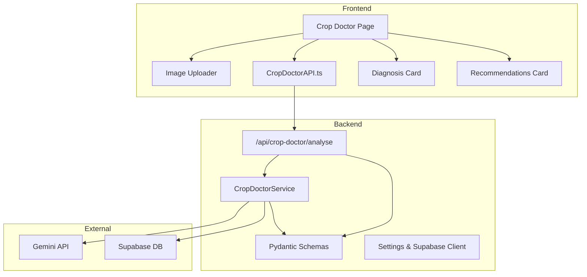
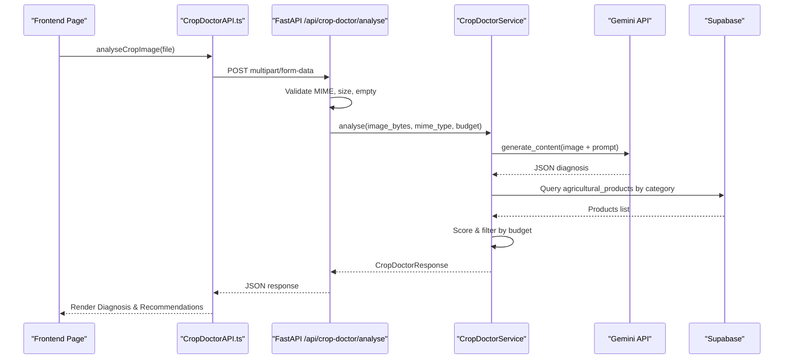
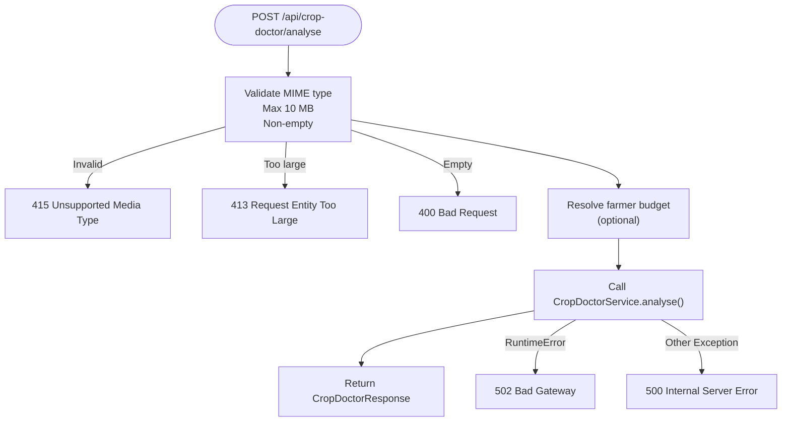
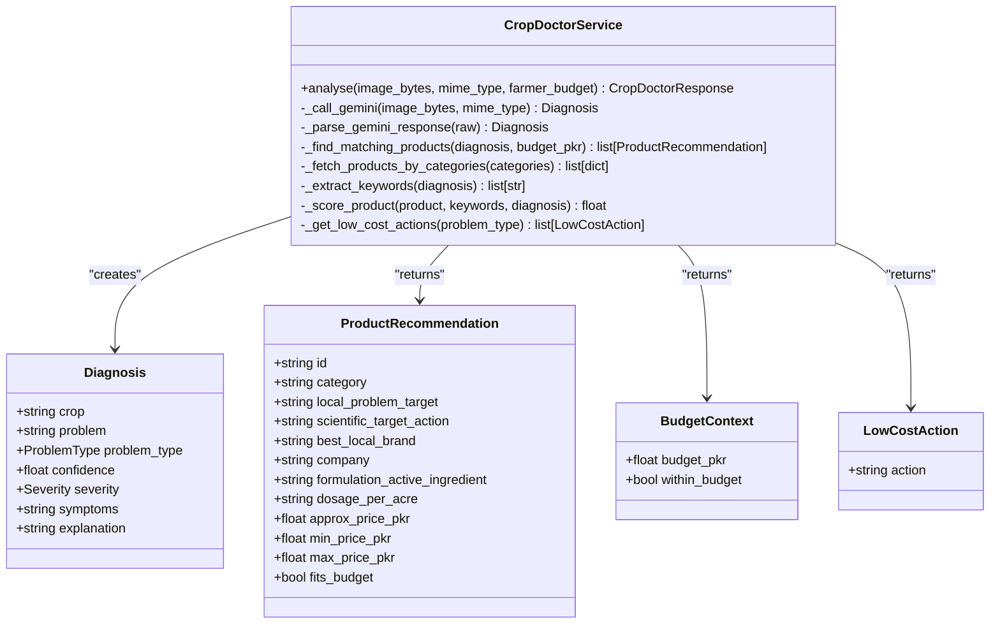
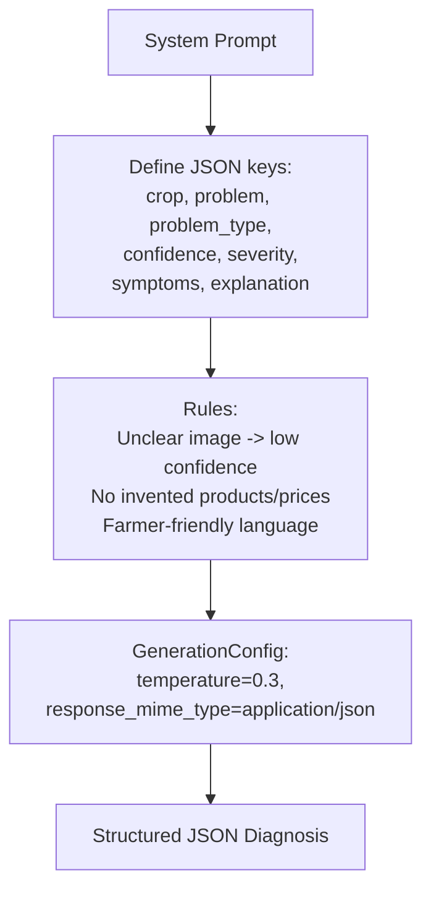
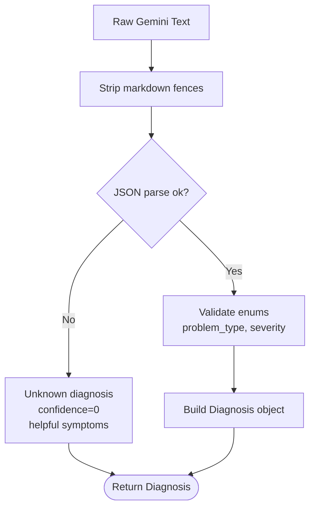
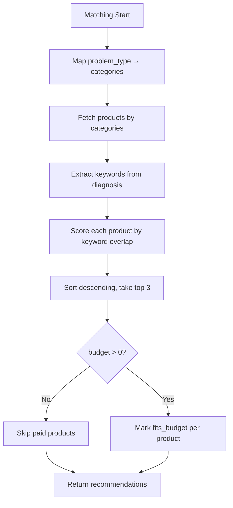
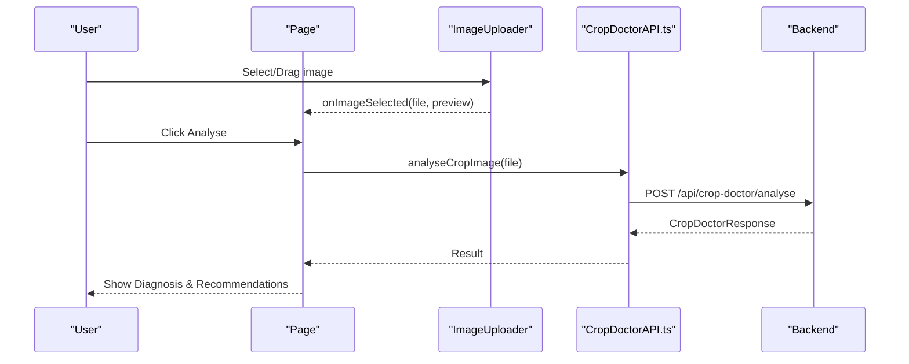
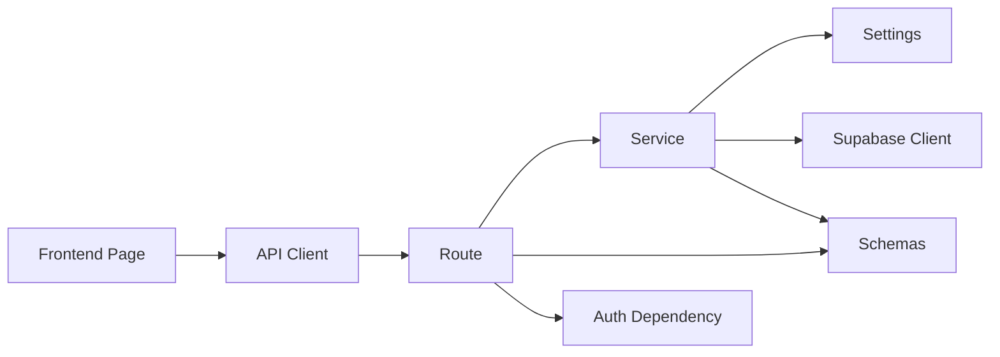

# Crop Doctor Service

<cite>
**Referenced Files in This Document**
- [crop_doctor.py](file://Backend/routes/crop_doctor.py)
- [crop_doctor_service.py](file://Backend/services/crop_doctor_service.py)
- [crop_doctor.py (schemas)](file://Backend/schemas/crop_doctor.py)
- [settings.py](file://Backend/config/settings.py)
- [supabase_client.py](file://Backend/config/supabase_client.py)
- [auth.py](file://Backend/dependencies/auth.py)
- [CropDoctorAPI.ts](file://Frontend/greenflora/services/CropDoctorAPI.ts)
- [cropDoctor.ts (types)](file://Frontend/greenflora/types/cropDoctor.ts)
- [page.tsx (Crop Doctor page)](file://Frontend/greenflora/app/crop-doctor/page.tsx)
- [ImageUploader.tsx](file://Frontend/greenflora/components/cropDoctor/ImageUploader.tsx)
- [DiagnosisCard.tsx](file://Frontend/greenflora/components/cropDoctor/DiagnosisCard.tsx)
- [RecommendationsCard.tsx](file://Frontend/greenflora/components/cropDoctor/RecommendationsCard.tsx)
</cite>

## Table of Contents
1. [Introduction](#introduction)
2. [Project Structure](#project-structure)
3. [Core Components](#core-components)
4. [Architecture Overview](#architecture-overview)
5. [Detailed Component Analysis](#detailed-component-analysis)
6. [Dependency Analysis](#dependency-analysis)
7. [Performance Considerations](#performance-considerations)
8. [Troubleshooting Guide](#troubleshooting-guide)
9. [Conclusion](#conclusion)
10. [Appendices](#appendices)

## Introduction
This document explains the AI-powered Crop Doctor service that analyzes crop images to detect plant diseases and provide budget-aware treatment recommendations. The workflow uses a FastAPI backend to accept image uploads, sends them to Google Gemini for structured diagnosis, matches products from a Supabase database, and returns a comprehensive response to the Next.js frontend for display.

Key capabilities:
- Image upload validation and secure processing on the backend
- Prompt-engineered Gemini analysis returning structured JSON
- Product matching and ranking based on problem type and keywords
- Budget-aware filtering and low-cost fallback actions
- Robust error handling for API failures, timeouts, and invalid inputs
- Frontend integration with clear states, retry flows, and user-friendly UI

## Project Structure
The Crop Doctor feature spans both backend and frontend layers:

- Backend
  - Routes: HTTP endpoint for image analysis
  - Services: Business logic for Gemini calls, product matching, and budgeting
  - Schemas: Pydantic models defining request/response contracts
  - Config: Settings and Supabase client initialization
  - Dependencies: Optional authentication helper

- Frontend
  - Page: User flow for uploading and viewing results
  - Components: Image uploader, diagnosis card, recommendations card
  - Services: API client calling the backend endpoint
  - Types: TypeScript interfaces mirroring backend schemas

**Diagram sources**
- [crop_doctor.py:48-125](file://Backend/routes/crop_doctor.py#L48-L125)
- [crop_doctor_service.py:131-165](file://Backend/services/crop_doctor_service.py#L131-L165)
- [CropDoctorAPI.ts:47-106](file://Frontend/greenflora/services/CropDoctorAPI.ts#L47-L106)
- [page.tsx (Crop Doctor page):43-66](file://Frontend/greenflora/app/crop-doctor/page.tsx#L43-L66)

**Section sources**
- [crop_doctor.py:48-125](file://Backend/routes/crop_doctor.py#L48-L125)
- [crop_doctor_service.py:131-165](file://Backend/services/crop_doctor_service.py#L131-L165)
- [CropDoctorAPI.ts:47-106](file://Frontend/greenflora/services/CropDoctorAPI.ts#L47-L106)
- [page.tsx (Crop Doctor page):43-66](file://Frontend/greenflora/app/crop-doctor/page.tsx#L43-L66)

## Core Components
- Route handler validates uploads, resolves optional user budget, and delegates analysis to the service layer. It maps errors to appropriate HTTP status codes.
- Service orchestrates Gemini analysis, parses structured JSON, queries Supabase for product matching, applies budget filters, and assembles the final response including low-cost actions when needed.
- Schemas define strict types for diagnosis, product recommendations, budget context, low-cost actions, and the full response.
- Frontend page manages state transitions (idle, analyzing, success, error), triggers analysis, and renders diagnosis and recommendations.
- Image uploader enforces file type and size constraints, supports drag-and-drop and camera capture, and previews selected images.
- Diagnosis card visualizes confidence, severity, symptoms, explanation, and category with contextual badges and progress bars.
- Recommendations card shows budget context, product cards with pricing and dosage, and low-cost actionable steps.

**Section sources**
- [crop_doctor.py:48-125](file://Backend/routes/crop_doctor.py#L48-L125)
- [crop_doctor_service.py:131-165](file://Backend/services/crop_doctor_service.py#L131-L165)
- [crop_doctor.py (schemas):41-123](file://Backend/schemas/crop_doctor.py#L41-L123)
- [page.tsx (Crop Doctor page):26-66](file://Frontend/greenflora/app/crop-doctor/page.tsx#L26-L66)
- [ImageUploader.tsx:28-56](file://Frontend/greenflora/components/cropDoctor/ImageUploader.tsx#L28-L56)
- [DiagnosisCard.tsx:21-62](file://Frontend/greenflora/components/cropDoctor/DiagnosisCard.tsx#L21-L62)
- [RecommendationsCard.tsx:28-89](file://Frontend/greenflora/components/cropDoctor/RecommendationsCard.tsx#L28-L89)

## Architecture Overview
End-to-end flow from image upload to diagnosis and recommendations:

**Diagram sources**
- [crop_doctor.py:48-125](file://Backend/routes/crop_doctor.py#L48-L125)
- [crop_doctor_service.py:171-205](file://Backend/services/crop_doctor_service.py#L171-L205)
- [crop_doctor_service.py:264-339](file://Backend/services/crop_doctor_service.py#L264-L339)
- [CropDoctorAPI.ts:47-106](file://Frontend/greenflora/services/CropDoctorAPI.ts#L47-L106)
- [page.tsx (Crop Doctor page):43-66](file://Frontend/greenflora/app/crop-doctor/page.tsx#L43-L66)

## Detailed Component Analysis

### Backend Route: /api/crop-doctor/analyse
- Accepts multipart image upload with strict MIME and size checks
- Resolves optional authenticated user budget via dependency
- Delegates analysis to service and maps exceptions to HTTP errors
- Returns structured CropDoctorResponse validated by Pydantic schema

**Diagram sources**
- [crop_doctor.py:48-125](file://Backend/routes/crop_doctor.py#L48-L125)

**Section sources**
- [crop_doctor.py:48-125](file://Backend/routes/crop_doctor.py#L48-L125)
- [auth.py:72-101](file://Backend/dependencies/auth.py#L72-L101)

### Service Layer: CropDoctorService
- Initializes Gemini client once using settings
- Sends image to Gemini with system prompt enforcing strict JSON output
- Parses response into Diagnosis model with safe fallbacks
- Queries Supabase for products in relevant categories
- Scores products against diagnosis keywords and ranks top matches
- Applies budget filtering and marks fits_budget
- Generates low-cost actions when no suitable paid options exist

**Diagram sources**
- [crop_doctor_service.py:118-165](file://Backend/services/crop_doctor_service.py#L118-L165)
- [crop_doctor_service.py:171-205](file://Backend/services/crop_doctor_service.py#L171-L205)
- [crop_doctor_service.py:264-339](file://Backend/services/crop_doctor_service.py#L264-L339)
- [crop_doctor_service.py:409-416](file://Backend/services/crop_doctor_service.py#L409-L416)
- [crop_doctor.py (schemas):41-123](file://Backend/schemas/crop_doctor.py#L41-L123)

**Section sources**
- [crop_doctor_service.py:118-165](file://Backend/services/crop_doctor_service.py#L118-L165)
- [crop_doctor_service.py:171-205](file://Backend/services/crop_doctor_service.py#L171-L205)
- [crop_doctor_service.py:264-339](file://Backend/services/crop_doctor_service.py#L264-L339)
- [crop_doctor_service.py:409-416](file://Backend/services/crop_doctor_service.py#L409-L416)

### Prompt Engineering for Agricultural Diagnosis
- System prompt instructs Gemini to return a single JSON object with specific keys: crop, problem, problem_type, confidence, severity, symptoms, explanation
- Rules enforce clarity thresholds, avoid inventing product names/prices, and keep language accessible to farmers
- Generation config sets temperature and response_mime_type to application/json for reliable parsing

**Diagram sources**
- [crop_doctor_service.py:42-64](file://Backend/services/crop_doctor_service.py#L42-L64)
- [crop_doctor_service.py:184-196](file://Backend/services/crop_doctor_service.py#L184-L196)

**Section sources**
- [crop_doctor_service.py:42-64](file://Backend/services/crop_doctor_service.py#L42-L64)
- [crop_doctor_service.py:184-196](file://Backend/services/crop_doctor_service.py#L184-L196)

### Response Parsing and Fallbacks
- Strips markdown fences if present before JSON parsing
- On parse failure, returns a low-confidence Unknown diagnosis with helpful symptoms and explanation
- Validates problem_type and severity enums; defaults to Unknown on mismatch
- Ensures robustness even if Gemini returns malformed content

**Diagram sources**
- [crop_doctor_service.py:207-258](file://Backend/services/crop_doctor_service.py#L207-L258)

**Section sources**
- [crop_doctor_service.py:207-258](file://Backend/services/crop_doctor_service.py#L207-L258)

### Product Matching and Budget Filtering
- Maps problem_type to preferred product categories (e.g., Disease → Fungicide)
- Fetches products from Supabase table agricultural_products by category
- Extracts keywords from diagnosis and scores products based on text overlap
- Ranks top three matches and determines fits_budget based on effective price vs budget
- Skips paid products when budget is zero to avoid irrelevant suggestions

**Diagram sources**
- [crop_doctor_service.py:264-339](file://Backend/services/crop_doctor_service.py#L264-L339)
- [crop_doctor_service.py:341-355](file://Backend/services/crop_doctor_service.py#L341-L355)
- [crop_doctor_service.py:357-403](file://Backend/services/crop_doctor_service.py#L357-L403)

**Section sources**
- [crop_doctor_service.py:264-339](file://Backend/services/crop_doctor_service.py#L264-L339)
- [crop_doctor_service.py:341-355](file://Backend/services/crop_doctor_service.py#L341-L355)
- [crop_doctor_service.py:357-403](file://Backend/services/crop_doctor_service.py#L357-L403)

### Low-Cost Action Generation
- Provides safe, generic guidance tailored to problem type when no paid option fits or none exists
- Includes actions like removing affected leaves, hand-picking insects, adding compost, mulching, etc.
- Ensures farmers always receive actionable advice even without budget or product matches

**Section sources**
- [crop_doctor_service.py:85-115](file://Backend/services/crop_doctor_service.py#L85-L115)
- [crop_doctor_service.py:409-416](file://Backend/services/crop_doctor_service.py#L409-L416)

### Frontend Integration and User Flow
- Page manages states: idle, analyzing, success, error
- Image uploader validates file type and size, supports drag-and-drop and camera capture
- API client sends multipart form data with optional auth token and handles timeouts
- Diagnosis card displays confidence, severity, symptoms, explanation, and category
- Recommendations card shows budget context, product cards with pricing/dosage, and low-cost actions

**Diagram sources**
- [page.tsx (Crop Doctor page):43-66](file://Frontend/greenflora/app/crop-doctor/page.tsx#L43-L66)
- [ImageUploader.tsx:28-56](file://Frontend/greenflora/components/cropDoctor/ImageUploader.tsx#L28-L56)
- [CropDoctorAPI.ts:47-106](file://Frontend/greenflora/services/CropDoctorAPI.ts#L47-L106)

**Section sources**
- [page.tsx (Crop Doctor page):26-66](file://Frontend/greenflora/app/crop-doctor/page.tsx#L26-L66)
- [ImageUploader.tsx:28-56](file://Frontend/greenflora/components/cropDoctor/ImageUploader.tsx#L28-L56)
- [CropDoctorAPI.ts:47-106](file://Frontend/greenflora/services/CropDoctorAPI.ts#L47-L106)
- [DiagnosisCard.tsx:64-193](file://Frontend/greenflora/components/cropDoctor/DiagnosisCard.tsx#L64-L193)
- [RecommendationsCard.tsx:91-204](file://Frontend/greenflora/components/cropDoctor/RecommendationsCard.tsx#L91-L204)

## Dependency Analysis
- Route depends on service, schemas, and optional auth dependency
- Service depends on settings (Gemini key), Supabase client, and schemas
- Frontend page depends on services and components
- External dependencies: Gemini API for image analysis, Supabase for product catalog

**Diagram sources**
- [crop_doctor.py:48-125](file://Backend/routes/crop_doctor.py#L48-L125)
- [crop_doctor_service.py:118-165](file://Backend/services/crop_doctor_service.py#L118-L165)
- [settings.py:48-86](file://Backend/config/settings.py#L48-L86)
- [supabase_client.py:16-47](file://Backend/config/supabase_client.py#L16-L47)
- [CropDoctorAPI.ts:47-106](file://Frontend/greenflora/services/CropDoctorAPI.ts#L47-L106)

**Section sources**
- [crop_doctor.py:48-125](file://Backend/routes/crop_doctor.py#L48-L125)
- [crop_doctor_service.py:118-165](file://Backend/services/crop_doctor_service.py#L118-L165)
- [settings.py:48-86](file://Backend/config/settings.py#L48-L86)
- [supabase_client.py:16-47](file://Backend/config/supabase_client.py#L16-L47)
- [CropDoctorAPI.ts:47-106](file://Frontend/greenflora/services/CropDoctorAPI.ts#L47-L106)

## Performance Considerations
- Gemini call timeout: Frontend uses a 60-second timeout to handle slow responses
- Image size limit: Enforced at both frontend and backend to prevent large payloads
- Supabase connection pooling and timeouts configured for stability
- Keyword scoring is lightweight; top-3 ranking minimizes payload size
- Low-cost actions are pre-defined strings, avoiding extra API calls

[No sources needed since this section provides general guidance]

## Troubleshooting Guide
Common issues and resolutions:
- Unsupported media type: Ensure JPEG, PNG, or WebP format
- Image too large: Compress image to under 10 MB
- Empty image: Re-select a valid file
- Network errors: Check internet connectivity and retry
- Timeout: Retry with smaller image or later
- Server errors: Retry after a short delay; check backend logs

Error mapping:
- 415 Unsupported Media Type: Invalid MIME type
- 413 Request Entity Too Large: Exceeds 10 MB
- 400 Bad Request: Empty image
- 408/504 Timeout: Frontend abort controller triggered
- 502 Bad Gateway: Gemini analysis failed
- 500 Internal Server Error: Unexpected backend error

**Section sources**
- [crop_doctor.py:63-87](file://Backend/routes/crop_doctor.py#L63-L87)
- [crop_doctor.py:113-124](file://Backend/routes/crop_doctor.py#L113-L124)
- [CropDoctorAPI.ts:33-39](file://Frontend/greenflora/services/CropDoctorAPI.ts#L33-L39)
- [CropDoctorAPI.ts:87-106](file://Frontend/greenflora/services/CropDoctorAPI.ts#L87-L106)

## Conclusion
The Crop Doctor service delivers a robust, user-friendly pipeline for plant disease detection and treatment recommendations. By combining prompt-engineered Gemini analysis with budget-aware product matching and low-cost fallbacks, it ensures actionable insights for farmers regardless of budget constraints. The frontend provides clear states, intuitive interactions, and informative visuals to guide users through diagnosis and next steps.

[No sources needed since this section summarizes without analyzing specific files]

## Appendices

### Example Diagnosis Request and Response Formats
- Request: Multipart form with field "image" containing JPEG/PNG/WebP up to 10 MB
- Response: JSON object with fields:
  - diagnosis: crop, problem, problem_type, confidence, severity, symptoms, explanation
  - products: array of product recommendations with pricing and fit flags
  - budget: budget_pkr and within_budget flag
  - low_cost_actions: array of safe, generic actions
  - disclaimer: advisory note about AI assessment accuracy

**Section sources**
- [crop_doctor.py (schemas):41-123](file://Backend/schemas/crop_doctor.py#L41-L123)
- [cropDoctor.ts (types):8-64](file://Frontend/greenflora/types/cropDoctor.ts#L8-L64)

### Integration Patterns with Frontend
- Use CropDoctorApi.analyseCropImage to send images and handle errors
- Manage page state to show loading, success, and error states
- Render DiagnosisCard with diagnosis and disclaimer
- Render RecommendationsCard with products, budget, and low-cost actions
- Provide retry functionality for failed analyses

**Section sources**
- [CropDoctorAPI.ts:47-106](file://Frontend/greenflora/services/CropDoctorAPI.ts#L47-L106)
- [page.tsx (Crop Doctor page):43-66](file://Frontend/greenflora/app/crop-doctor/page.tsx#L43-L66)
- [DiagnosisCard.tsx:64-193](file://Frontend/greenflora/components/cropDoctor/DiagnosisCard.tsx#L64-L193)
- [RecommendationsCard.tsx:91-204](file://Frontend/greenflora/components/cropDoctor/RecommendationsCard.tsx#L91-L204)