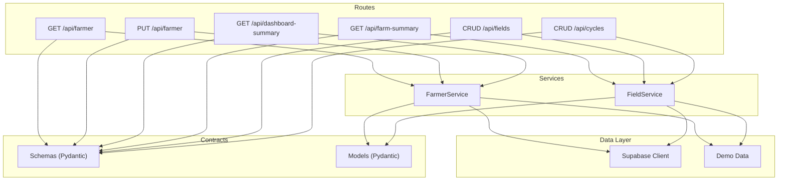
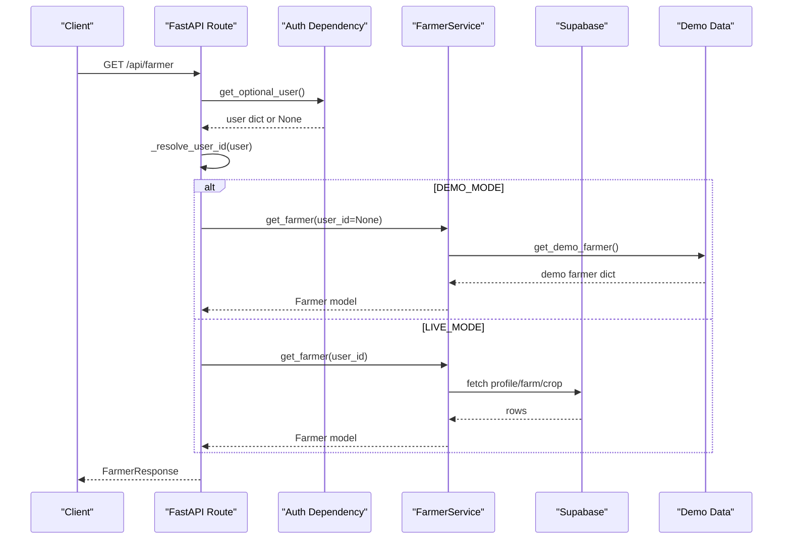
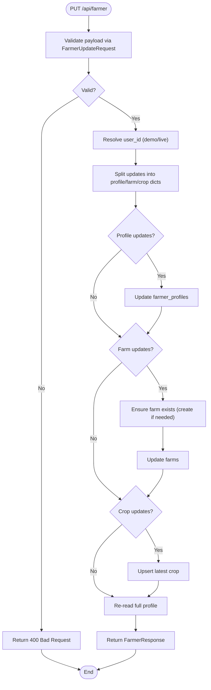
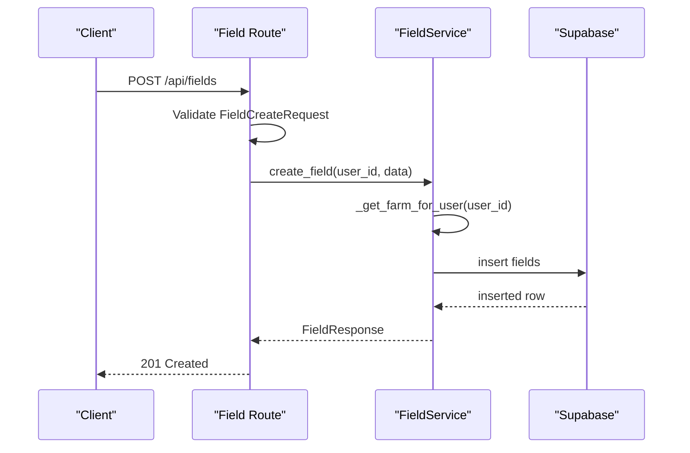
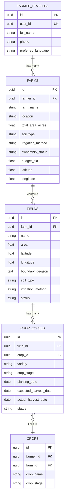
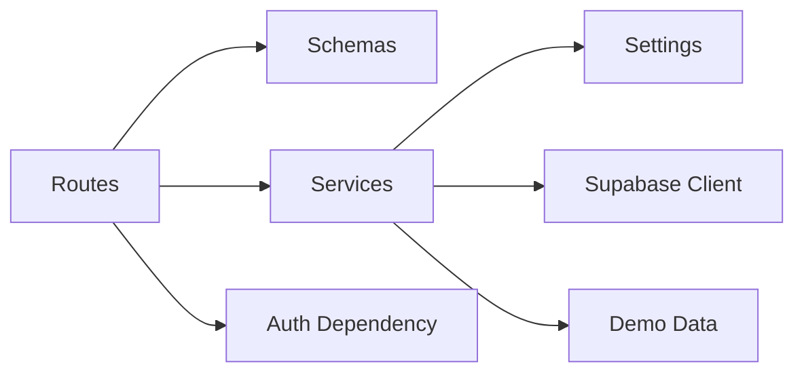

# Farmer Management Service

<cite>
**Referenced Files in This Document**
- [farmer.py](file://Backend/routes/farmer.py)
- [farmer_service.py](file://Backend/services/farmer_service.py)
- [farmer.py (schemas)](file://Backend/schemas/farmer.py)
- [farmer.py (models)](file://Backend/models/farmer.py)
- [field.py (routes)](file://Backend/routes/field.py)
- [field_service.py](file://Backend/services/field_service.py)
- [field.py (schemas)](file://Backend/schemas/field.py)
- [field.py (models)](file://Backend/models/field.py)
- [demo_farmer.py](file://Backend/data/demo_farmer.py)
- [demo_fields.py](file://Backend/data/demo_fields.py)
- [settings.py](file://Backend/config/settings.py)
- [supabase_client.py](file://Backend/config/supabase_client.py)
- [auth.py](file://Backend/dependencies/auth.py)
</cite>

## Table of Contents
1. [Introduction](#introduction)
2. [Project Structure](#project-structure)
3. [Core Components](#core-components)
4. [Architecture Overview](#architecture-overview)
5. [Detailed Component Analysis](#detailed-component-analysis)
6. [Dependency Analysis](#dependency-analysis)
7. [Performance Considerations](#performance-considerations)
8. [Troubleshooting Guide](#troubleshooting-guide)
9. [Conclusion](#conclusion)

## Introduction
This document explains the Farmer Management Service, covering complete CRUD operations for farmer profiles, farm details, and preferences; database schema relationships between farmers, farms, and fields; data validation using Pydantic schemas; input sanitization and business rule enforcement; example workflows for profile updates, farm registration, and data retrieval; and performance considerations including caching strategies for large datasets.

The service is implemented as a FastAPI backend with thin routes, a service layer handling business logic, Pydantic schemas defining API contracts, and models representing internal data shapes. It supports both live mode (Supabase PostgreSQL) and demo mode (in-memory seeded data).

## Project Structure
The relevant backend components are organized by concern:
- Routes define HTTP endpoints and delegate to services.
- Services encapsulate business logic, data access, and demo/live behavior.
- Schemas define request/response contracts and validation rules.
- Models define internal data structures used across services.
- Data modules provide seeded demo data.
- Config centralizes environment settings and Supabase client setup.
- Dependencies provide authentication helpers.

**Diagram sources**
- [farmer.py:75-160](file://Backend/routes/farmer.py#L75-L160)
- [field.py:73-287](file://Backend/routes/field.py#L73-L287)
- [farmer_service.py:51-208](file://Backend/services/farmer_service.py#L51-L208)
- [field_service.py:89-545](file://Backend/services/field_service.py#L89-L545)
- [farmer.py (schemas):40-165](file://Backend/schemas/farmer.py#L40-L165)
- [field.py (schemas):32-195](file://Backend/schemas/field.py#L32-L195)
- [farmer.py (models):21-48](file://Backend/models/farmer.py#L21-L48)
- [field.py (models):18-53](file://Backend/models/field.py#L18-L53)
- [supabase_client.py:16-47](file://Backend/config/supabase_client.py#L16-L47)
- [demo_farmer.py:19-47](file://Backend/data/demo_farmer.py#L19-L47)
- [demo_fields.py:20-149](file://Backend/data/demo_fields.py#L20-L149)

**Section sources**
- [farmer.py:1-161](file://Backend/routes/farmer.py#L1-L161)
- [field.py:1-287](file://Backend/routes/field.py#L1-L287)
- [farmer_service.py:1-491](file://Backend/services/farmer_service.py#L1-L491)
- [field_service.py:1-788](file://Backend/services/field_service.py#L1-L788)
- [farmer.py (schemas):1-165](file://Backend/schemas/farmer.py#L1-L165)
- [field.py (schemas):1-195](file://Backend/schemas/field.py#L1-L195)
- [farmer.py (models):1-48](file://Backend/models/farmer.py#L1-L48)
- [field.py (models):1-53](file://Backend/models/field.py#L1-L53)
- [settings.py:1-123](file://Backend/config/settings.py#L1-L123)
- [supabase_client.py:1-47](file://Backend/config/supabase_client.py#L1-L47)
- [auth.py:1-101](file://Backend/dependencies/auth.py#L1-L101)

## Core Components
- Farmer routes expose GET and PUT for farmer profiles and a dashboard summary endpoint. They validate inputs via Pydantic schemas and call the farmer service.
- Field routes expose farm summary and full CRUD for fields and crop cycles. They enforce farm ownership and delegate to the field service.
- FarmerService handles reading/updating farmer profiles, auto-provisioning first-time users, and merging flat updates into normalized tables.
- FieldService manages fields and crop cycles, including linking crops, enforcing ownership, and building summaries with crop distribution.
- Schemas define strict validation for allowed values (languages, irrigation methods, statuses), numeric bounds (area, coordinates), and optional partial updates.
- Models define internal shapes for Farmer, Field, and CropCycle used by services and responses.

Key responsibilities:
- Input validation and sanitization at the route boundary via schemas.
- Business rules enforced in services (e.g., partial update translation, auto-provisioning, ownership checks).
- Demo/live mode branching based on configuration.

**Section sources**
- [farmer.py:75-160](file://Backend/routes/farmer.py#L75-L160)
- [field.py:73-287](file://Backend/routes/field.py#L73-L287)
- [farmer_service.py:68-208](file://Backend/services/farmer_service.py#L68-L208)
- [field_service.py:111-545](file://Backend/services/field_service.py#L111-L545)
- [farmer.py (schemas):40-165](file://Backend/schemas/farmer.py#L40-L165)
- [field.py (schemas):32-195](file://Backend/schemas/field.py#L32-L195)
- [farmer.py (models):21-48](file://Backend/models/farmer.py#L21-L48)
- [field.py (models):18-53](file://Backend/models/field.py#L18-L53)

## Architecture Overview
The architecture follows a layered design:
- Routes: Thin controllers that parse requests, validate via schemas, and call services.
- Services: Centralize business logic, handle demo/live modes, and interact with Supabase or demo data.
- Data Layer: Supabase client configured with timeouts and connection limits; demo data modules for offline development.
- Contracts: Pydantic schemas ensure consistent API contracts; models represent internal data shapes.

**Diagram sources**
- [farmer.py:75-92](file://Backend/routes/farmer.py#L75-L92)
- [auth.py:72-101](file://Backend/dependencies/auth.py#L72-L101)
- [farmer_service.py:68-95](file://Backend/services/farmer_service.py#L68-L95)
- [demo_farmer.py:19-47](file://Backend/data/demo_farmer.py#L19-L47)
- [supabase_client.py:16-47](file://Backend/config/supabase_client.py#L16-L47)

## Detailed Component Analysis

### Farmer Profile CRUD
- GET /api/farmer: Returns the current farmer’s full profile. In demo mode, returns cached demo farmer; in live mode, queries Supabase and auto-provisions if missing.
- PUT /api/farmer: Partial update of the profile. Accepts only changed fields; validates via FarmerUpdateRequest; translates to per-table updates (profiles, farms, crops); returns refreshed profile.
- GET /api/dashboard-summary: Lightweight overview for dashboard rendering, returning selected fields from the farmer profile.

Validation and sanitization:
- Allowed languages, irrigation methods, and ownership statuses are validated via Pydantic validators.
- Numeric bounds enforced for area and coordinates.
- Optional fields allow partial updates without resending entire profile.

Business rules:
- Auto-provisioning creates farmer_profiles row from auth metadata when first accessed.
- Farms are created lazily when farm-specific fields are updated.
- Latest crop upsert logic ensures efficient updates to the most recent crop record.

Example workflows:
- Profile update: Send a PATCH-like payload with only changed fields (e.g., current_crop, budget_pkr). The service merges updates and persists them to the appropriate tables.
- Farm registration: Include farm_name, location, area, soil type, irrigation method, ownership status, budget, and coordinates in the update payload; the service creates or updates the farm record.
- Data retrieval: GET /api/farmer returns the full profile; GET /api/dashboard-summary returns a compact view.

**Diagram sources**
- [farmer.py:95-128](file://Backend/routes/farmer.py#L95-L128)
- [farmer_service.py:97-208](file://Backend/services/farmer_service.py#L97-L208)
- [farmer.py (schemas):86-144](file://Backend/schemas/farmer.py#L86-L144)

**Section sources**
- [farmer.py:75-160](file://Backend/routes/farmer.py#L75-L160)
- [farmer_service.py:68-208](file://Backend/services/farmer_service.py#L68-L208)
- [farmer.py (schemas):40-165](file://Backend/schemas/farmer.py#L40-L165)

### Fields and Crop Cycles CRUD
- GET /api/farm-summary: Returns farm overview with all fields, totals, and crop distribution.
- GET /api/fields: Lists all fields for the farmer’s farm.
- POST /api/fields: Creates a new field on the farmer’s farm.
- PUT /api/fields/{field_id}: Updates an existing field (partial).
- DELETE /api/fields/{field_id}: Deletes a field and its crop cycles.
- GET /api/fields/{field_id}/cycles: Lists crop cycles for a specific field.
- POST /api/fields/{field_id}/cycles: Creates a new crop cycle on a field.
- PUT /api/cycles/{cycle_id}: Updates an existing crop cycle (partial).
- DELETE /api/cycles/{cycle_id}: Deletes a crop cycle.

Ownership enforcement:
- All field and cycle operations verify that the resource belongs to the authenticated user’s farm.
- Farm context is resolved automatically; missing profiles/farms are auto-provisioned.

Crop linkage:
- Crop cycles link to the crops table via crop_id; names and stages are resolved and upserted to maintain consistency.

Validation and sanitization:
- Field and cycle schemas enforce allowed statuses, irrigation methods, numeric bounds, and string lengths.
- Partial updates are supported; empty payloads return 400.

Example workflows:
- Register a field: Provide name, optional area, coordinates, soil type, irrigation method, and status; the service creates the field and attaches active cycle info.
- Create a crop cycle: Provide crop_name, variety, stage, planting/harvest dates; the service links to crops and returns the cycle.
- Retrieve farm summary: Get aggregated stats and crop distribution for visualization.

**Diagram sources**
- [field.py:114-135](file://Backend/routes/field.py#L114-L135)
- [field_service.py:336-359](file://Backend/services/field_service.py#L336-L359)
- [field_service.py:592-601](file://Backend/services/field_service.py#L592-L601)

**Section sources**
- [field.py:73-287](file://Backend/routes/field.py#L73-L287)
- [field_service.py:111-545](file://Backend/services/field_service.py#L111-L545)
- [field.py (schemas):32-195](file://Backend/schemas/field.py#L32-L195)

### Database Schema Relationships
The normalized schema spans multiple tables:
- farmer_profiles: Stores identity and preferences linked to auth user_id.
- farms: Represents a farmer’s farm with attributes like name, location, area, soil type, irrigation method, ownership status, budget, and coordinates.
- fields: Distinct plots within a farm with area, coordinates, boundary GeoJSON, soil type, irrigation method, and status.
- crop_cycles: Links a field to a crop for a season/period, including variety, stage, planting/harvest dates, and status.
- crops: Shared crop definitions linked to farms, storing crop_name and crop_stage.

Relationship chain:
- farmer_profiles → farms → fields → crop_cycles → crops

**Diagram sources**
- [farmer_service.py:134-153](file://Backend/services/farmer_service.py#L134-L153)
- [field_service.py:570-692](file://Backend/services/field_service.py#L570-L692)
- [field_service.py:241-321](file://Backend/services/field_service.py#L241-L321)

**Section sources**
- [farmer_service.py:134-153](file://Backend/services/farmer_service.py#L134-L153)
- [field_service.py:570-692](file://Backend/services/field_service.py#L570-L692)
- [field_service.py:241-321](file://Backend/services/field_service.py#L241-L321)

## Dependency Analysis
- Routes depend on schemas for validation and services for business logic.
- Services depend on configuration (settings, supabase_client) and data modules (demo data).
- Authentication dependency provides optional user resolution for demo/live modes.
- FieldService enforces farm ownership by querying relationships and verifying resource association.

**Diagram sources**
- [farmer.py:28-41](file://Backend/routes/farmer.py#L28-L41)
- [field.py:25-44](file://Backend/routes/field.py#L25-L44)
- [farmer_service.py:24-31](file://Backend/services/farmer_service.py#L24-L31)
- [field_service.py:18-31](file://Backend/services/field_service.py#L18-L31)
- [settings.py:48-123](file://Backend/config/settings.py#L48-L123)
- [supabase_client.py:16-47](file://Backend/config/supabase_client.py#L16-L47)
- [auth.py:1-101](file://Backend/dependencies/auth.py#L1-L101)

**Section sources**
- [farmer.py:28-41](file://Backend/routes/farmer.py#L28-L41)
- [field.py:25-44](file://Backend/routes/field.py#L25-L44)
- [farmer_service.py:24-31](file://Backend/services/farmer_service.py#L24-L31)
- [field_service.py:18-31](file://Backend/services/field_service.py#L18-L31)
- [settings.py:48-123](file://Backend/config/settings.py#L48-L123)
- [supabase_client.py:16-47](file://Backend/config/supabase_client.py#L16-L47)
- [auth.py:1-101](file://Backend/dependencies/auth.py#L1-L101)

## Performance Considerations
- Demo-mode caching: FarmerService caches the demo farmer in memory; FieldService caches demo fields and crop cycles. This avoids repeated recomputation during sessions.
- Live-mode direct access: In production, services query Supabase directly; consider adding application-level caching (e.g., Redis) for frequently accessed profiles and summaries to reduce database load.
- Query optimization: Use targeted selects and joins (e.g., nested selects for crops) to minimize payload size and round trips.
- Connection pooling: Supabase client uses HTTPX with connection limits and timeouts to prevent socket errors and improve stability under load.
- Pagination and filtering: For large datasets (many fields or cycles), implement pagination and server-side filtering to avoid loading entire collections.
- Batch updates: Group related writes where possible to reduce transaction overhead.

[No sources needed since this section provides general guidance]

## Troubleshooting Guide
Common issues and resolutions:
- Missing authentication token in live mode: Routes raise 401 Unauthorized; ensure a valid Bearer token is provided.
- Unconfigured database: Services raise RuntimeError if Supabase is not configured; set SUPABASE_URL and SUPABASE_SERVICE_KEY.
- Invalid enum values: Pydantic validators reject disallowed languages, irrigation methods, or statuses; correct the payload to match allowed sets.
- Empty update payloads: Routes return 400 when no fields are provided to update; include at least one field.
- Ownership violations: Accessing fields or cycles not belonging to your farm raises 404; verify farm context and resource IDs.

**Section sources**
- [farmer.py:50-68](file://Backend/routes/farmer.py#L50-L68)
- [field.py:51-66](file://Backend/routes/field.py#L51-L66)
- [farmer_service.py:82-116](file://Backend/services/farmer_service.py#L82-L116)
- [field_service.py:111-220](file://Backend/services/field_service.py#L111-L220)
- [farmer.py (schemas):110-135](file://Backend/schemas/farmer.py#L110-L135)
- [field.py (schemas):63-110](file://Backend/schemas/field.py#L63-L110)

## Conclusion
The Farmer Management Service provides a robust, layered implementation for managing farmer profiles, farms, fields, and crop cycles. It enforces strong validation through Pydantic schemas, maintains clear separation of concerns between routes and services, and supports both demo and live environments. The normalized database schema ensures data integrity and scalability. With careful attention to performance and error handling, the service can support growing datasets and complex farming workflows.

[No sources needed since this section summarizes without analyzing specific files]