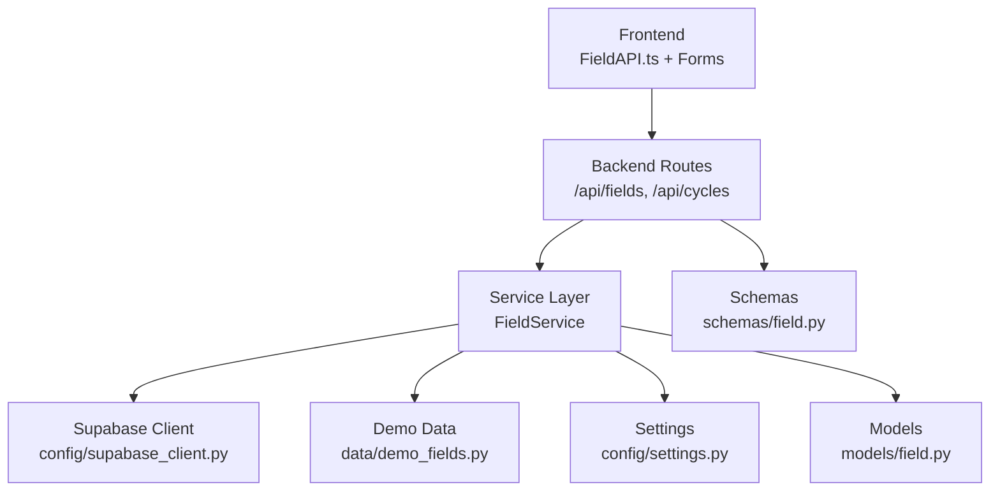
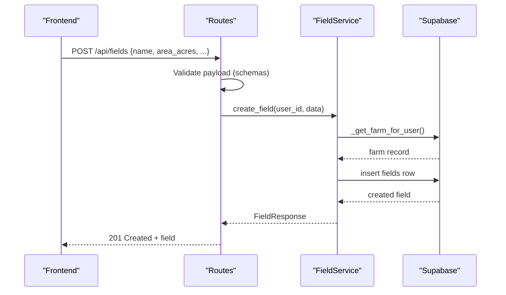
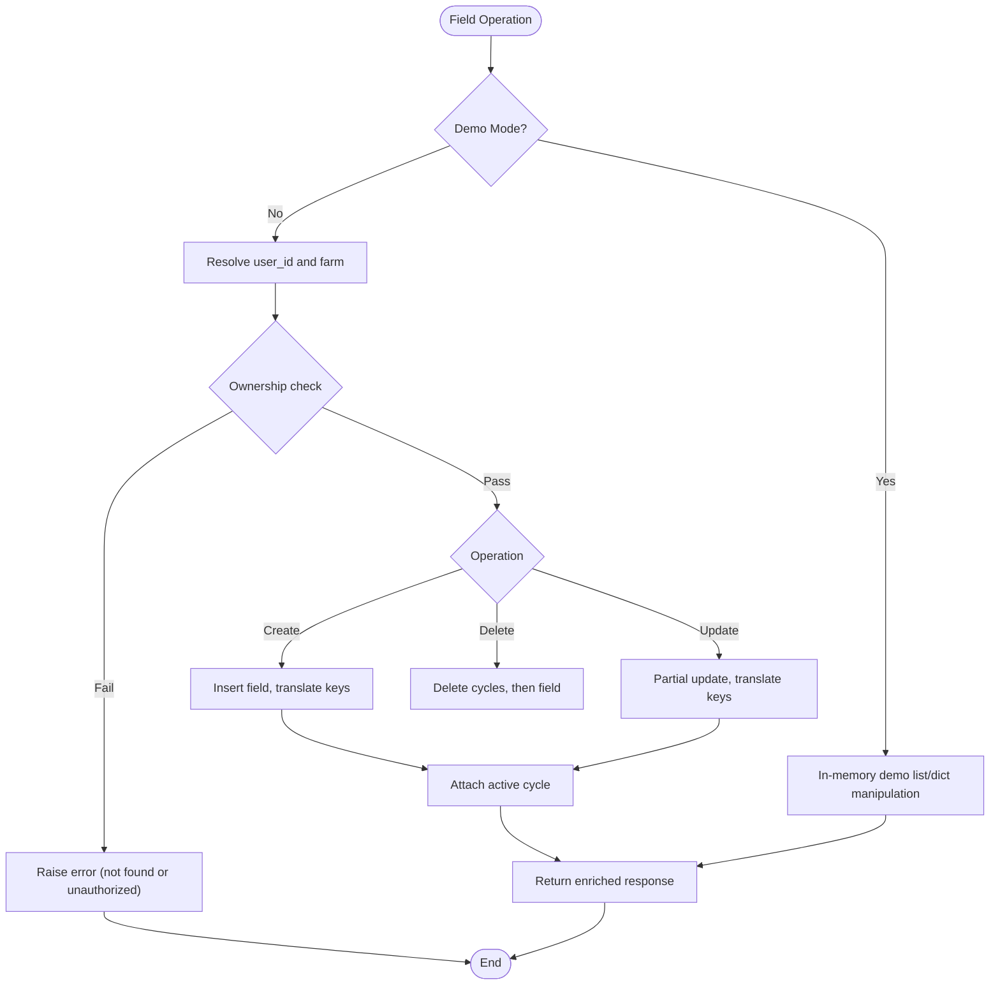
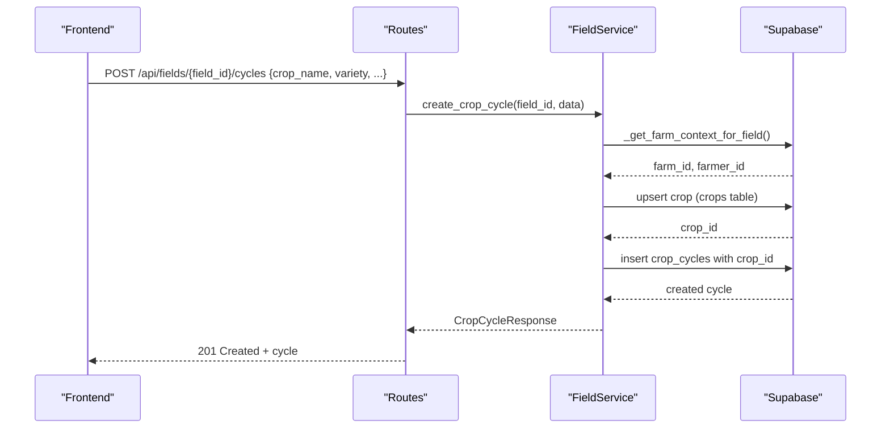
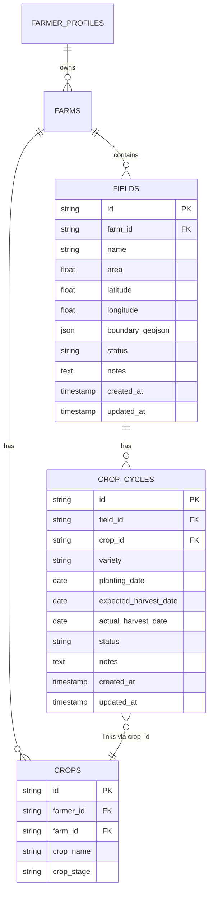
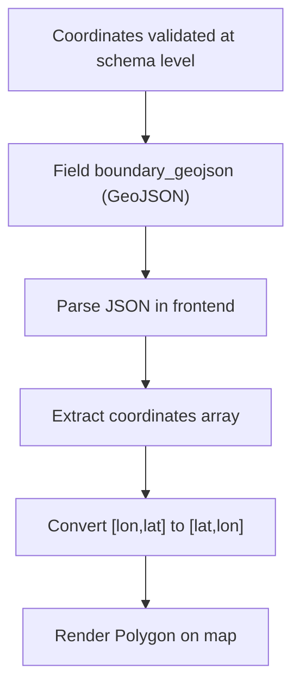
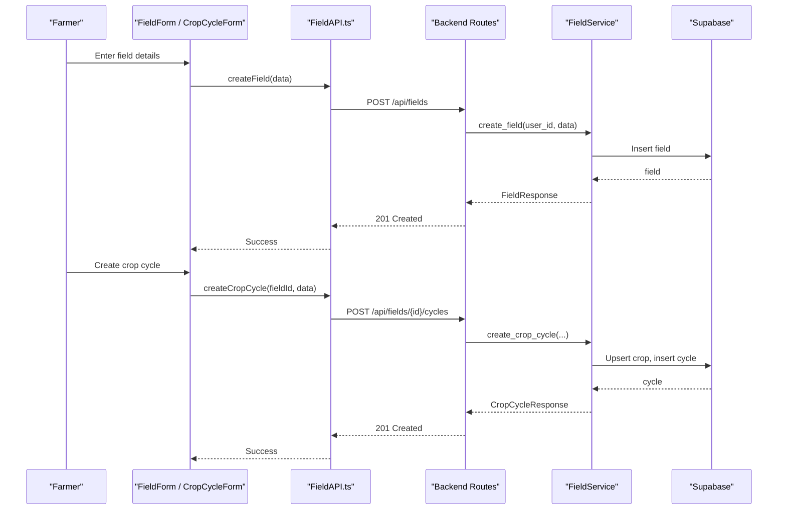
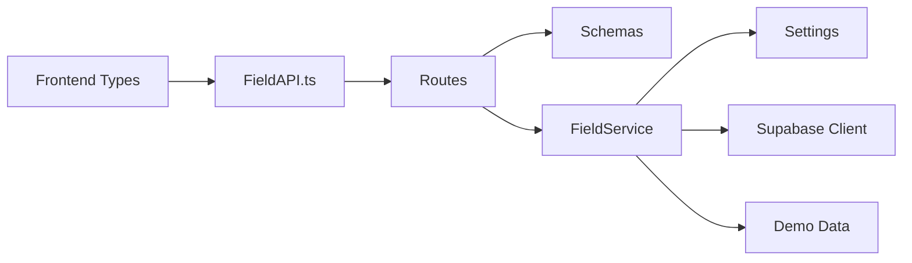

# Field Management Service

<cite>
**Referenced Files in This Document**
- [field_service.py](file://Backend/services/field_service.py)
- [field.py (routes)](file://Backend/routes/field.py)
- [field.py (schemas)](file://Backend/schemas/field.py)
- [field.py (models)](file://Backend/models/field.py)
- [demo_fields.py](file://Backend/data/demo_fields.py)
- [settings.py](file://Backend/config/settings.py)
- [supabase_client.py](file://Backend/config/supabase_client.py)
- [FieldAPI.ts](file://Frontend/greenflora/services/FieldAPI.ts)
- [field.ts (types)](file://Frontend/greenflora/types/field.ts)
- [FieldForm.tsx](file://Frontend/greenflora/components/fields/FieldForm.tsx)
- [CropCycleForm.tsx](file://Frontend/greenflora/components/fields/CropCycleForm.tsx)
- [FarmMap.tsx](file://Frontend/greenflora/components/map/FarmMap.tsx)
- [test_field_flow.py](file://Backend/test_field_flow.py)
</cite>

## Table of Contents
1. [Introduction](#introduction)
2. [Project Structure](#project-structure)
3. [Core Components](#core-components)
4. [Architecture Overview](#architecture-overview)
5. [Detailed Component Analysis](#detailed-component-analysis)
6. [Dependency Analysis](#dependency-analysis)
7. [Performance Considerations](#performance-considerations)
8. [Troubleshooting Guide](#troubleshooting-guide)
9. [Conclusion](#conclusion)
10. [Appendices](#appendices)

## Introduction
This document explains the field management service that powers farm and field operations, crop cycle tracking, and geospatial visualization. It covers the full lifecycle of fields and crop cycles, the database relationships between farms, fields, crops, and crop cycles, and how location data is handled for mapping and queries. It also includes examples of typical workflows such as planting a crop and recording a harvest, plus performance guidance for calculations and batch operations.

## Project Structure
The field management feature spans backend routes, services, schemas, models, configuration, and frontend components:
- Backend routes expose REST endpoints for fields and crop cycles.
- The service layer encapsulates business logic, ownership checks, demo mode behavior, and Supabase interactions.
- Schemas define request/response contracts with validation rules.
- Models describe core domain entities.
- Configuration controls environment settings and Supabase client setup.
- Frontend types mirror backend schemas; API client calls the backend; forms handle user input; map component renders field markers and optional GeoJSON boundaries.

**Diagram sources**
- [field.py (routes):1-287](file://Backend/routes/field.py#L1-L287)
- [field_service.py:1-788](file://Backend/services/field_service.py#L1-L788)
- [field.py (schemas):1-195](file://Backend/schemas/field.py#L1-L195)
- [field.py (models):1-53](file://Backend/models/field.py#L1-L53)
- [settings.py:1-123](file://Backend/config/settings.py#L1-L123)
- [supabase_client.py:1-47](file://Backend/config/supabase_client.py#L1-L47)
- [demo_fields.py:1-149](file://Backend/data/demo_fields.py#L1-L149)

**Section sources**
- [field.py (routes):1-287](file://Backend/routes/field.py#L1-L287)
- [field_service.py:1-788](file://Backend/services/field_service.py#L1-L788)
- [field.py (schemas):1-195](file://Backend/schemas/field.py#L1-L195)
- [field.py (models):1-53](file://Backend/models/field.py#L1-L53)
- [settings.py:1-123](file://Backend/config/settings.py#L1-L123)
- [supabase_client.py:1-47](file://Backend/config/supabase_client.py#L1-L47)
- [demo_fields.py:1-149](file://Backend/data/demo_fields.py#L1-L149)

## Core Components
- FieldService: Central orchestrator for all field and crop cycle operations, including ownership enforcement, demo mode, and Supabase integration.
- Routes: Thin FastAPI endpoints that validate payloads via schemas and delegate to FieldService.
- Schemas: Pydantic models enforcing allowed values and ranges for fields and crop cycles.
- Models: Domain models describing fields and crop cycles.
- Demo Data: In-memory dataset used when demo mode is enabled.
- Supabase Client: Configured HTTPX-backed client for stable DB connections.
- Frontend Types and API: TypeScript interfaces mirroring backend schemas; FieldApi methods call backend endpoints.

Key responsibilities:
- Farm auto-provisioning and ownership verification.
- Field CRUD with area, coordinates, boundary GeoJSON, soil type, irrigation method, and status.
- Crop cycle lifecycle: create, update, delete; link to crops table; track planting and harvest dates; manage active cycles.
- Farm summary aggregation: total area, field counts, crop distribution by acres.

**Section sources**
- [field_service.py:89-788](file://Backend/services/field_service.py#L89-L788)
- [field.py (routes):44-287](file://Backend/routes/field.py#L44-L287)
- [field.py (schemas):18-195](file://Backend/schemas/field.py#L18-L195)
- [field.py (models):18-53](file://Backend/models/field.py#L18-L53)
- [demo_fields.py:14-149](file://Backend/data/demo_fields.py#L14-L149)
- [supabase_client.py:16-47](file://Backend/config/supabase_client.py#L16-L47)
- [FieldAPI.ts:107-171](file://Frontend/greenflora/services/FieldAPI.ts#L107-L171)
- [field.ts:8-78](file://Frontend/greenflora/types/field.ts#L8-L78)

## Architecture Overview
The system follows a layered architecture:
- Presentation: Frontend components and hooks render UI and collect inputs.
- API Layer: FastAPI routes accept requests, validate via schemas, and call the service.
- Service Layer: FieldService implements business rules, enforces ownership, handles demo vs live mode, and interacts with Supabase.
- Data Layer: Supabase tables store fields, crop_cycles, crops, farms, farmer_profiles.

**Diagram sources**
- [field.py (routes):114-135](file://Backend/routes/field.py#L114-L135)
- [field_service.py:336-359](file://Backend/services/field_service.py#L336-L359)
- [field_service.py:111-183](file://Backend/services/field_service.py#L111-L183)
- [field_service.py:592-601](file://Backend/services/field_service.py#L592-L601)

**Section sources**
- [field.py (routes):1-287](file://Backend/routes/field.py#L1-L287)
- [field_service.py:1-788](file://Backend/services/field_service.py#L1-L788)

## Detailed Component Analysis

### Field Lifecycle Management
- Creation:
  - Route validates payload and calls service.
  - Service ensures farm exists (auto-provisions if missing), then inserts field with translated column names and filters unknown columns.
  - Returns field with active_crop_cycle set to None initially.
- Updates:
  - Partial updates supported; service verifies ownership and applies only non-null fields.
  - If no valid DB columns are updated, returns current state with active cycle attached.
- Deletion:
  - Deletes associated crop cycles first, then the field.
  - Ownership verified before deletion.

**Diagram sources**
- [field_service.py:327-395](file://Backend/services/field_service.py#L327-L395)
- [field_service.py:570-645](file://Backend/services/field_service.py#L570-L645)

**Section sources**
- [field_service.py:327-395](file://Backend/services/field_service.py#L327-L395)
- [field_service.py:570-645](file://Backend/services/field_service.py#L570-L645)

### Crop Cycle Tracking
- Creation:
  - Validates field ownership.
  - Upserts crop entry in crops table linked to farm; sets crop_id on cycle.
  - Inserts cycle with translated keys; ensures crop_name and stage present.
- Updates:
  - Resolves current cycle context; upserts crop linkage if crop_name changes.
  - Applies partial updates; enriches response with resolved crop info.
- Deletion:
  - Verifies ownership; deletes cycle.

**Diagram sources**
- [field.py (routes):213-237](file://Backend/routes/field.py#L213-L237)
- [field_service.py:417-442](file://Backend/services/field_service.py#L417-L442)
- [field_service.py:241-295](file://Backend/services/field_service.py#L241-L295)
- [field_service.py:694-717](file://Backend/services/field_service.py#L694-L717)

**Section sources**
- [field_service.py:401-473](file://Backend/services/field_service.py#L401-L473)
- [field_service.py:651-783](file://Backend/services/field_service.py#L651-L783)

### Database Model Relationships
- farmer_profiles → farms → fields → crop_cycles → crops
- Fields store geospatial attributes: latitude, longitude, boundary_geojson.
- Crop cycles link to crops via crop_id; service resolves crop_name and crop_stage from crops table.

**Diagram sources**
- [field_service.py:48-64](file://Backend/services/field_service.py#L48-L64)
- [field_service.py:241-295](file://Backend/services/field_service.py#L241-L295)
- [field_service.py:651-717](file://Backend/services/field_service.py#L651-L717)

**Section sources**
- [field_service.py:48-64](file://Backend/services/field_service.py#L48-L64)
- [field_service.py:241-295](file://Backend/services/field_service.py#L241-L295)
- [field_service.py:651-717](file://Backend/services/field_service.py#L651-L717)

### Geospatial Data Handling
- Coordinates:
  - Fields store latitude and longitude; validated within reasonable bounds in schemas.
  - Frontend can auto-generate near-farm coordinates for new fields.
- Boundary GeoJSON:
  - Optional polygon stored as JSON string; parsed and rendered as Leaflet polygons in the map component.
  - Coordinates are converted from GeoJSON [lon, lat] to Leaflet [lat, lon].
- Location-based queries:
  - Current implementation lists fields by farm_id; geospatial filtering not implemented in service.
  - Map displays all fields for the farm; future enhancements could add proximity queries using PostGIS or Supabase functions.

**Diagram sources**
- [field.py (schemas):51-70](file://Backend/schemas/field.py#L51-L70)
- [FieldForm.tsx:90-107](file://Frontend/greenflora/components/fields/FieldForm.tsx#L90-L107)
- [FarmMap.tsx:320-348](file://Frontend/greenflora/components/map/FarmMap.tsx#L320-L348)

**Section sources**
- [field.py (schemas):51-70](file://Backend/schemas/field.py#L51-L70)
- [FieldForm.tsx:58-108](file://Frontend/greenflora/components/fields/FieldForm.tsx#L58-L108)
- [FarmMap.tsx:285-352](file://Frontend/greenflora/components/map/FarmMap.tsx#L285-L352)

### Examples and Workflows
- Create a field:
  - Submit form with name, area, optional crop name; coordinates auto-generated near farm center.
  - Backend creates field and optionally links to crops table via crop cycle creation flow.
- Plant a crop:
  - Create crop cycle on a field with crop_name, variety, planting_date, expected_harvest_date.
  - Service upserts crop entry and attaches crop_id to cycle.
- Harvest tracking:
  - Update crop cycle status to harvested; set actual_harvest_date if needed.
  - Active cycle resolution excludes harvested cycles; farm summary aggregates crop distribution by acres based on active cycles.

**Diagram sources**
- [FieldForm.tsx:86-108](file://Frontend/greenflora/components/fields/FieldForm.tsx#L86-L108)
- [CropCycleForm.tsx:60-70](file://Frontend/greenflora/components/fields/CropCycleForm.tsx#L60-L70)
- [FieldAPI.ts:119-156](file://Frontend/greenflora/services/FieldAPI.ts#L119-L156)
- [field.py (routes):114-237](file://Backend/routes/field.py#L114-L237)
- [field_service.py:336-442](file://Backend/services/field_service.py#L336-L442)

**Section sources**
- [FieldForm.tsx:58-108](file://Frontend/greenflora/components/fields/FieldForm.tsx#L58-L108)
- [CropCycleForm.tsx:43-70](file://Frontend/greenflora/components/fields/CropCycleForm.tsx#L43-L70)
- [FieldAPI.ts:107-171](file://Frontend/greenflora/services/FieldAPI.ts#L107-L171)
- [field.py (routes):114-237](file://Backend/routes/field.py#L114-L237)
- [field_service.py:336-442](file://Backend/services/field_service.py#L336-L442)

## Dependency Analysis
- Routes depend on schemas for validation and service for business logic.
- Service depends on settings for demo mode and Supabase client for DB access.
- Frontend types mirror backend schemas; API client uses consistent paths and headers.
- Demo data provides fallback behavior without external dependencies.

**Diagram sources**
- [field.py (routes):25-44](file://Backend/routes/field.py#L25-L44)
- [field_service.py:18-31](file://Backend/services/field_service.py#L18-L31)
- [settings.py:48-123](file://Backend/config/settings.py#L48-L123)
- [supabase_client.py:16-47](file://Backend/config/supabase_client.py#L16-L47)
- [demo_fields.py:14-149](file://Backend/data/demo_fields.py#L14-L149)
- [field.ts:8-78](file://Frontend/greenflora/types/field.ts#L8-L78)
- [FieldAPI.ts:1-171](file://Frontend/greenflora/services/FieldAPI.ts#L1-171)

**Section sources**
- [field.py (routes):25-44](file://Backend/routes/field.py#L25-L44)
- [field_service.py:18-31](file://Backend/services/field_service.py#L18-L31)
- [settings.py:48-123](file://Backend/config/settings.py#L48-L123)
- [supabase_client.py:16-47](file://Backend/config/supabase_client.py#L16-L47)
- [demo_fields.py:14-149](file://Backend/data/demo_fields.py#L14-L149)
- [field.ts:8-78](file://Frontend/greenflora/types/field.ts#L8-L78)
- [FieldAPI.ts:1-171](file://Frontend/greenflora/services/FieldAPI.ts#L1-L171)

## Performance Considerations
- Query efficiency:
  - List fields and cycles use ordered queries and limit results where appropriate.
  - Active cycle retrieval limits to one result per field.
- Column translation:
  - Mapping API keys to DB columns prevents unnecessary writes and reduces errors.
- Demo mode:
  - In-memory operations avoid network overhead during development/testing.
- Frontend optimization:
  - Map rendering conditionally parses GeoJSON only when present.
  - Requests include timeouts and error classification to improve UX.
- Batch operations:
  - Current design focuses on single-entity operations; consider batching field/cycle updates server-side for large datasets.
- Connection pooling:
  - Supabase client configured with HTTPX connection limits and timeouts to stabilize DB interactions.

[No sources needed since this section provides general guidance]

## Troubleshooting Guide
Common issues and resolutions:
- Unauthorized or missing user:
  - Ensure Bearer token is present in production; demo mode bypasses auth.
- Field not found or unauthorized:
  - Ownership verification fails if field does not belong to user’s farm; verify farm association.
- Database configuration errors:
  - Missing Supabase URL or service key raises runtime errors; configure environment variables.
- Validation errors:
  - Invalid irrigation method or status values rejected by schemas; use allowed enums.
- Geospatial parsing failures:
  - Malformed boundary_geojson causes map rendering errors; validate JSON structure.

**Section sources**
- [field.py (routes):51-67](file://Backend/routes/field.py#L51-L67)
- [field_service.py:111-220](file://Backend/services/field_service.py#L111-L220)
- [field.py (schemas):63-110](file://Backend/schemas/field.py#L63-L110)
- [FieldAPI.ts:40-101](file://Frontend/greenflora/services/FieldAPI.ts#L40-L101)

## Conclusion
The field management service provides a robust foundation for managing farm fields and crop cycles with clear separation of concerns across routes, service, schemas, and models. It supports both demo and live modes, enforces ownership, and integrates geospatial data for mapping. Future enhancements can include advanced geospatial queries, batch operations, and richer analytics for crop planning and harvest tracking.

[No sources needed since this section summarizes without analyzing specific files]

## Appendices

### API Endpoints Summary
- GET /api/farm-summary: Farm overview with fields and crop distribution.
- GET /api/fields: List fields for the authenticated user’s farm.
- POST /api/fields: Create a new field.
- PUT /api/fields/{field_id}: Update an existing field.
- DELETE /api/fields/{field_id}: Delete a field and its cycles.
- GET /api/fields/{field_id}/cycles: List crop cycles for a field.
- POST /api/fields/{field_id}/cycles: Create a crop cycle.
- PUT /api/cycles/{cycle_id}: Update a crop cycle.
- DELETE /api/cycles/{cycle_id}: Delete a crop cycle.

**Section sources**
- [field.py (routes):73-287](file://Backend/routes/field.py#L73-L287)

### Testing the Flow
- Use test script to exercise end-to-end flow: fetch farm summary, create field, create crop cycle, re-fetch summary, clean up by deleting field.

**Section sources**
- [test_field_flow.py:1-87](file://Backend/test_field_flow.py#L1-L87)