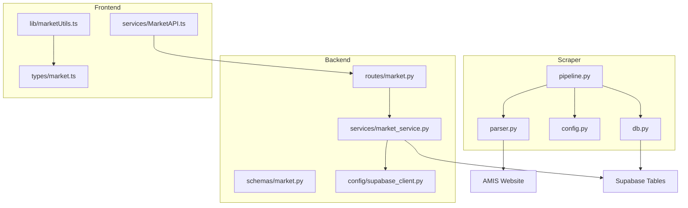
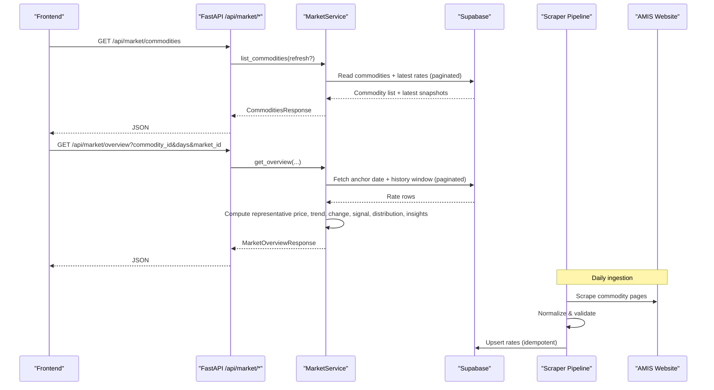
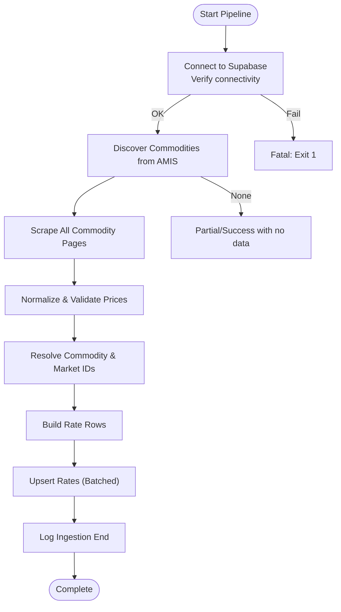
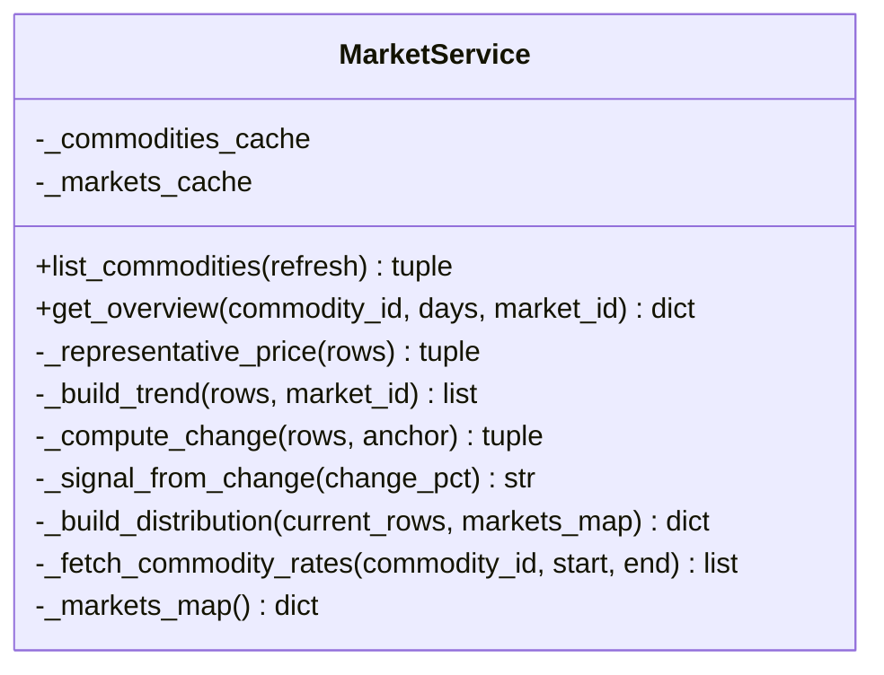

# Market Data Service

<cite>
**Referenced Files in This Document**
- [market.py](file://Backend/routes/market.py)
- [market_service.py](file://Backend/services/market_service.py)
- [market.py (schemas)](file://Backend/schemas/market.py)
- [supabase_client.py](file://Backend/config/supabase_client.py)
- [pipeline.py](file://Scraper/pipeline.py)
- [parser.py](file://Scraper/parser.py)
- [config.py (scraper)](file://Scraper/config.py)
- [db.py](file://Scraper/db.py)
- [MarketAPI.ts](file://Frontend/greenflora/services/MarketAPI.ts)
- [marketUtils.ts](file://Frontend/greenflora/lib/marketUtils.ts)
- [market.ts (types)](file://Frontend/greenflora/types/market.ts)
</cite>

## Table of Contents
1. [Introduction](#introduction)
2. [Project Structure](#project-structure)
3. [Core Components](#core-components)
4. [Architecture Overview](#architecture-overview)
5. [Detailed Component Analysis](#detailed-component-analysis)
6. [Dependency Analysis](#dependency-analysis)
7. [Performance Considerations](#performance-considerations)
8. [Troubleshooting Guide](#troubleshooting-guide)
9. [Conclusion](#conclusion)
10. [Appendices](#appendices)

## Introduction
This document describes the Market Data Service that powers market intelligence for farmers. It integrates AMIS marketplace data through a daily ingestion pipeline, exposes price retrieval APIs, and computes trend analysis to deliver actionable insights. The service transforms raw market data into farmer-friendly summaries, including current prices, price signals, market comparisons, arrival distributions, and trend charts.

Key capabilities:
- AMIS integration via a robust scraper pipeline that normalizes and upserts data into Supabase tables.
- Public REST endpoints for commodity listing and market overview per crop.
- Trend computation, change detection, and signal generation based on real data.
- Caching strategies for fast responses and efficient database access.
- Frontend utilities for formatting, period slicing, and visual accents.

## Project Structure
The system is composed of three layers:
- Scraper: scrapes AMIS HTML, parses market prices, and upserts normalized rows into Supabase.
- Backend API: FastAPI routes expose public endpoints; a service layer reads from Supabase and computes insights.
- Frontend: TypeScript types mirror backend schemas; an API client calls endpoints; utilities format and slice trends.

**Diagram sources**
- [pipeline.py:36-257](file://Scraper/pipeline.py#L36-L257)
- [parser.py:120-157](file://Scraper/parser.py#L120-L157)
- [db.py:320-378](file://Scraper/db.py#L320-L378)
- [market.py](file://Backend/routes/market.py)
- [market_service.py:47-653](file://Backend/services/market_service.py#L47-L653)
- [market.py (schemas):22-132](file://Backend/schemas/market.py#L22-L132)
- [supabase_client.py:16-47](file://Backend/config/supabase_client.py#L16-L47)
- [MarketAPI.ts:46-127](file://Frontend/greenflora/services/MarketAPI.ts#L46-L127)
- [marketUtils.ts:129-144](file://Frontend/greenflora/lib/marketUtils.ts#L129-L144)
- [market.ts:10-120](file://Frontend/greenflora/types/market.ts#L10-L120)

**Section sources**
- [pipeline.py:36-257](file://Scraper/pipeline.py#L36-L257)
- [market.py](file://Backend/routes/market.py)
- [market_service.py:47-653](file://Backend/services/market_service.py#L47-L653)
- [MarketAPI.ts:46-127](file://Frontend/greenflora/services/MarketAPI.ts#L46-L127)

## Core Components
- AMIS Scraper Pipeline: Orchestrates scraping, normalization, and idempotent upserts into Supabase with logging and error isolation per commodity.
- Backend Market Service: Reads from Supabase, computes representative prices, trends, changes, signals, market comparisons, and farmer insights. Includes short-lived in-memory caches for commodities and markets.
- API Routes: Thin FastAPI endpoints validating inputs and delegating to the service layer, returning standardized Pydantic models.
- Frontend Integration: Types mirror backend schemas; API client handles timeouts and errors; utilities format currency, dates, and slice trend series client-side.

**Section sources**
- [pipeline.py:36-257](file://Scraper/pipeline.py#L36-L257)
- [market_service.py:47-653](file://Backend/services/market_service.py#L47-L653)
- [market.py](file://Backend/routes/market.py)
- [market.py (schemas):22-132](file://Backend/schemas/market.py#L22-L132)
- [MarketAPI.ts:46-127](file://Frontend/greenflora/services/MarketAPI.ts#L46-L127)
- [marketUtils.ts:129-144](file://Frontend/greenflora/lib/marketUtils.ts#L129-L144)

## Architecture Overview
The data flow starts with the AMIS website, scraped daily by the pipeline, normalized, and stored in Supabase. The backend service queries these tables to build market overviews and trends. The frontend consumes public endpoints and renders farmer-friendly visuals.

**Diagram sources**
- [market.py](file://Backend/routes/market.py)
- [market_service.py:158-343](file://Backend/services/market_service.py#L158-L343)
- [pipeline.py:36-257](file://Scraper/pipeline.py#L36-L257)
- [parser.py:165-225](file://Scraper/parser.py#L165-L225)
- [db.py:320-378](file://Scraper/db.py#L320-L378)

## Detailed Component Analysis

### AMIS Scraper Pipeline
Responsibilities:
- Discover commodities from AMIS browse page.
- Scrape each commodity’s price table with retries and backoff.
- Normalize and validate parsed data.
- Resolve commodity and market IDs in Supabase.
- Upsert rate rows idempotently using unique constraints or fallback logic.
- Log ingestion runs with status and metrics.

Key behaviors:
- Resilient to partial failures; one commodity failure does not block others.
- Idempotent writes prevent duplicates across repeated runs.
- Schema discovery ensures compatibility even if columns change.

**Diagram sources**
- [pipeline.py:36-257](file://Scraper/pipeline.py#L36-L257)
- [parser.py:120-157](file://Scraper/parser.py#L120-L157)
- [db.py:320-378](file://Scraper/db.py#L320-L378)

**Section sources**
- [pipeline.py:36-257](file://Scraper/pipeline.py#L36-L257)
- [parser.py:165-225](file://Scraper/parser.py#L165-L225)
- [db.py:320-378](file://Scraper/db.py#L320-L378)
- [config.py (scraper):18-70](file://Scraper/config.py#L18-L70)

### Backend Market Service
Responsibilities:
- Provide commodity list with latest date and representative price.
- Build full market overview for a commodity: current price, change, signal, highest/lowest markets, spread, trend series, distribution, and insights.
- Compute representative price using FQP when available, otherwise midpoint of min/max; prefer quantity-weighted average when sufficient arrivals exist.
- Generate trend series per day, optionally scoped to a single market.
- Compute percent change versus ~7 days prior with flexible fallbacks.
- Derive signal thresholds (rising/falling/stable).
- Cache commodities and markets lookups with TTL to reduce DB load.

Caching strategy:
- In-memory caches for commodities list and markets map with a 10-minute TTL.
- Refresh flag allows forcing recomputation for the commodities list.

Trend and change algorithms:
- Representative price selection prioritizes weighted average when enough markets report quantities; otherwise uses simple average or single-market value.
- Change calculation anchors at the latest available date and compares to the closest historical date within a 2–14 day window around 7 days prior.
- Signal threshold set at ±2% to classify movement.

**Diagram sources**
- [market_service.py:47-653](file://Backend/services/market_service.py#L47-L653)

**Section sources**
- [market_service.py:59-152](file://Backend/services/market_service.py#L59-L152)
- [market_service.py:158-343](file://Backend/services/market_service.py#L158-L343)
- [market_service.py:349-468](file://Backend/services/market_service.py#L349-L468)
- [market_service.py:474-593](file://Backend/services/market_service.py#L474-L593)
- [market_service.py:599-653](file://Backend/services/market_service.py#L599-L653)

### API Routes and Schemas
Endpoints:
- GET /api/market/commodities: Returns selectable crops with latest date and representative price. Supports optional refresh.
- GET /api/market/overview: Returns comprehensive market intelligence bundle for a commodity, including trend, comparison, distribution, and insights. Parameters include commodity_id, days (1–365), and optional market_id.

Error handling:
- Validates UUID formats and returns 404 for missing commodities/markets.
- Maps service-level RuntimeErrors to 503 Service Unavailable for temporary issues.
- Catches unexpected exceptions and returns 500 with user-friendly messages.

Schemas:
- Pydantic models define response shapes for commodities and overview, ensuring consistent contracts between backend and frontend.

**Section sources**
- [market.py:38-108](file://Backend/routes/market.py#L38-L108)
- [market.py (schemas):22-132](file://Backend/schemas/market.py#L22-L132)

### Frontend Integration
Types:
- TypeScript interfaces mirror backend schemas, including MarketCommodity, MarketOverview, MarketTrendPoint, MarketDistribution, and MarketSignal.

API Client:
- Centralized request function with timeout, authentication header injection, and typed error classification (network, timeout, validation, server, unknown).
- Methods for fetching commodities and market overview with query parameters.

Utilities:
- Currency and date formatting helpers for PKR and localized display.
- Client-side trend slicing to switch periods instantly without refetching.
- Crop-specific visual accents for charts and UI elements.

**Section sources**
- [market.ts:10-120](file://Frontend/greenflora/types/market.ts#L10-L120)
- [MarketAPI.ts:46-127](file://Frontend/greenflora/services/MarketAPI.ts#L46-L127)
- [marketUtils.ts:21-144](file://Frontend/greenflora/lib/marketUtils.ts#L21-L144)
- [marketUtils.ts:150-329](file://Frontend/greenflora/lib/marketUtils.ts#L150-L329)

## Dependency Analysis
Component relationships:
- Scraper depends on AMIS website and Supabase; it normalizes and persists data.
- Backend routes depend on the market service and Pydantic schemas; they do not contain business logic.
- Market service depends on Supabase client configuration and performs all computations.
- Frontend depends on backend endpoints and uses local utilities for presentation.

External dependencies:
- AMIS website for raw market data.
- Supabase for persistent storage and querying.
- HTTPX client configured for stable connections in the backend.

Potential coupling:
- Tight coupling between scraper parsing logic and AMIS HTML structure; changes to AMIS require parser updates.
- Strong contract between backend schemas and frontend types; mismatches will cause runtime type errors.

**Diagram sources**
- [parser.py:120-157](file://Scraper/parser.py#L120-L157)
- [pipeline.py:36-257](file://Scraper/pipeline.py#L36-L257)
- [db.py:320-378](file://Scraper/db.py#L320-L378)
- [market_service.py:47-653](file://Backend/services/market_service.py#L47-L653)
- [market.py](file://Backend/routes/market.py)
- [MarketAPI.ts:46-127](file://Frontend/greenflora/services/MarketAPI.ts#L46-L127)

**Section sources**
- [supabase_client.py:16-47](file://Backend/config/supabase_client.py#L16-L47)
- [market_service.py:47-653](file://Backend/services/market_service.py#L47-L653)

## Performance Considerations
- Pagination: Both commodity list scanning and overview history fetch use page sizes to limit memory and network overhead.
- Caching: Short-lived in-memory caches for commodities and markets reduce repeated database queries.
- Representative price computation: Weighted averages are used only when sufficient quantity data exists, avoiding skewed results.
- Trend slicing: Client-side filtering avoids additional requests when switching time windows.
- Database constraints: Unique constraints on rate rows enable efficient upserts; fallback logic ensures resilience if constraints are missing.
- HTTP tuning: Backend uses a dedicated HTTPX client with timeouts and connection limits to avoid socket errors and improve stability.

[No sources needed since this section provides general guidance]

## Troubleshooting Guide
Common issues and resolutions:
- No data available: If Supabase is not configured or the pipeline has not ingested data yet, endpoints return empty results; check environment variables and pipeline logs.
- External API failures: Scraper retries with exponential backoff; partial failures are logged and do not block other commodities.
- Database connectivity: Scraper verifies connectivity before starting; backend raises service unavailable when Supabase is unreachable.
- Invalid IDs: Route handlers validate UUID formats and return 404 for missing commodities/markets.
- Large datasets: Ensure pagination and cache TTL settings are appropriate; monitor row caps for list scans and overview histories.

Operational checks:
- Verify Supabase credentials and connectivity.
- Inspect ingestion logs for run status, records found/inserted/skipped, and error messages.
- Confirm unique constraints exist on rate tables for optimal upsert performance.

**Section sources**
- [pipeline.py:62-81](file://Scraper/pipeline.py#L62-L81)
- [pipeline.py:104-151](file://Scraper/pipeline.py#L104-L151)
- [db.py:83-90](file://Scraper/db.py#L83-L90)
- [market.py:94-108](file://Backend/routes/market.py#L94-L108)
- [market_service.py:176-193](file://Backend/services/market_service.py#L176-L193)

## Conclusion
The Market Data Service delivers reliable, farmer-focused market intelligence by integrating AMIS data through a resilient scraper pipeline, exposing clear APIs, and computing actionable insights. Its design emphasizes data integrity, performance, and transparency, enabling farmers to make informed decisions about pricing, market selection, and timing.

[No sources needed since this section summarizes without analyzing specific files]

## Appendices

### Example Usage Patterns
- Price queries:
  - Retrieve commodities: call GET /api/market/commodities; optionally pass refresh=true to bypass cache.
  - Retrieve overview: call GET /api/market/overview with commodity_id, days (e.g., 7, 30, 90, 180), and optional market_id to scope trend.
- Trend calculations:
  - Use the returned trend array to visualize daily prices; filter client-side for different periods using provided utilities.
- Market comparison operations:
  - Compare prices across markets using the market_comparison array; identify highest and lowest markets and compute spreads.

[No sources needed since this section provides general guidance]