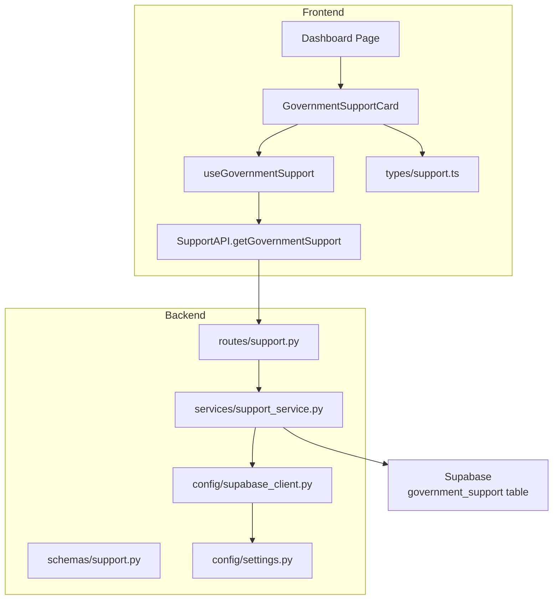
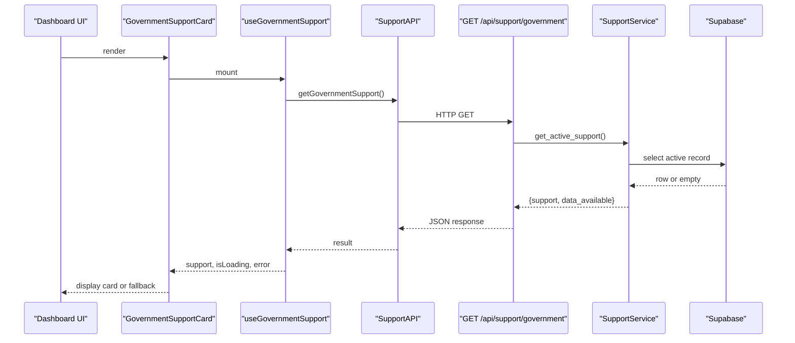
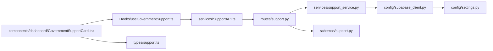

# Support Service

<cite>
**Referenced Files in This Document**
- [support.py](file://Backend/routes/support.py)
- [support_service.py](file://Backend/services/support_service.py)
- [support.py (schemas)](file://Backend/schemas/support.py)
- [supabase_client.py](file://Backend/config/supabase_client.py)
- [settings.py](file://Backend/config/settings.py)
- [SupportAPI.ts](file://Frontend/greenflora/services/SupportAPI.ts)
- [useGovernmentSupport.ts](file://Frontend/greenflora/Hooks/useGovernmentSupport.ts)
- [GovernmentSupportCard.tsx](file://Frontend/greenflora/components/dashboard/GovernmentSupportCard.tsx)
- [dashboard page](file://Frontend/greenflora/app/dashboard/page.tsx)
- [support types](file://Frontend/greenflora/types/support.ts)
</cite>

## Table of Contents
1. [Introduction](#introduction)
2. [Project Structure](#project-structure)
3. [Core Components](#core-components)
4. [Architecture Overview](#architecture-overview)
5. [Detailed Component Analysis](#detailed-component-analysis)
6. [Dependency Analysis](#dependency-analysis)
7. [Performance Considerations](#performance-considerations)
8. [Troubleshooting Guide](#troubleshooting-guide)
9. [Conclusion](#conclusion)

## Introduction
This document explains the Government Support Service that provides farmers with the active official government helpline and related support information. The service reads a single active record from a Supabase table and exposes it through a public API endpoint. The frontend displays this information as a dashboard card, including a direct “Call Now” action that opens the device dialer.

Key characteristics:
- Public reference data: no authentication is required to access the endpoint.
- Single active record model: only one active government support record is returned at a time.
- Graceful degradation: when no database or record exists, the UI shows a fallback state.
- Caching: short-lived in-memory caching reduces database load for a rarely changing dataset.

## Project Structure
The feature spans backend routes, services, schemas, configuration, and frontend hooks, API client, types, and UI components.

**Diagram sources**
- [dashboard page:213-216](file://Frontend/greenflora/app/dashboard/page.tsx#L213-L216)
- [GovernmentSupportCard.tsx:61-129](file://Frontend/greenflora/components/dashboard/GovernmentSupportCard.tsx#L61-L129)
- [useGovernmentSupport.ts:22-50](file://Frontend/greenflora/Hooks/useGovernmentSupport.ts#L22-L50)
- [SupportAPI.ts:99-101](file://Frontend/greenflora/services/SupportAPI.ts#L99-L101)
- [support.py (routes):32-56](file://Backend/routes/support.py#L32-L56)
- [support_service.py:51-90](file://Backend/services/support_service.py#L51-L90)
- [supabase_client.py:19-47](file://Backend/config/supabase_client.py#L19-L47)
- [settings.py:70-73](file://Backend/config/settings.py#L70-L73)

**Section sources**
- [dashboard page:213-216](file://Frontend/greenflora/app/dashboard/page.tsx#L213-L216)
- [GovernmentSupportCard.tsx:61-129](file://Frontend/greenflora/components/dashboard/GovernmentSupportCard.tsx#L61-L129)
- [useGovernmentSupport.ts:22-50](file://Frontend/greenflora/Hooks/useGovernmentSupport.ts#L22-L50)
- [SupportAPI.ts:99-101](file://Frontend/greenflora/services/SupportAPI.ts#L99-L101)
- [support.py (routes):32-56](file://Backend/routes/support.py#L32-L56)
- [support_service.py:51-90](file://Backend/services/support_service.py#L51-L90)
- [supabase_client.py:19-47](file://Backend/config/supabase_client.py#L19-L47)
- [settings.py:70-73](file://Backend/config/settings.py#L70-L73)

## Core Components
- Backend route: exposes GET /api/support/government and returns the active support record.
- Service layer: queries Supabase for the active record, caches it briefly, and returns structured data.
- Schemas: define the response shape for the API and ensure consistent payloads.
- Frontend API client: calls the backend endpoint with timeouts and error classification.
- React hook: loads, caches locally, and exposes loading/error states to components.
- UI card: renders the active support info and a “Call Now” link using tel: protocol.
- Configuration: initializes the Supabase client based on environment variables.

**Section sources**
- [support.py (routes):32-56](file://Backend/routes/support.py#L32-L56)
- [support_service.py:51-90](file://Backend/services/support_service.py#L51-L90)
- [support.py (schemas):20-40](file://Backend/schemas/support.py#L20-L40)
- [SupportAPI.ts:45-101](file://Frontend/greenflora/services/SupportAPI.ts#L45-L101)
- [useGovernmentSupport.ts:22-50](file://Frontend/greenflora/Hooks/useGovernmentSupport.ts#L22-L50)
- [GovernmentSupportCard.tsx:61-129](file://Frontend/greenflora/components/dashboard/GovernmentSupportCard.tsx#L61-L129)
- [supabase_client.py:19-47](file://Backend/config/supabase_client.py#L19-L47)

## Architecture Overview
The flow starts at the dashboard, which renders the GovernmentSupportCard. The card uses a React hook to fetch data via the frontend API client. The client calls the backend route, which delegates to the service layer. The service reads from Supabase’s government_support table and returns the active record. The frontend then renders the details and enables a phone call action.

**Diagram sources**
- [GovernmentSupportCard.tsx:61-129](file://Frontend/greenflora/components/dashboard/GovernmentSupportCard.tsx#L61-L129)
- [useGovernmentSupport.ts:22-50](file://Frontend/greenflora/Hooks/useGovernmentSupport.ts#L22-L50)
- [SupportAPI.ts:99-101](file://Frontend/greenflora/services/SupportAPI.ts#L99-L101)
- [support.py (routes):32-56](file://Backend/routes/support.py#L32-L56)
- [support_service.py:51-90](file://Backend/services/support_service.py#L51-L90)

## Detailed Component Analysis

### Backend Route: GET /api/support/government
- Purpose: Return the active government support record for the dashboard card.
- Behavior: Calls the service layer, wraps results in a typed response, and handles errors by returning appropriate HTTP status codes.
- Authentication: Not required; the endpoint serves public reference data.

Error handling:
- Database/runtime errors map to 503 or 500 responses with user-friendly messages.

**Section sources**
- [support.py (routes):32-56](file://Backend/routes/support.py#L32-L56)

### Service Layer: SupportService
- Data source: Supabase table government_support.
- Query logic: Selects fields id, name, organization, phone, description, hours where is_active is true, ordered by id ascending, limited to one row.
- Caching: In-memory cache with a 10-minute TTL to reduce database calls.
- Availability flag: Returns data_available=False when Supabase client is not configured.

Complexity:
- Time complexity per request: O(1) after cache hit; otherwise O(log N) due to ordering and limit on a small set.
- Space complexity: O(1) cache entry.

Optimization opportunities:
- Extend cache TTL if updates are even less frequent.
- Add metrics/logging around cache hits vs misses.

**Section sources**
- [support_service.py:51-90](file://Backend/services/support_service.py#L51-L90)

### API Schemas and Types
- Backend schema defines GovernmentSupportInfo and GovernmentSupportResponse, ensuring consistent payload structure.
- Frontend types mirror the backend schema for type safety across the stack.

Data contract highlights:
- support can be null when no active record exists.
- data_available indicates whether the database was reachable.

**Section sources**
- [support.py (schemas):20-40](file://Backend/schemas/support.py#L20-L40)
- [support types:11-29](file://Frontend/greenflora/types/support.ts#L11-L29)

### Frontend API Client: SupportAPI
- Provides getGovernmentSupport() that calls the backend endpoint.
- Includes timeout handling and error classification (network, timeout, validation, server).
- Attaches optional Authorization header if an access token is present, though not required for this endpoint.

Integration notes:
- Uses NEXT_PUBLIC_API_BASE_URL for base URL configuration.
- Centralized request wrapper ensures consistent behavior across features.

**Section sources**
- [SupportAPI.ts:45-101](file://Frontend/greenflora/services/SupportAPI.ts#L45-L101)

### React Hook: useGovernmentSupport
- Loads support data on mount and exposes support, isLoading, error, and refresh.
- Handles network and server errors gracefully by setting error state and clearing support.

Usage pattern:
- Follows the same loading/error/refresh pattern used by other dashboard features.

**Section sources**
- [useGovernmentSupport.ts:22-50](file://Frontend/greenflora/Hooks/useGovernmentSupport.ts#L22-L50)

### UI Component: GovernmentSupportCard
- Renders the active support info: name, organization, phone, hours, description.
- Provides a “Call Now” button that opens the device dialer using a sanitized tel: link.
- Shows skeleton while loading and a friendly fallback when data is unavailable.

Accessibility:
- Uses aria-label for call actions.
- Clear visual hierarchy and readable text sizes.

**Section sources**
- [GovernmentSupportCard.tsx:61-129](file://Frontend/greenflora/components/dashboard/GovernmentSupportCard.tsx#L61-L129)

### Dashboard Integration
- The dashboard includes the GovernmentSupportCard within its layout.
- The section is placed after key insights and farm summary, providing quick access to official support.

**Section sources**
- [dashboard page:213-216](file://Frontend/greenflora/app/dashboard/page.tsx#L213-L216)

### Configuration and Data Source
- Supabase client initialization depends on environment variables for URL and service key.
- If not configured, the service returns data_available=False and the UI falls back gracefully.

Environment variables:
- SUPABASE_URL
- SUPABASE_SERVICE_KEY

**Section sources**
- [supabase_client.py:19-47](file://Backend/config/supabase_client.py#L19-L47)
- [settings.py:70-73](file://Backend/config/settings.py#L70-L73)

## Dependency Analysis
The feature has minimal coupling and clear separation of concerns:
- Routes depend on services and schemas.
- Services depend on configuration and external database.
- Frontend depends on types, API client, and hook.
- No circular dependencies observed.

**Diagram sources**
- [support.py (routes):32-56](file://Backend/routes/support.py#L32-L56)
- [support_service.py:51-90](file://Backend/services/support_service.py#L51-L90)
- [support.py (schemas):20-40](file://Backend/schemas/support.py#L20-L40)
- [supabase_client.py:19-47](file://Backend/config/supabase_client.py#L19-L47)
- [settings.py:70-73](file://Backend/config/settings.py#L70-L73)
- [useGovernmentSupport.ts:22-50](file://Frontend/greenflora/Hooks/useGovernmentSupport.ts#L22-L50)
- [SupportAPI.ts:99-101](file://Frontend/greenflora/services/SupportAPI.ts#L99-L101)
- [GovernmentSupportCard.tsx:61-129](file://Frontend/greenflora/components/dashboard/GovernmentSupportCard.tsx#L61-L129)
- [support types:11-29](file://Frontend/greenflora/types/support.ts#L11-L29)

**Section sources**
- [support.py (routes):32-56](file://Backend/routes/support.py#L32-L56)
- [support_service.py:51-90](file://Backend/services/support_service.py#L51-L90)
- [support.py (schemas):20-40](file://Backend/schemas/support.py#L20-L40)
- [supabase_client.py:19-47](file://Backend/config/supabase_client.py#L19-L47)
- [settings.py:70-73](file://Backend/config/settings.py#L70-L73)
- [useGovernmentSupport.ts:22-50](file://Frontend/greenflora/Hooks/useGovernmentSupport.ts#L22-L50)
- [SupportAPI.ts:99-101](file://Frontend/greenflora/services/SupportAPI.ts#L99-L101)
- [GovernmentSupportCard.tsx:61-129](file://Frontend/greenflora/components/dashboard/GovernmentSupportCard.tsx#L61-L129)
- [support types:11-29](file://Frontend/greenflora/types/support.ts#L11-L29)

## Performance Considerations
- In-memory caching with a 10-minute TTL reduces database load for a rarely updated dataset.
- Short request timeout (30 seconds) on the frontend prevents long hangs.
- Minimal payload size by selecting only necessary fields.
- Optional: add cache invalidation triggers when the active record changes.

[No sources needed since this section provides general guidance]

## Troubleshooting Guide
Common issues and resolutions:
- No Supabase configuration:
  - Symptom: data_available=false; UI shows fallback message.
  - Resolution: Set SUPABASE_URL and SUPABASE_SERVICE_KEY environment variables.
- Database unreachable:
  - Symptom: 503 or 500 error from backend; UI shows error state.
  - Resolution: Check Supabase availability and credentials; verify network connectivity.
- Frontend timeout:
  - Symptom: Network error or timeout classification in SupportApiError.
  - Resolution: Verify API base URL and network; consider increasing timeout if needed.
- Missing active record:
  - Symptom: support=null; UI shows fallback.
  - Resolution: Ensure a record exists in government_support with is_active=true.

**Section sources**
- [support_service.py:62-90](file://Backend/services/support_service.py#L62-L90)
- [support.py (routes):45-56](file://Backend/routes/support.py#L45-L56)
- [SupportAPI.ts:37-92](file://Frontend/greenflora/services/SupportAPI.ts#L37-L92)
- [GovernmentSupportCard.tsx:47-70](file://Frontend/greenflora/components/dashboard/GovernmentSupportCard.tsx#L47-L70)

## Conclusion
The Government Support Service delivers a reliable, accessible way for farmers to contact official government helplines directly from the dashboard. It emphasizes data integrity by reading from a single authoritative source, graceful degradation when data is unavailable, and a simple, user-friendly interface with a direct call action. The architecture is clean and maintainable, with clear boundaries between routes, services, schemas, and frontend layers.

[No sources needed since this section summarizes without analyzing specific files]