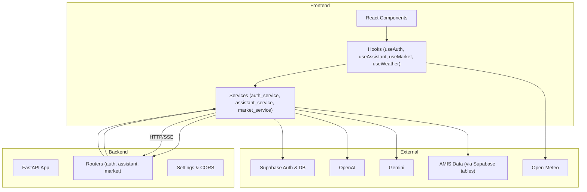
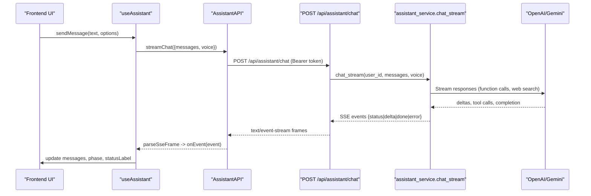
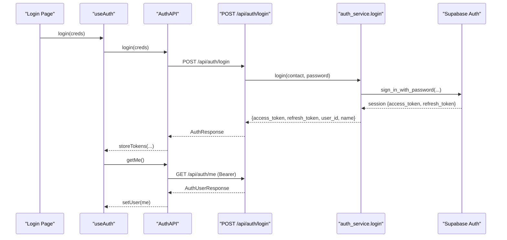
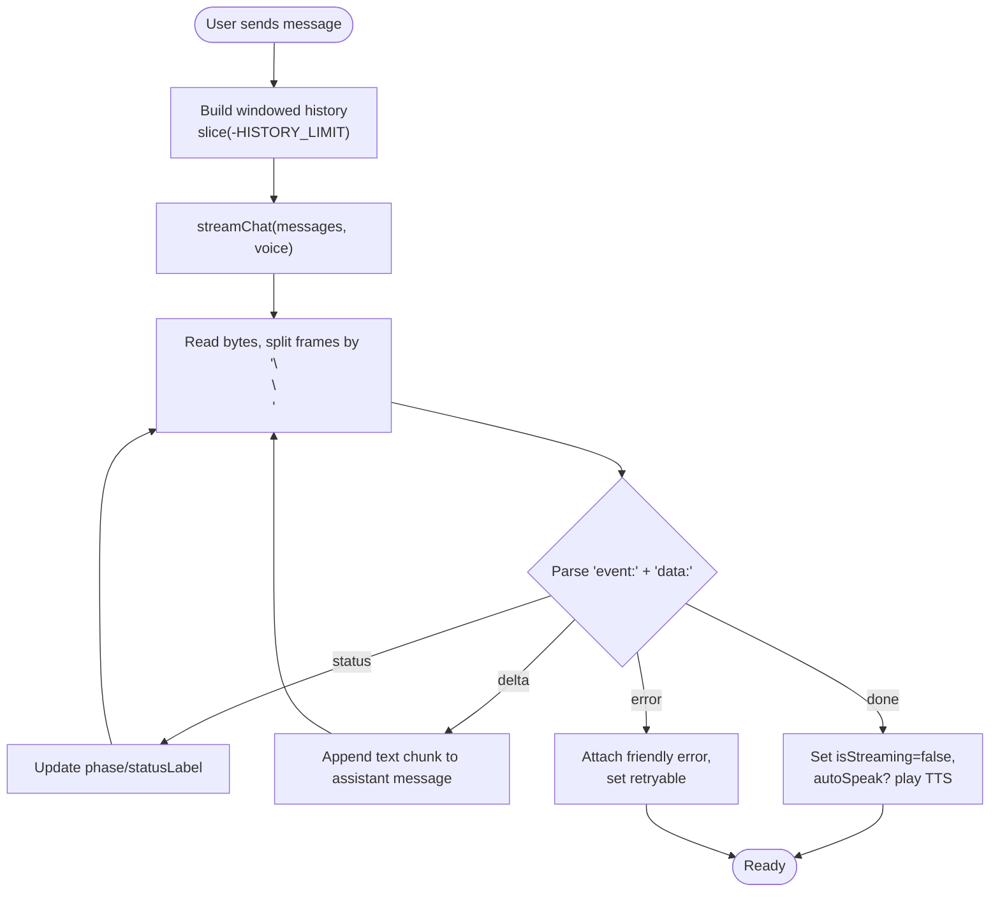
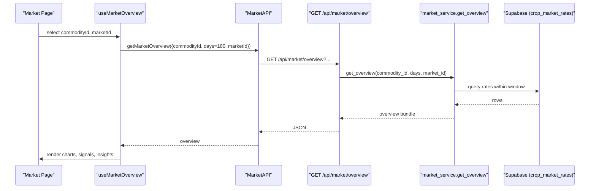
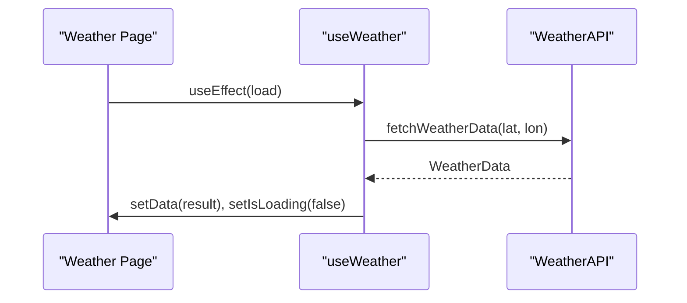
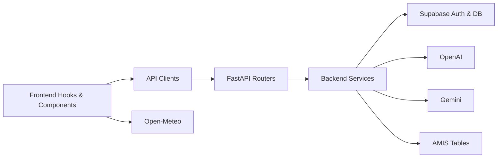

# Data Flow Patterns

<cite>
**Referenced Files in This Document**
- [main.py](file://Backend/main.py)
- [settings.py](file://Backend/config/settings.py)
- [routes/auth.py](file://Backend/routes/auth.py)
- [auth_service.py](file://Backend/services/auth_service.py)
- [routes/assistant.py](file://Backend/routes/assistant.py)
- [assistant_service.py](file://Backend/services/assistant_service.py)
- [routes/market.py](file://Backend/routes/market.py)
- [market_service.py](file://Backend/services/market_service.py)
- [useAuth.tsx](file://Frontend/greenflora/Hooks/useAuth.tsx)
- [AuthAPI.ts](file://Frontend/greenflora/services/AuthAPI.ts)
- [useAssistant.ts](file://Frontend/greenflora/Hooks/useAssistant.ts)
- [AssistantAPI.ts](file://Frontend/greenflora/services/AssistantAPI.ts)
- [useMarket.ts](file://Frontend/greenflora/Hooks/useMarket.ts)
- [MarketAPI.ts](file://Frontend/greenflora/services/MarketAPI.ts)
- [useWeather.ts](file://Frontend/greenflora/Hooks/useWeather.ts)
- [AssistantPanel.tsx](file://Frontend/greenflora/components/assistant/AssistantPanel.tsx)
</cite>

## Table of Contents
1. Introduction
2. Project Structure
3. Core Components
4. Architecture Overview
5. Detailed Component Analysis
6. Dependency Analysis
7. Performance Considerations
8. Troubleshooting Guide
9. Conclusion

## Introduction
This document explains Green Flora’s end-to-end data flow patterns for request-response cycles and real-time communication. It covers:
- User interactions from the Next.js frontend through FastAPI routes, service layers, and external integrations back to the UI.
- Server-Sent Events (SSE) streaming for AI assistant responses.
- Authentication flows with token management, session handling, and protected route access.
- Real-time updates for market prices, weather changes, and assistant conversations.
- Error propagation, loading states, optimistic UI updates, and data transformation across JSON, binary, and streaming formats.
- Caching strategies, request deduplication, and performance optimizations used throughout the application.

## Project Structure
Green Flora is a full-stack application:
- Backend: FastAPI app with modular routers, services, schemas, and configuration.
- Frontend: Next.js app with React hooks, typed API clients, and presentation components.
- External integrations: Supabase Auth and database, OpenAI and Gemini providers, AMIS market data via Supabase tables, and Open-Meteo for weather.

**Diagram sources**
- [main.py:15-47](file://Backend/main.py#L15-L47)
- [settings.py:48-123](file://Backend/config/settings.py#L48-L123)
- [routes/auth.py:38-132](file://Backend/routes/auth.py#L38-L132)
- [routes/assistant.py:42-208](file://Backend/routes/assistant.py#L42-L208)
- [routes/market.py:31-108](file://Backend/routes/market.py#L31-L108)
- [useAuth.tsx:46-128](file://Frontend/greenflora/Hooks/useAuth.tsx#L46-L128)
- [useAssistant.ts:160-657](file://Frontend/greenflora/Hooks/useAssistant.ts#L160-L657)
- [useMarket.ts:33-135](file://Frontend/greenflora/Hooks/useMarket.ts#L33-L135)
- [useWeather.ts:21-58](file://Frontend/greenflora/Hooks/useWeather.ts#L21-L58)

**Section sources**
- [main.py:15-47](file://Backend/main.py#L15-L47)
- [settings.py:48-123](file://Backend/config/settings.py#L48-L123)

## Core Components
- Authentication: FastAPI routes validate credentials via Supabase Auth; tokens are stored in the browser and attached to requests. Protected endpoints require valid Bearer tokens.
- AI Assistant: Streaming chat over SSE with status/delta/done/error events; optional voice transcription and text-to-speech; provider fallback from OpenAI to Gemini on transient errors.
- Market Intelligence: Public endpoints returning AMIS-derived commodity lists and detailed overview bundles with caching at the service layer.
- Weather: Client-side fetch to Open-Meteo using coordinates; simple loading/error state management.

Key responsibilities:
- Routes: Input validation, auth resolution, error mapping to HTTP status codes.
- Services: Business logic, external calls, caching, transformations.
- Frontend hooks: State machines, streaming event handling, request deduplication, optimistic UI updates.

**Section sources**
- [routes/auth.py:68-132](file://Backend/routes/auth.py#L68-L132)
- [auth_service.py:51-193](file://Backend/services/auth_service.py#L51-L193)
- [routes/assistant.py:68-208](file://Backend/routes/assistant.py#L68-L208)
- [assistant_service.py:106-926](file://Backend/services/assistant_service.py#L106-L926)
- [routes/market.py:38-108](file://Backend/routes/market.py#L38-L108)
- [market_service.py:47-653](file://Backend/services/market_service.py#L47-L653)
- [useAuth.tsx:46-128](file://Frontend/greenflora/Hooks/useAuth.tsx#L46-L128)
- [useAssistant.ts:160-657](file://Frontend/greenflora/Hooks/useAssistant.ts#L160-L657)
- [useMarket.ts:33-135](file://Frontend/greenflora/Hooks/useMarket.ts#L33-L135)
- [useWeather.ts:21-58](file://Frontend/greenflora/Hooks/useWeather.ts#L21-L58)

## Architecture Overview
The system follows a layered architecture:
- Presentation: React components and hooks manage UI state and user interactions.
- API Clients: Typed services encapsulate HTTP/SSE calls, timeouts, and error classification.
- Backend Routers: Thin controllers that validate inputs and delegate to services.
- Services: Orchestrate external integrations, compute derived data, and cache results.
- External Systems: Supabase Auth/DB, OpenAI/Gemini, AMIS data, Open-Meteo.

**Diagram sources**
- [useAssistant.ts:285-455](file://Frontend/greenflora/Hooks/useAssistant.ts#L285-L455)
- [AssistantAPI.ts:231-305](file://Frontend/greenflora/services/AssistantAPI.ts#L231-L305)
- [routes/assistant.py:68-112](file://Backend/routes/assistant.py#L68-L112)
- [assistant_service.py:175-287](file://Backend/services/assistant_service.py#L175-L287)

**Section sources**
- [routes/assistant.py:68-112](file://Backend/routes/assistant.py#L68-L112)
- [assistant_service.py:175-287](file://Backend/services/assistant_service.py#L175-L287)
- [AssistantAPI.ts:231-305](file://Frontend/greenflora/services/AssistantAPI.ts#L231-L305)
- [useAssistant.ts:285-455](file://Frontend/greenflora/Hooks/useAssistant.ts#L285-L455)

## Detailed Component Analysis

### Authentication Flow
- Signup/Login: Frontend calls AuthAPI endpoints; backend routes call auth_service to interact with Supabase Auth; tokens are returned and stored in localStorage.
- Session Restoration: On app mount, useAuth restores session by calling getMe; if invalid, attempts refresh using stored refresh token; clears tokens on failure.
- Protected Access: Requests include Authorization header with Bearer token; backend dependencies resolve current user or raise 401.

**Diagram sources**
- [useAuth.tsx:90-103](file://Frontend/greenflora/Hooks/useAuth.tsx#L90-L103)
- [AuthAPI.ts:150-178](file://Frontend/greenflora/services/AuthAPI.ts#L150-L178)
- [routes/auth.py:79-132](file://Backend/routes/auth.py#L79-L132)
- [auth_service.py:94-193](file://Backend/services/auth_service.py#L94-L193)

**Section sources**
- [routes/auth.py:68-132](file://Backend/routes/auth.py#L68-L132)
- [auth_service.py:51-193](file://Backend/services/auth_service.py#L51-L193)
- [useAuth.tsx:46-128](file://Frontend/greenflora/Hooks/useAuth.tsx#L46-L128)
- [AuthAPI.ts:25-178](file://Frontend/greenflora/services/AuthAPI.ts#L25-L178)

### AI Assistant Streaming (SSE)
- Chat Endpoint: POST /api/assistant/chat returns a StreamingResponse with media type text/event-stream.
- Event Stream: The service yields structured events: status (thinking/searching/tool), delta (text chunks), done (provider metadata), error (friendly message, retryable flag).
- Frontend Parsing: AssistantAPI reads the response body stream, splits frames by double newline, parses event/data lines, and dispatches typed events to the hook.
- Voice Mode: Optional voice input triggers transcription and entity extraction; replies can be auto-read aloud via TTS.

**Diagram sources**
- [useAssistant.ts:285-455](file://Frontend/greenflora/Hooks/useAssistant.ts#L285-L455)
- [AssistantAPI.ts:161-305](file://Frontend/greenflora/services/AssistantAPI.ts#L161-L305)
- [routes/assistant.py:68-112](file://Backend/routes/assistant.py#L68-L112)
- [assistant_service.py:175-287](file://Backend/services/assistant_service.py#L175-L287)

**Section sources**
- [routes/assistant.py:68-112](file://Backend/routes/assistant.py#L68-L112)
- [assistant_service.py:175-287](file://Backend/services/assistant_service.py#L175-L287)
- [AssistantAPI.ts:161-305](file://Frontend/greenflora/services/AssistantAPI.ts#L161-L305)
- [useAssistant.ts:285-455](file://Frontend/greenflora/Hooks/useAssistant.ts#L285-L455)

### Market Data Updates
- Commodities List: Public endpoint returns crops with latest date and representative price; service caches results with TTL to keep selector snappy.
- Overview Bundle: Single-crop overview includes current price, change percentage, signal, highest/lowest markets, trend series, distribution, and insights; computed from AMIS data via Supabase tables.
- Frontend Hooks: useMarketCommodities loads list once; useMarketOverview fetches 180-day window and slices periods client-side; uses requestIdRef to avoid out-of-order updates.

**Diagram sources**
- [useMarket.ts:80-135](file://Frontend/greenflora/Hooks/useMarket.ts#L80-L135)
- [MarketAPI.ts:116-128](file://Frontend/greenflora/services/MarketAPI.ts#L116-L128)
- [routes/market.py:69-108](file://Backend/routes/market.py#L69-L108)
- [market_service.py:158-343](file://Backend/services/market_service.py#L158-L343)

**Section sources**
- [routes/market.py:38-108](file://Backend/routes/market.py#L38-L108)
- [market_service.py:47-653](file://Backend/services/market_service.py#L47-L653)
- [useMarket.ts:33-135](file://Frontend/greenflora/Hooks/useMarket.ts#L33-L135)
- [MarketAPI.ts:46-128](file://Frontend/greenflora/services/MarketAPI.ts#L46-L128)

### Weather Updates
- Client Fetch: useWeather calls WeatherAPI with latitude/longitude; sets loading/error states; renders current and forecast data.
- No Backend Dependency: Weather data is fetched directly from Open-Meteo in the frontend.

**Diagram sources**
- [useWeather.ts:21-58](file://Frontend/greenflora/Hooks/useWeather.ts#L21-L58)

**Section sources**
- [useWeather.ts:21-58](file://Frontend/greenflora/Hooks/useWeather.ts#L21-L58)

### Data Transformation Layers
- JSON: Most endpoints return JSON payloads validated by Pydantic schemas; frontend types enforce structure.
- Binary: Text-to-speech returns MP3 blobs; speech-to-text accepts multipart audio files.
- Streaming: SSE frames carry JSON payloads per event; frontend parser normalizes line endings and handles partial frames.

Examples:
- Assistant chat: JSON messages in request; SSE frames with JSON data in response.
- TTS: JSON request body; binary MP3 response.
- Transcription: multipart form upload; JSON response with transcribed text.

**Section sources**
- [routes/assistant.py:119-173](file://Backend/routes/assistant.py#L119-L173)
- [assistant_service.py:591-677](file://Backend/services/assistant_service.py#L591-L677)
- [AssistantAPI.ts:315-386](file://Frontend/greenflora/services/AssistantAPI.ts#L315-L386)

### Caching Strategies
- Market Service: In-memory caches for commodities list and markets map with TTL to reduce DB load and improve responsiveness.
- Greeting Cache: Assistant greeting cached per language/time-of-day/user name with TTL to avoid repeated AI calls.
- Frontend Caching: Request deduplication via requestIdRef in hooks; no explicit network cache for sensitive data.

**Section sources**
- [market_service.py:47-152](file://Backend/services/market_service.py#L47-L152)
- [assistant_service.py:683-735](file://Backend/services/assistant_service.py#L683-L735)
- [useMarket.ts:80-135](file://Frontend/greenflora/Hooks/useMarket.ts#L80-L135)

### Request Deduplication and Optimistic UI
- Request ID Guard: useMarketOverview increments requestIdRef before fetching; ignores superseded responses to prevent stale data rendering.
- Optimistic Updates: Assistant hook creates an empty assistant message immediately with isStreaming=true; appends delta text incrementally; finalizes on done or error.
- Abort Control: UseAbortController to cancel in-flight requests when user stops or navigates away; distinguishes AbortError from network errors.

**Section sources**
- [useMarket.ts:80-135](file://Frontend/greenflora/Hooks/useMarket.ts#L80-L135)
- [useAssistant.ts:285-455](file://Frontend/greenflora/Hooks/useAssistant.ts#L285-L455)
- [AssistantAPI.ts:231-305](file://Frontend/greenflora/services/AssistantAPI.ts#L231-L305)

### Error Propagation Patterns
- Backend: Routes map service exceptions to HTTP status codes; assistant routes wrap unexpected failures in friendly error events; market routes return 503 for temporary unavailability.
- Frontend: API clients classify errors into network/timeout/validation/server/auth types; hooks surface user-friendly messages without leaking raw errors.
- Streaming Errors: Assistant hook attaches error to the assistant message with retryable flag; UI offers retry action.

**Section sources**
- [routes/auth.py:45-61](file://Backend/routes/auth.py#L45-L61)
- [routes/assistant.py:91-112](file://Backend/routes/assistant.py#L91-L112)
- [routes/market.py:51-108](file://Backend/routes/market.py#L51-L108)
- [AssistantAPI.ts:50-93](file://Frontend/greenflora/services/AssistantAPI.ts#L50-L93)
- [useAssistant.ts:394-455](file://Frontend/greenflora/Hooks/useAssistant.ts#L394-L455)

## Dependency Analysis

**Diagram sources**
- [main.py:15-47](file://Backend/main.py#L15-L47)
- [routes/auth.py:38-132](file://Backend/routes/auth.py#L38-L132)
- [routes/assistant.py:42-208](file://Backend/routes/assistant.py#L42-L208)
- [routes/market.py:31-108](file://Backend/routes/market.py#L31-L108)
- [useAuth.tsx:46-128](file://Frontend/greenflora/Hooks/useAuth.tsx#L46-L128)
- [useAssistant.ts:160-657](file://Frontend/greenflora/Hooks/useAssistant.ts#L160-L657)
- [useMarket.ts:33-135](file://Frontend/greenflora/Hooks/useMarket.ts#L33-L135)
- [useWeather.ts:21-58](file://Frontend/greenflora/Hooks/useWeather.ts#L21-L58)

**Section sources**
- [main.py:15-47](file://Backend/main.py#L15-L47)
- [settings.py:48-123](file://Backend/config/settings.py#L48-L123)

## Performance Considerations
- Streaming Efficiency: SSE avoids full round-trips for long answers; incremental UI updates improve perceived latency.
- Caching: Market service caches frequently accessed lists and maps; greeting cache reduces AI calls.
- Timeouts: Frontend enforces request timeouts; backend streams have configurable timeouts for AI providers.
- Provider Fallback: Assistant service falls back to Gemini on transient OpenAI errors; prevents single-point failures.
- Payload Limits: Message length caps and audio size limits protect backend resources.

[No sources needed since this section provides general guidance]

## Troubleshooting Guide
Common issues and resolutions:
- Authentication Failures: Ensure tokens are stored and refreshed; check Supabase configuration; verify CORS settings.
- SSE Interruptions: Handle AbortError gracefully; reattach listeners; offer retry actions for failed streams.
- Market Data Unavailable: Check AMIS ingestion status; service returns empty states; UI should show honest empty states.
- Voice Features: Microphone permissions required; transcription/TTS failures do not block text replies; show notices.

**Section sources**
- [useAuth.tsx:50-88](file://Frontend/greenflora/Hooks/useAuth.tsx#L50-L88)
- [AssistantAPI.ts:231-305](file://Frontend/greenflora/services/AssistantAPI.ts#L231-L305)
- [market_service.py:67-152](file://Backend/services/market_service.py#L67-L152)
- [useAssistant.ts:457-556](file://Frontend/greenflora/Hooks/useAssistant.ts#L457-L556)

## Conclusion
Green Flora implements robust data flow patterns across its stack:
- Clear separation of concerns between routes, services, and frontend hooks.
- Reliable streaming with SSE for real-time AI assistant responses.
- Secure authentication with token persistence and session restoration.
- Efficient caching and request deduplication for responsive UIs.
- Graceful error handling and fallbacks to maintain usability under failures.
These patterns ensure a smooth, performant, and resilient experience for farmers using the platform.