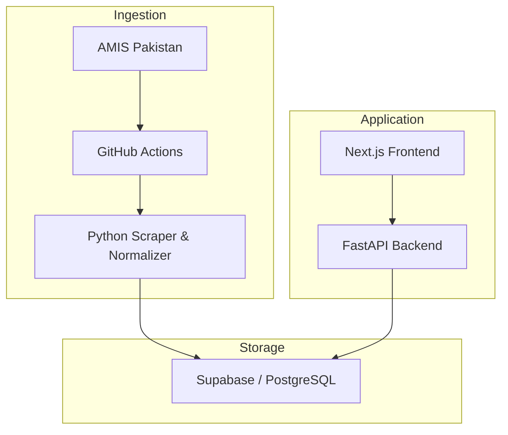
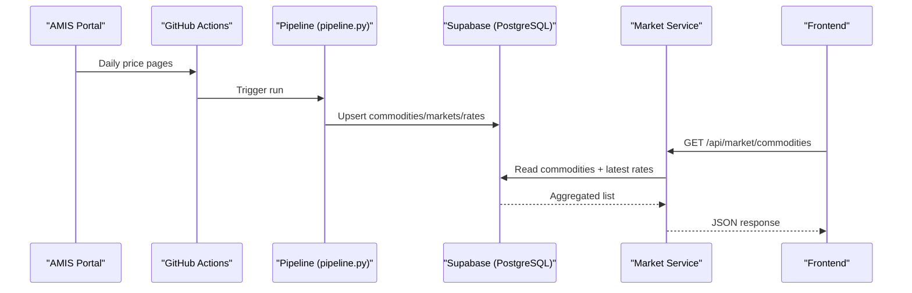
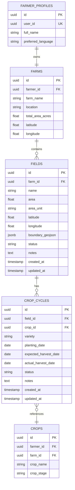
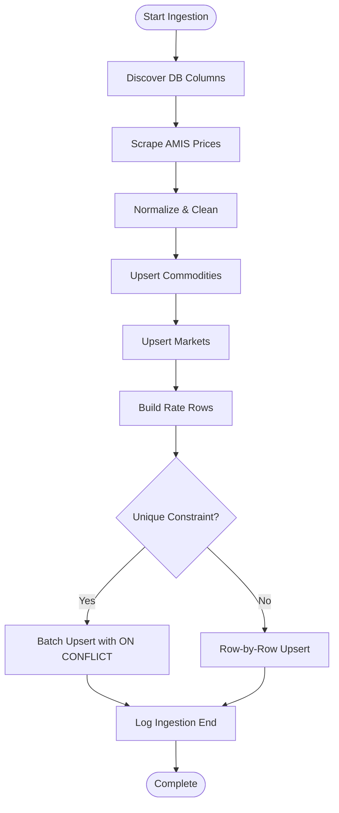
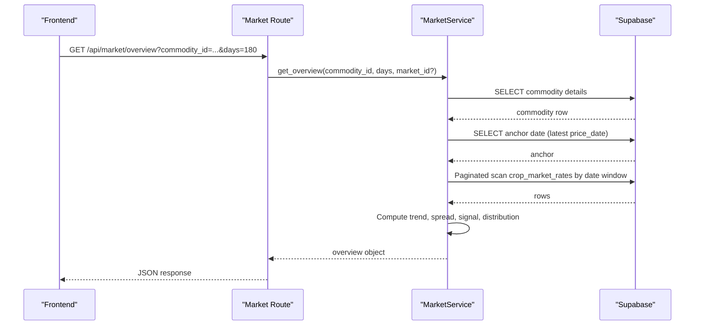
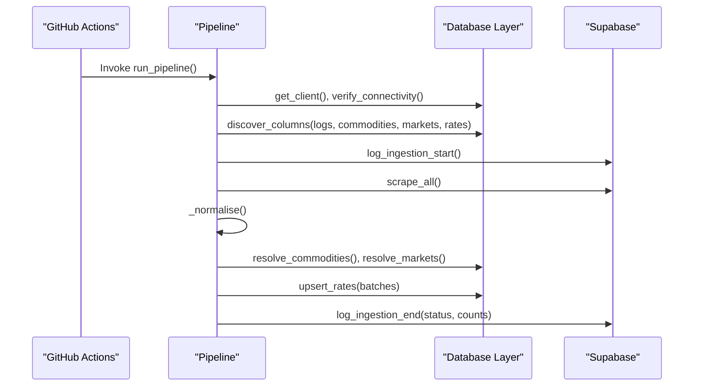
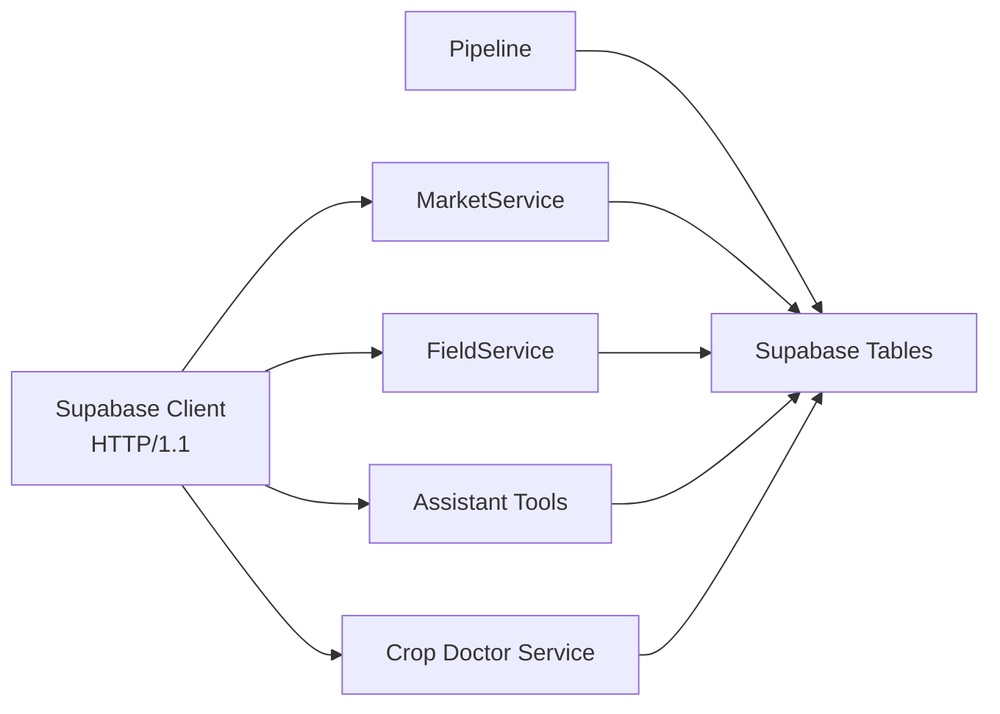

# Database Design

<cite>
**Referenced Files in This Document**
- [architechture.md](file://architechture.md)
- [supabase_client.py](file://Backend/config/supabase_client.py)
- [farmer_service.py](file://Backend/services/farmer_service.py)
- [field_service.py](file://Backend/services/field_service.py)
- [market_service.py](file://Backend/services/market_service.py)
- [assistant_tools.py](file://Backend/services/assistant_tools.py)
- [crop_doctor_service.py](file://Backend/services/crop_doctor_service.py)
- [db.py](file://Scraper/db.py)
- [pipeline.py](file://Scraper/pipeline.py)
- [config.py](file://Scraper/config.py)
- [routes/market.py](file://Backend/routes/market.py)
- [routes/field.py](file://Backend/routes/field.py)
- [routes/farmer.py](file://Backend/routes/farmer.py)
</cite>

## Table of Contents
1. Introduction
2. Project Structure
3. Core Components
4. Architecture Overview
5. Detailed Component Analysis
6. Dependency Analysis
7. Performance Considerations
8. Troubleshooting Guide
9. Conclusion
10. Appendices

## Introduction
This document describes the PostgreSQL schema managed through Supabase for Green-Flora, focusing on farmer profiles, farm information, field records, market data tables, and agricultural products catalog. It explains entity relationships, foreign key constraints, data integrity rules, table structures inferred from code, indexes and constraints observed in ingestion logic, data flow from AMIS scraping to normalized storage, query patterns used by services, optimization strategies, migration approaches, backup procedures, access control policies, and how structured database data is kept separate from AI-generated content to preserve integrity.

## Project Structure
Green-Flora uses a layered backend (FastAPI routes → services → Supabase), a scheduled AMIS scraper pipeline that ingests market data into Supabase, and a Next.js frontend. The database layer is accessed via a centralized Supabase client configured with HTTP/1.1 stability settings. Market data flows from AMIS through GitHub Actions into Supabase; application features read from the same normalized tables.

**Diagram sources**
- [architechture.md:303-352](file://architechture.md#L303-L352)
- [architechture.md:480-504](file://architechture.md#L480-L504)

**Section sources**
- [architechture.md:303-352](file://architechture.md#L303-L352)
- [architechture.md:480-504](file://architechture.md#L480-L504)

## Core Components
The database supports three primary domains:
- Farmer and farm domain: farmer_profiles, farms, fields, crop_cycles, crops
- Market intelligence domain: commodities, markets, crop_market_rates, data_ingestion_logs
- Agricultural products catalog: agricultural_products

Key observations from code:
- Farmer profile and farm auto-provisioning occur when first accessing fields or profile endpoints.
- Fields and crop cycles are linked to farms and reference crops via crop_id.
- Market data is ingested daily into normalized tables with unique constraints and upserts.
- Agricultural products are queried by category and text fields for assistant tools and crop doctor recommendations.

**Section sources**
- [field_service.py:111-183](file://Backend/services/field_service.py#L111-L183)
- [field_service.py:241-321](file://Backend/services/field_service.py#L241-L321)
- [field_service.py:570-693](file://Backend/services/field_service.py#L570-L693)
- [db.py:17-26](file://Scraper/db.py#L17-L26)
- [db.py:320-378](file://Scraper/db.py#L320-L378)
- [assistant_tools.py:451-490](file://Backend/services/assistant_tools.py#L451-L490)
- [crop_doctor_service.py:330-365](file://Backend/services/crop_doctor_service.py#L330-L365)

## Architecture Overview
The system separates authoritative structured data from AI reasoning. Market prices, weather, and product catalogs are stored in PostgreSQL and consumed directly by services and the AI assistant tools. This prevents hallucinated values and ensures consistent insights across UI and assistant responses.

**Diagram sources**
- [pipeline.py:36-257](file://Scraper/pipeline.py#L36-L257)
- [market_service.py:59-152](file://Backend/services/market_service.py#L59-L152)
- [routes/market.py:38-62](file://Backend/routes/market.py#L38-L62)

**Section sources**
- [architechture.md:480-504](file://architechture.md#L480-L504)
- [pipeline.py:36-257](file://Scraper/pipeline.py#L36-L257)
- [market_service.py:59-152](file://Backend/services/market_service.py#L59-L152)

## Detailed Component Analysis

### Farmer Profiles, Farms, Fields, Crop Cycles, and Crops
- farmer_profiles: Stores per-user identity linkage and preferences. Auto-created if missing during field operations.
- farms: One farm per farmer; auto-created if missing. Holds farm name, location, area, coordinates.
- fields: Plots within a farm; includes area, coordinates, boundary GeoJSON, soil type, irrigation method, status.
- crop_cycles: Seasonal planting records tied to fields; links to crops via crop_id; tracks variety, stages, dates, status.
- crops: Canonical crop entries per farm; referenced by crop_cycles; stores crop_name and stage.

Relationships and constraints:
- farmer_profiles → farms (one-to-one or one-to-many depending on future design; current code assumes one farm per farmer).
- farms → fields (one-to-many).
- fields → crop_cycles (one-to-many).
- crop_cycles → crops (many-to-one via crop_id).
- Ownership enforcement occurs at service level using farm_id checks and joins.

Indexes and constraints:
- No explicit DDL in code; service queries rely on id lookups and filters.
- Deletion cascades are handled in service code (delete crop_cycles before fields).

**Diagram sources**
- [field_service.py:111-183](file://Backend/services/field_service.py#L111-L183)
- [field_service.py:241-321](file://Backend/services/field_service.py#L241-L321)
- [field_service.py:570-693](file://Backend/services/field_service.py#L570-L693)

**Section sources**
- [field_service.py:111-183](file://Backend/services/field_service.py#L111-L183)
- [field_service.py:241-321](file://Backend/services/field_service.py#L241-L321)
- [field_service.py:570-693](file://Backend/services/field_service.py#L570-L693)

### Market Data Tables: Commodities, Markets, Rates, Ingestion Logs
- commodities: Reference table for crops traded in markets; includes name, category, unit, active flag, and optional amis_id.
- markets: Reference table for trading locations; includes name, district, province, coordinates, active flag, and optional amis_id.
- crop_market_rates: Time-series of prices per commodity-market-date; includes min_price, max_price, fqp, quantity, unit, source.
- data_ingestion_logs: Tracks ingestion runs with timestamps, status, counts, and error messages.

Constraints and integrity:
- Unique constraint on (commodity_id, market_id, price_date) enforced via upsert; fallback row-by-row handling if missing.
- Idempotent ingestion: duplicate prevention via ON CONFLICT strategy.
- Schema-resilient: column discovery avoids failures on non-essential columns.

**Diagram sources**
- [db.py:62-90](file://Scraper/db.py#L62-L90)
- [db.py:98-178](file://Scraper/db.py#L98-L178)
- [db.py:186-259](file://Scraper/db.py#L186-L259)
- [db.py:320-416](file://Scraper/db.py#L320-L416)
- [pipeline.py:36-257](file://Scraper/pipeline.py#L36-L257)

**Section sources**
- [db.py:17-26](file://Scraper/db.py#L17-L26)
- [db.py:98-178](file://Scraper/db.py#L98-L178)
- [db.py:186-259](file://Scraper/db.py#L186-L259)
- [db.py:320-416](file://Scraper/db.py#L320-L416)
- [pipeline.py:36-257](file://Scraper/pipeline.py#L36-L257)

### Agricultural Products Catalog
- agricultural_products: Stores categories, target problems, brands, active ingredients, dosage, and price ranges. Used by assistant tools and crop doctor service to recommend products based on diagnosis and budget.

Query patterns:
- Text search across multiple columns using OR clauses.
- Category-based filtering for targeted recommendations.

**Section sources**
- [assistant_tools.py:451-490](file://Backend/services/assistant_tools.py#L451-L490)
- [crop_doctor_service.py:330-365](file://Backend/services/crop_doctor_service.py#L330-L365)

### Query Patterns and Optimization Strategies
- Market service caches commodities and markets with TTL to reduce repeated reads.
- Paginated scans over crop_market_rates with range limits to avoid large payloads.
- Representative price computation prefers quantity-weighted averages when sufficient data exists; otherwise falls back to simple average or single market value.
- Trend series built per day; optional scoping to a specific market.
- Change detection compares representative price against ~7-day prior window with flexible fallbacks.

**Diagram sources**
- [routes/market.py:69-108](file://Backend/routes/market.py#L69-L108)
- [market_service.py:158-343](file://Backend/services/market_service.py#L158-L343)
- [market_service.py:599-648](file://Backend/services/market_service.py#L599-L648)

**Section sources**
- [market_service.py:47-45](file://Backend/services/market_service.py#L47-L45)
- [market_service.py:59-152](file://Backend/services/market_service.py#L59-L152)
- [market_service.py:158-343](file://Backend/services/market_service.py#L158-L343)
- [market_service.py:398-468](file://Backend/services/market_service.py#L398-L468)
- [market_service.py:599-648](file://Backend/services/market_service.py#L599-L648)

### Data Flow from AMIS Scraper to Database
- Pipeline orchestrates scraping, normalization, ID resolution, and upserts.
- Column discovery ensures resilience to schema changes.
- Ingestion logs record start/end, status, and metrics.

**Diagram sources**
- [pipeline.py:36-257](file://Scraper/pipeline.py#L36-L257)
- [db.py:62-90](file://Scraper/db.py#L62-L90)
- [db.py:424-497](file://Scraper/db.py#L424-L497)

**Section sources**
- [pipeline.py:36-257](file://Scraper/pipeline.py#L36-L257)
- [db.py:424-497](file://Scraper/db.py#L424-L497)

### Access Control Policies
- Farmer and field routes use optional authentication; live mode requires Bearer token; demo mode bypasses auth.
- Farm ownership enforced in service layer by verifying field and cycle belong to the authenticated user’s farm.
- Market endpoints are public since they serve government reference data.

**Section sources**
- [routes/farmer.py:50-68](file://Backend/routes/farmer.py#L50-L68)
- [routes/field.py:51-66](file://Backend/routes/field.py#L51-L66)
- [routes/market.py:8-16](file://Backend/routes/market.py#L8-L16)
- [field_service.py:185-220](file://Backend/services/field_service.py#L185-L220)

### Relationship Between Structured Data and AI-Generated Content
- The assistant uses tool calls to query the same market and product tables rather than fabricating values.
- Market service computes signals and insights strictly from real rows; insights are appended only when supported by data.
- Product recommendations are sourced from agricultural_products and filtered by diagnosis keywords and budget.

**Section sources**
- [architechture.md:581-605](file://architechture.md#L581-L605)
- [market_service.py:523-593](file://Backend/services/market_service.py#L523-L593)
- [assistant_tools.py:451-490](file://Backend/services/assistant_tools.py#L451-L490)
- [crop_doctor_service.py:330-365](file://Backend/services/crop_doctor_service.py#L330-L365)

## Dependency Analysis
- Backend services depend on a centralized Supabase client configured with stable HTTP/1.1 settings.
- Market service depends on PostgREST pagination and caching.
- Field service depends on farm ownership checks and cross-table joins.
- Scraper depends on environment configuration and resilient schema discovery.

**Diagram sources**
- [supabase_client.py:19-47](file://Backend/config/supabase_client.py#L19-L47)
- [market_service.py:59-152](file://Backend/services/market_service.py#L59-L152)
- [field_service.py:111-183](file://Backend/services/field_service.py#L111-L183)
- [assistant_tools.py:451-490](file://Backend/services/assistant_tools.py#L451-L490)
- [crop_doctor_service.py:330-365](file://Backend/services/crop_doctor_service.py#L330-L365)

**Section sources**
- [supabase_client.py:19-47](file://Backend/config/supabase_client.py#L19-L47)
- [market_service.py:59-152](file://Backend/services/market_service.py#L59-L152)
- [field_service.py:111-183](file://Backend/services/field_service.py#L111-L183)
- [assistant_tools.py:451-490](file://Backend/services/assistant_tools.py#L451-L490)
- [crop_doctor_service.py:330-365](file://Backend/services/crop_doctor_service.py#L330-L365)

## Performance Considerations
- Use batch upserts with ON CONFLICT where possible; fallback to row-by-row when constraints are missing.
- Cache frequently accessed reference data (commodities, markets) with short TTL.
- Paginate large scans over rate tables to limit memory usage and latency.
- Prefer representative price methods that leverage quantity data when available for more accurate aggregations.
- Limit history windows to reasonable sizes (e.g., 180 days) to balance freshness and performance.

[No sources needed since this section provides general guidance]

## Troubleshooting Guide
Common issues and mitigations:
- Missing unique constraint on crop_market_rates: pipeline detects and falls back to row-by-row upsert; add constraint to restore efficient batch upserts.
- Connectivity failures: pipeline verifies Supabase connectivity early and aborts with clear errors; ensure credentials are set.
- Empty tables: column discovery handles empty tables gracefully; ingestion logs capture outcomes.
- Authentication errors: routes return 401 in live mode without token; ensure proper bearer token is provided.

**Section sources**
- [db.py:353-378](file://Scraper/db.py#L353-L378)
- [db.py:83-90](file://Scraper/db.py#L83-L90)
- [routes/farmer.py:50-68](file://Backend/routes/farmer.py#L50-L68)
- [routes/field.py:51-66](file://Backend/routes/field.py#L51-L66)

## Conclusion
Green-Flora’s database design centers on robust, normalized tables for farmer/farm data, market intelligence, and agricultural products, with strong separation between authoritative data and AI-generated insights. The ingestion pipeline ensures idempotent, schema-resilient updates, while services optimize reads through caching and pagination. Access controls enforce farm ownership, and market endpoints remain public for reference data. This design supports reliable analytics, actionable insights, and trustworthy AI assistance grounded in verified data.

[No sources needed since this section summarizes without analyzing specific files]

## Appendices

### Table Structures and Key Fields
- farmer_profiles: id, user_id, full_name, preferred_language
- farms: id, farmer_id, farm_name, location, total_area_acres, latitude, longitude
- fields: id, farm_id, name, area, area_unit, latitude, longitude, boundary_geojson, status, notes, created_at, updated_at
- crop_cycles: id, field_id, crop_id, variety, planting_date, expected_harvest_date, actual_harvest_date, status, notes, created_at, updated_at
- crops: id, farmer_id, farm_id, crop_name, crop_stage
- commodities: id, amis_id, name, category, unit, is_active, created_at
- markets: id, amis_id, name, district, province, latitude, longitude, is_active, created_at
- crop_market_rates: id, commodity_id, market_id, price_date, min_price, max_price, fqp, quantity, unit, source, created_at
- data_ingestion_logs: id, run_started_at, run_finished_at, status, records_found, records_inserted, records_skipped, error_message, source

**Section sources**
- [field_service.py:48-64](file://Backend/services/field_service.py#L48-L64)
- [db.py:17-26](file://Scraper/db.py#L17-L26)

### Migration Approaches
- Schema-resilient ingestion adapts to column changes at runtime; prefer adding new columns gradually and updating pipelines accordingly.
- Introduce database-level constraints (e.g., unique indexes) incrementally; maintain fallback logic until constraints are enforced.
- Use ingestion logs to track successful migrations and detect regressions.

**Section sources**
- [db.py:62-90](file://Scraper/db.py#L62-L90)
- [db.py:353-378](file://Scraper/db.py#L353-L378)

### Backup Procedures
- Rely on Supabase’s native backups and point-in-time recovery.
- Export critical reference tables (commodities, markets) periodically for auditability.
- Archive ingestion logs to maintain provenance of data updates.

[No sources needed since this section provides general guidance]

### Access Control Policies Summary
- Farmer and field operations require authentication in live mode; demo mode allows unauthenticated access.
- Market endpoints are public.
- Service-layer ownership checks prevent cross-farm data access.

**Section sources**
- [routes/farmer.py:50-68](file://Backend/routes/farmer.py#L50-L68)
- [routes/field.py:51-66](file://Backend/routes/field.py#L51-L66)
- [routes/market.py:8-16](file://Backend/routes/market.py#L8-L16)
- [field_service.py:185-220](file://Backend/services/field_service.py#L185-L220)