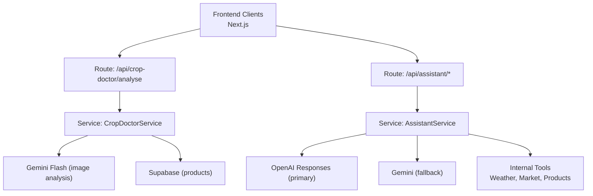
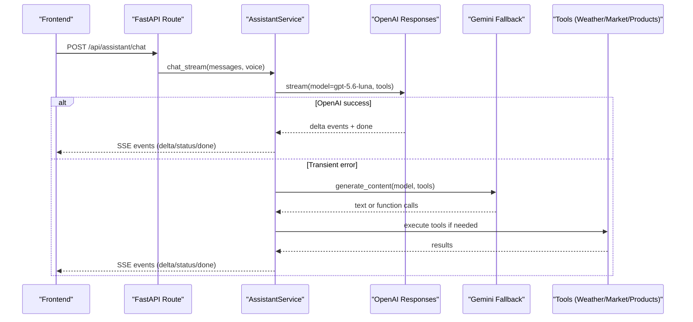
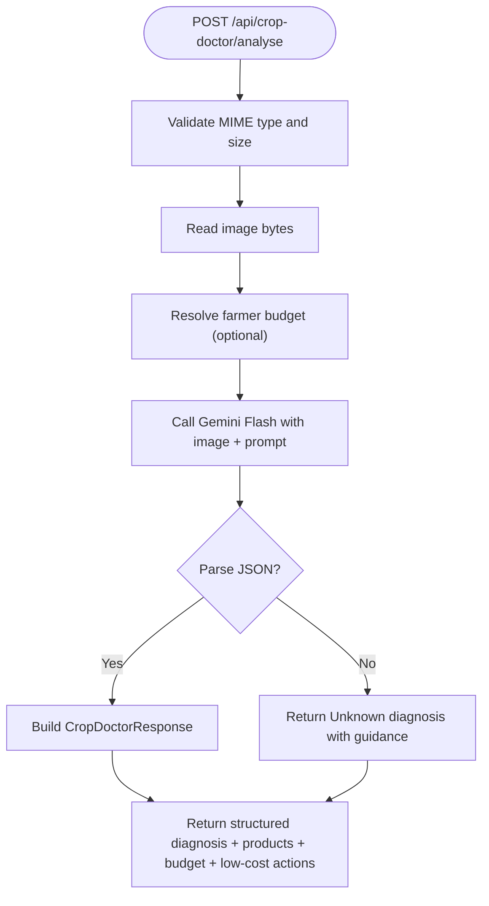
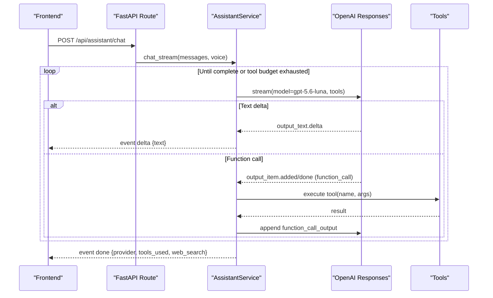
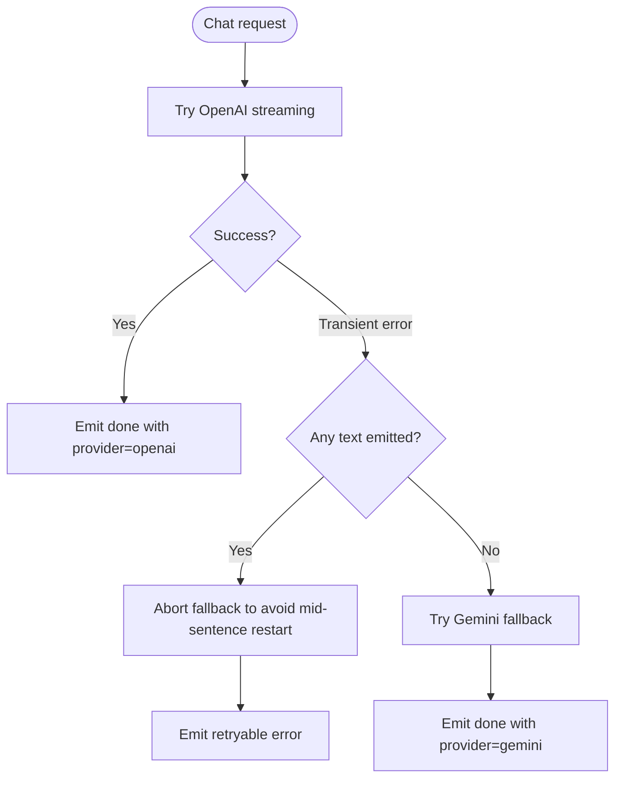
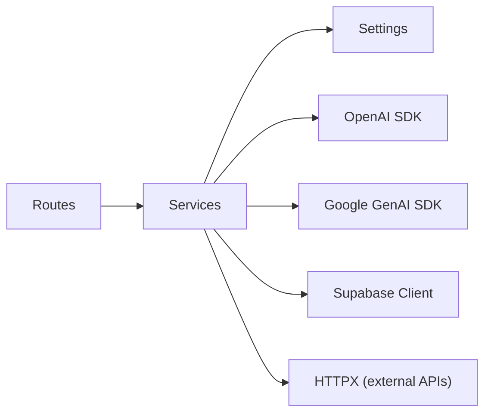

# AI Providers Integration

<cite>
**Referenced Files in This Document**
- [main.py](file://Backend/main.py)
- [settings.py](file://Backend/config/settings.py)
- [crop_doctor_service.py](file://Backend/services/crop_doctor_service.py)
- [assistant_service.py](file://Backend/services/assistant_service.py)
- [assistant_tools.py](file://Backend/services/assistant_tools.py)
- [crop_doctor.py](file://Backend/routes/crop_doctor.py)
- [assistant.py](file://Backend/routes/assistant.py)
- [crop_doctor.py (schemas)](file://Backend/schemas/crop_doctor.py)
- [CropDoctorAPI.ts](file://Frontend/greenflora/services/CropDoctorAPI.ts)
- [AssistantAPI.ts](file://Frontend/greenflora/services/AssistantAPI.ts)
</cite>

## Table of Contents
1. Introduction
2. Project Structure
3. Core Components
4. Architecture Overview
5. Detailed Component Analysis
6. Dependency Analysis
7. Performance Considerations
8. Troubleshooting Guide
9. Conclusion

## Introduction
This document explains how Green Flora integrates multiple AI providers to deliver two core capabilities:
- Image-based crop diagnosis via Gemini Flash
- Conversational AI with tool calling via OpenAI GPT-5.6 Luna

It covers prompt engineering, structured response parsing, error handling, provider failover, configuration for API keys and models, the structured JSON schema for crop diagnosis, and performance techniques such as request caching and streaming. It also provides troubleshooting guidance for common AI service errors and fallback strategies.

## Project Structure
The AI integration spans backend routes, services, schemas, and configuration, plus frontend clients that call these endpoints.

**Diagram sources**
- [crop_doctor.py:48-125](file://Backend/routes/crop_doctor.py#L48-L125)
- [assistant.py:68-112](file://Backend/routes/assistant.py#L68-L112)
- [crop_doctor_service.py:118-165](file://Backend/services/crop_doctor_service.py#L118-L165)
- [assistant_service.py:106-287](file://Backend/services/assistant_service.py#L106-L287)
- [assistant_tools.py:518-575](file://Backend/services/assistant_tools.py#L518-L575)

**Section sources**
- [main.py:15-47](file://Backend/main.py#L15-L47)
- [crop_doctor.py:48-125](file://Backend/routes/crop_doctor.py#L48-L125)
- [assistant.py:68-112](file://Backend/routes/assistant.py#L68-L112)

## Core Components
- Gemini Flash image analysis for crop diagnosis
- OpenAI GPT-5.6 Luna conversational assistant with tool calling
- Provider failover from OpenAI to Gemini on transient failures
- Structured JSON responses for diagnosis and recommendations
- Configuration for API keys, model selection, and timeouts
- Streaming chat via Server-Sent Events (SSE)
- Internal tools for weather, market data, and product search

**Section sources**
- [crop_doctor_service.py:42-64](file://Backend/services/crop_doctor_service.py#L42-L64)
- [assistant_service.py:6-31](file://Backend/services/assistant_service.py#L6-L31)
- [settings.py:84-114](file://Backend/config/settings.py#L84-L114)
- [crop_doctor.py:48-125](file://Backend/routes/crop_doctor.py#L48-L125)
- [assistant.py:68-112](file://Backend/routes/assistant.py#L68-L112)

## Architecture Overview
Green Flora uses a primary/fallback provider strategy:
- Primary: OpenAI Responses API with gpt-5.6-luna for streaming conversation and tool calling
- Fallback: Gemini Flash for non-streaming conversation when OpenAI is temporarily unavailable
- Utility: gpt-4o-mini for lightweight tasks like greetings and entity extraction
- Speech layer: transcription and TTS via OpenAI audio endpoints

**Diagram sources**
- [assistant_service.py:175-287](file://Backend/services/assistant_service.py#L175-L287)
- [assistant_service.py:293-425](file://Backend/services/assistant_service.py#L293-L425)
- [assistant_service.py:431-540](file://Backend/services/assistant_service.py#L431-L540)
- [assistant_tools.py:518-575](file://Backend/services/assistant_tools.py#L518-L575)

## Detailed Component Analysis

### Gemini Flash Integration for Image Analysis (Crop Doctor)
- Prompt engineering: A system prompt instructs Gemini to return strict JSON with fields for crop, problem, problem_type, confidence, severity, symptoms, and explanation. The prompt enforces enumerated values and farmer-friendly language.
- Response parsing: The service strips markdown fences, parses JSON, validates enums, and falls back to a low-confidence Unknown diagnosis if parsing fails so users always receive an answer.
- Error handling: If the Gemini API key is missing or the call fails, a clear runtime error is raised and surfaced by the route as a 502 Bad Gateway.
- Data flow: The route validates the uploaded image, resolves optional budget context, calls the service, and returns a structured response including diagnosis, products, budget context, and low-cost actions.

**Diagram sources**
- [crop_doctor.py:48-125](file://Backend/routes/crop_doctor.py#L48-L125)
- [crop_doctor_service.py:131-165](file://Backend/services/crop_doctor_service.py#L131-L165)
- [crop_doctor_service.py:171-258](file://Backend/services/crop_doctor_service.py#L171-L258)

**Section sources**
- [crop_doctor_service.py:42-64](file://Backend/services/crop_doctor_service.py#L42-L64)
- [crop_doctor_service.py:171-258](file://Backend/services/crop_doctor_service.py#L171-L258)
- [crop_doctor.py:48-125](file://Backend/routes/crop_doctor.py#L48-L125)

### OpenAI GPT-5.6 Luna Integration for Conversational AI with Tool Calling
- Provider strategy: OpenAI Responses API streams deltas for real-time UX; tools include internal functions (weather, market, products) plus web search.
- Tool execution: When the model requests tools, the service executes them, appends outputs to the conversation, and continues until no more tools are requested or a hop limit is reached.
- Streaming and status: SSE events expose thinking/searching/tool progress, text deltas, and completion metadata (provider used, tools used, whether web search was triggered).
- Link sanitization: Markdown links and citations are stripped from streamed text to avoid leaking references to the UI.

**Diagram sources**
- [assistant_service.py:175-287](file://Backend/services/assistant_service.py#L175-L287)
- [assistant_service.py:293-425](file://Backend/services/assistant_service.py#L293-L425)
- [assistant_tools.py:518-575](file://Backend/services/assistant_tools.py#L518-L575)

**Section sources**
- [assistant_service.py:6-31](file://Backend/services/assistant_service.py#L6-L31)
- [assistant_service.py:175-287](file://Backend/services/assistant_service.py#L175-L287)
- [assistant_service.py:293-425](file://Backend/services/assistant_service.py#L293-L425)
- [assistant.py:68-112](file://Backend/routes/assistant.py#L68-L112)

### Failover Mechanism Between AI Providers
- Primary path: OpenAI streaming is attempted first.
- Transient failure detection: Timeouts, connection errors, rate limits, and server errors are classified as transient and trigger fallback.
- Fallback path: Gemini is invoked with function tools and optional Google Search grounding. If the combination is rejected, it retries with data tools only.
- User experience: Status events indicate connecting to backup; mid-stream interruptions do not restart answers once text has been emitted.

**Diagram sources**
- [assistant_service.py:175-287](file://Backend/services/assistant_service.py#L175-L287)
- [assistant_service.py:293-425](file://Backend/services/assistant_service.py#L293-L425)
- [assistant_service.py:431-540](file://Backend/services/assistant_service.py#L431-L540)

**Section sources**
- [assistant_service.py:175-287](file://Backend/services/assistant_service.py#L175-L287)
- [assistant_service.py:293-425](file://Backend/services/assistant_service.py#L293-L425)
- [assistant_service.py:431-540](file://Backend/services/assistant_service.py#L431-L540)

### Configuration Setup: API Keys, Models, and Timeouts
- API keys:
  - Gemini: GEMINI_API_KEY
  - OpenAI: OPENAI_API_KEY
- Model selection:
  - Main model: AI_MAIN_MODEL (default gpt-5.6-luna)
  - Fallback model: AI_FALLBACK_MODEL (default gemini-3.6-flash)
  - Utility model: AI_UTILITY_MODEL (default gpt-4o-mini)
  - Transcribe model: AI_TRANSCRIBE_MODEL (default gpt-4o-mini-transcribe)
  - TTS model: AI_TTS_MODEL (default gpt-4o-mini-tts)
- Timeouts:
  - Streaming timeout: AI_STREAM_TIMEOUT_SECONDS (default 180)
  - Audio timeout: AI_AUDIO_TIMEOUT_SECONDS (default 60)
- Environment loading: Settings loads .env variables at startup and exposes typed attributes to services.

**Section sources**
- [settings.py:84-114](file://Backend/config/settings.py#L84-L114)

### Structured JSON Response Format for Crop Diagnosis
The Crop Doctor endpoint returns a consistent structure:
- diagnosis:
  - crop: detected crop name
  - problem: short problem name
  - problem_type: one of Disease, Pest/Insect, Nutrient Deficiency, Weed, Environmental/Physical Stress, Unknown
  - confidence: number 0–100
  - severity: Low, Moderate, High, Unknown
  - symptoms: farmer-friendly description
  - explanation: cause summary
- products: list of matched agricultural products with pricing and dosage details
- budget:
  - budget_pkr: farmer’s treatment budget
  - within_budget: whether any product fits
- low_cost_actions: safe, generic steps when paid options are unavailable or exceed budget
- disclaimer: advisory note about AI assessment accuracy

**Section sources**
- [crop_doctor.py (schemas):21-123](file://Backend/schemas/crop_doctor.py#L21-L123)

### Performance Optimization Techniques
- Request caching:
  - Greeting cache: In-memory TTL-based cache for dashboard greetings keyed by language/time-of-day/name to avoid repeated AI calls.
- Streaming:
  - SSE streaming for chat reduces perceived latency and improves responsiveness.
- Tool budget and message limits:
  - Limits on tool hops and history messages prevent runaway loops and keep prompts bounded.
- Safe defaults and graceful degradation:
  - Missing Supabase or external data returns explicit “unavailable” payloads instead of failing hard.
- Frontend timeouts:
  - Client-side abort controllers enforce request timeouts to avoid hanging UI.

[No sources needed since this section provides general guidance]

## Dependency Analysis
- Routes depend on services for business logic and on settings for configuration.
- Services depend on external SDKs (OpenAI, Google GenAI), HTTP clients, and database clients (Supabase).
- Tools abstract data access for weather, market, and products, ensuring consistent behavior across providers.

**Diagram sources**
- [main.py:15-47](file://Backend/main.py#L15-L47)
- [assistant_service.py:106-128](file://Backend/services/assistant_service.py#L106-L128)
- [crop_doctor_service.py:118-126](file://Backend/services/crop_doctor_service.py#L118-L126)
- [assistant_tools.py:23-43](file://Backend/services/assistant_tools.py#L23-L43)

**Section sources**
- [main.py:15-47](file://Backend/main.py#L15-L47)
- [assistant_service.py:106-128](file://Backend/services/assistant_service.py#L106-L128)
- [crop_doctor_service.py:118-126](file://Backend/services/crop_doctor_service.py#L118-L126)
- [assistant_tools.py:23-43](file://Backend/services/assistant_tools.py#L23-L43)

## Performance Considerations
- Prefer streaming for long-running conversations to improve user experience.
- Use utility models for cheap tasks (greetings, entity extraction) to reduce cost and latency.
- Limit tool hops and message length to control token usage and response time.
- Cache frequently accessed, stable content (e.g., greetings) with short TTLs.
- Enforce client-side timeouts to prevent indefinite waits.
- Degrade gracefully when external data sources are unavailable to maintain app stability.

[No sources needed since this section provides general guidance]

## Troubleshooting Guide
Common issues and recommended actions:
- Missing API keys:
  - Symptom: Feature disabled or runtime error indicating configuration is required.
  - Action: Set GEMINI_API_KEY and/or OPENAI_API_KEY in environment.
- Rate limiting or server errors from OpenAI:
  - Symptom: Transient error events during chat; automatic fallback to Gemini.
  - Action: Retry after a short delay; monitor logs for repeated failures.
- Gemini fallback unavailability:
  - Symptom: Errors when both providers are down.
  - Action: Ensure GEMINI_API_KEY is set; check network connectivity.
- Invalid or malformed AI responses:
  - Symptom: Parsing warnings or fallback diagnoses.
  - Action: Review prompts and model outputs; consider adjusting temperature or constraints.
- External tool failures (weather/market/products):
  - Symptom: “Unavailable” payloads returned by tools.
  - Action: Verify network access and downstream services; handle gracefully in UI.
- Frontend timeouts:
  - Symptom: Network or timeout errors on client side.
  - Action: Increase timeout thresholds if necessary; ensure stable connectivity.

**Section sources**
- [crop_doctor_service.py:171-205](file://Backend/services/crop_doctor_service.py#L171-L205)
- [assistant_service.py:228-287](file://Backend/services/assistant_service.py#L228-L287)
- [assistant_service.py:556-585](file://Backend/services/assistant_service.py#L556-L585)
- [CropDoctorAPI.ts:33-106](file://Frontend/greenflora/services/CropDoctorAPI.ts#L33-L106)
- [AssistantAPI.ts:50-84](file://Frontend/greenflora/services/AssistantAPI.ts#L50-L84)

## Conclusion
Green Flora’s AI integration combines Gemini Flash for robust image-based crop diagnosis and OpenAI GPT-5.6 Luna for conversational assistance with tool calling. A well-defined failover mechanism ensures resilience, while structured schemas and streaming provide reliable, user-friendly experiences. Configuration is centralized and extensible, enabling easy model swaps and tuning. With caching, streaming, and graceful degradation, the system balances performance, reliability, and cost-effectiveness for farmers’ needs.