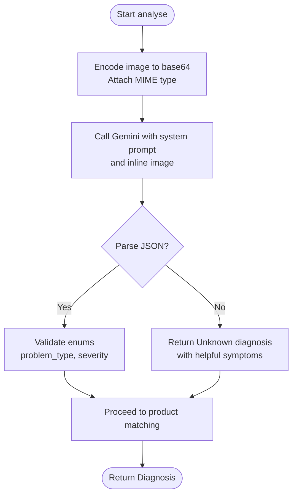
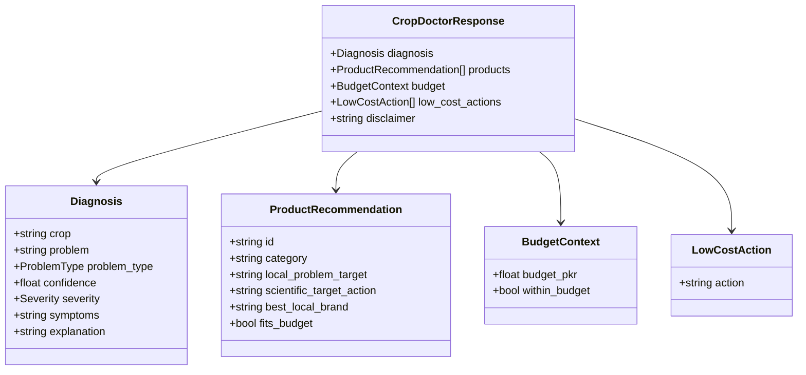
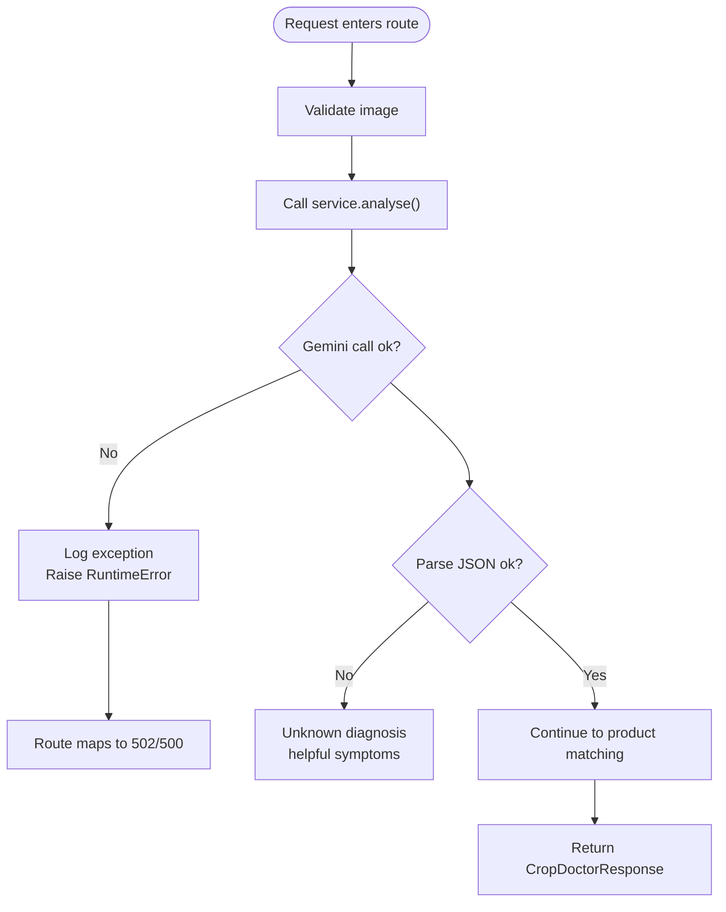
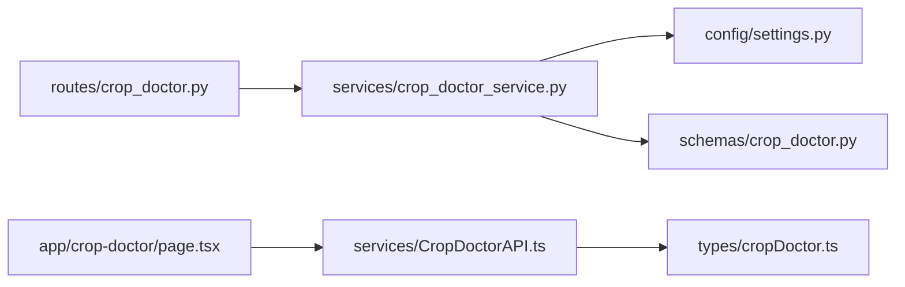

# Gemini API Integration

<cite>
**Referenced Files in This Document**
- [crop_doctor.py](file://Backend/routes/crop_doctor.py)
- [crop_doctor_service.py](file://Backend/services/crop_doctor_service.py)
- [crop_doctor.py (schemas)](file://Backend/schemas/crop_doctor.py)
- [settings.py](file://Backend/config/settings.py)
- [CropDoctorAPI.ts](file://Frontend/greenflora/services/CropDoctorAPI.ts)
- [cropDoctor.ts (types)](file://Frontend/greenflora/types/cropDoctor.ts)
- [page.tsx (Crop Doctor page)](file://Frontend/greenflora/app/crop-doctor/page.tsx)
- [ImageUploader.tsx](file://Frontend/greenflora/components/cropDoctor/ImageUploader.tsx)
</cite>

## Table of Contents
1. Introduction
2. Project Structure
3. Core Components
4. Architecture Overview
5. Detailed Component Analysis
6. Dependency Analysis
7. Performance Considerations
8. Troubleshooting Guide
9. Conclusion

## Introduction
This document explains how Green-Flora’s Crop Doctor feature integrates with the Gemini API to analyse crop images and return structured diagnoses, product recommendations, budget-aware suggestions, and low-cost actions. It covers the full workflow from image upload to response parsing, including base64 encoding, MIME type handling, prompt engineering for strict JSON output, confidence scoring, problem classification, severity assessment, configuration setup, error handling, and troubleshooting guidance.

## Project Structure
The Crop Doctor integration spans backend routes, services, schemas, configuration, and frontend components:
- Backend route validates uploads and delegates analysis to the service.
- Service calls Gemini with a system prompt and inline image data, parses structured JSON, matches products via Supabase, and assembles the final response.
- Frontend handles image selection, uploads via multipart/form-data, manages timeouts, and renders diagnosis and recommendations.

```mermaid
graph TB
FE["Frontend<br/>Crop Doctor Page"] --> API["Backend Route<br/>/api/crop-doctor/analyse"]
API --> SVC["Service<br/>CropDoctorService"]
SVC --> GEM["Gemini API<br/>gemini-3.6-flash"]
SVC --> SUP["Supabase<br/>agricultural_products"]
SVC --> RESP["CropDoctorResponse"]
FE <-- RESP
```

**Diagram sources**
- [crop_doctor.py:48-125](file://Backend/routes/crop_doctor.py#L48-L125)
- [crop_doctor_service.py:131-165](file://Backend/services/crop_doctor_service.py#L131-L165)
- [crop_doctor_service.py:171-205](file://Backend/services/crop_doctor_service.py#L171-L205)
- [crop_doctor_service.py:264-339](file://Backend/services/crop_doctor_service.py#L264-L339)
- [CropDoctorAPI.ts:47-106](file://Frontend/greenflora/services/CropDoctorAPI.ts#L47-L106)

**Section sources**
- [crop_doctor.py:48-125](file://Backend/routes/crop_doctor.py#L48-L125)
- [crop_doctor_service.py:131-165](file://Backend/services/crop_doctor_service.py#L131-L165)
- [CropDoctorAPI.ts:47-106](file://Frontend/greenflora/services/CropDoctorAPI.ts#L47-L106)

## Core Components
- Backend route: Validates MIME type, size, emptiness; resolves optional farmer budget; calls service; maps exceptions to HTTP status codes.
- Service: Encodes image to base64, sends to Gemini with a strict JSON system prompt, parses response into Diagnosis, queries Supabase for matching products, applies budget logic, and returns low-cost actions when needed.
- Schemas: Define enums for ProblemType and Severity, and Pydantic models for Diagnosis, ProductRecommendation, BudgetContext, LowCostAction, and CropDoctorResponse.
- Configuration: Reads GEMINI_API_KEY and model settings from environment variables.
- Frontend: Uploads images via FormData, enforces client-side validation, sets a request timeout, classifies errors, and displays results.

**Section sources**
- [crop_doctor.py:48-125](file://Backend/routes/crop_doctor.py#L48-L125)
- [crop_doctor_service.py:118-165](file://Backend/services/crop_doctor_service.py#L118-L165)
- [crop_doctor.py (schemas):21-123](file://Backend/schemas/crop_doctor.py#L21-L123)
- [settings.py:84-106](file://Backend/config/settings.py#L84-L106)
- [CropDoctorAPI.ts:47-106](file://Frontend/greenflora/services/CropDoctorAPI.ts#L47-L106)

## Architecture Overview
End-to-end flow from image upload to diagnosis and recommendations:

```mermaid
sequenceDiagram
participant FE as "Frontend"
participant RT as "Route /analyse"
participant SV as "CropDoctorService"
participant GM as "Gemini API"
participant SB as "Supabase"
FE->>RT : POST /api/crop-doctor/analyse (multipart image)
RT->>RT : Validate MIME, size, empty
RT->>SV : analyse(image_bytes, mime_type, budget)
SV->>GM : generate_content({system_prompt, inline_data})
GM-->>SV : JSON text (Diagnosis)
SV->>SB : Query agricultural_products by category
SB-->>SV : Products list
SV->>SV : Score & filter by keywords + budget
SV-->>RT : CropDoctorResponse
RT-->>FE : JSON response
```



**Diagram sources**
- [crop_doctor.py:48-125](file://Backend/routes/crop_doctor.py#L48-L125)
- [crop_doctor_service.py:131-165](file://Backend/services/crop_doctor_service.py#L131-L165)
- [crop_doctor_service.py:171-205](file://Backend/services/crop_doctor_service.py#L171-L205)
- [crop_doctor_service.py:264-339](file://Backend/services/crop_doctor_service.py#L264-L339)

## Detailed Component Analysis

### Image Analysis Workflow
- Base64 encoding and MIME handling: The service encodes raw image bytes to base64 and attaches it as inline_data with the correct MIME type for Gemini.
- Prompt engineering: A system prompt instructs Gemini to return a single JSON object with strict keys and enumerated values for problem_type and severity, ensuring reliable parsing.
- Generation parameters: Temperature is set low to reduce variability, and response_mime_type is set to application/json to encourage structured output.
- Response parsing: The service strips markdown fences if present, parses JSON, validates enums, and falls back to an Unknown diagnosis if parsing fails or fields are invalid.



**Diagram sources**
- [crop_doctor_service.py:171-205](file://Backend/services/crop_doctor_service.py#L171-L205)
- [crop_doctor_service.py:207-258](file://Backend/services/crop_doctor_service.py#L207-L258)

**Section sources**
- [crop_doctor_service.py:171-205](file://Backend/services/crop_doctor_service.py#L171-L205)
- [crop_doctor_service.py:207-258](file://Backend/services/crop_doctor_service.py#L207-L258)

### Confidence Scoring, Problem Classification, and Severity
- Confidence: A numeric percentage (0–100) returned by Gemini indicating certainty; used downstream to inform UI and potentially filtering.
- Problem classification: Enumerated categories include Disease, Pest/Insect, Nutrient Deficiency, Weed, Environmental/Physical Stress, and Unknown. The service validates and normalizes these values.
- Severity: Enumerated levels Low, Moderate, High, Unknown; validated and normalized on parse.

These fields are defined in schemas and enforced during parsing to ensure consistent responses.

**Section sources**
- [crop_doctor.py (schemas):21-35](file://Backend/schemas/crop_doctor.py#L21-L35)
- [crop_doctor.py (schemas):41-62](file://Backend/schemas/crop_doctor.py#L41-L62)
- [crop_doctor_service.py:207-258](file://Backend/services/crop_doctor_service.py#L207-L258)

### Product Matching and Budget-Aware Recommendations
- Category mapping: Each problem_type maps to preferred product categories (e.g., Disease → Fungicide).
- Keyword extraction: Keywords derived from diagnosis fields are matched against product text fields to score relevance.
- Budget context: If at least one product fits the farmer’s budget, within_budget is true; otherwise, low-cost actions are provided.
- Low-cost fallback: Generic, safe actions per problem type are included when no paid option fits or no products match.



**Diagram sources**
- [crop_doctor.py (schemas):41-123](file://Backend/schemas/crop_doctor.py#L41-L123)

**Section sources**
- [crop_doctor_service.py:264-339](file://Backend/services/crop_doctor_service.py#L264-L339)
- [crop_doctor_service.py:409-416](file://Backend/services/crop_doctor_service.py#L409-L416)
- [crop_doctor.py (schemas):68-123](file://Backend/schemas/crop_doctor.py#L68-L123)

### Configuration Setup
- API key: GEMINI_API_KEY must be set in the backend environment; the service checks for its presence before calling Gemini.
- Model selection: The service uses gemini-3.6-flash for image analysis.
- Generation parameters: temperature=0.3 and response_mime_type="application/json" are configured to improve reliability and structure.

**Section sources**
- [settings.py:84-106](file://Backend/config/settings.py#L84-L106)
- [crop_doctor_service.py:121-126](file://Backend/services/crop_doctor_service.py#L121-L126)
- [crop_doctor_service.py:184-196](file://Backend/services/crop_doctor_service.py#L184-L196)

### Error Handling Strategies
- Missing API key: Raises a runtime error indicating configuration is required.
- API call failures: Catches exceptions and raises a user-friendly runtime error; route maps to HTTP 502 Bad Gateway.
- Parsing failures: Falls back to Unknown diagnosis with helpful symptoms rather than failing the entire request.
- Frontend timeouts: Client sets a 60-second timeout; AbortError is converted to a typed timeout error.
- Network and server errors: Frontend classifies errors into network, timeout, validation, server, unknown types and surfaces messages accordingly.



**Diagram sources**
- [crop_doctor.py:106-125](file://Backend/routes/crop_doctor.py#L106-L125)
- [crop_doctor_service.py:171-205](file://Backend/services/crop_doctor_service.py#L171-L205)
- [crop_doctor_service.py:207-258](file://Backend/services/crop_doctor_service.py#L207-L258)
- [CropDoctorAPI.ts:33-39](file://Frontend/greenflora/services/CropDoctorAPI.ts#L33-L39)
- [CropDoctorAPI.ts:87-106](file://Frontend/greenflora/services/CropDoctorAPI.ts#L87-L106)

**Section sources**
- [crop_doctor.py:106-125](file://Backend/routes/crop_doctor.py#L106-L125)
- [crop_doctor_service.py:171-205](file://Backend/services/crop_doctor_service.py#L171-L205)
- [crop_doctor_service.py:207-258](file://Backend/services/crop_doctor_service.py#L207-L258)
- [CropDoctorAPI.ts:33-39](file://Frontend/greenflora/services/CropDoctorAPI.ts#L33-L39)
- [CropDoctorAPI.ts:87-106](file://Frontend/greenflora/services/CropDoctorAPI.ts#L87-L106)

### Frontend Interaction and Validation
- Image selection: Supports drag-and-drop, file picker, and camera capture; validates accepted MIME types and max size (10 MB).
- Upload: Sends multipart/form-data with field name “image”; does not manually set Content-Type so the browser sets boundary correctly.
- Timeout: Uses AbortController with a 60-second timeout; converts abort to a typed timeout error.
- Error display: Shows loading state, error state with retry, and success state rendering diagnosis and recommendations.

**Section sources**
- [ImageUploader.tsx:14-56](file://Frontend/greenflora/components/cropDoctor/ImageUploader.tsx#L14-L56)
- [CropDoctorAPI.ts:47-106](file://Frontend/greenflora/services/CropDoctorAPI.ts#L47-L106)
- [page.tsx (Crop Doctor page):43-66](file://Frontend/greenflora/app/crop-doctor/page.tsx#L43-L66)

## Dependency Analysis
Key dependencies and relationships:
- Route depends on service and schemas; service depends on settings, Supabase client, and Gemini SDK.
- Frontend depends on types and API service; page orchestrates UI states and calls API service.



**Diagram sources**
- [crop_doctor.py:26-30](file://Backend/routes/crop_doctor.py#L26-L30)
- [crop_doctor_service.py:22-34](file://Backend/services/crop_doctor_service.py#L22-L34)
- [crop_doctor_service.py:24-25](file://Backend/services/crop_doctor_service.py#L24-L25)
- [CropDoctorAPI.ts:9-10](file://Frontend/greenflora/services/CropDoctorAPI.ts#L9-L10)
- [page.tsx (Crop Doctor page):17-18](file://Frontend/greenflora/app/crop-doctor/page.tsx#L17-L18)

**Section sources**
- [crop_doctor.py:26-30](file://Backend/routes/crop_doctor.py#L26-L30)
- [crop_doctor_service.py:22-34](file://Backend/services/crop_doctor_service.py#L22-L34)
- [CropDoctorAPI.ts:9-10](file://Frontend/greenflora/services/CropDoctorAPI.ts#L9-L10)
- [page.tsx (Crop Doctor page):17-18](file://Frontend/greenflora/app/crop-doctor/page.tsx#L17-L18)

## Performance Considerations
- Low temperature (0.3) reduces variability and improves consistency of structured outputs.
- Inline image data avoids extra storage steps; base64 encoding is efficient enough for typical image sizes under 10 MB.
- Request timeout (60 seconds) prevents long hangs due to slow Gemini responses.
- Product matching uses keyword scoring and limited top results (up to 3), minimizing database load and processing time.
- Budget filtering avoids unnecessary product inclusion when no fit exists, reducing payload size.

[No sources needed since this section provides general guidance]

## Troubleshooting Guide
Common issues and resolutions:
- Invalid image: Ensure JPEG/PNG/WebP format and size ≤ 10 MB; frontend validates and shows errors; backend rejects unsupported MIME types or oversized files.
- Network errors: Check internet connectivity; frontend classifies as network error and suggests retrying.
- Timeouts: Gemini may take longer; frontend timeout is 60 seconds; consider reducing image size or retrying.
- Rate limiting: If Gemini rate limits occur, retries with smaller images or later attempts; backend logs and returns appropriate errors.
- Missing API key: Backend requires GEMINI_API_KEY; without it, analysis fails early with a clear message.
- Parsing failures: If Gemini returns non-JSON, the service falls back to Unknown diagnosis with helpful symptoms; re-upload a clearer photo.

**Section sources**
- [crop_doctor.py:63-87](file://Backend/routes/crop_doctor.py#L63-L87)
- [crop_doctor_service.py:171-205](file://Backend/services/crop_doctor_service.py#L171-L205)
- [crop_doctor_service.py:207-258](file://Backend/services/crop_doctor_service.py#L207-L258)
- [CropDoctorAPI.ts:33-39](file://Frontend/greenflora/services/CropDoctorAPI.ts#L33-L39)
- [CropDoctorAPI.ts:87-106](file://Frontend/greenflora/services/CropDoctorAPI.ts#L87-L106)
- [ImageUploader.tsx:28-56](file://Frontend/greenflora/components/cropDoctor/ImageUploader.tsx#L28-L56)

## Conclusion
Green-Flora’s Crop Doctor integrates Gemini through a robust pipeline that validates inputs, encodes images, enforces structured JSON via prompt engineering, parses and normalizes responses, and delivers budget-aware recommendations with graceful fallbacks. Clear configuration, strong error handling, and thoughtful performance tuning ensure reliable diagnostics even under adverse conditions.

[No sources needed since this section summarizes without analyzing specific files]