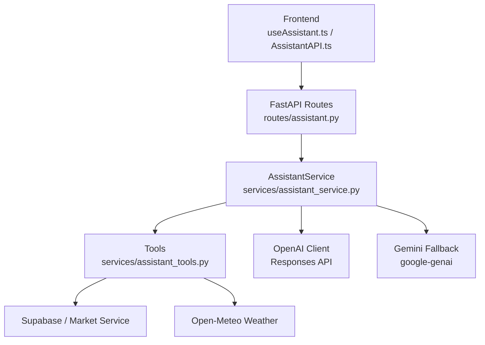
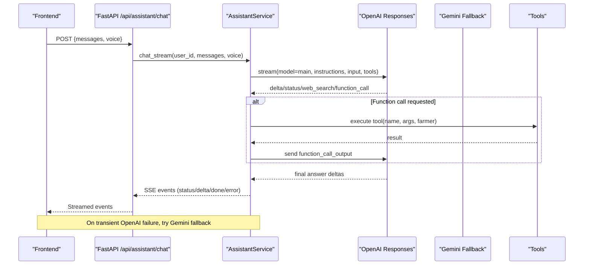
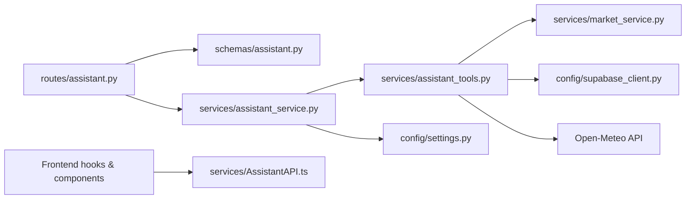

# OpenAI Assistant Integration

<cite>
**Referenced Files in This Document**
- [assistant_service.py](file://Backend/services/assistant_service.py)
- [assistant_tools.py](file://Backend/services/assistant_tools.py)
- [assistant.py](file://Backend/routes/assistant.py)
- [settings.py](file://Backend/config/settings.py)
- [assistant.py (schemas)](file://Backend/schemas/assistant.py)
- [AssistantAPI.ts](file://Frontend/greenflora/services/AssistantAPI.ts)
- [assistant.ts (types)](file://Frontend/greenflora/types/assistant.ts)
- [useAssistant.ts](file://Frontend/greenflora/Hooks/useAssistant.ts)
- [AssistantPanel.tsx](file://Frontend/greenflora/components/assistant/AssistantPanel.tsx)
</cite>

## Table of Contents
1. [Introduction](#introduction)
2. [Project Structure](#project-structure)
3. [Core Components](#core-components)
4. [Architecture Overview](#architecture-overview)
5. [Detailed Component Analysis](#detailed-component-analysis)
6. [Dependency Analysis](#dependency-analysis)
7. [Performance Considerations](#performance-considerations)
8. [Troubleshooting Guide](#troubleshooting-guide)
9. [Conclusion](#conclusion)
10. [Appendices](#appendices)

## Introduction
This document explains the Green Flora AI assistant powered by OpenAI GPT-5.6 Luna, including how the assistant is initialized, how tools are registered and invoked, how conversations are managed across multiple turns, and how voice processing flows from speech-to-text to AI response generation. It also covers configuration for API keys and model selection, tool registration patterns, parameter validation, response formatting, and guidance for extending capabilities with custom tools.

## Project Structure
The assistant spans backend FastAPI routes, a central service orchestrating AI providers and tools, a tools module that implements data access, and a frontend that streams responses via Server-Sent Events (SSE), handles microphone input, and plays text-to-speech audio.

**Diagram sources**
- [assistant.py:68-112](file://Backend/routes/assistant.py#L68-L112)
- [assistant_service.py:106-127](file://Backend/services/assistant_service.py#L106-L127)
- [assistant_tools.py:116-137](file://Backend/services/assistant_tools.py#L116-L137)

**Section sources**
- [assistant.py:1-208](file://Backend/routes/assistant.py#L1-L208)
- [assistant_service.py:1-127](file://Backend/services/assistant_service.py#L1-L127)
- [assistant_tools.py:1-50](file://Backend/services/assistant_tools.py#L1-L50)

## Core Components
- AssistantService: Central orchestrator for chat streaming, provider fallbacks, tool execution, voice transcription, TTS, and greeting generation.
- Tools: Internal functions for weather, market prices, and agricultural product search; plus farmer snapshot loading and context rendering.
- Routes: Thin FastAPI endpoints exposing SSE chat, transcribe, speak, and greeting endpoints with auth handling.
- Frontend: React hook and components implementing stateful conversation UI, SSE parsing, microphone capture, and TTS playback.

Key responsibilities:
- Provider strategy: Primary OpenAI Responses API with Gemini fallback on transient failures.
- Tool calling: Model requests function calls; backend executes tools and feeds results back.
- Voice pipeline: Speech-to-text via OpenAI transcription, optional entity extraction hints, then main model reasoning; TTS via OpenAI speech synthesis.
- Configuration: All models and timeouts loaded from environment settings.

**Section sources**
- [assistant_service.py:106-127](file://Backend/services/assistant_service.py#L106-L127)
- [assistant_tools.py:518-575](file://Backend/services/assistant_tools.py#L518-L575)
- [assistant.py:68-112](file://Backend/routes/assistant.py#L68-L112)
- [useAssistant.ts:285-455](file://Frontend/greenflora/Hooks/useAssistant.ts#L285-L455)

## Architecture Overview
The assistant uses a streaming SSE architecture. The frontend sends messages and receives status, delta, done, and error events. The backend orchestrates provider calls, tool usage, and voice features.

**Diagram sources**
- [assistant.py:68-112](file://Backend/routes/assistant.py#L68-L112)
- [assistant_service.py:175-287](file://Backend/services/assistant_service.py#L175-L287)
- [assistant_service.py:293-425](file://Backend/services/assistant_service.py#L293-L425)
- [assistant_service.py:431-540](file://Backend/services/assistant_service.py#L431-L540)
- [assistant_tools.py:556-585](file://Backend/services/assistant_tools.py#L556-L585)

## Detailed Component Analysis

### Assistant Initialization and Provider Strategy
- Initializes OpenAI client if OPENAI_API_KEY is set.
- Optionally initializes Gemini fallback if GEMINI_API_KEY is set.
- Maintains a small in-memory greeting cache keyed by language/time-of-day/name.
- Uses tunables like max tool hops, message history limit, and character caps.

Configuration highlights:
- Models: ai_main_model (default gpt-5.6-luna), ai_utility_model (gpt-4o-mini), ai_transcribe_model (gpt-4o-mini-transcribe), ai_tts_model (gpt-4o-mini-tts), ai_fallback_model (gemini-3.6-flash).
- Timeouts: ai_stream_timeout_seconds, ai_audio_timeout_seconds.
- Demo mode and CORS, Supabase keys, and other app settings are centralized.

**Section sources**
- [assistant_service.py:106-127](file://Backend/services/assistant_service.py#L106-L127)
- [settings.py:87-114](file://Backend/config/settings.py#L87-L114)

### Chat Streaming and Conversation Management
- chat_stream sanitizes messages, loads farmer snapshot, builds system prompt, optionally enhances with voice-derived entities, then runs OpenAI streaming.
- Handles transient errors by falling back to Gemini without restarting mid-stream if partial text was already emitted.
- Emits SSE events: status (thinking/searching/tool/connecting_backup), delta (text chunks), done (provider, tools_used, web_search), error (message, retryable).
- Enforces a tool budget (_MAX_TOOL_HOPS) to keep responses responsive.

Conversation state:
- History window limited to _MAX_HISTORY_MESSAGES per request.
- Per-message character cap enforced.
- Frontend maintains a local message list, truncates content, and sends only recent history.

**Section sources**
- [assistant_service.py:175-287](file://Backend/services/assistant_service.py#L175-L287)
- [assistant_service.py:293-425](file://Backend/services/assistant_service.py#L293-L425)
- [assistant_service.py:431-540](file://Backend/services/assistant_service.py#L431-L540)
- [useAssistant.ts:285-455](file://Frontend/greenflora/Hooks/useAssistant.ts#L285-L455)

### Tool Registration and Invocation Pattern
Tool definitions are declared centrally and reused by both OpenAI and Gemini runners. Each definition includes name, description, and JSON schema parameters. The assistant converts these into provider-specific tool payloads.

Available tools:
- get_weather: Current conditions + 7-day forecast for farm or named place.
- get_crop_market_data: Latest AMIS mandi price bundle for a crop, with trend summary and market comparison.
- search_agricultural_products: Search products dataset by problem/crop/category keywords.

Invocation flow:
- Model returns function_call items during streaming.
- Backend records call metadata, emits tool status, executes tool, and posts function_call_output back to the model.
- Results include explicit availability flags and messages when data is missing, preventing fabrication.

Parameter validation:
- Arguments parsed from JSON; invalid inputs default to safe empty values.
- Tools return structured “unavailable” payloads instead of inventing data.

**Section sources**
- [assistant_tools.py:518-575](file://Backend/services/assistant_tools.py#L518-L575)
- [assistant_service.py:300-425](file://Backend/services/assistant_service.py#L300-L425)
- [assistant_service.py:556-585](file://Backend/services/assistant_service.py#L556-L585)

### Weather Tool
- Resolves place names via geocoding if provided; otherwise uses saved farm coordinates.
- Fetches current and daily forecasts from Open-Meteo with WMO code interpretation.
- Returns structured data with availability flag and note instructing the model not to fabricate beyond provided data.

**Section sources**
- [assistant_tools.py:194-319](file://Backend/services/assistant_tools.py#L194-L319)

### Market Data Tool
- Normalizes crop names using Urdu/Roman-Urdu aliases.
- Matches against AMIS commodities via market_service.
- Retrieves overview with trend, signal, highest/lowest markets, and per-market comparisons.
- Returns “found” status and insights; on errors, returns unavailable payload.

**Section sources**
- [assistant_tools.py:326-428](file://Backend/services/assistant_tools.py#L326-L428)

### Agricultural Products Tool
- Searches Supabase table agricultural_products using sanitized OR clauses across problem/target/category/brand fields.
- Limits results and returns brand, dosage, pricing ranges exactly as stored.
- Returns available/results or unavailable message depending on query and database connectivity.

**Section sources**
- [assistant_tools.py:435-508](file://Backend/services/assistant_tools.py#L435-L508)

### Voice Processing Pipeline
- Transcription: POST /api/assistant/transcribe accepts multipart audio; backend validates size and MIME type, transcribes via OpenAI audio.transcriptions.create, and returns text.
- Entity extraction: When voice=true, the assistant extracts farming entities (crops, location, market, date/time, activity, disease, intents) using a cheap utility model to improve main model reasoning.
- Text-to-speech: POST /api/assistant/speak returns MP3 audio via OpenAI audio.speech.create with voice and optional instructions.

Frontend integration:
- useAssistant manages recording, transcription, sending voice messages, and auto-speaking replies.
- AssistantAPI parses SSE frames, handles timeouts, and classifies errors.

**Section sources**
- [assistant_service.py:591-677](file://Backend/services/assistant_service.py#L591-L677)
- [assistant_service.py:737-800](file://Backend/services/assistant_service.py#L737-L800)
- [assistant.py:119-173](file://Backend/routes/assistant.py#L119-L173)
- [AssistantAPI.ts:315-385](file://Frontend/greenflora/services/AssistantAPI.ts#L315-L385)
- [useAssistant.ts:457-556](file://Frontend/greenflora/Hooks/useAssistant.ts#L457-L556)

### Dashboard Greeting
- Generates a short, localized greeting based on time-of-day and preferred language.
- Uses cached greetings and falls back to hardcoded messages if AI is unreachable.
- Exposed via GET /api/assistant/greeting.

**Section sources**
- [assistant_service.py:683-735](file://Backend/services/assistant_service.py#L683-L735)
- [assistant.py:180-208](file://Backend/routes/assistant.py#L180-L208)

### Frontend State Machine and UI
- Phases: ready → listening → transcribing → thinking → generating → speaking → ready.
- Maintains message history, streaming updates, and auto-speak toggle.
- Renders phase labels and controls in AssistantPanel.

**Section sources**
- [useAssistant.ts:42-158](file://Frontend/greenflora/Hooks/useAssistant.ts#L42-L158)
- [AssistantPanel.tsx:17-49](file://Frontend/greenflora/components/assistant/AssistantPanel.tsx#L17-L49)

## Dependency Analysis
- Routes depend on schemas for request/response validation and on AssistantService for orchestration.
- AssistantService depends on Settings for configuration and on assistant_tools for data retrieval.
- Tools depend on market_service and Supabase client; weather tool depends on Open-Meteo HTTP API.
- Frontend depends on AssistantAPI for network calls and types for event shapes.

**Diagram sources**
- [assistant.py:1-208](file://Backend/routes/assistant.py#L1-L208)
- [assistant_service.py:1-127](file://Backend/services/assistant_service.py#L1-L127)
- [assistant_tools.py:1-50](file://Backend/services/assistant_tools.py#L1-L50)
- [settings.py:48-123](file://Backend/config/settings.py#L48-L123)
- [AssistantAPI.ts:1-140](file://Frontend/greenflora/services/AssistantAPI.ts#L1-L140)

**Section sources**
- [assistant.py:1-208](file://Backend/routes/assistant.py#L1-L208)
- [assistant_service.py:1-127](file://Backend/services/assistant_service.py#L1-L127)
- [assistant_tools.py:1-50](file://Backend/services/assistant_tools.py#L1-L50)
- [settings.py:48-123](file://Backend/config/settings.py#L48-L123)
- [AssistantAPI.ts:1-140](file://Frontend/greenflora/services/AssistantAPI.ts#L1-L140)

## Performance Considerations
- Tool budget limits prevent excessive tool rounds, ensuring responsiveness even under heavy reasoning.
- Message history capped to reduce token usage and latency.
- Character caps per message avoid oversized payloads.
- Streaming reduces perceived latency by delivering deltas immediately.
- Greeting caching avoids unnecessary AI calls on dashboard load.
- Audio endpoints have shorter timeouts than chat streaming to fail fast on slow connections.

[No sources needed since this section provides general guidance]

## Troubleshooting Guide
Common issues and mitigations:
- No AI configured: If neither OpenAI nor Gemini keys are set, chat returns an error indicating the assistant is not configured.
- Transient provider failures: Timeout, connection, rate limit, or 5xx errors trigger fallback to Gemini; mid-stream interruptions yield friendly errors.
- Tool failures: Tools return “unavailable” payloads with reasons; model instructed to report honestly rather than fabricate.
- Voice transcription/TTS failures: Endpoints raise user-friendly errors; frontend surfaces notices without breaking text experience.
- Authentication: In live mode, missing token yields 401; demo mode allows unauthenticated access.

Operational checks:
- Ensure OPENAI_API_KEY and optionally GEMINI_API_KEY are set.
- Verify AI_MAIN_MODEL and other model env vars match your provider setup.
- Confirm CORS origins allow the frontend origin.
- Validate Supabase credentials for product searches and market data.

**Section sources**
- [assistant_service.py:175-287](file://Backend/services/assistant_service.py#L175-L287)
- [assistant_service.py:591-677](file://Backend/services/assistant_service.py#L591-L677)
- [assistant.py:45-55](file://Backend/routes/assistant.py#L45-L55)
- [assistant.py:119-173](file://Backend/routes/assistant.py#L119-L173)

## Conclusion
Green Flora’s assistant integrates OpenAI GPT-5.6 Luna as the primary reasoning engine with Gemini as a resilient fallback. Tools provide reliable access to weather, market prices, and agricultural products, while the voice pipeline supports natural interaction through transcription and TTS. The design emphasizes safety (no fabricated data), responsiveness (streaming and tool budgets), and configurability (environment-driven models and timeouts). Extending capabilities involves adding new tool definitions and corresponding implementations, following the established pattern.

[No sources needed since this section summarizes without analyzing specific files]

## Appendices

### Configuration Reference
- OPENAI_API_KEY: Enables OpenAI client for primary provider and voice features.
- GEMINI_API_KEY: Enables Gemini fallback for resilience.
- AI_MAIN_MODEL: Primary reasoning model (default gpt-5.6-luna).
- AI_UTILITY_MODEL: Utility model for entity extraction and greeting generation (default gpt-4o-mini).
- AI_TRANSCRIBE_MODEL: Speech-to-text model (default gpt-4o-mini-transcribe).
- AI_TTS_MODEL: Text-to-speech model (default gpt-4o-mini-tts).
- AI_FALLBACK_MODEL: Gemini fallback model (default gemini-3.6-flash).
- AI_STREAM_TIMEOUT_SECONDS: Chat streaming timeout.
- AI_AUDIO_TIMEOUT_SECONDS: Audio endpoint timeout.
- DEMO_MODE: Allows unauthenticated access for development.
- CORS_ORIGINS: Allowed frontend origins.
- SUPABASE_URL, SUPABASE_SERVICE_KEY, SUPABASE_ANON_KEY: Database access for tools.

**Section sources**
- [settings.py:70-114](file://Backend/config/settings.py#L70-L114)

### Custom Tool Creation Guide
To add a new capability:
1. Define a tool entry in TOOL_DEFINITIONS with name, description, and parameters schema.
2. Implement a function in assistant_tools that fetches data safely and returns structured results with availability flags.
3. Add a handler in AssistantService._execute_tool to route the tool name to the implementation.
4. Ensure the tool returns honest “unavailable” payloads when data is missing.
5. Test via chat with prompts that trigger the tool; verify SSE status events and final done metadata.

Example references:
- Tool definitions and parameter schemas.
- Tool execution routing and error handling.
- Weather, market, and product tools as patterns.

**Section sources**
- [assistant_tools.py:518-575](file://Backend/services/assistant_tools.py#L518-L575)
- [assistant_service.py:556-585](file://Backend/services/assistant_service.py#L556-L585)
- [assistant_tools.py:194-319](file://Backend/services/assistant_tools.py#L194-L319)
- [assistant_tools.py:326-428](file://Backend/services/assistant_tools.py#L326-L428)
- [assistant_tools.py:435-508](file://Backend/services/assistant_tools.py#L435-L508)

### SSE Event Types and Handling
- status: Progress states like thinking, searching, tool, connecting_backup.
- delta: Incremental text chunks forming the assistant’s reply.
- done: Final metadata including provider, tools used, and whether web search was employed.
- error: Friendly error messages with retryable flag.

Frontend parsing and state transitions manage phases and update UI accordingly.

**Section sources**
- [assistant_service.py:175-287](file://Backend/services/assistant_service.py#L175-L287)
- [AssistantAPI.ts:161-220](file://Frontend/greenflora/services/AssistantAPI.ts#L161-L220)
- [useAssistant.ts:360-411](file://Frontend/greenflora/Hooks/useAssistant.ts#L360-L411)