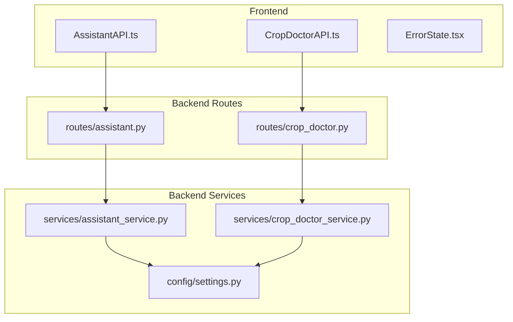
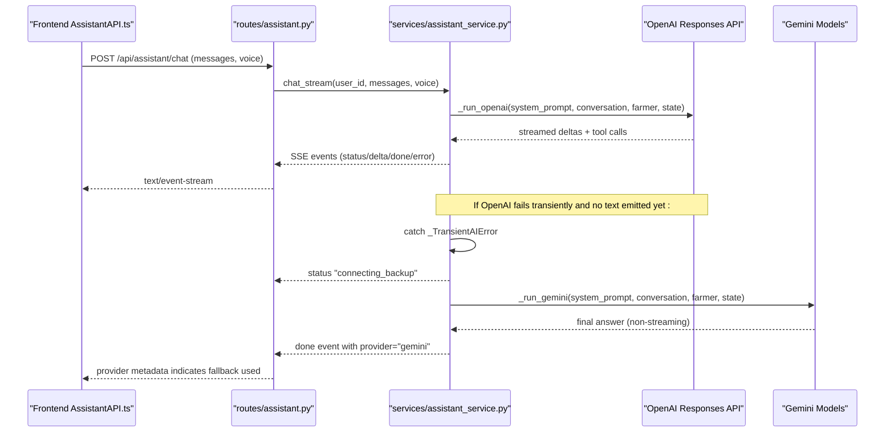
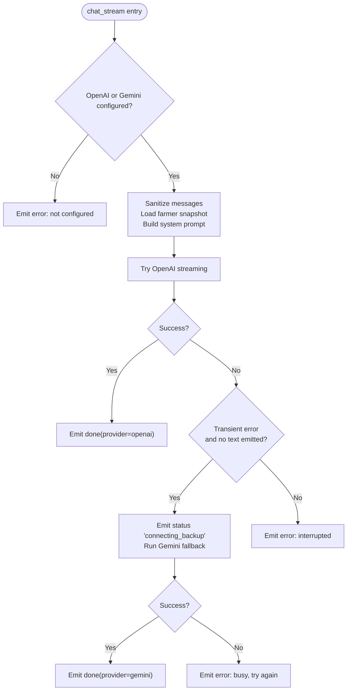
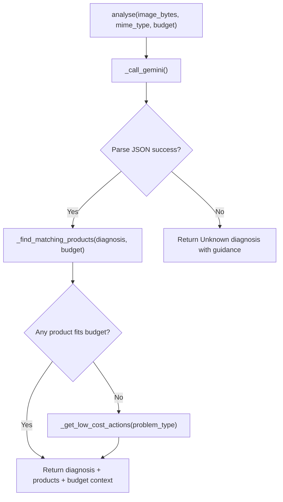
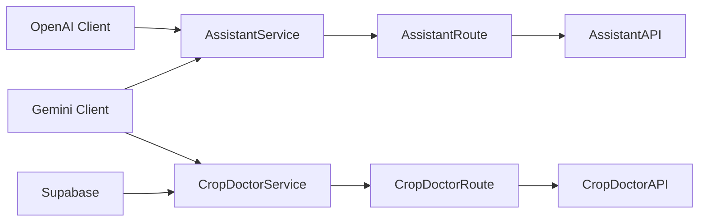

# Provider Failover & Fallback

<cite>
**Referenced Files in This Document**
- [assistant_service.py](file://Backend/services/assistant_service.py)
- [crop_doctor_service.py](file://Backend/services/crop_doctor_service.py)
- [settings.py](file://Backend/config/settings.py)
- [assistant.py](file://Backend/routes/assistant.py)
- [crop_doctor.py](file://Backend/routes/crop_doctor.py)
- [AssistantAPI.ts](file://Frontend/greenflora/services/AssistantAPI.ts)
- [CropDoctorAPI.ts](file://Frontend/greenflora/services/CropDoctorAPI.ts)
- [ErrorState.tsx](file://Frontend/greenflora/components/ui/ErrorState.tsx)
</cite>

## Table of Contents
1. [Introduction](#introduction)
2. [Project Structure](#project-structure)
3. [Core Components](#core-components)
4. [Architecture Overview](#architecture-overview)
5. [Detailed Component Analysis](#detailed-component-analysis)
6. [Dependency Analysis](#dependency-analysis)
7. [Performance Considerations](#performance-considerations)
8. [Troubleshooting Guide](#troubleshooting-guide)
9. [Conclusion](#conclusion)

## Introduction
This document explains Green Flora’s AI provider failover and fallback mechanisms. The system uses a primary-secondary architecture:
- OpenAI is the primary provider for conversational tasks via the assistant chat stream.
- Gemini is the fallback provider for conversation when OpenAI experiences transient failures.
- Gemini is also the primary provider for image analysis in Crop Doctor, with robust local fallbacks to keep core functionality available even if external services are degraded.

The design emphasizes graceful degradation: user-facing features continue to work with reduced capability when providers are unavailable, using cached responses, safe defaults, and retry strategies where appropriate.

## Project Structure
Green Flora implements provider orchestration and error handling across backend services, routes, configuration, and frontend clients.

**Diagram sources**
- [AssistantAPI.ts:231-237](file://Frontend/greenflora/services/AssistantAPI.ts#L231-L237)
- [CropDoctorAPI.ts:47-69](file://Frontend/greenflora/services/CropDoctorAPI.ts#L47-L69)
- [assistant.py:75-113](file://Backend/routes/assistant.py#L75-L113)
- [crop_doctor.py:48-125](file://Backend/routes/crop_doctor.py#L48-L125)
- [assistant_service.py:106-287](file://Backend/services/assistant_service.py#L106-L287)
- [crop_doctor_service.py:118-165](file://Backend/services/crop_doctor_service.py#L118-L165)
- [settings.py:84-114](file://Backend/config/settings.py#L84-L114)

**Section sources**
- [assistant_service.py:106-287](file://Backend/services/assistant_service.py#L106-L287)
- [crop_doctor_service.py:118-165](file://Backend/services/crop_doctor_service.py#L118-L165)
- [settings.py:84-114](file://Backend/config/settings.py#L84-L114)
- [assistant.py:75-113](file://Backend/routes/assistant.py#L75-L113)
- [crop_doctor.py:48-125](file://Backend/routes/crop_doctor.py#L48-L125)
- [AssistantAPI.ts:231-237](file://Frontend/greenflora/services/AssistantAPI.ts#L231-L237)
- [CropDoctorAPI.ts:47-69](file://Frontend/greenflora/services/CropDoctorAPI.ts#L47-L69)

## Core Components
- AssistantService orchestrates conversational AI with OpenAI as primary and Gemini as fallback. It streams SSE events, handles transient errors, and degrades gracefully when providers fail.
- CropDoctorService performs image-based crop diagnosis using Gemini, with local fallbacks (low-cost actions, safe defaults) when parsing or external data is unavailable.
- Settings centralizes provider keys, model names, and timeouts, enabling configuration-driven behavior without code changes.
- Frontend clients (AssistantAPI.ts, CropDoctorAPI.ts) implement timeouts, error classification, and user-friendly messages; ErrorState.tsx provides consistent UI for retries and alerts.

Key responsibilities:
- Primary-secondary provider selection based on transient vs non-transient errors.
- Streaming resilience: avoid restarting mid-answer; emit status updates for fallback transitions.
- Graceful degradation: cached greetings, low-cost actions, and safe defaults ensure usability.
- Configurable thresholds: timeouts and model selection via environment variables.

**Section sources**
- [assistant_service.py:106-287](file://Backend/services/assistant_service.py#L106-L287)
- [crop_doctor_service.py:118-165](file://Backend/services/crop_doctor_service.py#L118-L165)
- [settings.py:84-114](file://Backend/config/settings.py#L84-L114)
- [AssistantAPI.ts:231-237](file://Frontend/greenflora/services/AssistantAPI.ts#L231-L237)
- [CropDoctorAPI.ts:47-69](file://Frontend/greenflora/services/CropDoctorAPI.ts#L47-L69)
- [ErrorState.tsx:11-38](file://Frontend/greenflora/components/ui/ErrorState.tsx#L11-L38)

## Architecture Overview
The assistant chat flow demonstrates the primary-secondary provider pattern with streaming resilience and fallback signaling.

**Diagram sources**
- [assistant.py:75-113](file://Backend/routes/assistant.py#L75-L113)
- [assistant_service.py:175-287](file://Backend/services/assistant_service.py#L175-L287)
- [assistant_service.py:293-425](file://Backend/services/assistant_service.py#L293-L425)
- [assistant_service.py:431-540](file://Backend/services/assistant_service.py#L431-L540)

## Detailed Component Analysis

### AssistantService: Primary-Secondary Orchestration
- Provider strategy:
  - Primary: OpenAI Responses API with function tools and web search.
  - Fallback: Gemini Flash via google-genai SDK when OpenAI has transient issues.
- Streaming resilience:
  - If an error occurs after text emission, the service avoids restarting mid-sentence and returns a friendly error with retry guidance.
  - Status events communicate “thinking,” “searching,” “tool,” and “connecting_backup” states to the UI.
- Tool budget management:
  - Limits tool-call rounds to maintain responsiveness; falls back to direct answers when budget is exhausted.
- Graceful degradation:
  - Greeting generation uses cached values and hardcoded fallbacks so the dashboard never blocks on AI unavailability.

**Diagram sources**
- [assistant_service.py:175-287](file://Backend/services/assistant_service.py#L175-L287)
- [assistant_service.py:293-425](file://Backend/services/assistant_service.py#L293-L425)
- [assistant_service.py:431-540](file://Backend/services/assistant_service.py#L431-L540)

**Section sources**
- [assistant_service.py:106-287](file://Backend/services/assistant_service.py#L106-L287)
- [assistant_service.py:293-425](file://Backend/services/assistant_service.py#L293-L425)
- [assistant_service.py:431-540](file://Backend/services/assistant_service.py#L431-L540)

### CropDoctorService: Image Analysis with Local Fallbacks
- Primary path:
  - Sends image to Gemini for structured JSON diagnosis.
  - Matches products from Supabase by category and keywords, scores relevance, and filters by farmer budget.
- Graceful degradation:
  - If Gemini response cannot be parsed, returns a safe “Unknown” diagnosis with farmer-friendly symptoms and explanation.
  - If product lookup fails or no items fit budget, provides low-cost actions tailored to problem type.
- Error handling:
  - Raises RuntimeError on missing configuration or API failure; route maps to HTTP 502 with user-friendly detail.

**Diagram sources**
- [crop_doctor_service.py:131-165](file://Backend/services/crop_doctor_service.py#L131-L165)
- [crop_doctor_service.py:171-258](file://Backend/services/crop_doctor_service.py#L171-L258)
- [crop_doctor_service.py:264-339](file://Backend/services/crop_doctor_service.py#L264-L339)
- [crop_doctor_service.py:409-416](file://Backend/services/crop_doctor_service.py#L409-L416)

**Section sources**
- [crop_doctor_service.py:118-165](file://Backend/services/crop_doctor_service.py#L118-L165)
- [crop_doctor_service.py:171-258](file://Backend/services/crop_doctor_service.py#L171-L258)
- [crop_doctor_service.py:264-339](file://Backend/services/crop_doctor_service.py#L264-L339)
- [crop_doctor_service.py:409-416](file://Backend/services/crop_doctor_service.py#L409-L416)

### Configuration: Thresholds and Provider Selection
- Environment-driven settings:
  - API keys for OpenAI and Gemini.
  - Model names for main reasoning, utility tasks, transcription, TTS, and fallback.
  - Timeouts for streaming chat and audio endpoints.
- Behavior impact:
  - ai_stream_timeout_seconds controls how long assistant streaming requests can run before timing out.
  - ai_audio_timeout_seconds controls transcription/TTS request duration.
  - ai_fallback_model selects the Gemini model used during fallback.

**Section sources**
- [settings.py:84-114](file://Backend/config/settings.py#L84-L114)

### Frontend Resilience: Timeouts, Classification, and User Feedback
- AssistantAPI.ts:
  - Streams chat events and normalizes provider metadata (“openai” vs “gemini”).
  - Classifies errors into network/timeout/validation/server/auth categories.
  - Provides friendly fallback messages and supports retryable errors.
- CropDoctorAPI.ts:
  - Enforces per-request timeout for image analysis.
  - Maps transport failures to user-friendly messages and status types.
- ErrorState.tsx:
  - Reusable UI component to display errors and offer retry actions.

**Section sources**
- [AssistantAPI.ts:231-237](file://Frontend/greenflora/services/AssistantAPI.ts#L231-L237)
- [AssistantAPI.ts:197-216](file://Frontend/greenflora/services/AssistantAPI.ts#L197-L216)
- [CropDoctorAPI.ts:47-69](file://Frontend/greenflora/services/CropDoctorAPI.ts#L47-L69)
- [CropDoctorAPI.ts:71-106](file://Frontend/greenflora/services/CropDoctorAPI.ts#L71-L106)
- [ErrorState.tsx:11-38](file://Frontend/greenflora/components/ui/ErrorState.tsx#L11-L38)

## Dependency Analysis
Provider dependencies and coupling:
- AssistantService depends on OpenAI client for primary streaming and Gemini client for fallback; both are optional at initialization.
- CropDoctorService depends on Gemini client and Supabase for product matching; degrades gracefully if either is unavailable.
- Routes wrap service calls and map exceptions to HTTP statuses, ensuring consistent error exposure.
- Frontend clients depend on backend endpoints and handle timeouts and error classification locally.

**Diagram sources**
- [assistant_service.py:106-127](file://Backend/services/assistant_service.py#L106-L127)
- [crop_doctor_service.py:118-125](file://Backend/services/crop_doctor_service.py#L118-L125)
- [assistant.py:75-113](file://Backend/routes/assistant.py#L75-L113)
- [crop_doctor.py:48-125](file://Backend/routes/crop_doctor.py#L48-L125)
- [AssistantAPI.ts:231-237](file://Frontend/greenflora/services/AssistantAPI.ts#L231-L237)
- [CropDoctorAPI.ts:47-69](file://Frontend/greenflora/services/CropDoctorAPI.ts#L47-L69)

**Section sources**
- [assistant_service.py:106-127](file://Backend/services/assistant_service.py#L106-L127)
- [crop_doctor_service.py:118-125](file://Backend/services/crop_doctor_service.py#L118-L125)
- [assistant.py:75-113](file://Backend/routes/assistant.py#L75-L113)
- [crop_doctor.py:48-125](file://Backend/routes/crop_doctor.py#L48-L125)

## Performance Considerations
- Streaming efficiency:
  - AssistantService streams OpenAI responses incrementally, reducing perceived latency and allowing early user feedback.
  - Gemini fallback is non-streaming but still emits status events to keep users informed.
- Tool budget limits:
  - Prevents excessive tool calls that could degrade performance; forces direct answers when needed.
- Timeouts:
  - Configurable streaming and audio timeouts balance responsiveness with provider variability.
- Caching:
  - Greeting cache reduces unnecessary AI calls for dashboard greetings, improving load times.

[No sources needed since this section provides general guidance]

## Troubleshooting Guide
Common issues and diagnostics:
- OpenAI transient failures:
  - Symptoms: interruptions, rate limits, server errors, timeouts.
  - Behavior: AssistantService catches transient errors and attempts Gemini fallback if no text was emitted yet; otherwise returns a friendly error with retry option.
- Gemini fallback failures:
  - Symptoms: empty candidates, unsupported tool combinations.
  - Behavior: AssistantService degrades tool usage (e.g., removes Google Search grounding) and returns clear errors when necessary.
- Crop Doctor analysis failures:
  - Symptoms: invalid images, parsing errors, missing API key.
  - Behavior: Returns safe default diagnosis and low-cost actions; route maps to HTTP 502 with details.
- Frontend timeouts and network errors:
  - Symptoms: AbortError, network unreachable.
  - Behavior: Clients classify errors and present actionable messages; ErrorState supports retry flows.

Configuration checks:
- Verify environment variables for API keys and models in settings.
- Adjust timeouts if providers are slow or overloaded.

Recovery procedures:
- Retry on retryable errors surfaced by backend events or frontend error classification.
- Use cached greetings and low-cost actions to maintain core functionality while providers recover.

**Section sources**
- [assistant_service.py:228-287](file://Backend/services/assistant_service.py#L228-L287)
- [assistant_service.py:293-425](file://Backend/services/assistant_service.py#L293-L425)
- [assistant_service.py:431-540](file://Backend/services/assistant_service.py#L431-L540)
- [crop_doctor_service.py:171-258](file://Backend/services/crop_doctor_service.py#L171-L258)
- [crop_doctor.py:106-125](file://Backend/routes/crop_doctor.py#L106-L125)
- [AssistantAPI.ts:197-216](file://Frontend/greenflora/services/AssistantAPI.ts#L197-L216)
- [CropDoctorAPI.ts:71-106](file://Frontend/greenflora/services/CropDoctorAPI.ts#L71-L106)
- [ErrorState.tsx:11-38](file://Frontend/greenflora/components/ui/ErrorState.tsx#L11-L38)

## Conclusion
Green Flora’s AI provider architecture ensures resilient user experiences through a well-defined primary-secondary model:
- OpenAI powers conversational tasks with streaming and tool integration.
- Gemini serves as a robust fallback for conversation and as the primary provider for image analysis.
- Graceful degradation strategies (cached greetings, low-cost actions, safe defaults) keep core features functional under adverse conditions.
- Configuration-driven thresholds and timeouts enable tuning for different environments and provider behaviors.
- Frontend error handling and UI components provide clear feedback and retry options to users.

This design balances reliability, performance, and user experience while maintaining flexibility to adapt to changing provider capabilities and constraints.

[No sources needed since this section summarizes without analyzing specific files]