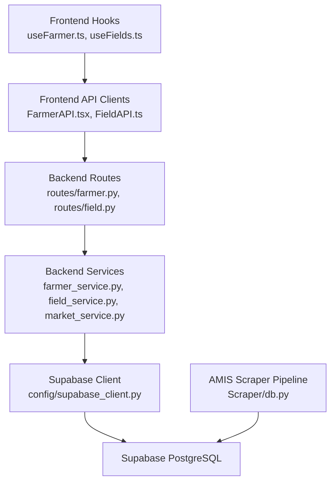
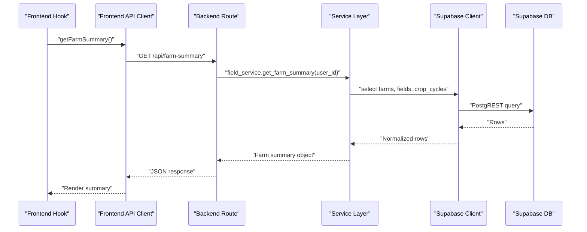
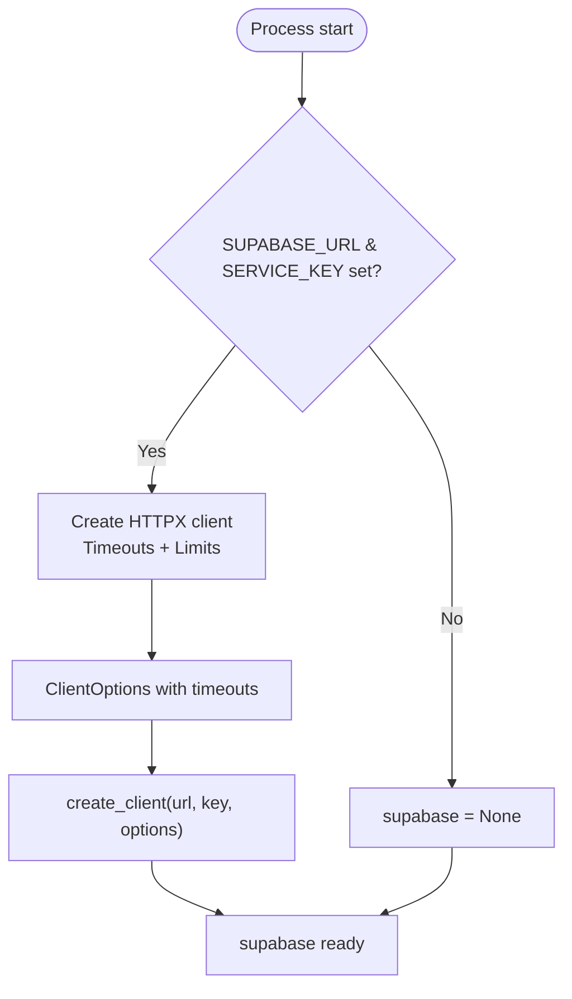
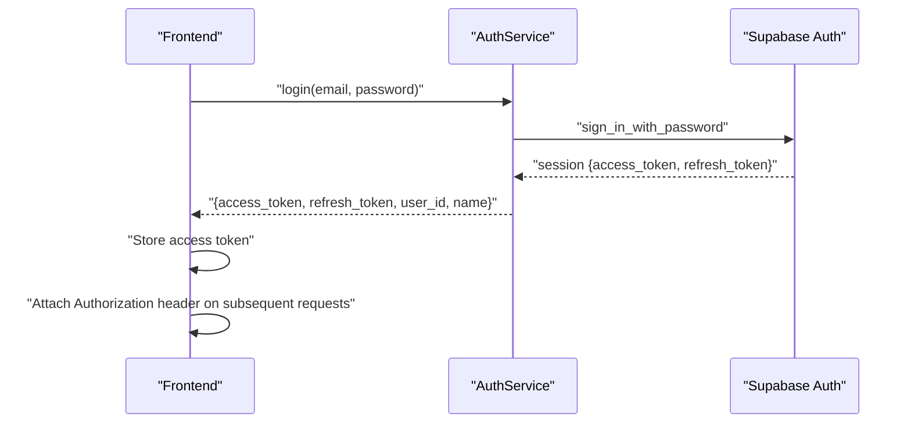
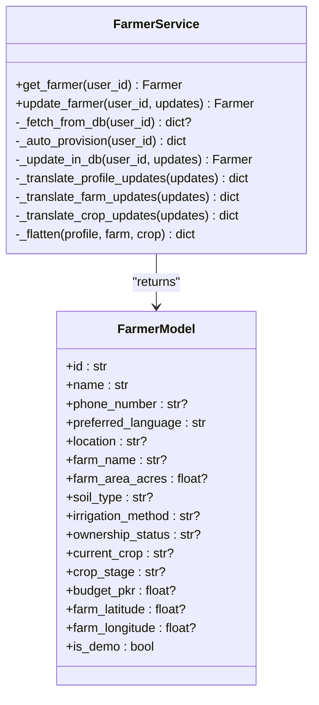
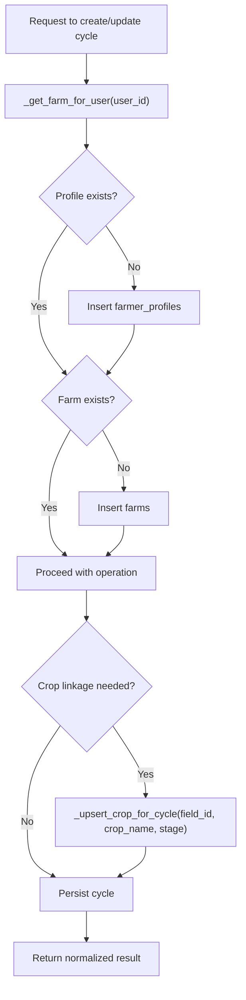
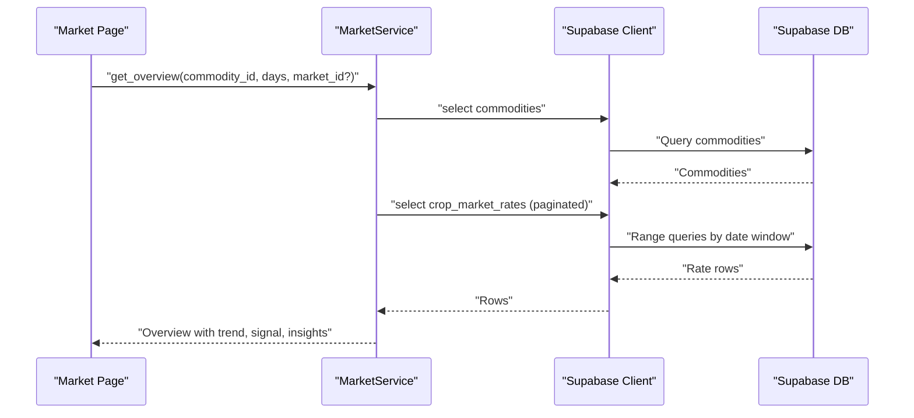
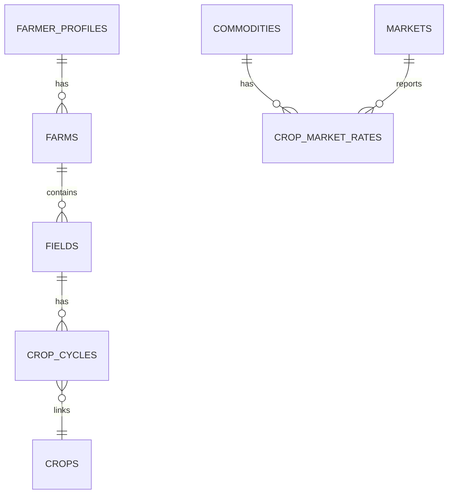
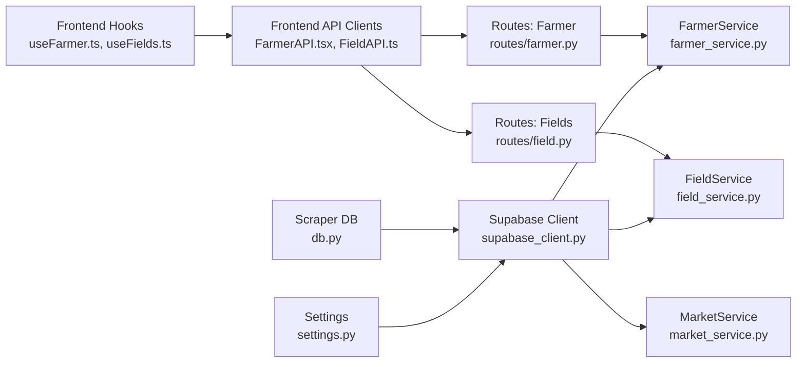
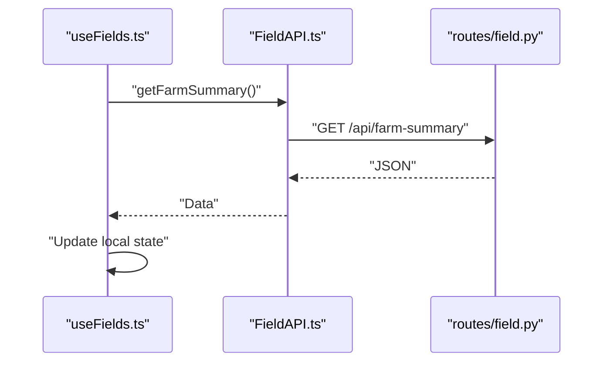

# Database Integration

<cite>
**Referenced Files in This Document**
- [supabase_client.py](file://Backend/config/supabase_client.py)
- [settings.py](file://Backend/config/settings.py)
- [farmer_service.py](file://Backend/services/farmer_service.py)
- [field_service.py](file://Backend/services/field_service.py)
- [market_service.py](file://Backend/services/market_service.py)
- [db.py](file://Scraper/db.py)
- [farmer.py](file://Backend/routes/farmer.py)
- [field.py](file://Backend/routes/field.py)
- [auth_service.py](file://Backend/services/auth_service.py)
- [useFarmer.ts](file://Frontend/greenflora/Hooks/useFarmer.ts)
- [useFields.ts](file://Frontend/greenflora/Hooks/useFields.ts)
- [FarmerAPI.tsx](file://Frontend/greenflora/services/FarmerAPI.tsx)
- [FieldAPI.ts](file://Frontend/greenflora/services/FieldAPI.ts)
</cite>

## Table of Contents
1. Introduction
2. Project Structure
3. Core Components
4. Architecture Overview
5. Detailed Component Analysis
6. Dependency Analysis
7. Performance Considerations
8. Troubleshooting Guide
9. Conclusion
10. Appendices

## Introduction
This document explains how Green-Flora integrates with Supabase for database operations, authentication, and data flows across the backend and frontend. It covers connection management (authentication, pooling, timeouts), real-time capabilities, schema design for farmer profiles, farm fields, market data, and user interactions. It also documents query optimization techniques, transaction-like patterns, migration strategies, backup and disaster recovery considerations, and secure access patterns with role-based permissions.

## Project Structure
Green-Flora uses a layered architecture:
- Frontend hooks call HTTP APIs to fetch or update data.
- Backend routes validate input and delegate to services.
- Services encapsulate business logic and interact with Supabase via a centralized client.
- A separate Scraper pipeline ingests market data into Supabase tables.

**Diagram sources**
- [supabase_client.py:1-47](file://Backend/config/supabase_client.py#L1-L47)
- [farmer_service.py:1-120](file://Backend/services/farmer_service.py#L1-L120)
- [field_service.py:1-120](file://Backend/services/field_service.py#L1-L120)
- [market_service.py:1-120](file://Backend/services/market_service.py#L1-L120)
- [db.py:1-120](file://Scraper/db.py#L1-L120)
- [farmer.py:1-80](file://Backend/routes/farmer.py#L1-L80)
- [field.py:1-90](file://Backend/routes/field.py#L1-L90)
- [useFarmer.ts:1-88](file://Frontend/greenflora/Hooks/useFarmer.ts#L1-L88)
- [useFields.ts:1-159](file://Frontend/greenflora/Hooks/useFields.ts#L1-L159)
- [FarmerAPI.tsx:1-109](file://Frontend/greenflora/services/FarmerAPI.tsx#L1-L109)
- [FieldAPI.ts:1-171](file://Frontend/greenflora/services/FieldAPI.ts#L1-L171)

**Section sources**
- [supabase_client.py:1-47](file://Backend/config/supabase_client.py#L1-L47)
- [settings.py:1-123](file://Backend/config/settings.py#L1-L123)
- [farmer_service.py:1-120](file://Backend/services/farmer_service.py#L1-L120)
- [field_service.py:1-120](file://Backend/services/field_service.py#L1-L120)
- [market_service.py:1-120](file://Backend/services/market_service.py#L1-L120)
- [db.py:1-120](file://Scraper/db.py#L1-L120)
- [farmer.py:1-80](file://Backend/routes/farmer.py#L1-L80)
- [field.py:1-90](file://Backend/routes/field.py#L1-L90)
- [useFarmer.ts:1-88](file://Frontend/greenflora/Hooks/useFarmer.ts#L1-L88)
- [useFields.ts:1-159](file://Frontend/greenflora/Hooks/useFields.ts#L1-L159)
- [FarmerAPI.tsx:1-109](file://Frontend/greenflora/services/FarmerAPI.tsx#L1-L109)
- [FieldAPI.ts:1-171](file://Frontend/greenflora/services/FieldAPI.ts#L1-L171)

## Core Components
- Supabase client configuration and connection pooling via HTTPX with explicit timeouts and limits.
- Service layer modules that implement read/write logic for farmer profiles, fields/crop cycles, and market intelligence.
- Route handlers that enforce authentication and translate errors to HTTP responses.
- Frontend hooks and API clients that manage loading states, retries, and error classification.
- AMIS scraper pipeline that upserts market rates idempotently with schema discovery and fallbacks.

Key responsibilities:
- Connection management: centralized client creation, environment-driven configuration, and robust timeouts.
- Data modeling: internal Pydantic models for farmers and fields; service layers normalize between API contracts and DB schemas.
- Real-time readiness: current implementation is request/response; real-time can be added via Supabase subscriptions on relevant tables.
- Query optimization: pagination, selective selects, caching, and batched upserts.
- Transaction-like patterns: multi-step writes coordinated within services with rollback via exceptions and careful ordering.

**Section sources**
- [supabase_client.py:1-47](file://Backend/config/supabase_client.py#L1-L47)
- [settings.py:48-123](file://Backend/config/settings.py#L48-L123)
- [farmer_service.py:51-120](file://Backend/services/farmer_service.py#L51-L120)
- [field_service.py:89-184](file://Backend/services/field_service.py#L89-L184)
- [market_service.py:47-153](file://Backend/services/market_service.py#L47-L153)
- [db.py:43-90](file://Scraper/db.py#L43-L90)
- [farmer.py:46-92](file://Backend/routes/farmer.py#L46-L92)
- [field.py:47-135](file://Backend/routes/field.py#L47-L135)
- [useFarmer.ts:34-88](file://Frontend/greenflora/Hooks/useFarmer.ts#L34-L88)
- [useFields.ts:51-159](file://Frontend/greenflora/Hooks/useFields.ts#L51-L159)
- [FarmerAPI.tsx:42-109](file://Frontend/greenflora/services/FarmerAPI.tsx#L42-L109)
- [FieldAPI.ts:48-171](file://Frontend/greenflora/services/FieldAPI.ts#L48-L171)

## Architecture Overview
The system follows a clear separation of concerns:
- Frontend hooks orchestrate UI state and call API clients.
- API clients attach auth tokens and handle timeouts/errors.
- Backend routes validate inputs and delegate to services.
- Services perform business logic, enforce ownership, and call Supabase.
- The Scraper pipeline ingests external market data into Supabase tables.

**Diagram sources**
- [useFields.ts:51-159](file://Frontend/greenflora/Hooks/useFields.ts#L51-L159)
- [FieldAPI.ts:107-109](file://Frontend/greenflora/services/FieldAPI.ts#L107-L109)
- [field.py:73-89](file://Backend/routes/field.py#L73-L89)
- [field_service.py:479-545](file://Backend/services/field_service.py#L479-L545)
- [supabase_client.py:19-47](file://Backend/config/supabase_client.py#L19-L47)

## Detailed Component Analysis

### Supabase Connection Management
- Centralized client initialization with HTTP/1.1 over HTTPX to avoid platform-specific issues.
- Timeouts configured for connect/read/write/pool; connection pool limits set for concurrency control.
- Environment variables supply URL and service key; client remains None when not configured, enabling graceful degradation.

**Diagram sources**
- [supabase_client.py:16-47](file://Backend/config/supabase_client.py#L16-L47)
- [settings.py:70-73](file://Backend/config/settings.py#L70-L73)

**Section sources**
- [supabase_client.py:1-47](file://Backend/config/supabase_client.py#L1-L47)
- [settings.py:48-123](file://Backend/config/settings.py#L48-L123)

### Authentication Flow
- Backend uses Supabase Auth via AuthService for login, signup, and token refresh.
- Routes use optional user dependency; in live mode without token, returns 401.
- Frontend attaches Bearer token from stored access token to all requests.

**Diagram sources**
- [auth_service.py:1-151](file://Backend/services/auth_service.py#L1-L151)
- [FarmerAPI.tsx:42-109](file://Frontend/greenflora/services/FarmerAPI.tsx#L42-L109)
- [field.py:51-67](file://Backend/routes/field.py#L51-L67)
- [farmer.py:50-68](file://Backend/routes/farmer.py#L50-L68)

**Section sources**
- [auth_service.py:1-151](file://Backend/services/auth_service.py#L1-L151)
- [FarmerAPI.tsx:42-109](file://Frontend/greenflora/services/FarmerAPI.tsx#L42-L109)
- [field.py:51-67](file://Backend/routes/field.py#L51-L67)
- [farmer.py:50-68](file://Backend/routes/farmer.py#L50-L68)

### Farmer Profiles: Read/Write and Auto-Provisioning
- FarmerService reads from Supabase tables farmer_profiles, farms, crops and flattens into a unified model.
- On first access, auto-provisions farmer_profiles and lazily creates farms when needed.
- Updates split flat payloads into per-table updates and re-read to return consistent state.

**Diagram sources**
- [farmer_service.py:51-120](file://Backend/services/farmer_service.py#L51-L120)
- [farmer_service.py:134-208](file://Backend/services/farmer_service.py#L134-L208)
- [farmer_service.py:214-244](file://Backend/services/farmer_service.py#L214-L244)
- [farmer_service.py:363-462](file://Backend/services/farmer_service.py#L363-L462)
- [farmer.py:21-43](file://Backend/models/farmer.py#L21-L43)

**Section sources**
- [farmer_service.py:51-462](file://Backend/services/farmer_service.py#L51-L462)
- [farmer.py:21-43](file://Backend/models/farmer.py#L21-L43)
- [farmer.py:75-161](file://Backend/routes/farmer.py#L75-L161)

### Fields and Crop Cycles: Ownership and Normalization
- FieldService enforces farm ownership by linking fields and cycles to a user’s farm.
- Auto-provisions farmer_profiles and farms if missing to enable seamless first-time usage.
- Translates between API keys and DB columns to remain resilient to schema changes.
- Links crop cycles to crops table via upsert to maintain normalized references.

**Diagram sources**
- [field_service.py:111-184](file://Backend/services/field_service.py#L111-L184)
- [field_service.py:241-295](file://Backend/services/field_service.py#L241-L295)
- [field_service.py:694-717](file://Backend/services/field_service.py#L694-L717)

**Section sources**
- [field_service.py:89-788](file://Backend/services/field_service.py#L89-L788)
- [field.py:73-287](file://Backend/routes/field.py#L73-L287)

### Market Intelligence: Ingestion and Querying
- MarketService reads commodities, markets, and crop_market_rates with caching and pagination.
- Computes representative prices, trends, signals, and insights based strictly on real data.
- Scraper pipeline performs idempotent upserts with schema discovery and fallbacks when constraints are missing.

**Diagram sources**
- [market_service.py:158-343](file://Backend/services/market_service.py#L158-L343)
- [market_service.py:599-624](file://Backend/services/market_service.py#L599-L624)
- [db.py:320-416](file://Scraper/db.py#L320-L416)

**Section sources**
- [market_service.py:47-653](file://Backend/services/market_service.py#L47-L653)
- [db.py:43-497](file://Scraper/db.py#L43-L497)

### Real-Time Capabilities
- Current implementation relies on HTTP request/response cycles; no active Supabase real-time subscriptions are present in the analyzed code.
- To enable live synchronization across clients:
  - Subscribe to changes on farmer_profiles, farms, fields, crop_cycles, and crop_market_rates using Supabase real-time channels.
  - Use Postgres triggers or RLS policies to ensure only authorized users receive updates.
  - Implement optimistic UI updates with conflict resolution on the frontend.
  - Add backoff and retry logic for subscription reconnects.

[No sources needed since this section provides conceptual guidance]

### Database Schema Design
Observed tables and relationships:
- farmer_profiles: user identity and profile attributes.
- farms: farm-level details linked to farmer_profiles.
- fields: plots belonging to farms with geometry and status.
- crop_cycles: lifecycle records tied to fields and optionally linked to crops.
- crops: normalized crop entries referenced by cycles.
- commodities, markets, crop_market_rates: market intelligence data ingested by the scraper.

**Diagram sources**
- [farmer_service.py:250-358](file://Backend/services/farmer_service.py#L250-L358)
- [field_service.py:570-717](file://Backend/services/field_service.py#L570-L717)
- [db.py:17-26](file://Scraper/db.py#L17-L26)

**Section sources**
- [farmer_service.py:250-358](file://Backend/services/farmer_service.py#L250-L358)
- [field_service.py:570-717](file://Backend/services/field_service.py#L570-L717)
- [db.py:17-26](file://Scraper/db.py#L17-L26)

### Query Optimization Techniques
- Selective column projection to reduce payload size.
- Pagination with range queries for large datasets (e.g., commodity rate scans).
- Caching of stable lookups (commodities list, markets map) with TTL.
- Upserts with unique constraints and fallback row-by-row handling when constraints are missing.
- Ordering and limiting to retrieve latest records efficiently.

**Section sources**
- [market_service.py:59-153](file://Backend/services/market_service.py#L59-L153)
- [market_service.py:599-624](file://Backend/services/market_service.py#L599-L624)
- [db.py:320-416](file://Scraper/db.py#L320-L416)

### Transaction Management
- While explicit database transactions are not used in the analyzed code, services coordinate multi-step writes with strict ordering and exception handling to emulate transactional behavior:
  - FarmerService splits updates across tables and re-reads to ensure consistency.
  - FieldService deletes dependent records before parent deletion and links cycles to crops atomically within service methods.
  - Scraper logs ingestion runs and updates status at completion, ensuring auditability.

Recommendations:
- Wrap related writes in database-level transactions where supported by PostgREST or via Supabase Edge Functions.
- Use RLS policies to enforce row-level security consistently.

**Section sources**
- [farmer_service.py:159-208](file://Backend/services/farmer_service.py#L159-L208)
- [field_service.py:642-645](file://Backend/services/field_service.py#L642-L645)
- [db.py:424-497](file://Scraper/db.py#L424-L497)

### Data Migration Strategies
- Scraper employs schema discovery to adapt to column changes gracefully.
- Upsert strategies rely on unique constraints; fallbacks exist when constraints are absent.
- Recommendations:
  - Version migrations with backward-compatible columns.
  - Use feature flags to toggle new fields until fully adopted.
  - Validate schema changes in staging before production rollout.

**Section sources**
- [db.py:62-80](file://Scraper/db.py#L62-L80)
- [db.py:320-416](file://Scraper/db.py#L320-L416)

### Backup Procedures and Disaster Recovery
- Use Supabase-native backups and point-in-time recovery features.
- Export critical reference data (commodities, markets) periodically for offline archives.
- Maintain runbooks for restoring roles, RLS policies, and indexes after recovery.
- Test restore procedures regularly to ensure RTO/RPO targets are met.

[No sources needed since this section provides general guidance]

### Secure Access Patterns and Role-Based Permissions
- Use Supabase service-role credentials in backend contexts; never expose them to frontend.
- Enforce Row Level Security (RLS) policies to restrict access to farmer_profiles, farms, fields, and crop_cycles by user_id.
- Validate IDs and scopes server-side in services to prevent unauthorized access.
- Rotate keys and secrets via environment variables; avoid hardcoding.

**Section sources**
- [supabase_client.py:19-47](file://Backend/config/supabase_client.py#L19-L47)
- [field_service.py:185-220](file://Backend/services/field_service.py#L185-L220)
- [settings.py:70-73](file://Backend/config/settings.py#L70-L73)

## Dependency Analysis
The following diagram shows key dependencies among components involved in database integration.

**Diagram sources**
- [settings.py:48-123](file://Backend/config/settings.py#L48-L123)
- [supabase_client.py:16-47](file://Backend/config/supabase_client.py#L16-L47)
- [farmer_service.py:1-120](file://Backend/services/farmer_service.py#L1-L120)
- [field_service.py:1-120](file://Backend/services/field_service.py#L1-L120)
- [market_service.py:1-120](file://Backend/services/market_service.py#L1-L120)
- [farmer.py:1-80](file://Backend/routes/farmer.py#L1-L80)
- [field.py:1-90](file://Backend/routes/field.py#L1-L90)
- [useFarmer.ts:1-88](file://Frontend/greenflora/Hooks/useFarmer.ts#L1-L88)
- [useFields.ts:1-159](file://Frontend/greenflora/Hooks/useFields.ts#L1-L159)
- [FarmerAPI.tsx:1-109](file://Frontend/greenflora/services/FarmerAPI.tsx#L1-L109)
- [FieldAPI.ts:1-171](file://Frontend/greenflora/services/FieldAPI.ts#L1-L171)
- [db.py:1-120](file://Scraper/db.py#L1-L120)

**Section sources**
- [settings.py:48-123](file://Backend/config/settings.py#L48-L123)
- [supabase_client.py:16-47](file://Backend/config/supabase_client.py#L16-L47)
- [farmer_service.py:1-120](file://Backend/services/farmer_service.py#L1-L120)
- [field_service.py:1-120](file://Backend/services/field_service.py#L1-L120)
- [market_service.py:1-120](file://Backend/services/market_service.py#L1-L120)
- [farmer.py:1-80](file://Backend/routes/farmer.py#L1-L80)
- [field.py:1-90](file://Backend/routes/field.py#L1-L90)
- [useFarmer.ts:1-88](file://Frontend/greenflora/Hooks/useFarmer.ts#L1-L88)
- [useFields.ts:1-159](file://Frontend/greenflora/Hooks/useFields.ts#L1-L159)
- [FarmerAPI.tsx:1-109](file://Frontend/greenflora/services/FarmerAPI.tsx#L1-L109)
- [FieldAPI.ts:1-171](file://Frontend/greenflora/services/FieldAPI.ts#L1-L171)
- [db.py:1-120](file://Scraper/db.py#L1-L120)

## Performance Considerations
- Connection pooling: HTTPX limits cap concurrent connections and keepalive reuse to balance throughput and resource usage.
- Timeouts: Configured connect/read/write/pool timeouts prevent hanging requests.
- Caching: MarketService caches commodities and markets maps to reduce repeated queries.
- Pagination: Range queries limit memory and network overhead for large datasets.
- Selective selects: Minimize payload by requesting only necessary columns.
- Upserts: Prefer database-level upserts with unique constraints; fallbacks degrade gracefully.

[No sources needed since this section provides general guidance]

## Troubleshooting Guide
Common issues and resolutions:
- Missing Supabase configuration: Ensure SUPABASE_URL and SUPABASE_SERVICE_KEY are set; client will be None otherwise.
- Authentication failures: Verify tokens and session refresh; AuthService raises descriptive errors.
- Ownership errors: Ensure resources belong to the authenticated user’s farm; services enforce checks.
- Schema mismatches: Scraper discovers columns and filters payloads; add missing columns or adjust mappings.
- Constraint errors: Upsert fallback handles missing unique constraints; add constraints for optimal performance.

**Section sources**
- [supabase_client.py:19-47](file://Backend/config/supabase_client.py#L19-L47)
- [auth_service.py:24-151](file://Backend/services/auth_service.py#L24-L151)
- [field_service.py:185-220](file://Backend/services/field_service.py#L185-L220)
- [db.py:62-90](file://Scraper/db.py#L62-L90)
- [db.py:320-416](file://Scraper/db.py#L320-L416)

## Conclusion
Green-Flora’s Supabase integration is structured around a centralized client, robust service-layer logic, and clear route boundaries. The system supports efficient querying, safe upserts, and resilient error handling. While real-time synchronization is not currently implemented, the architecture is well-positioned to adopt Supabase real-time features with minimal changes. Strong emphasis on ownership checks, schema resilience, and caching ensures reliable performance and maintainability.

[No sources needed since this section summarizes without analyzing specific files]

## Appendices

### Frontend Request Lifecycle

**Diagram sources**
- [useFields.ts:51-159](file://Frontend/greenflora/Hooks/useFields.ts#L51-L159)
- [FieldAPI.ts:107-109](file://Frontend/greenflora/services/FieldAPI.ts#L107-L109)
- [field.py:73-89](file://Backend/routes/field.py#L73-L89)

**Section sources**
- [useFields.ts:51-159](file://Frontend/greenflora/Hooks/useFields.ts#L51-L159)
- [FieldAPI.ts:107-109](file://Frontend/greenflora/services/FieldAPI.ts#L107-L109)
- [field.py:73-89](file://Backend/routes/field.py#L73-L89)