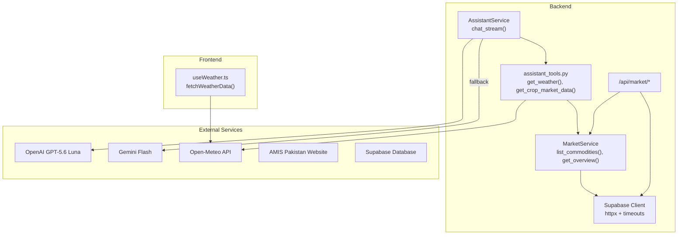
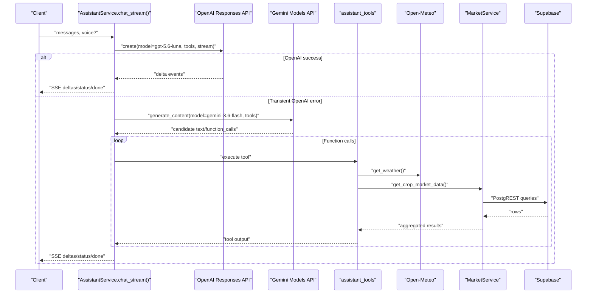
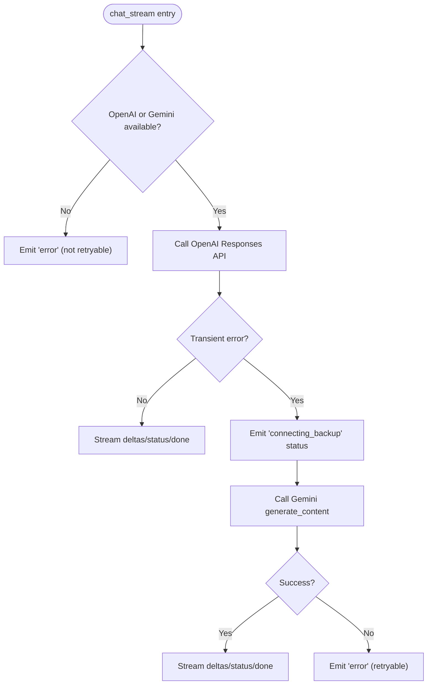
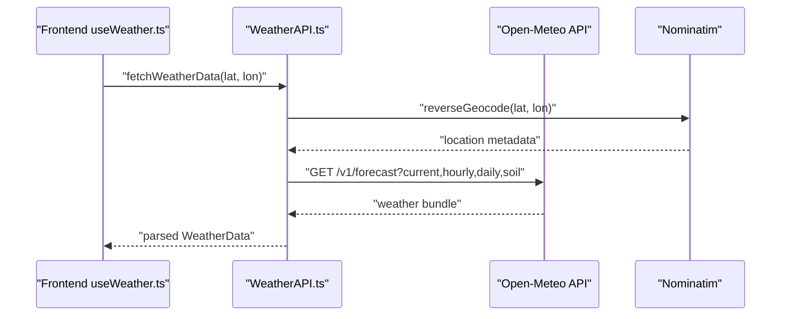
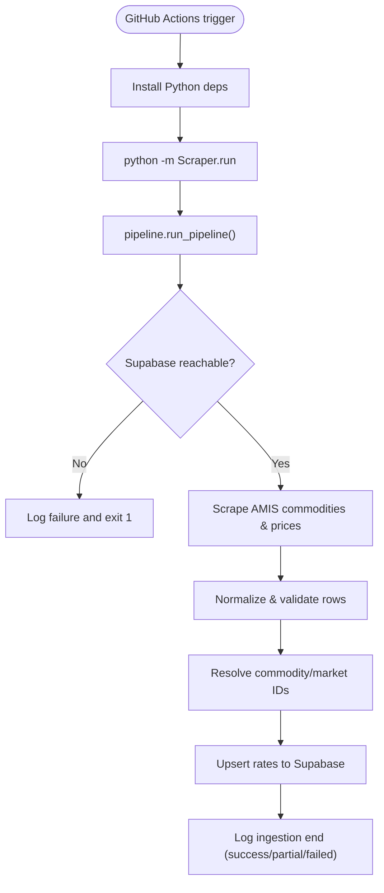
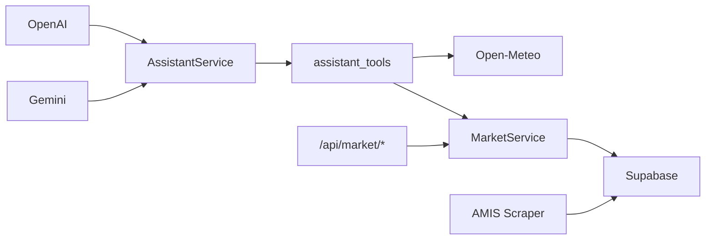

# External Integrations

<cite>
**Referenced Files in This Document**
- [settings.py](file://Backend/config/settings.py)
- [supabase_client.py](file://Backend/config/supabase_client.py)
- [assistant_service.py](file://Backend/services/assistant_service.py)
- [assistant_tools.py](file://Backend/services/assistant_tools.py)
- [market_service.py](file://Backend/services/market_service.py)
- [market.py](file://Backend/routes/market.py)
- [amis-scraper.yml](file://.github/workflows/amis-scraper.yml)
- [config.py](file://Scraper/config.py)
- [pipeline.py](file://Scraper/pipeline.py)
- [run.py](file://Scraper/run.py)
- [WeatherAPI.ts](file://Frontend/greenflora/services/WeatherAPI.ts)
- [useWeather.ts](file://Frontend/greenflora/Hooks/useWeather.ts)
</cite>

## Table of Contents
1. Introduction
2. Project Structure
3. Core Components
4. Architecture Overview
5. Detailed Component Analysis
6. Dependency Analysis
7. Performance Considerations
8. Troubleshooting Guide
9. Conclusion

## Introduction
This document explains Green-Flora’s external integrations: AI model providers (OpenAI primary, Gemini fallback), weather data via Open-Meteo, market data ingestion from AMIS Pakistan through scheduled GitHub Actions, and Supabase database connectivity with real-time-ready patterns. It covers request routing, failover behavior, error handling, retries, rate limiting, caching, performance tuning, and configuration management for API keys and endpoints.

## Project Structure
Green-Flora integrates multiple external services across backend services, a scraper pipeline, and the frontend:
- Backend orchestrates AI provider calls, tool execution (weather, market, products), and routes to Supabase.
- The Scraper ingests AMIS market prices into Supabase on a schedule.
- The Frontend fetches live weather directly from Open-Meteo and displays it.

**Diagram sources**
- [assistant_service.py:106-287](file://Backend/services/assistant_service.py#L106-L287)
- [assistant_tools.py:194-319](file://Backend/services/assistant_tools.py#L194-L319)
- [market_service.py:47-152](file://Backend/services/market_service.py#L47-L152)
- [market.py:38-108](file://Backend/routes/market.py#L38-L108)
- [WeatherAPI.ts:141-222](file://Frontend/greenflora/services/WeatherAPI.ts#L141-L222)
- [supabase_client.py:19-47](file://Backend/config/supabase_client.py#L19-L47)

**Section sources**
- [settings.py:48-122](file://Backend/config/settings.py#L48-L122)
- [supabase_client.py:19-47](file://Backend/config/supabase_client.py#L19-L47)

## Core Components
- AI Assistant orchestration: Primary provider is OpenAI (Responses API with gpt-5.6-luna). Fallback is Gemini Flash via google-genai SDK when transient failures occur. Utility models handle greeting and entity extraction.
- Weather tool: Uses Open-Meteo geocoding and forecast APIs to provide current conditions and 7-day forecasts.
- Market data pipeline: Scheduled GitHub Action scrapes AMIS Pakistan and upserts data into Supabase tables; backend reads aggregated data via PostgREST.
- Supabase client: Centralized HTTPX-backed client with explicit timeouts and connection limits to avoid platform-specific issues.

**Section sources**
- [assistant_service.py:6-31](file://Backend/services/assistant_service.py#L6-L31)
- [assistant_service.py:106-128](file://Backend/services/assistant_service.py#L106-L128)
- [assistant_tools.py:194-319](file://Backend/services/assistant_tools.py#L194-L319)
- [market_service.py:47-152](file://Backend/services/market_service.py#L47-L152)
- [amis-scraper.yml:1-46](file://.github/workflows/amis-scraper.yml#L1-L46)
- [supabase_client.py:19-47](file://Backend/config/supabase_client.py#L19-L47)

## Architecture Overview
The assistant service implements a provider strategy with clear routing and failover:
- Primary path: OpenAI streaming responses with function tools and optional web search.
- Fallback path: Gemini non-streaming with function tools and Google Search grounding; used only after transient OpenAI errors.
- Tool layer: Weather via Open-Meteo; market via Supabase-backed MarketService; product search via Supabase.

**Diagram sources**
- [assistant_service.py:175-287](file://Backend/services/assistant_service.py#L175-L287)
- [assistant_service.py:293-425](file://Backend/services/assistant_service.py#L293-L425)
- [assistant_service.py:431-540](file://Backend/services/assistant_service.py#L431-L540)
- [assistant_tools.py:194-319](file://Backend/services/assistant_tools.py#L194-L319)
- [market_service.py:158-343](file://Backend/services/market_service.py#L158-L343)

## Detailed Component Analysis

### AI Service Integrations: OpenAI Primary and Gemini Fallback
- Provider selection:
  - Primary: OpenAI Responses API with model gpt-5.6-luna configured via settings.
  - Fallback: Gemini Flash via google-genai SDK using gemini-3.6-flash configured via settings.
- Failover mechanism:
  - On transient OpenAI errors (timeout, connection, rate limit, 5xx), the assistant emits a status event indicating backup connection and then attempts Gemini.
  - If half an answer has already streamed, the assistant does not restart mid-sentence and returns a retryable error instead.
- Streaming and link sanitization:
  - SSE events are sanitized to strip Markdown links and citation markers that may arrive mid-chunk.
- Tool usage:
  - Both providers use shared tool definitions for weather, market data, and product search.
  - OpenAI supports web_search tool; Gemini uses Google Search grounding where supported.

**Diagram sources**
- [assistant_service.py:175-287](file://Backend/services/assistant_service.py#L175-L287)
- [assistant_service.py:293-425](file://Backend/services/assistant_service.py#L293-L425)
- [assistant_service.py:431-540](file://Backend/services/assistant_service.py#L431-L540)

**Section sources**
- [assistant_service.py:6-31](file://Backend/services/assistant_service.py#L6-L31)
- [assistant_service.py:106-128](file://Backend/services/assistant_service.py#L106-L128)
- [assistant_service.py:175-287](file://Backend/services/assistant_service.py#L175-L287)
- [assistant_service.py:293-425](file://Backend/services/assistant_service.py#L293-L425)
- [assistant_service.py:431-540](file://Backend/services/assistant_service.py#L431-L540)
- [settings.py:87-114](file://Backend/config/settings.py#L87-L114)

### Weather Service Integration: Open-Meteo
- Backend tool:
  - Geocodes place names via Open-Meteo geocoding API and fetches current conditions plus 7-day forecast via forecast endpoint.
  - Returns structured payloads with WMO code interpretation and notes instructing the model to avoid fabricating values.
- Frontend integration:
  - Directly calls Open-Meteo forecast endpoint with current, hourly, daily, and soil parameters in a single request.
  - Reverse geocodes coordinates using Nominatim to produce readable location labels.
  - Implements timeouts and typed error classification (network, timeout, server).

**Diagram sources**
- [WeatherAPI.ts:35-69](file://Frontend/greenflora/services/WeatherAPI.ts#L35-L69)
- [WeatherAPI.ts:141-222](file://Frontend/greenflora/services/WeatherAPI.ts#L141-L222)
- [assistant_tools.py:194-319](file://Backend/services/assistant_tools.py#L194-L319)

**Section sources**
- [assistant_tools.py:194-319](file://Backend/services/assistant_tools.py#L194-L319)
- [WeatherAPI.ts:141-222](file://Frontend/greenflora/services/WeatherAPI.ts#L141-L222)
- [useWeather.ts:21-57](file://Frontend/greenflora/Hooks/useWeather.ts#L21-L57)

### Market Data Pipeline: AMIS Pakistan via GitHub Actions
- Scheduled ingestion:
  - GitHub Actions workflow runs daily at a fixed UTC time and can be manually triggered.
  - Environment variables supply Supabase credentials securely via secrets.
- Pipeline steps:
  - Connects to Supabase, verifies connectivity, discovers schema columns.
  - Discovers commodities from AMIS website, scrapes price pages, normalizes data, resolves foreign keys, and upserts rates.
  - Logs ingestion start/end with status, counts, and error messages.
- Backend consumption:
  - MarketService reads from Supabase tables (commodities, markets, crop_market_rates) and computes aggregates, trends, signals, and insights.

**Diagram sources**
- [amis-scraper.yml:13-46](file://.github/workflows/amis-scraper.yml#L13-L46)
- [pipeline.py:36-257](file://Scraper/pipeline.py#L36-L257)
- [run.py:57-77](file://Scraper/run.py#L57-L77)

**Section sources**
- [amis-scraper.yml:1-46](file://.github/workflows/amis-scraper.yml#L1-L46)
- [config.py:18-70](file://Scraper/config.py#L18-L70)
- [pipeline.py:36-257](file://Scraper/pipeline.py#L36-L257)
- [market_service.py:47-152](file://Backend/services/market_service.py#L47-L152)
- [market.py:38-108](file://Backend/routes/market.py#L38-L108)

### Supabase Connection Management and Real-Time Capabilities
- Centralized client:
  - Uses httpx with HTTP/1.1 disabled to avoid intermittent socket errors on Windows.
  - Configures connect/read/write/pool timeouts and connection limits.
- Usage:
  - MarketService and assistant tools query PostgREST endpoints for commodities, markets, rates, and agricultural products.
- Real-time readiness:
  - While this codebase primarily uses REST queries, the Supabase client setup supports functions and storage clients with timeouts, enabling future real-time subscriptions if needed.

**Section sources**
- [supabase_client.py:19-47](file://Backend/config/supabase_client.py#L19-L47)
- [market_service.py:599-640](file://Backend/services/market_service.py#L599-L640)
- [assistant_tools.py:435-508](file://Backend/services/assistant_tools.py#L435-L508)

## Dependency Analysis
Key dependencies and coupling:
- AssistantService depends on OpenAI and optionally Gemini; both rely on shared tool definitions.
- Assistant tools depend on Open-Meteo and MarketService; MarketService depends on Supabase.
- Routes thin out validation and delegate to services; services encapsulate business logic and external calls.
- Scraper pipeline depends on AMIS website and writes to Supabase; independent of runtime backend.

**Diagram sources**
- [assistant_service.py:106-128](file://Backend/services/assistant_service.py#L106-L128)
- [assistant_tools.py:194-319](file://Backend/services/assistant_tools.py#L194-L319)
- [market_service.py:47-152](file://Backend/services/market_service.py#L47-L152)
- [market.py:38-108](file://Backend/routes/market.py#L38-L108)
- [amis-scraper.yml:13-46](file://.github/workflows/amis-scraper.yml#L13-L46)

**Section sources**
- [assistant_service.py:106-128](file://Backend/services/assistant_service.py#L106-L128)
- [assistant_tools.py:194-319](file://Backend/services/assistant_tools.py#L194-L319)
- [market_service.py:47-152](file://Backend/services/market_service.py#L47-L152)
- [market.py:38-108](file://Backend/routes/market.py#L38-L108)
- [amis-scraper.yml:13-46](file://.github/workflows/amis-scraper.yml#L13-L46)

## Performance Considerations
- Caching strategies:
  - MarketService caches commodities list and markets lookup map with a 10-minute TTL to reduce repeated queries.
  - AssistantService caches greetings per language/time-of-day/user with a 10-minute TTL and falls back to hardcoded greetings if AI is unreachable.
- Rate limiting and timeouts:
  - OpenAI calls use configurable stream/audio timeouts; Gemini calls use model generation with tool combinations that degrade gracefully.
  - Weather tool uses a 10-second HTTP timeout; Frontend weather requests use a 15-second timeout with AbortController.
  - Scraper config sets polite delays, retries with exponential backoff, and batch sizes for Supabase upserts.
- Connection pooling:
  - Supabase client uses httpx with max connections and keepalive limits to stabilize connections and avoid platform-specific issues.

[No sources needed since this section provides general guidance]

## Troubleshooting Guide
Common issues and resolutions:
- AI provider failures:
  - OpenAI transient errors (timeouts, rate limits, 5xx) trigger fallback to Gemini; UI receives a “connecting backup” status.
  - If Gemini also fails, a retryable error is emitted so the user can retry.
- Weather service unavailability:
  - Backend tool returns an “unavailable” payload with reason and message; Frontend surfaces network/timeout/server errors with user-friendly messages.
- Market data unavailable:
  - If Supabase is not configured or no data has been ingested, endpoints return empty states or 503 with details; MarketService methods raise descriptive exceptions mapped to HTTP statuses.
- Scraper failures:
  - Ingestion logs record partial or failed statuses; missing Supabase connectivity aborts the run; individual commodity failures do not block others.

**Section sources**
- [assistant_service.py:175-287](file://Backend/services/assistant_service.py#L175-L287)
- [assistant_tools.py:194-319](file://Backend/services/assistant_tools.py#L194-L319)
- [market_service.py:158-343](file://Backend/services/market_service.py#L158-L343)
- [market.py:38-108](file://Backend/routes/market.py#L38-L108)
- [pipeline.py:36-257](file://Scraper/pipeline.py#L36-L257)

## Configuration Management
Centralized environment-based configuration:
- Settings module loads all required keys and endpoints:
  - OpenAI key and model names (primary, utility, transcribe, TTS).
  - Gemini key and fallback model name.
  - Supabase URL and keys (service and anon).
  - OpenWeather key (reserved for future use).
  - Alibaba keys (reserved for future use).
  - Timeouts for streaming and audio operations.
- Scraper configuration:
  - Supabase credentials, AMIS URLs, HTTP behavior (timeout, delay, retries), batch size, table names, and ingestion source identifier.
- Frontend configuration:
  - Hardcoded endpoints for Open-Meteo and Nominatim; timeouts and headers set within the service.

**Section sources**
- [settings.py:48-122](file://Backend/config/settings.py#L48-L122)
- [config.py:18-70](file://Scraper/config.py#L18-L70)
- [WeatherAPI.ts:9-14](file://Frontend/greenflora/services/WeatherAPI.ts#L9-L14)

## Conclusion
Green-Flora’s external integrations are designed for resilience and clarity:
- AI assistant uses a robust primary/fallback strategy with streaming and safe error propagation.
- Weather data is fetched efficiently from Open-Meteo with clear error handling on both backend and frontend.
- Market data is reliably ingested via scheduled GitHub Actions and served through a cached, computed service layer backed by Supabase.
- Configuration is centralized and environment-driven, supporting secure secret management and easy provider swaps.
- Performance is optimized with caching, timeouts, connection limits, and graceful degradation to ensure consistent user experience even under external service stress.