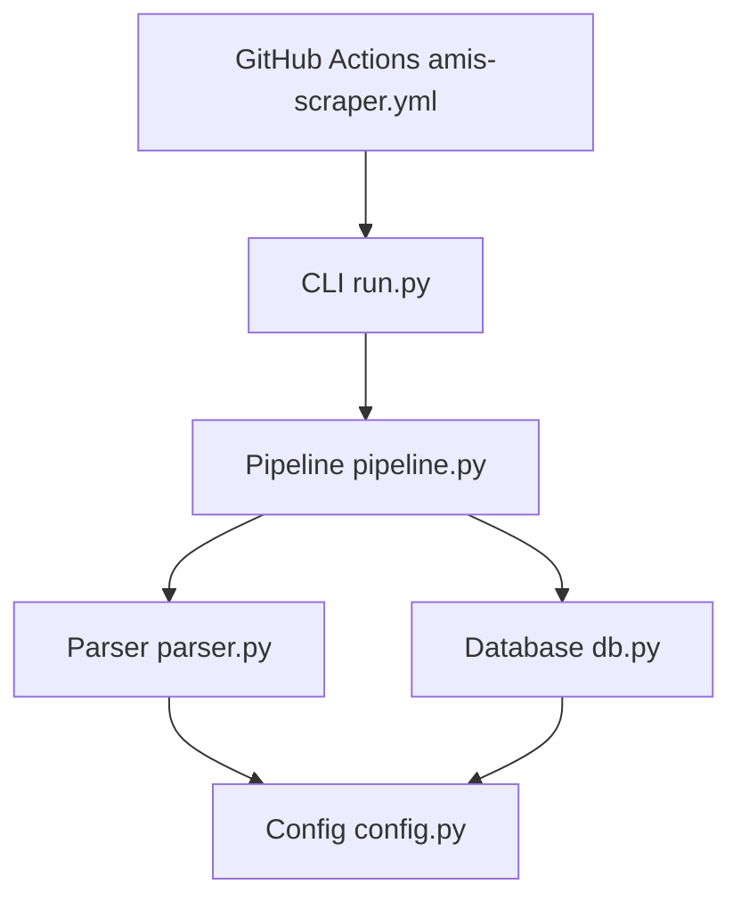
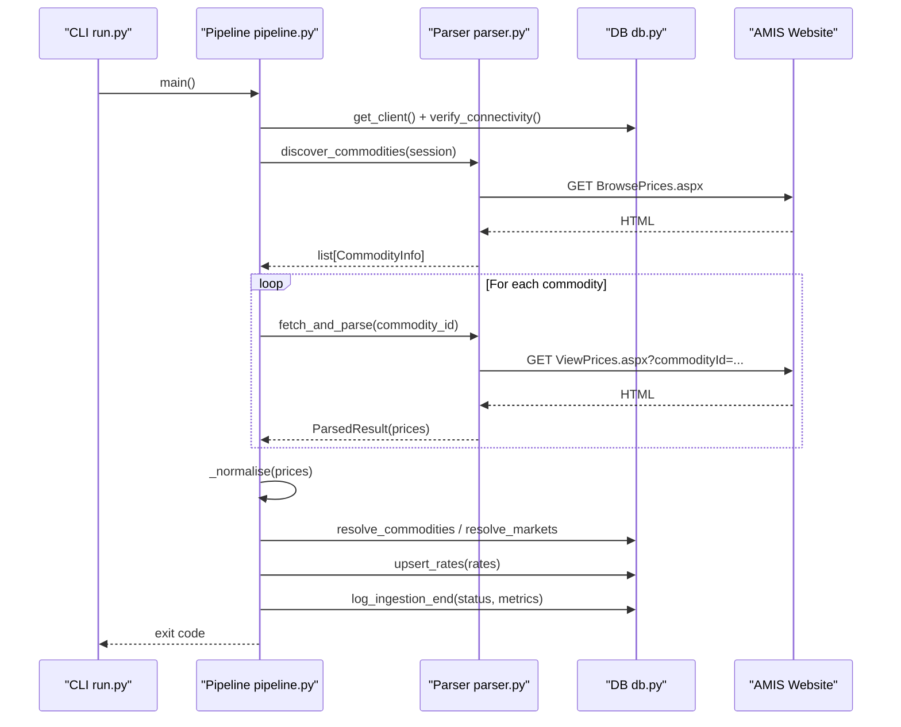
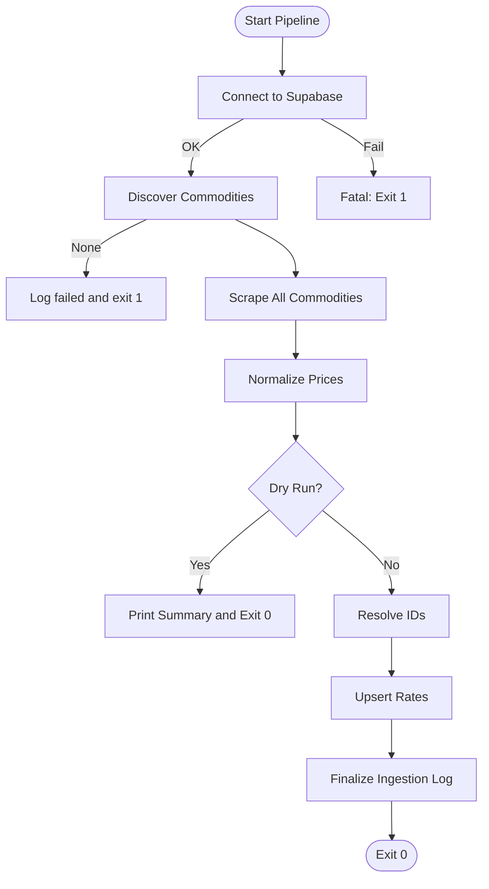
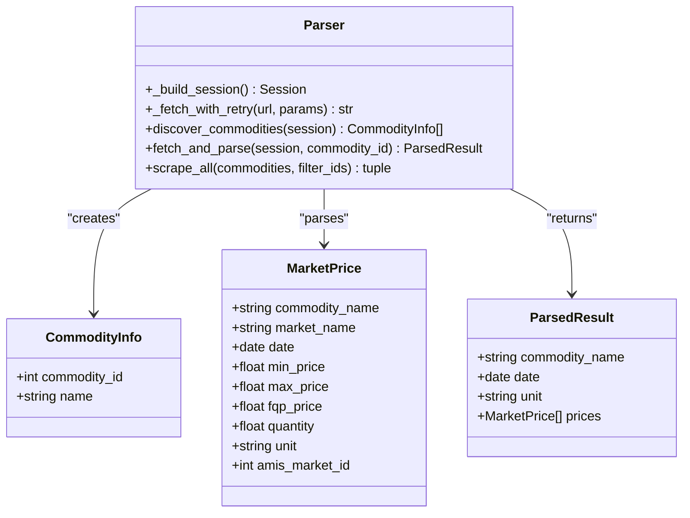
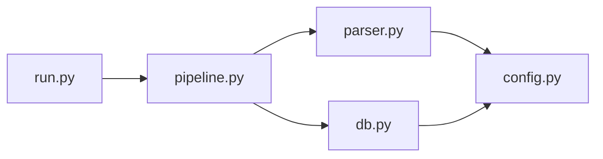

# AMIS Scraping Engine

<cite>
**Referenced Files in This Document**
- [run.py](file://Scraper/run.py)
- [pipeline.py](file://Scraper/pipeline.py)
- [parser.py](file://Scraper/parser.py)
- [config.py](file://Scraper/config.py)
- [db.py](file://Scraper/db.py)
- [amis-scraper.yml](file://.github/workflows/amis-scraper.yml)
</cite>

## Table of Contents
1. [Introduction](#introduction)
2. [Project Structure](#project-structure)
3. [Core Components](#core-components)
4. [Architecture Overview](#architecture-overview)
5. [Detailed Component Analysis](#detailed-component-analysis)
6. [Dependency Analysis](#dependency-analysis)
7. [Performance Considerations](#performance-considerations)
8. [Troubleshooting Guide](#troubleshooting-guide)
9. [Conclusion](#conclusion)
10. [Appendices](#appendices)

## Introduction
This document describes the AMIS scraping engine that extracts daily market price data from Pakistan’s Agriculture Marketing Information Service (AMIS). The system discovers available commodities, scrapes price tables for each commodity, normalizes and validates the extracted data, resolves identifiers to a relational database, and persists results with idempotent upserts. It is designed to be resilient to network issues and website structure changes through retries, fallback parsing strategies, and schema-resilient database operations.

## Project Structure
The scraper is implemented as a Python package under Scraper/ with a clear separation of concerns:
- CLI entry point orchestrates arguments and logging
- Pipeline coordinates discovery, scraping, normalization, and persistence
- Parser handles HTTP requests, HTML parsing with BeautifulSoup, and extraction logic
- Config centralizes environment-driven settings
- DB encapsulates Supabase client usage, schema discovery, and idempotent writes
- GitHub Actions workflow schedules and runs the pipeline daily

**Diagram sources**
- [run.py:1-78](file://Scraper/run.py#L1-L78)
- [pipeline.py:1-377](file://Scraper/pipeline.py#L1-L377)
- [parser.py:1-525](file://Scraper/parser.py#L1-L525)
- [config.py:1-70](file://Scraper/config.py#L1-L70)
- [db.py:1-497](file://Scraper/db.py#L1-L497)
- [amis-scraper.yml:1-46](file://.github/workflows/amis-scraper.yml#L1-L46)

**Section sources**
- [run.py:1-78](file://Scraper/run.py#L1-L78)
- [pipeline.py:1-377](file://Scraper/pipeline.py#L1-L377)
- [parser.py:1-525](file://Scraper/parser.py#L1-L525)
- [config.py:1-70](file://Scraper/config.py#L1-L70)
- [db.py:1-497](file://Scraper/db.py#L1-L497)
- [amis-scraper.yml:1-46](file://.github/workflows/amis-scraper.yml#L1-L46)

## Core Components
- CLI (run.py): Parses command-line flags, sets logging, and invokes the pipeline with optional dry-run and commodity filtering.
- Pipeline (pipeline.py): Orchestrates the end-to-end ingestion: connectivity checks, commodity discovery, scraping, normalization, ID resolution, upserts, and ingestion logging.
- Parser (parser.py): Manages session creation, retry-backed HTTP GETs, HTML parsing with BeautifulSoup, and robust extraction of commodity names, dates, units, and price table rows.
- Config (config.py): Centralized configuration for URLs, timeouts, retries, user agent, batch sizes, table names, and source identifier.
- Database (db.py): Encapsulates Supabase client creation, schema discovery, idempotent upserts for commodities/markets/rates, and ingestion log management.

Key responsibilities and interactions are detailed in subsequent sections.

**Section sources**
- [run.py:1-78](file://Scraper/run.py#L1-L78)
- [pipeline.py:1-377](file://Scraper/pipeline.py#L1-L377)
- [parser.py:1-525](file://Scraper/parser.py#L1-L525)
- [config.py:1-70](file://Scraper/config.py#L1-L70)
- [db.py:1-497](file://Scraper/db.py#L1-L497)

## Architecture Overview
The ingestion pipeline follows a linear flow with resilience built into each stage:
- Start pipeline and optionally connect to Supabase
- Discover commodities from AMIS browse page
- Scrape each commodity’s price page with retries and polite delays
- Normalize and validate parsed prices
- Resolve commodity and market IDs via Supabase
- Upsert rate rows with conflict handling and fallback
- Finalize ingestion logs with status and metrics

**Diagram sources**
- [pipeline.py:36-257](file://Scraper/pipeline.py#L36-L257)
- [parser.py:120-157](file://Scraper/parser.py#L120-L157)
- [parser.py:165-225](file://Scraper/parser.py#L165-L225)
- [db.py:267-312](file://Scraper/db.py#L267-L312)
- [db.py:320-378](file://Scraper/db.py#L320-L378)

## Detailed Component Analysis

### CLI Entry Point (run.py)
- Parses arguments for dry-run mode, commodity filtering, and verbosity
- Configures structured logging and suppresses noisy third-party logs
- Invokes the pipeline with filter_ids derived from comma-separated input

Operational notes:
- Dry-run enables scraping without writing to Supabase
- Commodity filtering allows targeted runs for debugging or partial updates

**Section sources**
- [run.py:1-78](file://Scraper/run.py#L1-L78)

### Pipeline Orchestration (pipeline.py)
Responsibilities:
- Initialize Supabase client and verify connectivity
- Start ingestion log entry
- Discover commodities from AMIS
- Scrape all commodities with success/failure counting
- Normalize and validate prices
- Resolve commodity and market IDs
- Build rate rows and upsert to database
- Finalize ingestion log with status and metrics

Error handling strategy:
- Failures in one commodity do not block others
- Supabase connectivity failure is fatal
- Ingestion logs capture success/partial/failed states

Normalization and validation:
- Strips whitespace from names
- Ensures non-negative numeric fields; invalid values become None

Upsert behavior:
- Uses database-level unique constraints when available
- Falls back to row-by-row SELECT/UPDATE/INSERT if constraints are missing

**Diagram sources**
- [pipeline.py:36-257](file://Scraper/pipeline.py#L36-L257)

**Section sources**
- [pipeline.py:1-377](file://Scraper/pipeline.py#L1-L377)

### Parser: HTML Parsing and Extraction (parser.py)
HTTP layer:
- Creates a requests.Session with a browser-like User-Agent
- Implements retry with exponential backoff and timeout handling
- Handles encoding issues by forcing UTF-8 when needed

Commodity discovery:
- Fetches the BrowsePrices page and extracts links containing commodityId
- Deduplicates and sorts discovered commodities

Single-commodity parsing:
- Fetches ViewPrices.aspx with searchType and commodityId parameters
- Extracts commodity name using multiple strategies (span ID, h2 regex, bold/strong text)
- Extracts date and unit from header cells and heading spans
- Locates the data table by known ID patterns or header column detection
- Parses rows while skipping headers and handling variable columns

Robustness features:
- Multiple selectors and regex fallbacks for name/date/table detection
- Graceful handling of missing or malformed data
- Skips rows where all prices are missing

Pagination:
- No explicit pagination implementation; the current design assumes a single page per commodity view

Rate limiting:
- Enforces a configurable delay between requests to avoid overwhelming the server

**Diagram sources**
- [parser.py:37-65](file://Scraper/parser.py#L37-L65)
- [parser.py:72-112](file://Scraper/parser.py#L72-L112)
- [parser.py:120-157](file://Scraper/parser.py#L120-L157)
- [parser.py:165-225](file://Scraper/parser.py#L165-L225)
- [parser.py:476-525](file://Scraper/parser.py#L476-L525)

**Section sources**
- [parser.py:1-525](file://Scraper/parser.py#L1-L525)

### Configuration (config.py)
Centralizes:
- Supabase credentials and service key
- AMIS base URLs and search type
- HTTP behavior: timeouts, delays, retries, backoff multiplier, user agent
- Batch size for upserts
- Table names for commodities, markets, rates, and ingestion logs
- Ingestion source identifier

Environment integration:
- Loads .env from the Scraper directory
- Reads environment variables for secrets and runtime settings

**Section sources**
- [config.py:1-70](file://Scraper/config.py#L1-L70)

### Database Integration (db.py)
Supabase client:
- Factory function creates client using service-role credentials
- Connectivity verification ensures the database is reachable

Schema discovery:
- Discovers table columns at runtime to remain resilient to schema changes
- Falls back gracefully when tables are empty or unreachable

Idempotent operations:
- Upserts for commodities and markets prefer stable AMIS IDs before falling back to name-based lookups
- Rate upsert uses database-level unique constraints when available; falls back to row-by-row logic otherwise

Ingestion logging:
- Starts a log entry on run start
- Updates final status, metrics, and error messages on completion

**Section sources**
- [db.py:1-497](file://Scraper/db.py#L1-L497)

### Deployment and Scheduling (.github/workflows/amis-scraper.yml)
- Runs daily at a scheduled time to scrape latest wholesale crop/commodity prices
- Requires Supabase URL and service key as GitHub Secrets
- Sets up Python 3.11, installs dependencies, and executes the scraper module

**Section sources**
- [amis-scraper.yml:1-46](file://.github/workflows/amis-scraper.yml#L1-L46)

## Dependency Analysis
The scraper has well-defined boundaries:
- CLI depends on pipeline
- Pipeline depends on parser and db
- Parser depends on config and external libraries (requests, BeautifulSoup)
- DB depends on config and supabase client

**Diagram sources**
- [run.py:1-78](file://Scraper/run.py#L1-L78)
- [pipeline.py:1-377](file://Scraper/pipeline.py#L1-L377)
- [parser.py:1-525](file://Scraper/parser.py#L1-L525)
- [db.py:1-497](file://Scraper/db.py#L1-L497)
- [config.py:1-70](file://Scraper/config.py#L1-L70)

Potential coupling points:
- Hardcoded AMIS URLs and selectors in parser.py may require updates if the website changes
- Supabase table names and constraints in config.py and db.py must match the deployed schema

Cohesion:
- Each module has a focused responsibility, improving maintainability and testability

**Section sources**
- [parser.py:1-525](file://Scraper/parser.py#L1-L525)
- [db.py:1-497](file://Scraper/db.py#L1-L497)
- [config.py:1-70](file://Scraper/config.py#L1-L70)

## Performance Considerations
- Request delay: A configurable delay between requests reduces load on AMIS and avoids throttling
- Retry with backoff: Exponential backoff mitigates transient network failures
- Batch upserts: Large batches reduce database round-trips; fallback to row-by-row if constraints are missing
- Schema discovery: Runtime column discovery avoids hard dependencies on exact schema layout
- Logging: Structured logging helps monitor performance and identify bottlenecks

Recommendations:
- Tune REQUEST_DELAY and MAX_RETRIES based on observed AMIS response patterns
- Monitor ingestion logs for repeated failures or slow pages
- Consider caching previously scraped commodity lists to reduce redundant requests

[No sources needed since this section provides general guidance]

## Troubleshooting Guide
Common issues and resolutions:
- Network failures:
  - Retries with exponential backoff handle temporary outages
  - Check REQUEST_TIMEOUT and MAX_RETRIES in config.py
- Website structure changes:
  - Parser uses multiple selectors and regex fallbacks for robustness
  - If selectors fail, update _extract_commodity_name, _extract_date_and_unit, or _find_data_table in parser.py
- Missing or incorrect data:
  - Normalization filters negative values and cleans whitespace
  - Rows with all missing prices are skipped
- Database connectivity:
  - verify_connectivity fails fast if Supabase is unreachable
  - Ensure SUPABASE_URL and SUPABASE_SERVICE_KEY are set correctly
- Unique constraint errors:
  - Upsert falls back to row-by-row logic if constraints are missing
  - Add ALTER TABLE to enforce unique constraints for better performance

Debugging tips:
- Use --dry-run to inspect parsed data without writing to the database
- Enable --verbose for DEBUG-level logs to trace request flows and parsing steps
- Review ingestion logs in Supabase for status, metrics, and error messages

**Section sources**
- [parser.py:72-112](file://Scraper/parser.py#L72-L112)
- [parser.py:194-225](file://Scraper/parser.py#L194-L225)
- [pipeline.py:265-333](file://Scraper/pipeline.py#L265-L333)
- [db.py:83-90](file://Scraper/db.py#L83-L90)
- [db.py:320-378](file://Scraper/db.py#L320-L378)

## Conclusion
The AMIS scraping engine provides a resilient, modular, and maintainable solution for extracting daily market price data from AMIS. It employs robust HTML parsing with BeautifulSoup, session management with proper headers, comprehensive error handling, and schema-resilient database operations. The pipeline supports dry-run testing, commodity filtering, and scheduled execution via GitHub Actions. With careful tuning of request timing and ongoing maintenance of selectors, it can reliably ingest market data even when the source website evolves.

[No sources needed since this section summarizes without analyzing specific files]

## Appendices

### Example: Parsing Different Table Formats
- Strategy 1: Locate table by ID pattern containing “Grd”
- Strategy 2: Detect header row by presence of “Min”, “Max”, “FQP” columns
- Row parsing skips headers and handles variable column counts

**Section sources**
- [parser.py:303-331](file://Scraper/parser.py#L303-L331)
- [parser.py:334-403](file://Scraper/parser.py#L334-L403)

### Example: Handling Pagination
- Current implementation does not implement pagination; it assumes a single page per commodity
- If AMIS introduces multi-page views, extend fetch_and_parse to follow next-page links or query parameters

[No sources needed since this section discusses conceptual extension]

### Example: Managing Rate Limiting
- Enforce REQUEST_DELAY between requests to avoid overwhelming AMIS
- Adjust RETRY_BACKOFF and MAX_RETRIES to balance reliability and politeness

**Section sources**
- [config.py:38-41](file://Scraper/config.py#L38-L41)
- [parser.py:500-523](file://Scraper/parser.py#L500-L523)

### Retry Mechanisms and Fallback Strategies
- HTTP retries with exponential backoff for transient failures
- Multiple parsing strategies for commodity name, date, and table location
- Database upsert fallback to row-by-row logic when unique constraints are missing

**Section sources**
- [parser.py:79-112](file://Scraper/parser.py#L79-L112)
- [parser.py:233-261](file://Scraper/parser.py#L233-L261)
- [parser.py:303-331](file://Scraper/parser.py#L303-L331)
- [db.py:320-378](file://Scraper/db.py#L320-L378)