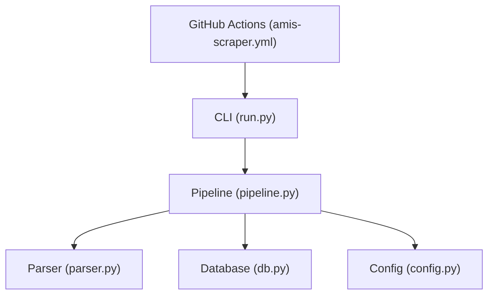
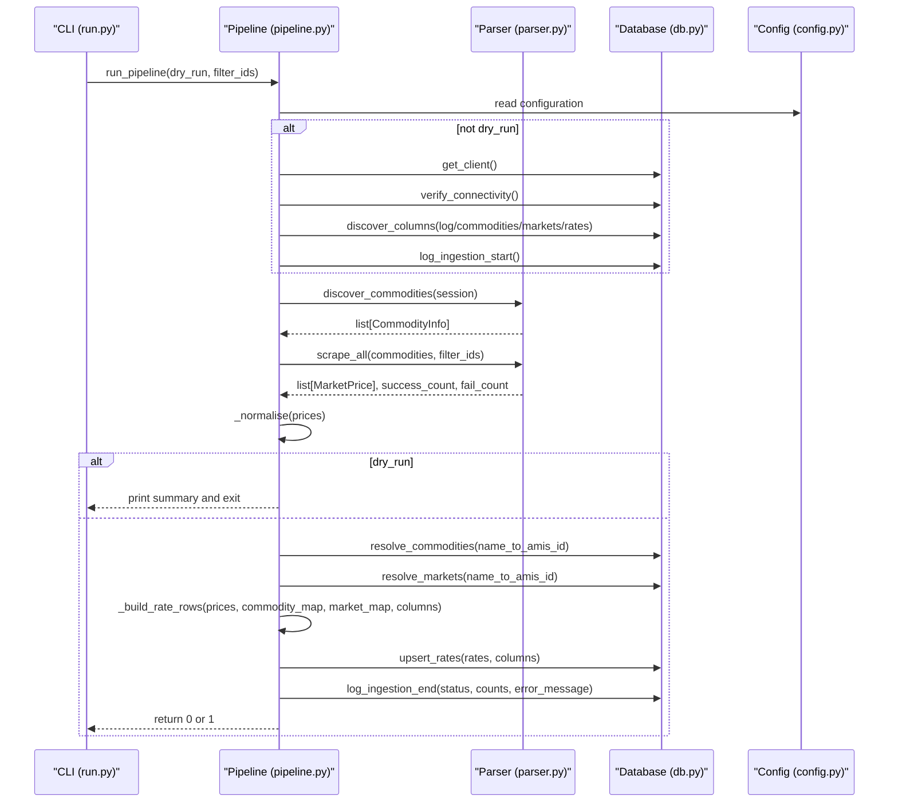
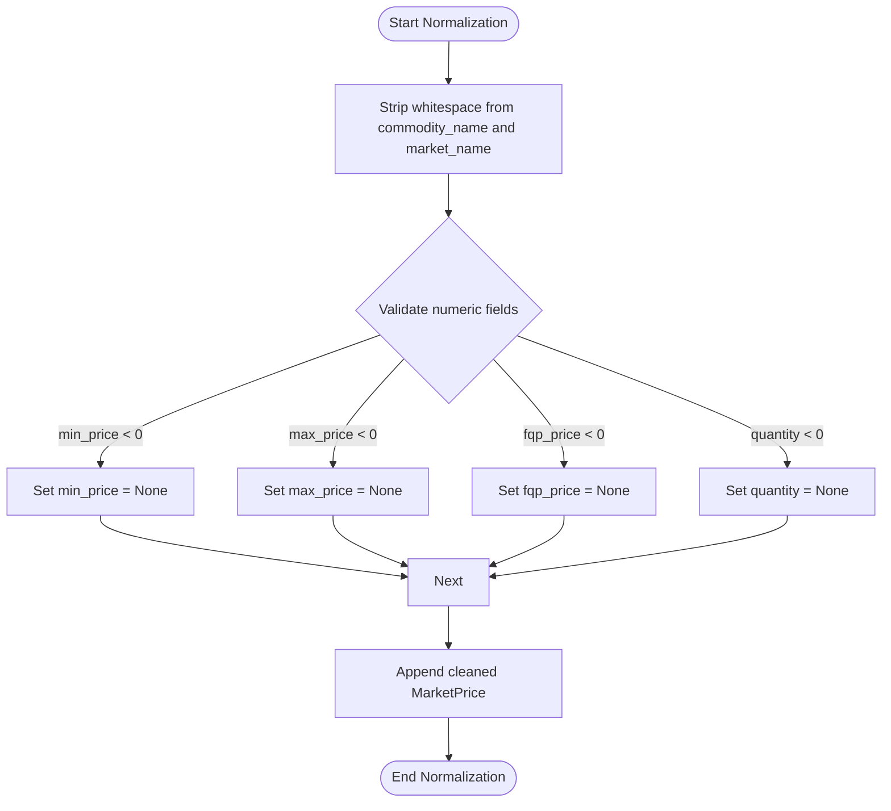
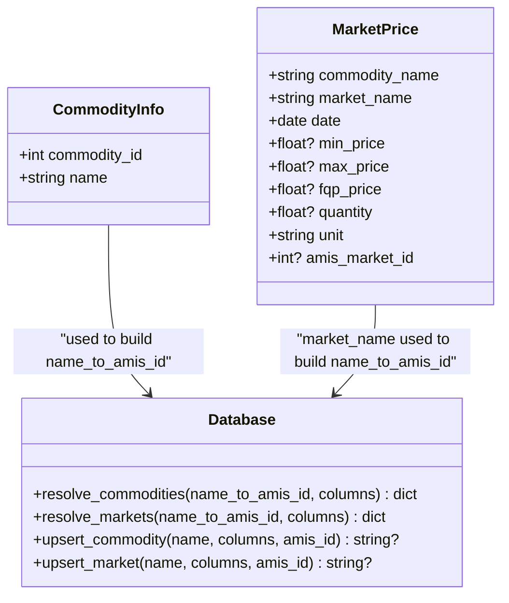
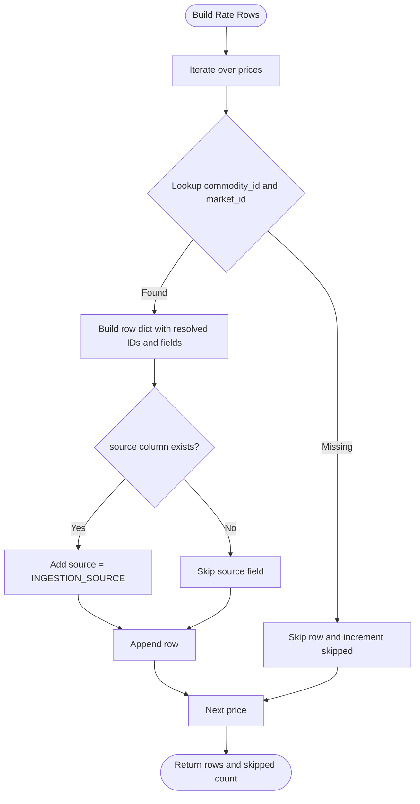
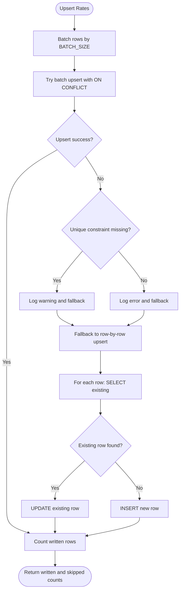
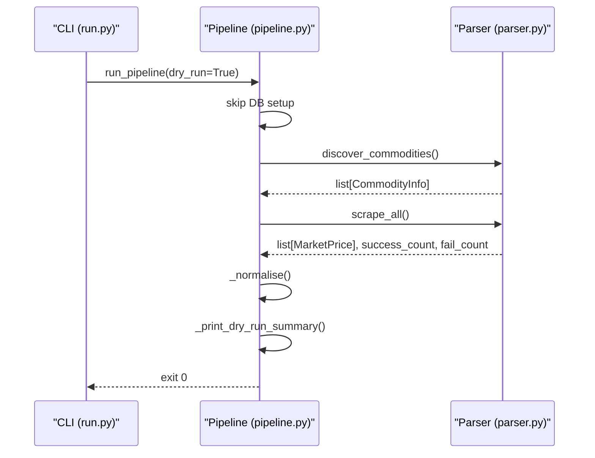
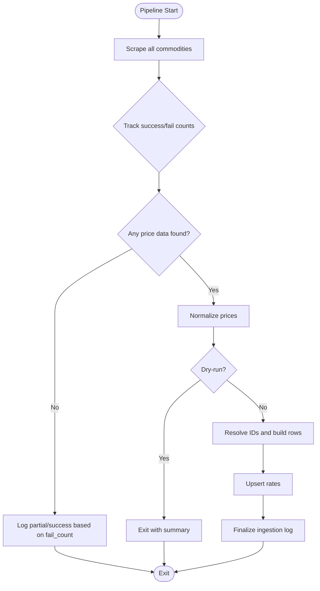
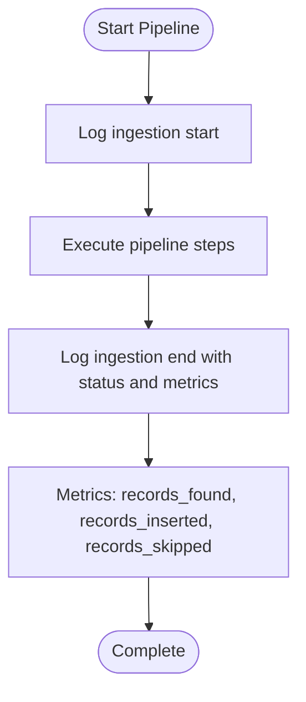
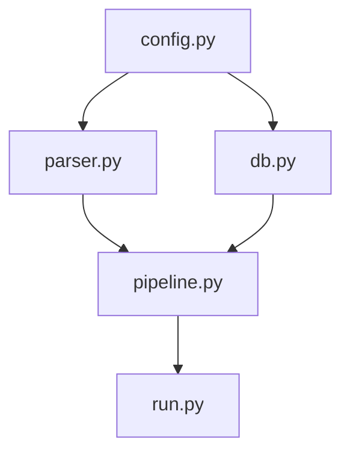

# Data Transformation Pipeline

<cite>
**Referenced Files in This Document**
- [pipeline.py](file://Scraper/pipeline.py)
- [parser.py](file://Scraper/parser.py)
- [db.py](file://Scraper/db.py)
- [config.py](file://Scraper/config.py)
- [run.py](file://Scraper/run.py)
- [amis-scraper.yml](file://.github/workflows/amis-scraper.yml)
</cite>

## Table of Contents
1. [Introduction](#introduction)
2. [Project Structure](#project-structure)
3. [Core Components](#core-components)
4. [Architecture Overview](#architecture-overview)
5. [Detailed Component Analysis](#detailed-component-analysis)
6. [Dependency Analysis](#dependency-analysis)
7. [Performance Considerations](#performance-considerations)
8. [Troubleshooting Guide](#troubleshooting-guide)
9. [Conclusion](#conclusion)

## Introduction
This document explains the data transformation pipeline that ingests raw market price data from AMIS Pakistan and converts it into structured, upsert-ready database records for Green Flora. It covers:
- Normalization (whitespace stripping, price validation, unit standardization)
- Commodity and market ID resolution (mapping AMIS identifiers to database foreign keys)
- Rate row construction (building upsert payloads)
- Deduplication via database constraints and fallback logic
- Dry-run mode for testing without writes
- Error handling per commodity with resilient ingestion
- Logging and metrics for ingestion status and performance

The pipeline is orchestrated by a CLI entry-point and can be scheduled daily via GitHub Actions.

## Project Structure
The Scraper module implements the end-to-end ingestion flow:
- parser.py: Fetches and parses AMIS HTML pages to extract commodity names, dates, units, and market prices.
- pipeline.py: Orchestrates scraping, normalization, ID resolution, rate row building, and database upserts; supports dry-run and logging.
- db.py: Encapsulates Supabase interactions, schema discovery, idempotent upserts, and ingestion logging.
- config.py: Centralized configuration for URLs, HTTP behavior, table names, and batch size.
- run.py: CLI entry-point with arguments for dry-run and selective commodity filtering.
- amis-scraper.yml: GitHub Actions workflow that schedules and runs the pipeline daily.

**Diagram sources**
- [run.py:34-73](file://Scraper/run.py#L34-L73)
- [pipeline.py:36-257](file://Scraper/pipeline.py#L36-L257)
- [parser.py:120-525](file://Scraper/parser.py#L120-L525)
- [db.py:43-497](file://Scraper/db.py#L43-L497)
- [config.py:22-69](file://Scraper/config.py#L22-L69)
- [amis-scraper.yml:15-45](file://.github/workflows/amis-scraper.yml#L15-L45)

**Section sources**
- [run.py:1-78](file://Scraper/run.py#L1-L78)
- [pipeline.py:1-377](file://Scraper/pipeline.py#L1-L377)
- [parser.py:1-525](file://Scraper/parser.py#L1-L525)
- [db.py:1-497](file://Scraper/db.py#L1-L497)
- [config.py:1-70](file://Scraper/config.py#L1-L70)
- [amis-scraper.yml:1-46](file://.github/workflows/amis-scraper.yml#L1-L46)

## Core Components
- Parser: Discovers commodities, scrapes each commodity page, extracts date/unit and market price rows, and returns structured MarketPrice objects.
- Pipeline: Coordinates scraping, normalizes data, resolves IDs, builds rate rows, performs upserts, logs ingestion, and supports dry-run.
- Database: Provides schema discovery, commodity/market upserts, bulk rate upserts with deduplication, and ingestion log management.
- Config: Holds environment-driven settings for Supabase, AMIS endpoints, HTTP behavior, and table names.
- CLI: Parses arguments and invokes the pipeline with optional dry-run and commodity filters.

Key responsibilities:
- Normalization ensures clean names and valid numeric fields before DB insertion.
- ID resolution maps AMIS identifiers to stable database foreign keys.
- Upsert logic prevents duplicates using unique constraints and fallback strategies.
- Logging captures start/end status, counts, and errors for observability.

**Section sources**
- [parser.py:37-65](file://Scraper/parser.py#L37-L65)
- [pipeline.py:265-333](file://Scraper/pipeline.py#L265-L333)
- [db.py:98-313](file://Scraper/db.py#L98-L313)
- [db.py:320-417](file://Scraper/db.py#L320-L417)
- [config.py:22-69](file://Scraper/config.py#L22-L69)
- [run.py:34-73](file://Scraper/run.py#L34-L73)

## Architecture Overview
The pipeline follows a linear orchestration with isolated components:
- CLI triggers pipeline execution with optional flags.
- Pipeline initializes Supabase client (unless dry-run), discovers schemas, starts ingestion log.
- Parser discovers commodities and scrapes all pages, returning parsed price rows.
- Pipeline normalizes prices, optionally exits in dry-run mode.
- Pipeline resolves commodity and market IDs using AMIS identifiers and existing DB entries.
- Pipeline constructs rate rows with resolved foreign keys and source tagging.
- Pipeline upserts rates with deduplication and logs final results.

**Diagram sources**
- [run.py:34-73](file://Scraper/run.py#L34-L73)
- [pipeline.py:36-257](file://Scraper/pipeline.py#L36-L257)
- [parser.py:120-525](file://Scraper/parser.py#L120-L525)
- [db.py:43-497](file://Scraper/db.py#L43-L497)
- [config.py:22-69](file://Scraper/config.py#L22-L69)

## Detailed Component Analysis

### Normalization Process
Normalization cleans and validates parsed price rows before any database interaction:
- Whitespace stripping on commodity and market names to ensure consistent lookups.
- Price validation: negative values are set to None to prevent invalid inserts.
- Unit standardization: default unit is applied when parsing fails to detect a specific unit string.

**Diagram sources**
- [pipeline.py:265-288](file://Scraper/pipeline.py#L265-L288)

**Section sources**
- [pipeline.py:265-288](file://Scraper/pipeline.py#L265-L288)

### Commodity and Market ID Resolution System
The system maps AMIS identifiers to database foreign keys using a two-step strategy:
- Build name-to-AMIS-ID maps from discovered commodities and parsed market links.
- Resolve commodities and markets by first attempting lookup by AMIS ID (stable), then by display name.
- If missing, insert new entries and capture their IDs; return mappings for downstream use.

**Diagram sources**
- [parser.py:37-65](file://Scraper/parser.py#L37-L65)
- [db.py:98-313](file://Scraper/db.py#L98-L313)

**Section sources**
- [pipeline.py:166-203](file://Scraper/pipeline.py#L166-L203)
- [db.py:98-179](file://Scraper/db.py#L98-L179)
- [db.py:186-259](file://Scraper/db.py#L186-L259)
- [db.py:267-313](file://Scraper/db.py#L267-L313)

### Rate Row Construction Process
Rate rows are built as upsert-ready dictionaries containing resolved foreign keys and normalized fields:
- For each MarketPrice, map commodity_name and market_name to database IDs using resolved maps.
- Construct row with fields: commodity_id, market_id, price_date, min_price, max_price, fqp, quantity, unit.
- Optionally include source column tagged with configured ingestion source if present in schema.
- Skip rows where commodity or market IDs cannot be resolved; track skipped count.

**Diagram sources**
- [pipeline.py:291-333](file://Scraper/pipeline.py#L291-L333)
- [config.py:69](file://Scraper/config.py#L69)

**Section sources**
- [pipeline.py:291-333](file://Scraper/pipeline.py#L291-L333)

### Deduplication Logic
Deduplication ensures idempotent ingestion:
- Database-level unique constraint on (commodity_id, market_id, price_date) prevents duplicate rate rows.
- Upsert uses ON CONFLICT to update existing rows rather than creating duplicates.
- Fallback to row-by-row SELECT/UPDATE/INSERT if unique constraint is missing; tracks skipped rows on failure.

**Diagram sources**
- [db.py:320-417](file://Scraper/db.py#L320-L417)
- [config.py:54](file://Scraper/config.py#L54)

**Section sources**
- [db.py:320-417](file://Scraper/db.py#L320-L417)

### Dry-Run Mode
Dry-run mode allows testing transformations without writing to the database:
- Skips Supabase client initialization and connectivity checks.
- Still discovers commodities and scrapes pages, normalizes data, and prints a summary.
- Useful for validating parsing and normalization logic before enabling writes.

**Diagram sources**
- [pipeline.py:36-163](file://Scraper/pipeline.py#L36-L163)
- [pipeline.py:336-377](file://Scraper/pipeline.py#L336-L377)

**Section sources**
- [pipeline.py:36-163](file://Scraper/pipeline.py#L36-L163)
- [pipeline.py:336-377](file://Scraper/pipeline.py#L336-L377)

### Error Handling Strategy
Error handling isolates failures per commodity and maintains pipeline resilience:
- Individual commodity scraping failures do not block others; counters track success/fail.
- Fatal failures (e.g., Supabase connectivity) abort the pipeline with non-zero exit code.
- Ingestion log records status (success/partial/failed), counts, and error messages.

**Diagram sources**
- [pipeline.py:104-151](file://Scraper/pipeline.py#L104-L151)
- [pipeline.py:231-257](file://Scraper/pipeline.py#L231-L257)

**Section sources**
- [pipeline.py:10-15](file://Scraper/pipeline.py#L10-L15)
- [pipeline.py:104-151](file://Scraper/pipeline.py#L104-L151)
- [pipeline.py:231-257](file://Scraper/pipeline.py#L231-L257)

### Logging System
Logging tracks ingestion status and performance metrics:
- Structured logging to stdout with timestamps and levels.
- Ingestion log rows record start/end times, status, counts, and error messages.
- Warnings and errors logged for retries, schema issues, and upsert failures.

**Diagram sources**
- [db.py:424-497](file://Scraper/db.py#L424-L497)
- [run.py:20-31](file://Scraper/run.py#L20-L31)

**Section sources**
- [db.py:424-497](file://Scraper/db.py#L424-L497)
- [run.py:20-31](file://Scraper/run.py#L20-L31)

## Dependency Analysis
The pipeline has clear separation of concerns with minimal coupling:
- Parser depends on config for HTTP settings and AMIS endpoints.
- Pipeline depends on parser for scraping and db for storage.
- Database depends on config for table names and credentials.
- CLI depends on pipeline for orchestration.

**Diagram sources**
- [config.py:22-69](file://Scraper/config.py#L22-L69)
- [parser.py:18-28](file://Scraper/parser.py#L18-L28)
- [db.py:28-34](file://Scraper/db.py#L28-L34)
- [pipeline.py:23-26](file://Scraper/pipeline.py#L23-L26)
- [run.py:17-17](file://Scraper/run.py#L17-L17)

**Section sources**
- [config.py:22-69](file://Scraper/config.py#L22-L69)
- [parser.py:18-28](file://Scraper/parser.py#L18-L28)
- [db.py:28-34](file://Scraper/db.py#L28-L34)
- [pipeline.py:23-26](file://Scraper/pipeline.py#L23-L26)
- [run.py:17-17](file://Scraper/run.py#L17-L17)

## Performance Considerations
- Request delays and retries: Configurable delay between requests and exponential backoff reduce server load and handle transient failures.
- Batch upserts: Large batches improve throughput; fallback to row-by-row ensures robustness if constraints are missing.
- Schema discovery: Runtime column detection avoids crashes on schema changes and enables graceful degradation.
- Dry-run mode: Enables fast validation without database overhead during development.

[No sources needed since this section provides general guidance]

## Troubleshooting Guide
Common issues and resolutions:
- No price data found: Indicates either no data available today or all commodities failed to scrape; check AMIS availability and filter_ids.
- Unresolved commodity/market IDs: Ensure AMIS identifiers match database entries; verify name normalization and AMIS ID extraction.
- Unique constraint missing: Pipeline falls back to row-by-row upsert; add the unique constraint for optimal performance.
- Supabase connectivity failure: Verify environment variables and service key; pipeline aborts on fatal connection errors.
- Dry-run output mismatch: Compare dry-run sample rows with expected format; validate parsing selectors and unit extraction.

**Section sources**
- [pipeline.py:133-151](file://Scraper/pipeline.py#L133-L151)
- [pipeline.py:329-333](file://Scraper/pipeline.py#L329-L333)
- [db.py:363-377](file://Scraper/db.py#L363-L377)
- [db.py:83-90](file://Scraper/db.py#L83-L90)

## Conclusion
The data transformation pipeline provides a robust, idempotent, and observable ingestion process for AMIS market data. It combines resilient scraping, thorough normalization, stable ID resolution, and efficient upserts with comprehensive logging. Dry-run mode facilitates safe testing, while per-commodity error isolation ensures continuous operation even when individual sources fail. The modular design and configuration-driven approach enable easy maintenance and adaptation to schema or source changes.

[No sources needed since this section summarizes without analyzing specific files]