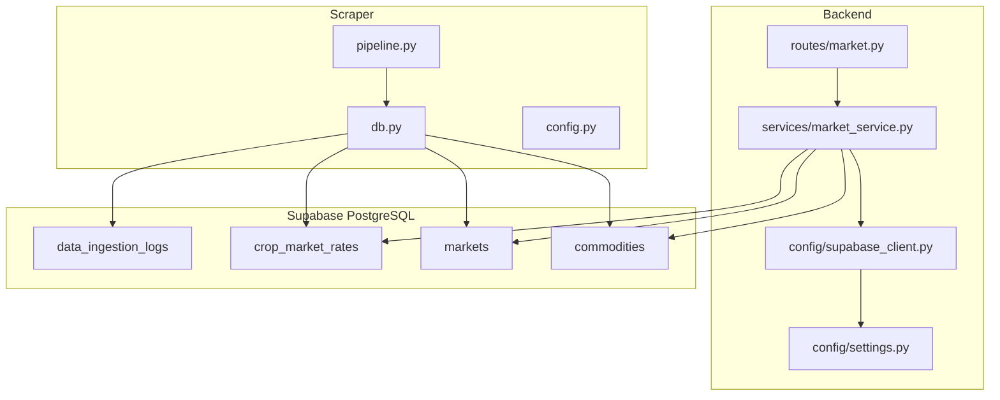
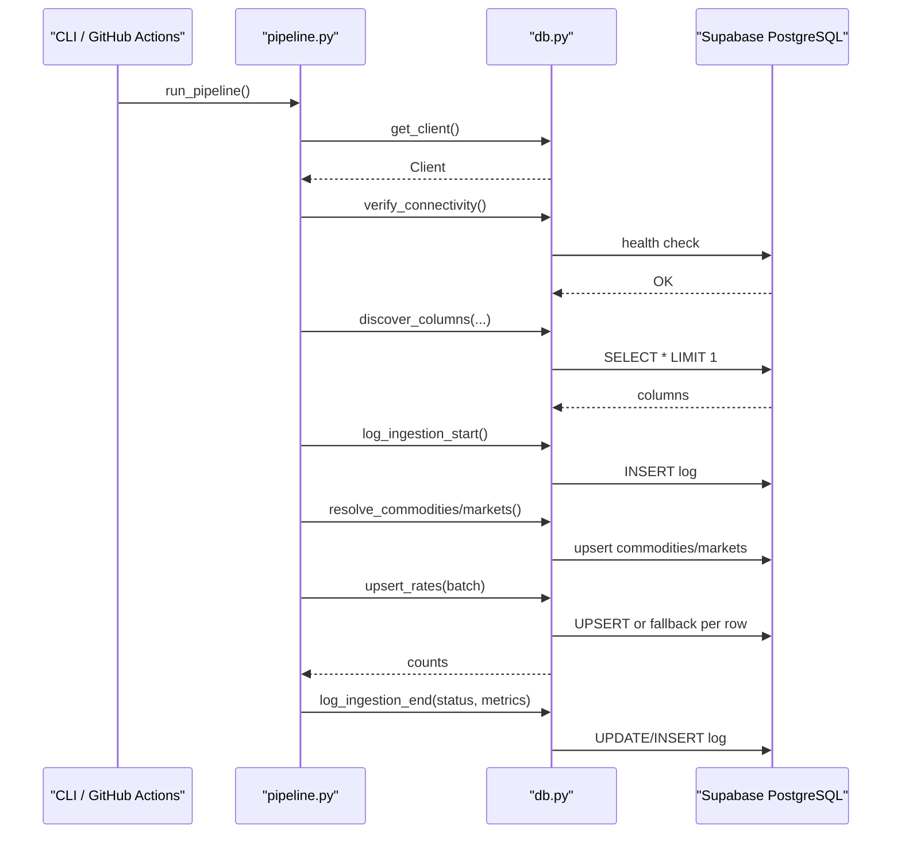
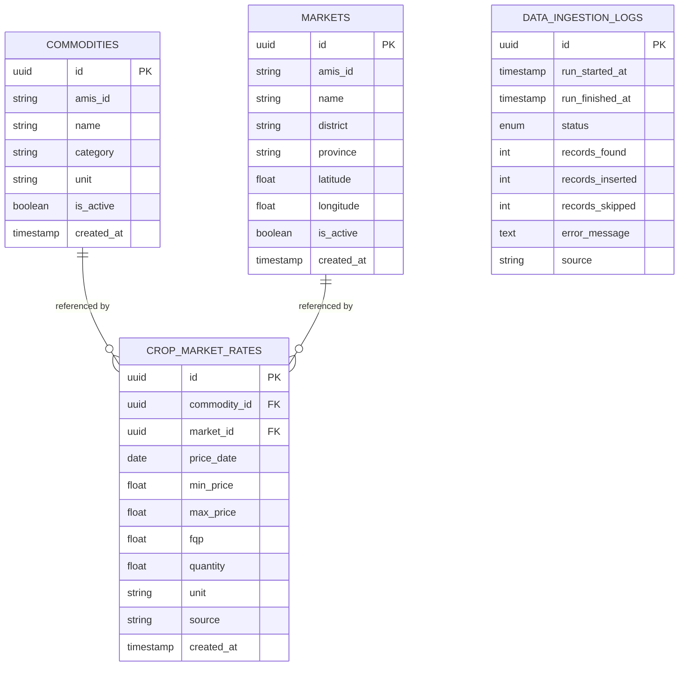
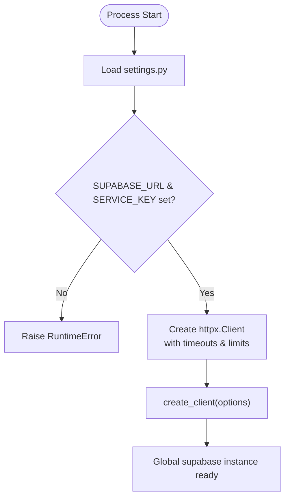
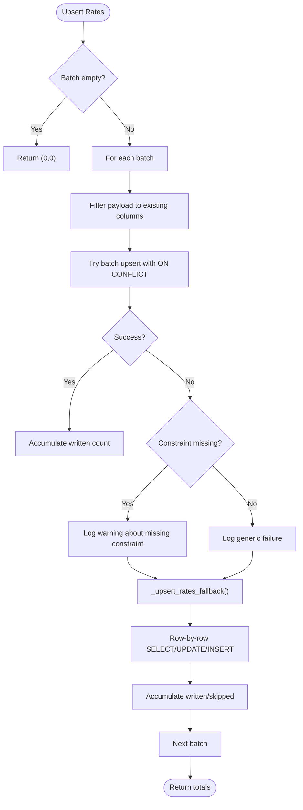
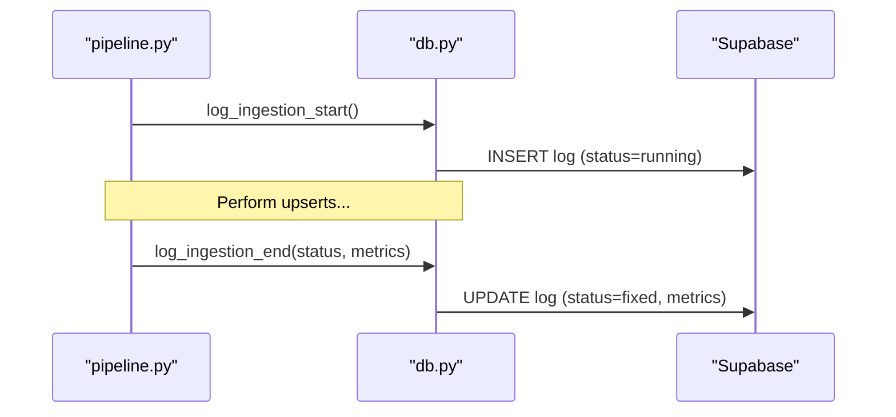
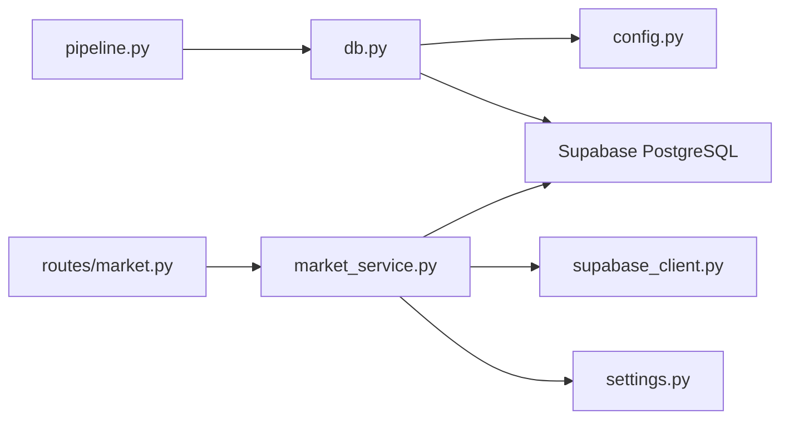

# Database Storage Layer

<cite>
**Referenced Files in This Document**
- [supabase_client.py](file://Backend/config/supabase_client.py)
- [settings.py](file://Backend/config/settings.py)
- [market_service.py](file://Backend/services/market_service.py)
- [market.py](file://Backend/routes/market.py)
- [market.py (schemas)](file://Backend/schemas/market.py)
- [db.py](file://Scraper/db.py)
- [config.py](file://Scraper/config.py)
- [pipeline.py](file://Scraper/pipeline.py)
</cite>

## Table of Contents
1. [Introduction](#introduction)
2. [Project Structure](#project-structure)
3. [Core Components](#core-components)
4. [Architecture Overview](#architecture-overview)
5. [Detailed Component Analysis](#detailed-component-analysis)
6. [Dependency Analysis](#dependency-analysis)
7. [Performance Considerations](#performance-considerations)
8. [Troubleshooting Guide](#troubleshooting-guide)
9. [Conclusion](#conclusion)
10. [Appendices](#appendices)

## Introduction
This document describes the database storage layer that persists market data using Supabase PostgreSQL. It covers schema design for commodities, markets, rates, and ingestion logs; connection management with Supabase client initialization, authentication, and connection pooling; upsert operations for idempotent inserts/updates; batch processing for efficient bulk writes; transaction-like consistency via ingestion logging; column discovery to adapt to schema changes; query optimization strategies for large datasets; and operational guidance including monitoring queries and performance tuning.

## Project Structure
The database storage layer spans two main areas:
- Scraper pipeline: ingests AMIS market data into Supabase tables with schema discovery, idempotent upserts, and ingestion logging.
- Backend services: read from Supabase to serve market intelligence endpoints with caching and optimized queries.

**Diagram sources**
- [pipeline.py:36-257](file://Scraper/pipeline.py#L36-L257)
- [db.py:62-496](file://Scraper/db.py#L62-L496)
- [config.py:54-69](file://Scraper/config.py#L54-L69)
- [market_service.py:47-653](file://Backend/services/market_service.py#L47-L653)
- [market.py:31-108](file://Backend/routes/market.py#L31-L108)
- [supabase_client.py:16-47](file://Backend/config/supabase_client.py#L16-L47)
- [settings.py:48-123](file://Backend/config/settings.py#L48-L123)

**Section sources**
- [pipeline.py:36-257](file://Scraper/pipeline.py#L36-L257)
- [db.py:62-496](file://Scraper/db.py#L62-L496)
- [market_service.py:47-653](file://Backend/services/market_service.py#L47-L653)
- [market.py:31-108](file://Backend/routes/market.py#L31-L108)
- [supabase_client.py:16-47](file://Backend/config/supabase_client.py#L16-L47)
- [settings.py:48-123](file://Backend/config/settings.py#L48-L123)

## Core Components
- Supabase client initialization and connection pooling:
  - A centralized HTTPX-backed Supabase client is created with explicit timeouts and connection limits to avoid HTTP/2 issues on Windows and to control pool sizing.
  - Settings are loaded from environment variables for URL and service key.
- Ingestion pipeline:
  - Discovers table schemas at runtime to remain resilient to non-essential column changes.
  - Upserts commodities and markets by stable identifiers when available, falling back to name-based lookup.
  - Batches rate upserts with a database-level unique constraint fallback to row-by-row logic if constraints are missing.
  - Logs ingestion runs with start/end status and metrics.
- Market service:
  - Reads only from Supabase tables for public market data.
  - Uses pagination and capped scans to optimize large dataset queries.
  - Caches commodity lists and market metadata with short TTLs.
  - Computes representative prices, trends, signals, and insights strictly from real rows.

**Section sources**
- [supabase_client.py:16-47](file://Backend/config/supabase_client.py#L16-L47)
- [settings.py:48-123](file://Backend/config/settings.py#L48-L123)
- [db.py:62-496](file://Scraper/db.py#L62-L496)
- [pipeline.py:36-257](file://Scraper/pipeline.py#L36-L257)
- [market_service.py:47-653](file://Backend/services/market_service.py#L47-L653)

## Architecture Overview
The system separates ingestion and consumption:
- Ingestion (Scraper):
  - Orchestrates scraping, normalization, and persistence.
  - Ensures idempotency and safety (no deletes).
  - Tracks run outcomes in ingestion logs.
- Consumption (Backend):
  - Exposes REST endpoints that delegate to a service layer.
  - Service layer performs efficient reads with pagination and caching.

**Diagram sources**
- [pipeline.py:36-257](file://Scraper/pipeline.py#L36-L257)
- [db.py:43-496](file://Scraper/db.py#L43-L496)

**Section sources**
- [pipeline.py:36-257](file://Scraper/pipeline.py#L36-L257)
- [db.py:43-496](file://Scraper/db.py#L43-L496)

## Detailed Component Analysis

### Schema Design and Relationships
- Tables involved:
  - commodities: stores unique commodity entries with optional external identifier and attributes.
  - markets: stores unique market entries with optional external identifier and location attributes.
  - crop_market_rates: stores daily price observations linking a commodity and market, with fields for min/max/FQP prices, quantity, unit, source, and timestamps.
  - data_ingestion_logs: records each ingestion run’s lifecycle and metrics.
- Constraints and uniqueness:
  - Rates use a unique constraint on (commodity_id, market_id, price_date) to enforce idempotent upserts.
  - The code includes a fallback path when the constraint is missing, ensuring robustness during migrations or misconfiguration.
- Relationships:
  - Rates reference commodities and markets via foreign keys (conceptually), enabling joins and aggregations.
  - Ingestion logs are independent but correlate runs with inserted/skipped counts.

**Diagram sources**
- [db.py:17-26](file://Scraper/db.py#L17-L26)
- [config.py:54-69](file://Scraper/config.py#L54-L69)

**Section sources**
- [db.py:17-26](file://Scraper/db.py#L17-L26)
- [config.py:54-69](file://Scraper/config.py#L54-L69)

### Connection Management and Authentication
- Supabase client creation:
  - Centralized client uses an HTTPX client with HTTP/1.1 disabled for HTTP/2, explicit timeouts, and connection limits to ensure stability under load.
  - PostgREST and storage/function timeouts are configured consistently.
- Configuration:
  - Environment-driven settings include Supabase URL and service key, loaded once and reused across modules.
- Authentication:
  - Scraper uses service-role credentials for server-side writes.
  - Backend routes do not require authentication for public market data endpoints.

**Diagram sources**
- [supabase_client.py:16-47](file://Backend/config/supabase_client.py#L16-L47)
- [settings.py:48-123](file://Backend/config/settings.py#L48-L123)

**Section sources**
- [supabase_client.py:16-47](file://Backend/config/supabase_client.py#L16-L47)
- [settings.py:48-123](file://Backend/config/settings.py#L48-L123)

### Upsert Operations and Idempotency
- Commodities and markets:
  - Lookup by stable external ID first, then by name; insert if not found; handle race conditions with fallback re-lookup.
- Rates:
  - Batch upsert using database-level unique constraint on (commodity_id, market_id, price_date).
  - Fallback to row-by-row SELECT/UPDATE/INSERT if constraint is missing or batch fails.
- Safety guarantees:
  - No deletes; only inserts or updates.
  - Column filtering ensures payloads match discovered schema.

**Diagram sources**
- [db.py:320-416](file://Scraper/db.py#L320-L416)

**Section sources**
- [db.py:320-416](file://Scraper/db.py#L320-L416)

### Batch Processing Capabilities
- Batch size configuration:
  - Configurable batch size controls how many rows are sent per upsert call.
- Filtering and resilience:
  - Each row is filtered to only include columns present in the target table.
  - If batch upsert fails due to missing constraints, the system falls back safely without losing progress.

**Section sources**
- [config.py:54-69](file://Scraper/config.py#L54-L69)
- [db.py:320-416](file://Scraper/db.py#L320-L416)

### Transaction Management and Consistency
- While there is no explicit multi-statement transaction wrapper around all writes, consistency is achieved through:
  - Ingestion logging: start/end markers with status and metrics provide an audit trail.
  - Idempotent upserts: duplicate prevention via unique constraints and fallback logic.
  - Safe operations: no deletes; only safe inserts/updates.
- Operational pattern:
  - Pipeline starts a log entry before writes and finalizes it after completion, capturing success/partial/failed states and counts.

**Diagram sources**
- [pipeline.py:95-249](file://Scraper/pipeline.py#L95-L249)
- [db.py:424-496](file://Scraper/db.py#L424-L496)

**Section sources**
- [pipeline.py:95-249](file://Scraper/pipeline.py#L95-L249)
- [db.py:424-496](file://Scraper/db.py#L424-L496)

### Column Discovery Mechanism
- Runtime schema discovery:
  - Select one row to infer column names; if table is empty, fallback to standard assumptions.
  - All write payloads are filtered to only include discovered columns, preventing errors on schema drift.
- Benefits:
  - Resilient to non-essential column additions/removals.
  - Reduces maintenance overhead when schema evolves.

**Section sources**
- [db.py:62-80](file://Scraper/db.py#L62-L80)

### Query Optimization Strategies for Large Datasets
- Pagination:
  - Rate scans use range-based pagination to limit memory and network usage.
- Caps and anchors:
  - Maximum scan rows prevent runaway queries.
  - Anchor queries fetch latest dates efficiently to compute windows.
- Caching:
  - In-memory caches for commodities list and market metadata reduce repeated reads.
- Efficient aggregation:
  - Representative price computation prefers weighted averages when quantity data is available.

**Section sources**
- [market_service.py:59-153](file://Backend/services/market_service.py#L59-L153)
- [market_service.py:158-343](file://Backend/services/market_service.py#L158-L343)
- [market_service.py:599-653](file://Backend/services/market_service.py#L599-L653)

### Backup and Recovery Procedures
- Current implementation does not include automated backup or recovery routines within the repository.
- Recommended practices:
  - Use Supabase native backups or PostgreSQL logical backups to capture schema and data snapshots.
  - Maintain versioned migration scripts for schema changes to enable reproducible restores.
  - Periodically export ingestion logs to track historical run outcomes and detect anomalies.

[No sources needed since this section provides general guidance]

### Examples of Database Operations
- Upsert a commodity:
  - Lookup by external ID or name; insert if missing; return ID.
  - See paths: [upsert_commodity:98-178](file://Scraper/db.py#L98-L178)
- Upsert a market:
  - Same strategy as commodities; returns ID.
  - See paths: [upsert_market:186-259](file://Scraper/db.py#L186-L259)
- Batch upsert rates:
  - Filters columns, attempts batch upsert with unique constraint, falls back to row-by-row if needed.
  - See paths: [upsert_rates:320-378](file://Scraper/db.py#L320-L378), [_upsert_rates_fallback:381-416](file://Scraper/db.py#L381-L416)
- Ingestion logging:
  - Start and end markers with status and metrics.
  - See paths: [log_ingestion_start:424-446](file://Scraper/db.py#L424-L446), [log_ingestion_end:449-496](file://Scraper/db.py#L449-L496)
- Read commodities and rates:
  - Paginated scans and anchored queries for overview computations.
  - See paths: [list_commodities:59-153](file://Backend/services/market_service.py#L59-L153), [_fetch_commodity_rates:599-624](file://Backend/services/market_service.py#L599-L624)

**Section sources**
- [db.py:98-178](file://Scraper/db.py#L98-L178)
- [db.py:186-259](file://Scraper/db.py#L186-L259)
- [db.py:320-416](file://Scraper/db.py#L320-L416)
- [db.py:424-496](file://Scraper/db.py#L424-L496)
- [market_service.py:59-153](file://Backend/services/market_service.py#L59-L153)
- [market_service.py:599-624](file://Backend/services/market_service.py#L599-L624)

## Dependency Analysis
- Scraper depends on:
  - db.py for all Supabase interactions.
  - config.py for table names, batch size, and ingestion source.
  - pipeline.py orchestrates the flow and logging.
- Backend depends on:
  - market_service.py for business logic and optimized reads.
  - routes/market.py for API endpoints.
  - supabase_client.py for connection setup and pooling.
  - settings.py for environment configuration.

**Diagram sources**
- [pipeline.py:36-257](file://Scraper/pipeline.py#L36-L257)
- [db.py:43-496](file://Scraper/db.py#L43-L496)
- [config.py:54-69](file://Scraper/config.py#L54-L69)
- [market_service.py:47-653](file://Backend/services/market_service.py#L47-L653)
- [market.py:31-108](file://Backend/routes/market.py#L31-L108)
- [supabase_client.py:16-47](file://Backend/config/supabase_client.py#L16-L47)
- [settings.py:48-123](file://Backend/config/settings.py#L48-L123)

**Section sources**
- [pipeline.py:36-257](file://Scraper/pipeline.py#L36-L257)
- [db.py:43-496](file://Scraper/db.py#L43-L496)
- [market_service.py:47-653](file://Backend/services/market_service.py#L47-L653)
- [market.py:31-108](file://Backend/routes/market.py#L31-L108)
- [supabase_client.py:16-47](file://Backend/config/supabase_client.py#L16-L47)
- [settings.py:48-123](file://Backend/config/settings.py#L48-L123)

## Performance Considerations
- Connection pooling and timeouts:
  - HTTPX client sets connect/read/write/pool timeouts and connection limits to balance throughput and stability.
- Batch size tuning:
  - Adjust BATCH_SIZE based on network latency and Supabase throughput to maximize throughput while avoiding oversized payloads.
- Query caps and pagination:
  - Use _PAGE_SIZE and maximum row caps to prevent excessive memory usage and long-running queries.
- Caching:
  - Cache commodity lists and market metadata with short TTLs to reduce redundant reads.
- Indexing recommendations:
  - Ensure indexes exist on frequently queried columns such as price_date, commodity_id, market_id to support efficient scans and upserts.
  - Validate unique constraints on (commodity_id, market_id, price_date) to leverage fast conflict resolution.

[No sources needed since this section provides general guidance]

## Troubleshooting Guide
- Connectivity failures:
  - Verify SUPABASE_URL and SUPABASE_SERVICE_KEY are set; connectivity checks will fail early if unreachable.
  - See paths: [verify_connectivity:83-90](file://Scraper/db.py#L83-L90)
- Missing unique constraints:
  - If batch upsert fails due to missing constraints, the system warns and falls back to row-by-row logic. Add the constraint to restore optimal performance.
  - See paths: [upsert_rates:320-378](file://Scraper/db.py#L320-L378)
- Schema drift:
  - Column discovery filters payloads to existing columns; if new columns appear, they will be used automatically; if removed, writes remain safe.
  - See paths: [discover_columns:62-80](file://Scraper/db.py#L62-L80)
- Empty tables:
  - When tables are empty, discovery assumes standard columns; subsequent writes may need schema adjustments if structure differs.
  - See paths: [discover_columns:62-80](file://Scraper/db.py#L62-L80)
- Ingestion logs:
  - Check data_ingestion_logs for run status, timestamps, and metrics to diagnose failures and partial successes.
  - See paths: [log_ingestion_start:424-446](file://Scraper/db.py#L424-L446), [log_ingestion_end:449-496](file://Scraper/db.py#L449-L496)

**Section sources**
- [db.py:83-90](file://Scraper/db.py#L83-L90)
- [db.py:320-378](file://Scraper/db.py#L320-L378)
- [db.py:62-80](file://Scraper/db.py#L62-L80)
- [db.py:424-496](file://Scraper/db.py#L424-L496)

## Conclusion
The database storage layer combines robust ingestion with efficient consumption:
- Ingestion uses schema discovery, idempotent upserts, batch processing, and ingestion logging to ensure safe, repeatable data loads.
- Consumption leverages pagination, caching, and careful aggregation to deliver responsive market intelligence APIs.
- Operational resilience is achieved through clear error handling, fallback mechanisms, and comprehensive logging.

[No sources needed since this section summarizes without analyzing specific files]

## Appendices

### Monitoring Queries for Data Integrity
- Recent ingestion runs:
  - Query data_ingestion_logs ordered by run_started_at to inspect recent statuses and metrics.
- Duplicate detection:
  - Verify uniqueness on (commodity_id, market_id, price_date) to ensure no duplicates exist.
- Coverage checks:
  - Count distinct dates per commodity to assess data freshness and completeness.
- Price sanity:
  - Identify rows where min_price > max_price or negative values to flag anomalies.

[No sources needed since this section provides general guidance]

### Performance Tuning Guidelines
- Ensure appropriate indexes on price_date, commodity_id, market_id.
- Tune BATCH_SIZE to match environment capacity.
- Keep page sizes reasonable to balance memory and latency.
- Monitor cache hit ratios and adjust TTLs if necessary.

[No sources needed since this section provides general guidance]