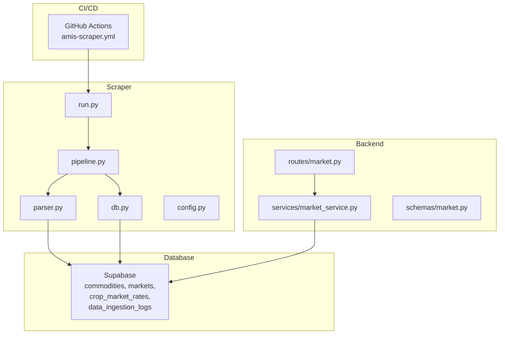
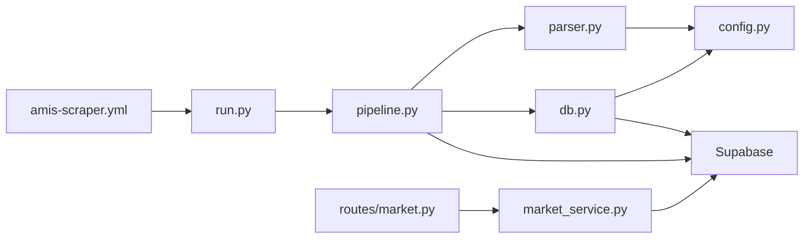

# Market Data Pipeline

<cite>
**Referenced Files in This Document**
- [pipeline.py](file://Scraper/pipeline.py)
- [parser.py](file://Scraper/parser.py)
- [db.py](file://Scraper/db.py)
- [config.py](file://Scraper/config.py)
- [run.py](file://Scraper/run.py)
- [amis-scraper.yml](file://.github/workflows/amis-scraper.yml)
- [market_service.py](file://Backend/services/market_service.py)
- [routes/market.py](file://Backend/routes/market.py)
- [schemas/market.py](file://Backend/schemas/market.py)
</cite>

## Table of Contents
1. [Introduction](#introduction)
2. [Project Structure](#project-structure)
3. [Core Components](#core-components)
4. [Architecture Overview](#architecture-overview)
5. [Detailed Component Analysis](#detailed-component-analysis)
6. [Dependency Analysis](#dependency-analysis)
7. [Performance Considerations](#performance-considerations)
8. [Troubleshooting Guide](#troubleshooting-guide)
9. [Conclusion](#conclusion)

## Introduction
This document describes the end-to-end AMIS market data pipeline that scrapes Pakistan’s Agriculture Marketing Information Service (AMIS), transforms raw HTML into structured records, and stores them in a Supabase database for downstream analytics and UI consumption. It covers:
- Web scraping and HTML parsing for commodity price pages
- Data normalization and idempotent upserts to the database
- Scheduled GitHub Actions workflow with retries and logging
- Backend API endpoints that serve market intelligence from the ingested data
- Monitoring, alerting, and scalability considerations

## Project Structure
The pipeline is split into three main areas:
- Scraper: fetches AMIS pages, parses HTML, normalizes data, and writes to Supabase
- Backend: exposes REST APIs to read commodities, markets, and price history
- CI/CD: GitHub Actions workflow that runs the scraper on a schedule



**Diagram sources**
- [amis-scraper.yml:1-46](file://.github/workflows/amis-scraper.yml#L1-L46)
- [run.py:1-78](file://Scraper/run.py#L1-L78)
- [pipeline.py:1-377](file://Scraper/pipeline.py#L1-L377)
- [parser.py:1-525](file://Scraper/parser.py#L1-L525)
- [db.py:1-497](file://Scraper/db.py#L1-L497)
- [routes/market.py:1-108](file://Backend/routes/market.py#L1-L108)
- [market_service.py:1-653](file://Backend/services/market_service.py#L1-L653)

**Section sources**
- [amis-scraper.yml:1-46](file://.github/workflows/amis-scraper.yml#L1-L46)
- [run.py:1-78](file://Scraper/run.py#L1-L78)
- [pipeline.py:1-377](file://Scraper/pipeline.py#L1-L377)
- [parser.py:1-525](file://Scraper/parser.py#L1-L525)
- [db.py:1-497](file://Scraper/db.py#L1-L497)
- [routes/market.py:1-108](file://Backend/routes/market.py#L1-L108)
- [market_service.py:1-653](file://Backend/services/market_service.py#L1-L653)

## Core Components
- Scraper entry point: CLI arguments, logging setup, and invocation of the pipeline
- Pipeline orchestrator: coordinates discovery, scraping, normalization, ID resolution, and upserts; logs ingestion status
- Parser: HTTP client with retries, HTML parsing for commodity lists and price tables, extraction of market names and IDs
- Database layer: schema discovery, idempotent upserts, ingestion logging, and safe fallbacks when constraints are missing
- Backend API: thin routes delegating to service logic that reads from Supabase and returns market intelligence
- Configuration: centralized settings for URLs, timeouts, retries, batch sizes, and table names

**Section sources**
- [run.py:1-78](file://Scraper/run.py#L1-L78)
- [pipeline.py:1-377](file://Scraper/pipeline.py#L1-L377)
- [parser.py:1-525](file://Scraper/parser.py#L1-L525)
- [db.py:1-497](file://Scraper/db.py#L1-L497)
- [config.py:1-70](file://Scraper/config.py#L1-L70)
- [routes/market.py:1-108](file://Backend/routes/market.py#L1-L108)
- [market_service.py:1-653](file://Backend/services/market_service.py#L1-L653)

## Architecture Overview
The system follows a clear separation of concerns:
- CI triggers daily execution of the scraper
- The scraper discovers commodities, scrapes each page, normalizes prices, resolves foreign keys, and upserts rates
- The backend serves market intelligence by reading from the same database

```mermaid
sequenceDiagram
participant GH as "GitHub Actions"
participant CLI as "run.py"
participant PIPE as "pipeline.py"
participant PAR as "parser.py"
participant DB as "db.py"
participant SUPA as "Supabase"
GH->>CLI : Run scraper job
CLI->>PIPE : run_pipeline(dry_run=False)
PIPE->>DB : get_client() + verify_connectivity()
PIPE->>PAR : discover_commodities(session)
PAR-->>PIPE : list of commodities
loop For each commodity
PIPE->>PAR : scrape_all(commodities)
PAR->>SUPA : GET ViewPrices.aspx per commodity
SUPA-->>PAR : HTML
PAR-->>PIPE : MarketPrice rows
end
PIPE->>PIPE : _normalise(prices)
PIPE->>DB : resolve_commodities/markets
PIPE->>DB : upsert_rates(batched)
DB->>SUPA : UPSERT crop_market_rates
PIPE->>DB : log_ingestion_end(status, counts)
DB->>SUPA : Update data_ingestion_logs
```

**Diagram sources**
- [amis-scraper.yml:1-46](file://.github/workflows/amis-scraper.yml#L1-L46)
- [run.py:1-78](file://Scraper/run.py#L1-L78)
- [pipeline.py:1-377](file://Scraper/pipeline.py#L1-L377)
- [parser.py:1-525](file://Scraper/parser.py#L1-L525)
- [db.py:1-497](file://Scraper/db.py#L1-L497)

## Detailed Component Analysis

### Scraper Entry Point (run.py)
- Configures logging and parses CLI flags for dry-run mode and filtering by commodity IDs
- Delegates execution to the pipeline orchestrator

Key behaviors:
- Dry-run mode skips database writes
- Commodity filter supports targeted re-runs for debugging or partial updates

**Section sources**
- [run.py:1-78](file://Scraper/run.py#L1-L78)

### Pipeline Orchestrator (pipeline.py)
Responsibilities:
- Establishes Supabase client and verifies connectivity
- Discovers table schemas dynamically to remain resilient to column changes
- Starts an ingestion log record
- Coordinates discovery and scraping of all commodities
- Normalizes extracted prices and builds rate rows with resolved foreign keys
- Upserts rates in batches and finalizes the ingestion log with success/partial/failed status

Error handling strategy:
- A failure in one commodity does not block others
- Fatal failures (e.g., Supabase connection) abort the run
- Ingestion logs capture status, counts, and error messages

Normalization rules:
- Strip whitespace from names
- Ensure non-negative numeric fields; set invalid values to None

Rate row building:
- Maps commodity and market names to database IDs
- Includes date, min/max/FQP prices, quantity, unit, and source

**Section sources**
- [pipeline.py:1-377](file://Scraper/pipeline.py#L1-L377)

### HTML Parser (parser.py)
Capabilities:
- Creates a requests session with a browser-like User-Agent
- Implements retry with exponential backoff for network resilience
- Discovers commodities from the browse page by extracting links containing commodity IDs
- Parses individual commodity pages to extract:
  - Commodity name via multiple strategies
  - Date and unit from header text
  - Price table rows including market name, min/max/FQP prices, and optional quantity
  - AMIS market/city IDs from links

Robustness:
- Handles encoding issues by falling back to apparent encoding
- Skips header rows and incomplete data rows
- Gracefully handles missing or malformed cells

Scraping orchestration:
- Iterates over discovered commodities, optionally filtered by IDs
- Enforces polite delay between requests

**Section sources**
- [parser.py:1-525](file://Scraper/parser.py#L1-L525)

### Database Layer (db.py)
Functions:
- Client creation using environment variables
- Schema discovery at runtime to avoid hard-coded column assumptions
- Connectivity verification before proceeding
- Idempotent upserts for commodities and markets by AMIS ID or name
- Bulk upsert for crop_market_rates with unique constraint enforcement and fallback to row-by-row if needed
- Ingestion logging start/end with timestamps and metrics

Design principles:
- Never delete existing data
- Safe against missing columns by filtering payloads
- Fallback path ensures progress even without unique constraints

**Section sources**
- [db.py:1-497](file://Scraper/db.py#L1-L497)

### Configuration (config.py)
Centralized settings include:
- Supabase URL and service key
- AMIS base URLs and search type
- HTTP behavior: timeout, delay, retries, backoff multiplier
- User-Agent string to mimic a browser
- Batch size for upserts
- Table names matching the Supabase schema
- Ingestion source identifier

**Section sources**
- [config.py:1-70](file://Scraper/config.py#L1-L70)

### Backend API (routes/market.py, services/market_service.py, schemas/market.py)
API endpoints:
- List commodities with latest date and representative price
- Get market overview for a single commodity including trend, comparison, distribution, and insights

Service logic:
- Reads only from Supabase tables populated by the scraper
- Caches commodities and markets for performance
- Computes representative prices, trends, change percentages, signals, and farmer insights based strictly on real data
- Paginates large datasets safely

Schemas:
- Define response models for commodities list and market overview
- Include fields for coverage, summary cards, charts, and insights

**Section sources**
- [routes/market.py:1-108](file://Backend/routes/market.py#L1-L108)
- [market_service.py:1-653](file://Backend/services/market_service.py#L1-L653)
- [schemas/market.py:1-132](file://Backend/schemas/market.py#L1-L132)

## Dependency Analysis
High-level dependencies:
- GitHub Actions triggers the Python scraper
- The scraper depends on config, parser, and db modules
- The parser depends on requests and BeautifulSoup
- The db module depends on Supabase client
- The backend depends on the same Supabase tables and provides APIs



**Diagram sources**
- [amis-scraper.yml:1-46](file://.github/workflows/amis-scraper.yml#L1-L46)
- [run.py:1-78](file://Scraper/run.py#L1-L78)
- [pipeline.py:1-377](file://Scraper/pipeline.py#L1-L377)
- [parser.py:1-525](file://Scraper/parser.py#L1-L525)
- [db.py:1-497](file://Scraper/db.py#L1-L497)
- [config.py:1-70](file://Scraper/config.py#L1-L70)
- [routes/market.py:1-108](file://Backend/routes/market.py#L1-L108)
- [market_service.py:1-653](file://Backend/services/market_service.py#L1-L653)

**Section sources**
- [pipeline.py:1-377](file://Scraper/pipeline.py#L1-L377)
- [parser.py:1-525](file://Scraper/parser.py#L1-L525)
- [db.py:1-497](file://Scraper/db.py#L1-L497)
- [config.py:1-70](file://Scraper/config.py#L1-L70)
- [routes/market.py:1-108](file://Backend/routes/market.py#L1-L108)
- [market_service.py:1-653](file://Backend/services/market_service.py#L1-L653)

## Performance Considerations
- Network resilience: Retry with exponential backoff reduces transient failures
- Polite scraping: Delay between requests avoids overwhelming AMIS
- Batch upserts: Batching reduces round-trips to Supabase
- Schema discovery: Avoids crashes due to schema drift
- Backend caching: Short TTL caches reduce repeated queries for commodities and markets
- Pagination: Large datasets are fetched in pages to prevent memory pressure

[No sources needed since this section provides general guidance]

## Troubleshooting Guide
Common issues and diagnostics:
- Supabase connectivity failure: Pipeline aborts early; check environment variables and secrets
- No commodities discovered: Indicates browse page fetch or parsing failure; inspect logs for errors
- No price data found: May indicate AMIS has no new data today; pipeline logs partial/success status accordingly
- Missing unique constraint: Falls back to row-by-row upsert; add the constraint for optimal performance
- Backend 503 responses: Occur when Supabase is unavailable or no data has been ingested yet

Monitoring and alerting:
- Use data_ingestion_logs to track run status, timestamps, and error messages
- Monitor backend endpoints for availability and data freshness
- Set alerts on failed ingestion logs or missing data windows

Data quality validation:
- Prices are normalized to non-negative values; negative values are dropped
- Representative prices prefer FQP when available; otherwise use midpoint of min/max
- Insights and signals are derived strictly from real data

Update frequency management:
- Daily schedule runs at a fixed time; adjust cron expression if needed
- Manual trigger supported via workflow_dispatch for ad-hoc runs

Scalability considerations:
- Handle large datasets via pagination and capped scans in the backend
- Increase batch size cautiously to balance throughput and memory usage
- Consider concurrency limits on AMIS side; current design uses sequential requests with delays

**Section sources**
- [pipeline.py:1-377](file://Scraper/pipeline.py#L1-L377)
- [parser.py:1-525](file://Scraper/parser.py#L1-L525)
- [db.py:1-497](file://Scraper/db.py#L1-L497)
- [market_service.py:1-653](file://Backend/services/market_service.py#L1-L653)

## Conclusion
The AMIS market data pipeline provides a robust, scheduled, and monitored solution for ingesting wholesale crop prices from AMIS Pakistan into a structured database. It emphasizes resilience through retries, schema discovery, and idempotent upserts, while the backend delivers actionable market intelligence to users. With careful monitoring and scalable design choices, the system can handle growing datasets and maintain reliable data freshness for decision-making.