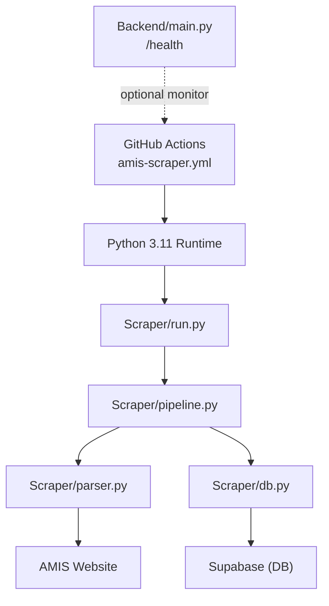
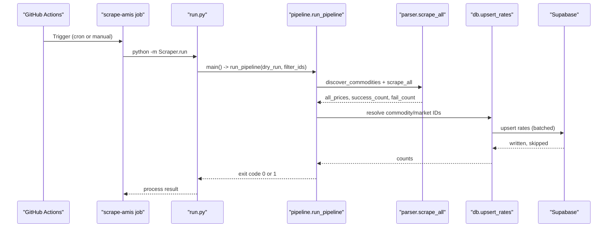
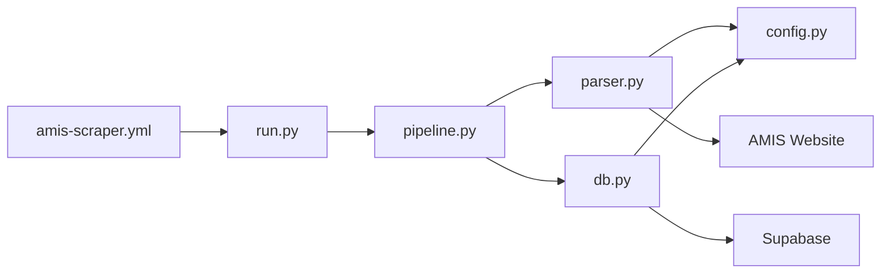

# Scheduled Workflow Automation

<cite>
**Referenced Files in This Document**
- [amis-scraper.yml](file://.github/workflows/amis-scraper.yml)
- [run.py](file://Scraper/run.py)
- [pipeline.py](file://Scraper/pipeline.py)
- [parser.py](file://Scraper/parser.py)
- [db.py](file://Scraper/db.py)
- [config.py](file://Scraper/config.py)
- [requirements.txt](file://Scraper/requirements.txt)
- [main.py](file://Backend/main.py)
- [market.py](file://Backend/routes/market.py)
</cite>

## Table of Contents
1. [Introduction](#introduction)
2. [Project Structure](#project-structure)
3. [Core Components](#core-components)
4. [Architecture Overview](#architecture-overview)
5. [Detailed Component Analysis](#detailed-component-analysis)
6. [Dependency Analysis](#dependency-analysis)
7. [Performance Considerations](#performance-considerations)
8. [Troubleshooting Guide](#troubleshooting-guide)
9. [Conclusion](#conclusion)
10. [Appendices](#appendices)

## Introduction
This document explains the GitHub Actions workflow that automates daily scraping of AMIS market data and ingestion into the Green Flora Supabase database. It covers scheduling, environment variables, artifact handling strategies, job execution flow, error handling, retries, health checks, deployment considerations for GitHub Actions, debugging techniques, and customization options for monitoring and alerting.

## Project Structure
The automation is implemented as a GitHub Actions workflow that runs a Python-based scraper pipeline:
- Workflow definition: [.github/workflows/amis-scraper.yml](file://.github/workflows/amis-scraper.yml)
- Scraper entry point: [Scraper/run.py](file://Scraper/run.py)
- Orchestration: [Scraper/pipeline.py](file://Scraper/pipeline.py)
- Web scraping and parsing: [Scraper/parser.py](file://Scraper/parser.py)
- Database integration (Supabase): [Scraper/db.py](file://Scraper/db.py)
- Configuration and constants: [Scraper/config.py](file://Scraper/config.py)
- Dependencies: [Scraper/requirements.txt](file://Scraper/requirements.txt)
- Backend health endpoint: [Backend/main.py](file://Backend/main.py)
- Market API routes (for downstream consumers): [Backend/routes/market.py](file://Backend/routes/market.py)

**Diagram sources**
- [amis-scraper.yml:15-45](file://.github/workflows/amis-scraper.yml#L15-L45)
- [run.py:57-77](file://Scraper/run.py#L57-L77)
- [pipeline.py:36-257](file://Scraper/pipeline.py#L36-L257)
- [parser.py:72-112](file://Scraper/parser.py#L72-L112)
- [db.py:43-90](file://Scraper/db.py#L43-L90)
- [main.py:50-52](file://Backend/main.py#L50-L52)

**Section sources**
- [amis-scraper.yml:1-46](file://.github/workflows/amis-scraper.yml#L1-L46)
- [run.py:1-78](file://Scraper/run.py#L1-L78)
- [pipeline.py:1-377](file://Scraper/pipeline.py#L1-L377)
- [parser.py:1-525](file://Scraper/parser.py#L1-L525)
- [db.py:1-497](file://Scraper/db.py#L1-L497)
- [config.py:1-70](file://Scraper/config.py#L1-L70)
- [requirements.txt:1-5](file://Scraper/requirements.txt#L1-L5)
- [main.py:1-57](file://Backend/main.py#L1-L57)
- [market.py:1-108](file://Backend/routes/market.py#L1-L108)

## Core Components
- Workflow trigger and schedule: The workflow runs on a cron schedule and supports manual dispatch.
- Environment variables: Supabase credentials are injected via GitHub Secrets into the job environment.
- Execution steps: Checkout code, set up Python, install dependencies, run the scraper module.
- Pipeline orchestration: Discovers commodities, scrapes prices, normalizes data, resolves IDs, upserts rates, and logs ingestion results.
- Retry and resilience: HTTP requests to AMIS include retries with exponential backoff; DB operations handle missing constraints gracefully.
- Health check: A simple /health endpoint exists in the backend for external monitoring.

**Section sources**
- [amis-scraper.yml:15-45](file://.github/workflows/amis-scraper.yml#L15-L45)
- [pipeline.py:36-257](file://Scraper/pipeline.py#L36-L257)
- [parser.py:79-112](file://Scraper/parser.py#L79-L112)
- [db.py:320-416](file://Scraper/db.py#L320-L416)
- [main.py:50-52](file://Backend/main.py#L50-L52)

## Architecture Overview
The workflow executes a single job that orchestrates the full ingestion pipeline. The pipeline coordinates web scraping, normalization, and database writes while logging each run’s status and metrics.

**Diagram sources**
- [amis-scraper.yml:22-45](file://.github/workflows/amis-scraper.yml#L22-L45)
- [run.py:57-77](file://Scraper/run.py#L57-L77)
- [pipeline.py:36-257](file://Scraper/pipeline.py#L36-L257)
- [parser.py:120-157](file://Scraper/parser.py#L120-L157)
- [parser.py:476-525](file://Scraper/parser.py#L476-L525)
- [db.py:320-416](file://Scraper/db.py#L320-L416)

## Detailed Component Analysis

### Workflow Configuration and Scheduling
- Schedule: Runs daily at a fixed UTC time using a cron expression.
- Manual trigger: Supports workflow_dispatch for ad-hoc runs.
- Job settings: Uses ubuntu-latest runner with a timeout to prevent runaway jobs.
- Environment variables: Injects SUPABASE_URL and SUPABASE_SERVICE_KEY from GitHub Secrets.
- Steps:
  - Checkout repository
  - Set up Python 3.11
  - Install dependencies from requirements.txt
  - Execute the scraper module

Customization tips:
- Adjust the cron expression to change frequency or timing.
- Add additional secrets for other services if needed.
- Extend steps to upload artifacts (logs, reports) by capturing stdout/stderr and using actions/upload-artifact.

**Section sources**
- [amis-scraper.yml:15-45](file://.github/workflows/amis-scraper.yml#L15-L45)
- [requirements.txt:1-5](file://Scraper/requirements.txt#L1-L5)

### Pipeline Orchestration
- Entry point: run.py parses CLI arguments and invokes the pipeline.
- Pipeline stages:
  - Initialize Supabase client and verify connectivity
  - Start ingestion log
  - Discover commodities from AMIS
  - Scrape all commodity pages
  - Normalize price data
  - Resolve commodity and market IDs
  - Build rate rows and upsert into Supabase
  - Finalize ingestion log with status and metrics

Error handling highlights:
- Fatal errors (e.g., missing Supabase credentials or connectivity failure) abort the run.
- Partial failures per commodity do not block others; final status reflects partial vs success.
- Ingestion logs record start/end, status, counts, and error messages.

Dry-run mode:
- Skips database writes and prints a summary for validation.

**Section sources**
- [run.py:20-77](file://Scraper/run.py#L20-L77)
- [pipeline.py:36-257](file://Scraper/pipeline.py#L36-L257)

### Scraping and Parsing
- Session setup: Browser-like User-Agent to avoid rejection.
- Retry mechanism: GET requests retry with exponential backoff and respect request timeouts.
- Commodity discovery: Parses browse page to extract commodity links and IDs.
- Price parsing: Extracts date, unit, and market price rows robustly across multiple HTML strategies.
- Concurrency: Sequential scraping per commodity with polite delays to be respectful to the source site.

Resilience:
- Handles encoding issues and missing fields gracefully.
- Logs warnings when no data is found for a commodity.

**Section sources**
- [parser.py:72-112](file://Scraper/parser.py#L72-L112)
- [parser.py:120-157](file://Scraper/parser.py#L120-L157)
- [parser.py:165-225](file://Scraper/parser.py#L165-L225)
- [parser.py:334-403](file://Scraper/parser.py#L334-L403)
- [parser.py:476-525](file://Scraper/parser.py#L476-L525)

### Database Integration and Upserts
- Client creation: Requires Supabase URL and service key; raises an error if missing.
- Connectivity check: Quick probe to ensure Supabase is reachable before proceeding.
- Schema discovery: Dynamically detects table columns to remain resilient to schema changes.
- Idempotent upserts: Uses batch upsert with conflict resolution; falls back to row-by-row if unique constraint is missing.
- Ingestion logging: Records run start/end, status, counts, and error messages.

Best practices:
- Ensure unique constraints exist on target tables for optimal performance.
- Keep BATCH_SIZE tuned to balance throughput and payload size.

**Section sources**
- [db.py:43-90](file://Scraper/db.py#L43-L90)
- [db.py:320-416](file://Scraper/db.py#L320-L416)
- [db.py:424-497](file://Scraper/db.py#L424-L497)

### Configuration and Environment Variables
- Secrets management: SUPABASE_URL and SUPABASE_SERVICE_KEY must be configured as GitHub Secrets and exposed to the job via env mapping.
- Local development: .env file in Scraper directory can be used to load environment variables locally.
- Constants: Request timeouts, delays, retries, user agent, and table names are centralized.

Security note:
- Never hardcode secrets; always use environment variables or secret managers.

**Section sources**
- [amis-scraper.yml:28-30](file://.github/workflows/amis-scraper.yml#L28-L30)
- [config.py:15-24](file://Scraper/config.py#L15-L24)
- [config.py:38-48](file://Scraper/config.py#L38-L48)
- [config.py:54-69](file://Scraper/config.py#L54-L69)

### Health Check Endpoints
- Backend exposes a minimal /health endpoint returning a status object.
- Use this endpoint for external monitoring systems to verify service availability.

Integration ideas:
- Periodic health checks from CI or external monitors can trigger alerts if the backend becomes unhealthy.

**Section sources**
- [main.py:50-52](file://Backend/main.py#L50-L52)

## Dependency Analysis
The workflow depends on:
- GitHub Actions runtime and Ubuntu runner
- Python 3.11 interpreter
- Python packages listed in requirements.txt
- External services: AMIS website and Supabase

Internal dependencies:
- run.py imports pipeline
- pipeline imports parser and db
- parser uses config
- db uses config

**Diagram sources**
- [amis-scraper.yml:22-45](file://.github/workflows/amis-scraper.yml#L22-L45)
- [run.py:17-77](file://Scraper/run.py#L17-L77)
- [pipeline.py:17-26](file://Scraper/pipeline.py#L17-L26)
- [parser.py:18-28](file://Scraper/parser.py#L18-L28)
- [db.py:28-35](file://Scraper/db.py#L28-L35)

**Section sources**
- [requirements.txt:1-5](file://Scraper/requirements.txt#L1-L5)
- [pipeline.py:17-26](file://Scraper/pipeline.py#L17-L26)
- [parser.py:18-28](file://Scraper/parser.py#L18-L28)
- [db.py:28-35](file://Scraper/db.py#L28-L35)

## Performance Considerations
- Timeouts and retries:
  - REQUEST_TIMEOUT controls per-request timeout.
  - MAX_RETRIES and RETRY_BACKOFF govern HTTP retry behavior.
- Politeness:
  - REQUEST_DELAY adds a pause between requests to avoid overloading AMIS.
- Batch upserts:
  - BATCH_SIZE determines how many rows are sent per upsert call.
- Runner resources:
  - The job runs on ubuntu-latest with a 30-minute timeout; adjust if necessary.
- Dry-run mode:
  - Use --dry-run to validate parsing without writing to the database.

Recommendations:
- Tune REQUEST_DELAY and MAX_RETRIES based on AMIS responsiveness.
- Monitor Supabase upsert performance and adjust BATCH_SIZE accordingly.
- Consider splitting large runs into smaller commodity subsets using --commodity-ids for parallelism across multiple workflows.

[No sources needed since this section provides general guidance]

## Troubleshooting Guide
Common issues and resolutions:
- Missing Supabase credentials:
  - Ensure SUPABASE_URL and SUPABASE_SERVICE_KEY are set in GitHub Secrets and mapped to the job environment.
- Supabase connectivity failure:
  - Verify network access and credentials; the pipeline will abort early if connectivity cannot be established.
- No data scraped:
  - Check AMIS availability and selectors; parser logs indicate whether browse page or price pages failed.
- Upsert failures:
  - If unique constraints are missing, the pipeline falls back to row-by-row updates; add constraints for better performance.
- Workflow timeouts:
  - Increase timeout-minutes or reduce workload via --commodity-ids filtering.

Debugging techniques:
- Enable verbose logging with --verbose to capture DEBUG-level output.
- Inspect GitHub Actions logs for step outputs and exceptions.
- Use dry-run mode to validate parsing logic without database writes.
- Query data_ingestion_logs to review run status, counts, and error messages.

External monitoring:
- Poll /health to confirm backend availability.
- Integrate with alerting systems by checking workflow status and ingestion logs.

**Section sources**
- [db.py:43-90](file://Scraper/db.py#L43-L90)
- [pipeline.py:71-80](file://Scraper/pipeline.py#L71-L80)
- [pipeline.py:108-151](file://Scraper/pipeline.py#L108-L151)
- [db.py:320-416](file://Scraper/db.py#L320-L416)
- [main.py:50-52](file://Backend/main.py#L50-L52)

## Conclusion
The scheduled workflow provides a reliable, automated pipeline for ingesting AMIS market data into Supabase. It includes robust error handling, retries, and comprehensive logging. With clear configuration points and optional dry-run capabilities, it supports both production reliability and developer debugging. Health checks and ingestion logs enable effective monitoring and alerting integration.

[No sources needed since this section summarizes without analyzing specific files]

## Appendices

### Customization Examples
- Change schedule:
  - Modify the cron expression in the workflow to adjust frequency or timing.
- Filter commodities:
  - Pass --commodity-ids to run only specific commodities during testing or targeted updates.
- Dry-run validation:
  - Use --dry-run to preview parsed data without writing to the database.
- Artifact handling:
  - Capture logs and outputs to upload as artifacts for later inspection.
- Parallel processing:
  - Split workloads across multiple workflow runs using different commodity filters to increase throughput.

Monitoring and Alerting
- Health checks:
  - Use /health to verify backend status.
- Ingestion logs:
  - Query data_ingestion_logs for run outcomes and error messages.
- External alerting:
  - Configure CI notifications or webhook integrations to alert on workflow failures or ingestion anomalies.

**Section sources**
- [amis-scraper.yml:15-45](file://.github/workflows/amis-scraper.yml#L15-L45)
- [run.py:34-54](file://Scraper/run.py#L34-L54)
- [pipeline.py:159-163](file://Scraper/pipeline.py#L159-L163)
- [db.py:424-497](file://Scraper/db.py#L424-L497)
- [main.py:50-52](file://Backend/main.py#L50-L52)