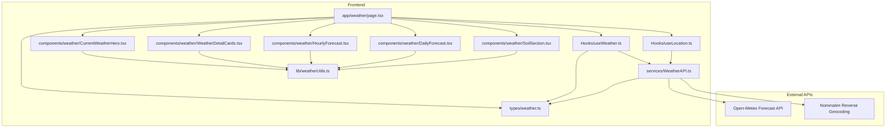
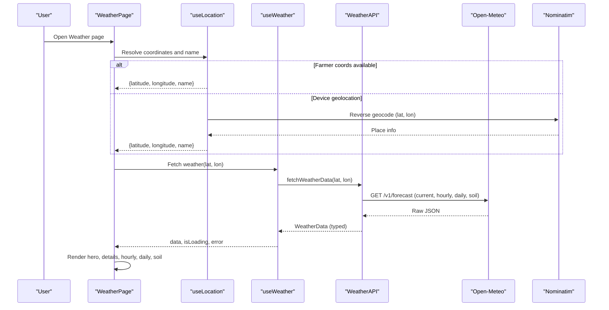
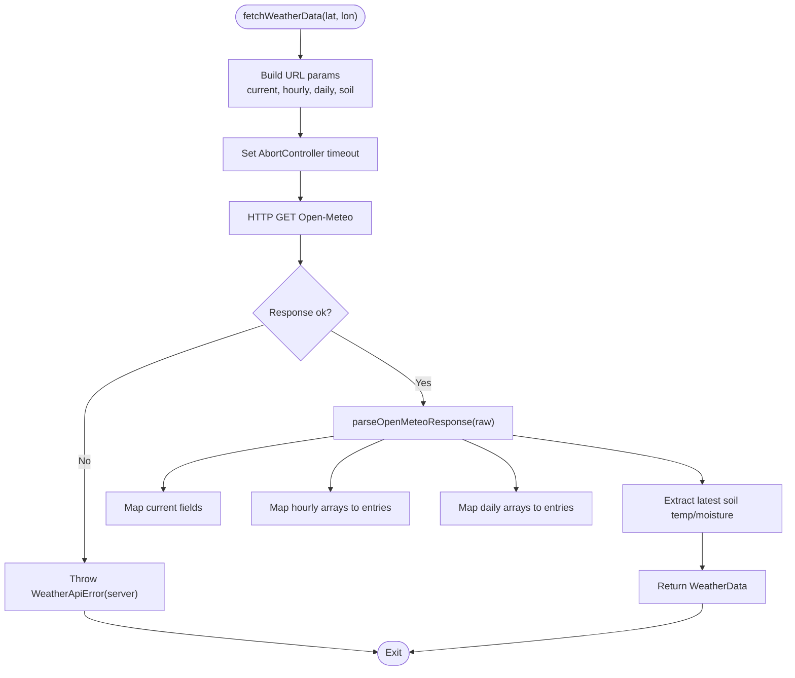
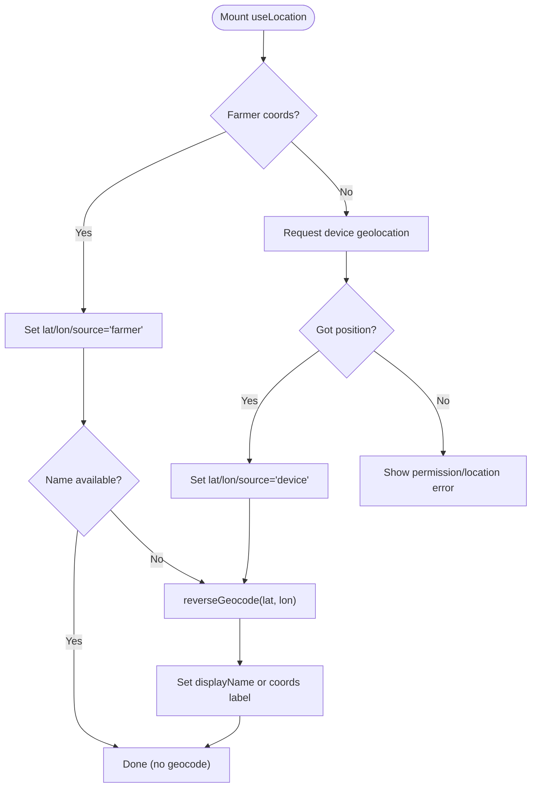
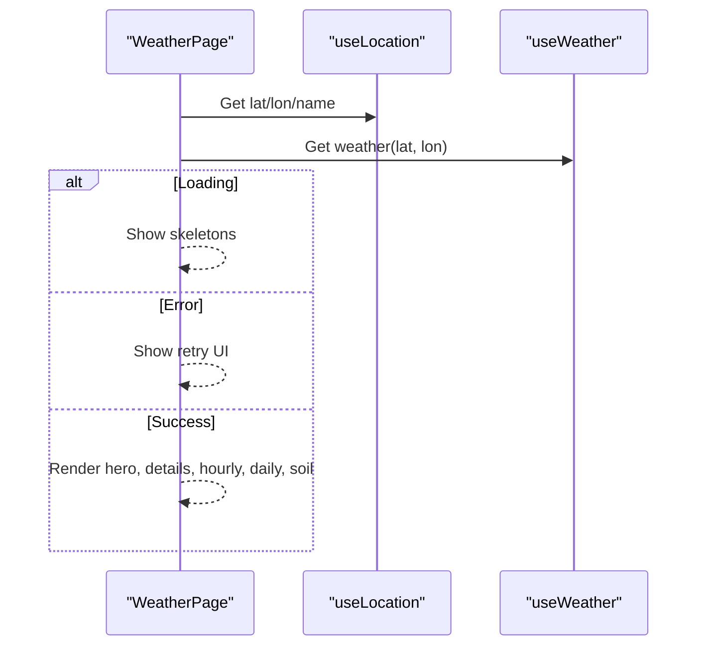
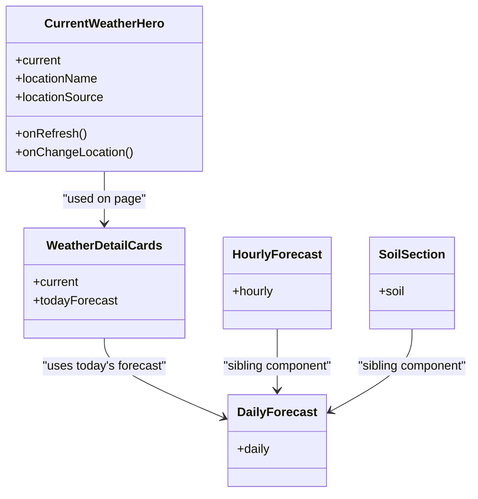
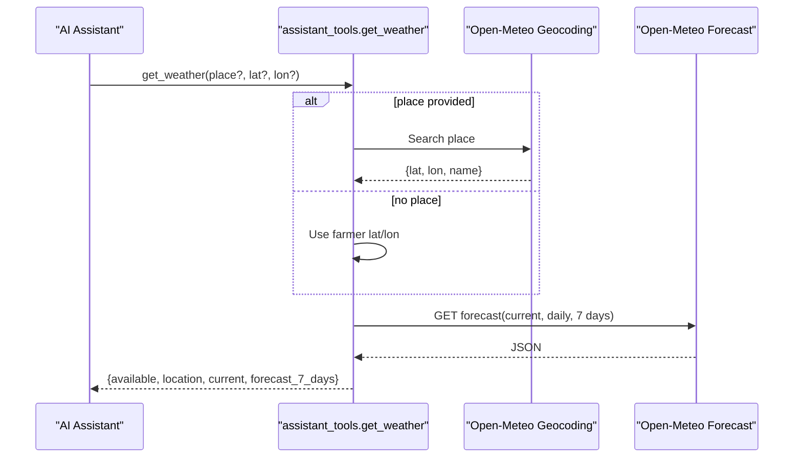
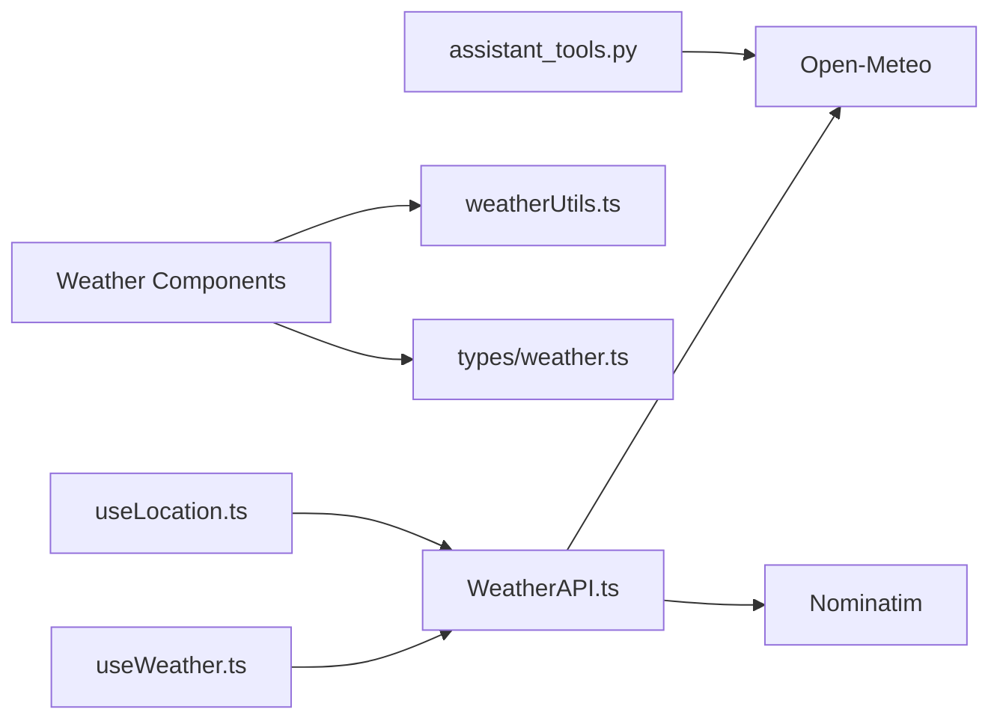

# Weather Service Integration

<cite>
**Referenced Files in This Document**
- [WeatherAPI.ts](file://Frontend/greenflora/services/WeatherAPI.ts)
- [weather.ts](file://Frontend/greenflora/types/weather.ts)
- [weatherUtils.ts](file://Frontend/greenflora/lib/weatherUtils.ts)
- [useWeather.ts](file://Frontend/greenflora/Hooks/useWeather.ts)
- [useLocation.ts](file://Frontend/greenflora/Hooks/useLocation.ts)
- [page.tsx](file://Frontend/greenflora/app/weather/page.tsx)
- [CurrentWeatherHero.tsx](file://Frontend/greenflora/components/weather/CurrentWeatherHero.tsx)
- [DailyForecast.tsx](file://Frontend/greenflora/components/weather/DailyForecast.tsx)
- [HourlyForecast.tsx](file://Frontend/greenflora/components/weather/HourlyForecast.tsx)
- [SoilSection.tsx](file://Frontend/greenflora/components/weather/SoilSection.tsx)
- [WeatherDetailCards.tsx](file://Frontend/greenflora/components/weather/WeatherDetailCards.tsx)
- [assistant_tools.py](file://Backend/services/assistant_tools.py)
</cite>

## Table of Contents
1. [Introduction](#introduction)
2. [Project Structure](#project-structure)
3. [Core Components](#core-components)
4. [Architecture Overview](#architecture-overview)
5. [Detailed Component Analysis](#detailed-component-analysis)
6. [Dependency Analysis](#dependency-analysis)
7. [Performance Considerations](#performance-considerations)
8. [Troubleshooting Guide](#troubleshooting-guide)
9. [Conclusion](#conclusion)
10. [Appendices](#appendices)

## Introduction
This document explains the weather service integration that powers Green Flora’s weather features using the Open-Meteo API. It covers:
- Retrieving current weather (temperature, humidity, wind speed, precipitation) and 7-day forecasts
- Location-based queries using farmer coordinates with timezone handling
- Data transformation from raw Open-Meteo responses to farmer-friendly formats
- Error handling for network failures, invalid locations, and timeouts
- Caching strategies to optimize performance and reduce API calls
- Examples of agricultural alerts and irrigation recommendations derived from weather data

The implementation spans a frontend-first approach with a dedicated weather page, reusable hooks, typed models, and utilities. A backend assistant tool also consumes Open-Meteo to provide weather insights within the AI Assistant.

## Project Structure
The weather feature is primarily implemented on the frontend:
- Services layer: HTTP client to Open-Meteo and reverse geocoding via Nominatim
- Types: Strongly-typed interfaces for current, hourly, daily, soil, and raw response shapes
- Hooks: React hooks to fetch and manage weather and location state
- UI components: Hero, detail cards, hourly strip, daily forecast, and soil section
- Page: Orchestrates location resolution and renders weather content
- Backend assistant tool: Optional server-side access to Open-Meteo for AI-driven answers

**Diagram sources**
- [page.tsx:41-66](file://Frontend/greenflora/app/weather/page.tsx#L41-L66)
- [useWeather.ts:21-57](file://Frontend/greenflora/Hooks/useWeather.ts#L21-L57)
- [useLocation.ts:49-175](file://Frontend/greenflora/Hooks/useLocation.ts#L49-L175)
- [WeatherAPI.ts:141-222](file://Frontend/greenflora/services/WeatherAPI.ts#L141-L222)
- [weather.ts:9-60](file://Frontend/greenflora/types/weather.ts#L9-L60)
- [weatherUtils.ts:14-194](file://Frontend/greenflora/lib/weatherUtils.ts#L14-L194)

**Section sources**
- [page.tsx:1-217](file://Frontend/greenflora/app/weather/page.tsx#L1-L217)
- [WeatherAPI.ts:1-291](file://Frontend/greenflora/services/WeatherAPI.ts#L1-L291)
- [weather.ts:1-124](file://Frontend/greenflora/types/weather.ts#L1-L124)
- [weatherUtils.ts:1-285](file://Frontend/greenflora/lib/weatherUtils.ts#L1-L285)
- [useWeather.ts:1-58](file://Frontend/greenflora/Hooks/useWeather.ts#L1-L58)
- [useLocation.ts:1-176](file://Frontend/greenflora/Hooks/useLocation.ts#L1-L176)

## Core Components
- WeatherAPI: Single request fetching current, hourly, daily, and soil data; reverse geocoding via Nominatim; robust error typing and timeouts
- Types: Clean interfaces for current conditions, hourly/daily entries, soil data, and raw Open-Meteo response
- useWeather: React hook encapsulating loading, error, and refresh behavior for weather data by coordinates
- useLocation: Resolves coordinates from farmer profile or device geolocation and reverse-geocodes to a readable name
- UI Components: Present current conditions, details, hourly strip, 7-day forecast, and estimated soil metrics
- Utilities: Map WMO codes to labels/categories, format times/days, UV index labeling, and soil moisture conversions

Key responsibilities:
- Data acquisition: One Open-Meteo call per location for efficiency
- Data shaping: Transform raw arrays into typed objects
- Presentation: Farmer-friendly labels, icons, and visual indicators
- Location: Prioritize farmer profile, fallback to device, always show a resolved name

**Section sources**
- [WeatherAPI.ts:141-291](file://Frontend/greenflora/services/WeatherAPI.ts#L141-L291)
- [weather.ts:9-60](file://Frontend/greenflora/types/weather.ts#L9-L60)
- [useWeather.ts:21-57](file://Frontend/greenflora/Hooks/useWeather.ts#L21-L57)
- [useLocation.ts:49-175](file://Frontend/greenflora/Hooks/useLocation.ts#L49-L175)
- [weatherUtils.ts:14-285](file://Frontend/greenflora/lib/weatherUtils.ts#L14-L285)

## Architecture Overview
The system follows a layered architecture:
- UI layer: Next.js page composes multiple weather components
- Hook layer: Encapsulates data fetching and state management
- Service layer: Communicates with Open-Meteo and Nominatim
- Utility layer: Maps codes, formats values, and derives labels
- External services: Open-Meteo provides weather; Nominatim provides place names

**Diagram sources**
- [page.tsx:41-66](file://Frontend/greenflora/app/weather/page.tsx#L41-L66)
- [useLocation.ts:49-175](file://Frontend/greenflora/Hooks/useLocation.ts#L49-L175)
- [useWeather.ts:21-57](file://Frontend/greenflora/Hooks/useWeather.ts#L21-L57)
- [WeatherAPI.ts:141-222](file://Frontend/greenflora/services/WeatherAPI.ts#L141-L222)

## Detailed Component Analysis

### WeatherAPI: Data Acquisition and Transformation
- Single combined request to Open-Meteo includes current, hourly (next 24 hours), daily (7 days), and soil temperature/moisture
- Reverse geocoding via Nominatim returns locality, district, province, country, and a formatted display name
- Timeouts and abort signals prevent hanging requests
- Errors are categorized into network, timeout, and server issues
- Response parsing maps arrays to structured objects and extracts latest soil values

**Diagram sources**
- [WeatherAPI.ts:141-222](file://Frontend/greenflora/services/WeatherAPI.ts#L141-L222)
- [WeatherAPI.ts:224-291](file://Frontend/greenflora/services/WeatherAPI.ts#L224-L291)

**Section sources**
- [WeatherAPI.ts:141-291](file://Frontend/greenflora/services/WeatherAPI.ts#L141-L291)
- [weather.ts:82-124](file://Frontend/greenflora/types/weather.ts#L82-L124)

### useLocation: Location Resolution and Reverse Geocoding
- Priority: farmer profile coordinates → device geolocation
- Reverse geocodes coordinates to a human-readable name; falls back to coordinate string if needed
- Tracks loading states separately for general loading and name resolution
- Handles permission errors and unsupported browsers gracefully

**Diagram sources**
- [useLocation.ts:49-175](file://Frontend/greenflora/Hooks/useLocation.ts#L49-L175)
- [WeatherAPI.ts:35-69](file://Frontend/greenflora/services/WeatherAPI.ts#L35-L69)

**Section sources**
- [useLocation.ts:49-175](file://Frontend/greenflora/Hooks/useLocation.ts#L49-L175)
- [WeatherAPI.ts:35-69](file://Frontend/greenflora/services/WeatherAPI.ts#L35-L69)

### Weather Page: Orchestration and Rendering
- Coordinates and location name are resolved before rendering weather
- Displays loading skeletons while resolving location or fetching weather
- Shows actionable empty/error states when location is missing or API fails
- Renders hero, detail cards, hourly strip, 7-day forecast, and soil section

**Diagram sources**
- [page.tsx:41-66](file://Frontend/greenflora/app/weather/page.tsx#L41-L66)
- [page.tsx:68-187](file://Frontend/greenflora/app/weather/page.tsx#L68-L187)

**Section sources**
- [page.tsx:41-187](file://Frontend/greenflora/app/weather/page.tsx#L41-L187)

### UI Components: Presentation Layer
- CurrentWeatherHero: Shows animated icon, temperature, feels-like, location name, and actions
- WeatherDetailCards: Humidity, rain chance, wind speed/direction, cloud cover, UV index, sunrise/sunset
- HourlyForecast: Horizontal strip of next 24 hours with time, icon, temperature, and rain probability
- DailyForecast: Vertical list of 7 days with min-max temperature bars and rain probability
- SoilSection: Estimated soil temperature and moisture with contextual labels and visual indicators

**Diagram sources**
- [CurrentWeatherHero.tsx:16-31](file://Frontend/greenflora/components/weather/CurrentWeatherHero.tsx#L16-L31)
- [WeatherDetailCards.tsx:26-34](file://Frontend/greenflora/components/weather/WeatherDetailCards.tsx#L26-L34)
- [HourlyForecast.tsx:14-16](file://Frontend/greenflora/components/weather/HourlyForecast.tsx#L14-L16)
- [DailyForecast.tsx:15-17](file://Frontend/greenflora/components/weather/DailyForecast.tsx#L15-L17)
- [SoilSection.tsx:19-21](file://Frontend/greenflora/components/weather/SoilSection.tsx#L19-L21)

**Section sources**
- [CurrentWeatherHero.tsx:1-115](file://Frontend/greenflora/components/weather/CurrentWeatherHero.tsx#L1-L115)
- [WeatherDetailCards.tsx:1-185](file://Frontend/greenflora/components/weather/WeatherDetailCards.tsx#L1-L185)
- [HourlyForecast.tsx:1-80](file://Frontend/greenflora/components/weather/HourlyForecast.tsx#L1-L80)
- [DailyForecast.tsx:1-105](file://Frontend/greenflora/components/weather/DailyForecast.tsx#L1-L105)
- [SoilSection.tsx:1-156](file://Frontend/greenflora/components/weather/SoilSection.tsx#L1-L156)

### Backend Assistant Tool: Server-Side Weather Access
- Provides a tool for the AI Assistant to fetch current conditions and a 7-day forecast
- Supports optional place name geocoding; otherwise uses farmer’s saved farm coordinates
- Returns structured data including current metrics and daily summaries
- Gracefully handles unavailable places and service errors

**Diagram sources**
- [assistant_tools.py:194-319](file://Backend/services/assistant_tools.py#L194-L319)

**Section sources**
- [assistant_tools.py:194-319](file://Backend/services/assistant_tools.py#L194-L319)

## Dependency Analysis
- Frontend dependencies:
  - WeatherAPI depends on Open-Meteo and Nominatim
  - useWeather depends on WeatherAPI and types
  - useLocation depends on WeatherAPI for reverse geocoding
  - UI components depend on types and utilities for formatting and mapping
- Backend dependency:
  - assistant_tools depends on httpx and Open-Meteo endpoints

**Diagram sources**
- [WeatherAPI.ts:141-222](file://Frontend/greenflora/services/WeatherAPI.ts#L141-L222)
- [useWeather.ts:21-57](file://Frontend/greenflora/Hooks/useWeather.ts#L21-L57)
- [useLocation.ts:49-175](file://Frontend/greenflora/Hooks/useLocation.ts#L49-L175)
- [weatherUtils.ts:14-285](file://Frontend/greenflora/lib/weatherUtils.ts#L14-L285)
- [assistant_tools.py:194-319](file://Backend/services/assistant_tools.py#L194-L319)

**Section sources**
- [WeatherAPI.ts:141-222](file://Frontend/greenflora/services/WeatherAPI.ts#L141-L222)
- [useWeather.ts:21-57](file://Frontend/greenflora/Hooks/useWeather.ts#L21-L57)
- [useLocation.ts:49-175](file://Frontend/greenflora/Hooks/useLocation.ts#L49-L175)
- [assistant_tools.py:194-319](file://Backend/services/assistant_tools.py#L194-L319)

## Performance Considerations
- Single combined Open-Meteo request reduces round-trips and latency
- Timeouts and abort controllers prevent long waits and resource leaks
- Minimal payload selection (only requested fields) keeps responses small
- UI avoids re-renders by isolating state in hooks and passing props down
- For caching, consider:
  - In-memory cache keyed by latitude/longitude with TTL (e.g., 5–15 minutes)
  - Browser storage (sessionStorage/localStorage) for offline resilience
  - Deduplication of concurrent requests to avoid duplicate network calls
  - Stale-while-revalidate pattern: serve cached data immediately, then refresh in background

[No sources needed since this section provides general guidance]

## Troubleshooting Guide
Common issues and resolutions:
- Network failure:
  - Symptom: “Couldn't reach the weather service”
  - Action: Check internet connectivity; retry via refresh action
- Timeout:
  - Symptom: “Weather request timed out”
  - Action: Retry after a short delay; ensure stable connection
- Invalid location:
  - Symptom: Empty or coordinate-only location name
  - Action: Allow user to set farm location in profile or grant device location permission
- API server errors:
  - Symptom: Non-OK HTTP status
  - Action: Display error message and offer retry; log details for debugging

Implementation references:
- Error classification and messages in the weather service
- Hook-level error handling and UI retry flows
- Location permission errors and fallback prompts

**Section sources**
- [WeatherAPI.ts:195-218](file://Frontend/greenflora/services/WeatherAPI.ts#L195-L218)
- [useWeather.ts:39-49](file://Frontend/greenflora/Hooks/useWeather.ts#L39-L49)
- [useLocation.ts:96-132](file://Frontend/greenflora/Hooks/useLocation.ts#L96-L132)
- [page.tsx:103-160](file://Frontend/greenflora/app/weather/page.tsx#L103-L160)

## Conclusion
Green Flora’s weather integration leverages Open-Meteo to deliver comprehensive, farmer-friendly weather insights with minimal network overhead. The architecture cleanly separates concerns across services, hooks, types, and UI components, while robust error handling and clear UX patterns ensure reliability. With optional backend assistance, the same data source supports both direct user interactions and AI-driven recommendations. Adding caching will further improve responsiveness and reduce external API usage.

[No sources needed since this section summarizes without analyzing specific files]

## Appendices

### Agricultural Alerts and Irrigation Recommendations
Examples grounded in the available data:
- Rain alert: If daily precipitation probability is high and current precipitation is non-zero, advise postponing spraying or field operations
- Heat stress warning: If max temperature exceeds crop-specific thresholds and UV index is very high, recommend shade or irrigation adjustments
- Frost risk: If min temperature approaches freezing overnight, suggest protective measures for sensitive crops
- Irrigation scheduling: Combine low soil moisture with rising temperatures and low rain probability to trigger irrigation recommendations
- Wind advisory: High wind speeds may affect spraying; advise waiting until conditions improve

These can be implemented as simple rules over the typed weather data returned by the service.

[No sources needed since this section provides conceptual examples]