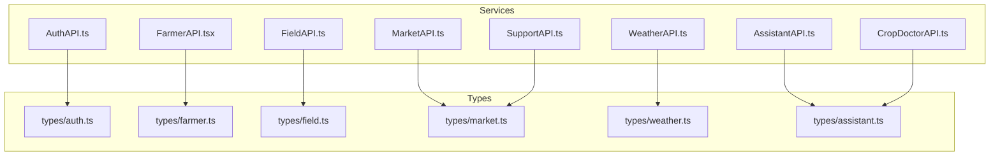
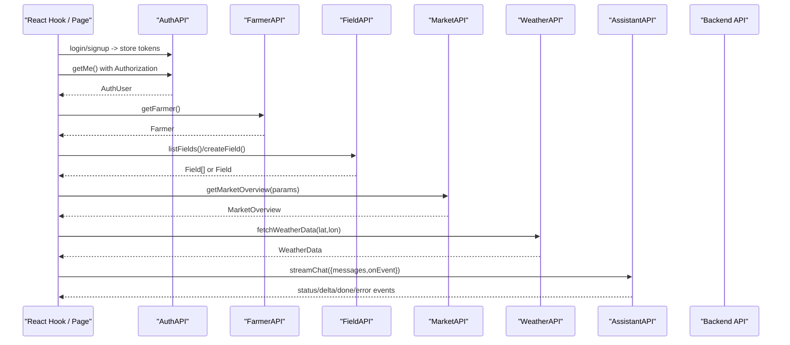
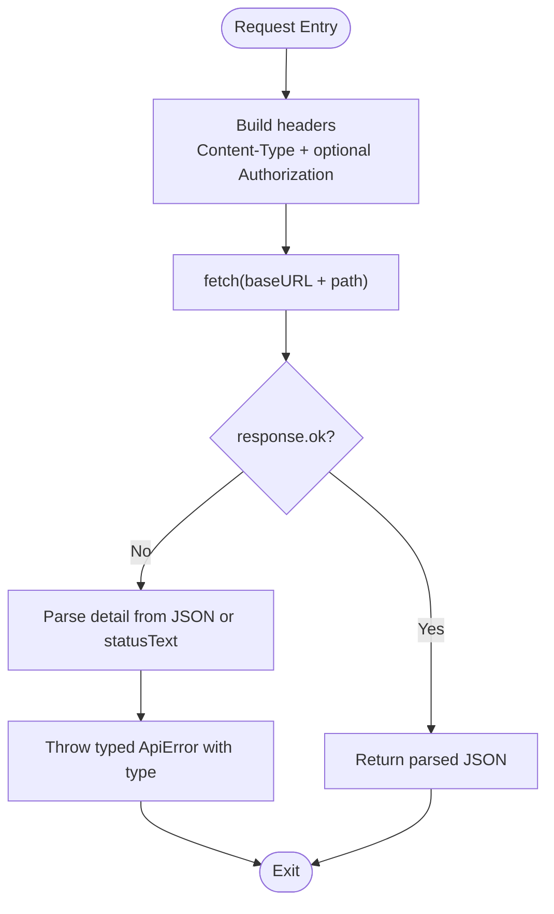
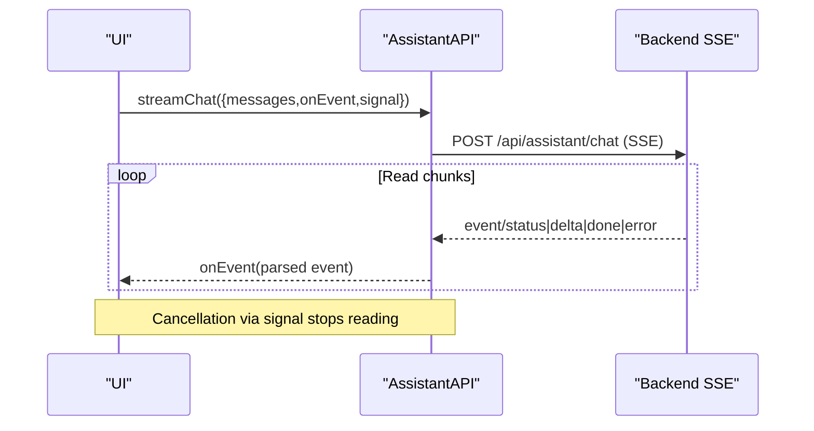
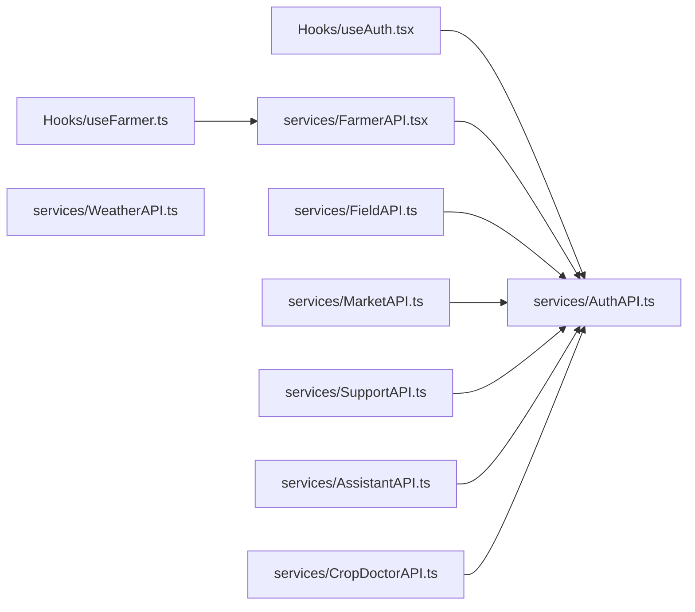

# API Integration

<cite>
**Referenced Files in This Document**
- [AuthAPI.ts](file://Frontend/greenflora/services/AuthAPI.ts)
- [FarmerAPI.tsx](file://Frontend/greenflora/services/FarmerAPI.tsx)
- [FieldAPI.ts](file://Frontend/greenflora/services/FieldAPI.ts)
- [MarketAPI.ts](file://Frontend/greenflora/services/MarketAPI.ts)
- [WeatherAPI.ts](file://Frontend/greenflora/services/WeatherAPI.ts)
- [AssistantAPI.ts](file://Frontend/greenflora/services/AssistantAPI.ts)
- [CropDoctorAPI.ts](file://Frontend/greenflora/services/CropDoctorAPI.ts)
- [SupportAPI.ts](file://Frontend/greenflora/services/SupportAPI.ts)
- [auth.ts](file://Frontend/greenflora/types/auth.ts)
- [farmer.ts](file://Frontend/greenflora/types/farmer.ts)
- [field.ts](file://Frontend/greenflora/types/field.ts)
- [market.ts](file://Frontend/greenflora/types/market.ts)
- [weather.ts](file://Frontend/greenflora/types/weather.ts)
- [assistant.ts](file://Frontend/greenflora/types/assistant.ts)
- [useAuth.tsx](file://Frontend/greenflora/Hooks/useAuth.tsx)
- [useFarmer.ts](file://Frontend/greenflora/Hooks/useFarmer.ts)
</cite>

## Table of Contents
1. Introduction
2. Project Structure
3. Core Components
4. Architecture Overview
5. Detailed Component Analysis
6. Dependency Analysis
7. Performance Considerations
8. Troubleshooting Guide
9. Conclusion
10. Appendices

## Introduction
This document explains Green-Flora’s frontend API integration layer built on the native fetch API. It covers the service architecture with separate modules per backend feature (Auth, Farmer, Field, Market, Weather, Assistant, Crop Doctor, Support), request/response handling, error management, and authentication token injection. It also documents caching strategies, retry mechanisms, offline support considerations, and security practices such as CSRF protection, input validation, and secure storage of sensitive data.

## Project Structure
The API layer is organized by feature into dedicated service modules under Frontend/greenflora/services. Each module encapsulates:
- A base URL configuration
- A typed error class and error classification logic
- A local request helper that injects Authorization headers when a token exists
- Feature-specific endpoints exposed as functions
- TypeScript types defined under Frontend/greenflora/types

**Diagram sources**
- [AuthAPI.ts:1-179](file://Frontend/greenflora/services/AuthAPI.ts#L1-L179)
- [FarmerAPI.tsx:1-109](file://Frontend/greenflora/services/FarmerAPI.tsx#L1-L109)
- [FieldAPI.ts:1-171](file://Frontend/greenflora/services/FieldAPI.ts#L1-L171)
- [MarketAPI.ts:1-128](file://Frontend/greenflora/services/MarketAPI.ts#L1-L128)
- [WeatherAPI.ts:1-291](file://Frontend/greenflora/services/WeatherAPI.ts#L1-L291)
- [AssistantAPI.ts:1-386](file://Frontend/greenflora/services/AssistantAPI.ts#L1-L386)
- [CropDoctorAPI.ts:1-107](file://Frontend/greenflora/services/CropDoctorAPI.ts#L1-L107)
- [SupportAPI.ts:1-102](file://Frontend/greenflora/services/SupportAPI.ts#L1-L102)
- [auth.ts:1-36](file://Frontend/greenflora/types/auth.ts#L1-L36)
- [farmer.ts:1-75](file://Frontend/greenflora/types/farmer.ts#L1-L75)
- [field.ts:1-78](file://Frontend/greenflora/types/field.ts#L1-L78)
- [market.ts:1-120](file://Frontend/greenflora/types/market.ts#L1-L120)
- [weather.ts:1-124](file://Frontend/greenflora/types/weather.ts#L1-L124)
- [assistant.ts:1-107](file://Frontend/greenflora/types/assistant.ts#L1-L107)

**Section sources**
- [AuthAPI.ts:16-17](file://Frontend/greenflora/services/AuthAPI.ts#L16-L17)
- [FarmerAPI.tsx:13-14](file://Frontend/greenflora/services/FarmerAPI.tsx#L13-L14)
- [FieldAPI.ts:19-20](file://Frontend/greenflora/services/FieldAPI.ts#L19-L20)
- [MarketAPI.ts:17-18](file://Frontend/greenflora/services/MarketAPI.ts#L17-L18)
- [WeatherAPI.ts:11-13](file://Frontend/greenflora/services/WeatherAPI.ts#L11-L13)
- [AssistantAPI.ts:23-28](file://Frontend/greenflora/services/AssistantAPI.ts#L23-L28)
- [CropDoctorAPI.ts:12-15](file://Frontend/greenflora/services/CropDoctorAPI.ts#L12-L15)
- [SupportAPI.ts:16-19](file://Frontend/greenflora/services/SupportAPI.ts#L16-L19)

## Core Components
- Authentication service: Centralizes token persistence in localStorage and provides login/signup/logout/session refresh and current user retrieval. It injects Bearer tokens for protected endpoints.
- Feature services: Each feature (Farmer, Field, Market, Weather, Assistant, Crop Doctor, Support) exposes typed functions that call fetch with consistent timeout, error classification, and optional auth header injection.
- Types: Strict TypeScript interfaces define request/response contracts aligned with backend schemas.
- Hooks: React hooks orchestrate stateful flows like session restoration and profile loading/saving.

Key responsibilities:
- Token lifecycle: store, retrieve, clear; refresh on mount if needed.
- Request helpers: AbortController-based timeouts, JSON parsing, error mapping to typed errors.
- Streaming: SSE chat streaming with event parsing and cancellation via signals.
- External APIs: Weather uses Open-Meteo; reverse geocoding uses Nominatim.

**Section sources**
- [AuthAPI.ts:21-46](file://Frontend/greenflora/services/AuthAPI.ts#L21-L46)
- [AuthAPI.ts:72-137](file://Frontend/greenflora/services/AuthAPI.ts#L72-L137)
- [useAuth.tsx:50-88](file://Frontend/greenflora/Hooks/useAuth.tsx#L50-L88)
- [AssistantAPI.ts:146-305](file://Frontend/greenflora/services/AssistantAPI.ts#L146-L305)
- [WeatherAPI.ts:141-222](file://Frontend/greenflora/services/WeatherAPI.ts#L141-L222)

## Architecture Overview
Green-Flora’s frontend API layer follows a feature-based service architecture. Each service encapsulates its own error class, request helper, and endpoint functions. Authentication is centralized in AuthAPI and consumed by other services via a shared token getter. The Assistant service adds advanced capabilities like SSE streaming and media uploads. Weather integrates external APIs directly.

**Diagram sources**
- [AuthAPI.ts:143-178](file://Frontend/greenflora/services/AuthAPI.ts#L143-L178)
- [FarmerAPI.tsx:92-108](file://Frontend/greenflora/services/FarmerAPI.tsx#L92-L108)
- [FieldAPI.ts:107-170](file://Frontend/greenflora/services/FieldAPI.ts#L107-L170)
- [MarketAPI.ts:100-127](file://Frontend/greenflora/services/MarketAPI.ts#L100-L127)
- [WeatherAPI.ts:141-222](file://Frontend/greenflora/services/WeatherAPI.ts#L141-L222)
- [AssistantAPI.ts:231-305](file://Frontend/greenflora/services/AssistantAPI.ts#L231-L305)

## Detailed Component Analysis

### Authentication Service (AuthAPI)
- Token storage: Access and refresh tokens are stored in localStorage under stable keys.
- Request helper: Adds Authorization header when includeAuth is true; handles timeouts, network errors, and server errors; maps response bodies to friendly messages.
- Endpoints: signup, login, refreshSession, logout, getMe.
- Session restoration: useAuth hook restores session on app start using stored tokens and refresh flow.

**Diagram sources**
- [AuthAPI.ts:72-137](file://Frontend/greenflora/services/AuthAPI.ts#L72-L137)

**Section sources**
- [AuthAPI.ts:21-46](file://Frontend/greenflora/services/AuthAPI.ts#L21-L46)
- [AuthAPI.ts:72-137](file://Frontend/greenflora/services/AuthAPI.ts#L72-L137)
- [AuthAPI.ts:143-178](file://Frontend/greenflora/services/AuthAPI.ts#L143-L178)
- [useAuth.tsx:50-88](file://Frontend/greenflora/Hooks/useAuth.tsx#L50-L88)
- [auth.ts:8-35](file://Frontend/greenflora/types/auth.ts#L8-L35)

### Farmer Service (FarmerAPI)
- Endpoints: getFarmer, updateFarmer, getDashboardSummary.
- Auth: Injects Bearer token automatically if present.
- Error handling: Classifies errors into network/timeout/validation/server/unknown.

Example calls:
- GET /api/farmer
- PUT /api/farmer with partial updates
- GET /api/dashboard-summary

**Section sources**
- [FarmerAPI.tsx:42-90](file://Frontend/greenflora/services/FarmerAPI.tsx#L42-L90)
- [FarmerAPI.tsx:92-108](file://Frontend/greenflora/services/FarmerAPI.tsx#L92-L108)
- [farmer.ts:22-56](file://Frontend/greenflora/types/farmer.ts#L22-L56)

### Field Service (FieldAPI)
- Endpoints: farm summary, fields CRUD, crop cycles CRUD.
- Special handling: Returns undefined for 204 No Content responses.
- Auth: Injects Bearer token automatically if present.

Example calls:
- GET /api/farm-summary
- GET/POST/PUT/DELETE /api/fields/{id}
- GET/POST/PUT/DELETE /api/fields/{fieldId}/cycles and /api/cycles/{cycleId}

**Section sources**
- [FieldAPI.ts:48-101](file://Frontend/greenflora/services/FieldAPI.ts#L48-L101)
- [FieldAPI.ts:107-170](file://Frontend/greenflora/services/FieldAPI.ts#L107-L170)
- [field.ts:8-77](file://Frontend/greenflora/types/field.ts#L8-L77)

### Market Service (MarketAPI)
- Public reference data endpoints: works with or without auth token.
- Endpoints: commodities list, market overview with query parameters.

Example calls:
- GET /api/market/commodities
- GET /api/market/overview?commodity_id=&days=&market_id=

**Section sources**
- [MarketAPI.ts:46-94](file://Frontend/greenflora/services/MarketAPI.ts#L46-L94)
- [MarketAPI.ts:100-127](file://Frontend/greenflora/services/MarketAPI.ts#L100-L127)
- [market.ts:10-119](file://Frontend/greenflora/types/market.ts#L10-L119)

### Weather Service (WeatherAPI)
- External APIs: Open-Meteo forecast and Nominatim reverse geocoding.
- Bundled weather fetch: single request retrieves current, hourly, daily, and soil data.
- Parsing: Transforms raw Open-Meteo response into clean typed structures.

Example calls:
- GET https://api.open-meteo.com/v1/forecast with selected parameters
- GET https://nominatim.openstreetmap.org/reverse with lat/lon

**Section sources**
- [WeatherAPI.ts:35-69](file://Frontend/greenflora/services/WeatherAPI.ts#L35-L69)
- [WeatherAPI.ts:141-222](file://Frontend/greenflora/services/WeatherAPI.ts#L141-L222)
- [WeatherAPI.ts:224-290](file://Frontend/greenflora/services/WeatherAPI.ts#L224-L290)
- [weather.ts:9-123](file://Frontend/greenflora/types/weather.ts#L9-L123)

### Assistant Service (AssistantAPI)
- Streaming chat over Server-Sent Events: parses frames, emits typed events, supports cancellation via AbortSignal.
- Media endpoints: transcribe audio (multipart/form-data) and text-to-speech (returns Blob).
- Dashboard greeting: simple JSON endpoint.

Example calls:
- POST /api/assistant/chat with Accept: text/event-stream
- POST /api/assistant/transcribe with FormData
- POST /api/assistant/speak with JSON body
- GET /api/assistant/greeting

**Diagram sources**
- [AssistantAPI.ts:231-305](file://Frontend/greenflora/services/AssistantAPI.ts#L231-L305)

**Section sources**
- [AssistantAPI.ts:108-140](file://Frontend/greenflora/services/AssistantAPI.ts#L108-L140)
- [AssistantAPI.ts:146-305](file://Frontend/greenflora/services/AssistantAPI.ts#L146-L305)
- [AssistantAPI.ts:315-385](file://Frontend/greenflora/services/AssistantAPI.ts#L315-L385)
- [assistant.ts:9-107](file://Frontend/greenflora/types/assistant.ts#L9-L107)

### Crop Doctor Service (CropDoctorAPI)
- Image analysis: multipart upload to backend which proxies to Gemini; API key remains server-side.
- Longer timeout to accommodate AI processing time.

Example call:
- POST /api/crop-doctor/analyse with image file

**Section sources**
- [CropDoctorAPI.ts:47-106](file://Frontend/greenflora/services/CropDoctorAPI.ts#L47-L106)

### Support Service (SupportAPI)
- Public government support contact data endpoint.
- Works with or without auth token.

Example call:
- GET /api/support/government

**Section sources**
- [SupportAPI.ts:45-101](file://Frontend/greenflora/services/SupportAPI.ts#L45-L101)

## Dependency Analysis
- Services depend on types for compile-time safety and on AuthAPI for token access.
- Hooks depend on services to manage UI state and side effects.
- Weather depends on external APIs; others depend on the backend.

**Diagram sources**
- [useAuth.tsx:50-88](file://Frontend/greenflora/Hooks/useAuth.tsx#L50-L88)
- [useFarmer.ts:34-87](file://Frontend/greenflora/Hooks/useFarmer.ts#L34-L87)
- [AuthAPI.ts:72-137](file://Frontend/greenflora/services/AuthAPI.ts#L72-L137)
- [FarmerAPI.tsx:42-90](file://Frontend/greenflora/services/FarmerAPI.tsx#L42-L90)
- [FieldAPI.ts:48-101](file://Frontend/greenflora/services/FieldAPI.ts#L48-L101)
- [MarketAPI.ts:46-94](file://Frontend/greenflora/services/MarketAPI.ts#L46-L94)
- [SupportAPI.ts:45-93](file://Frontend/greenflora/services/SupportAPI.ts#L45-L93)
- [AssistantAPI.ts:95-135](file://Frontend/greenflora/services/AssistantAPI.ts#L95-L135)
- [CropDoctorAPI.ts:56-69](file://Frontend/greenflora/services/CropDoctorAPI.ts#L56-L69)

**Section sources**
- [useAuth.tsx:50-88](file://Frontend/greenflora/Hooks/useAuth.tsx#L50-L88)
- [useFarmer.ts:34-87](file://Frontend/greenflora/Hooks/useFarmer.ts#L34-L87)
- [AuthAPI.ts:72-137](file://Frontend/greenflora/services/AuthAPI.ts#L72-L137)

## Performance Considerations
- Timeouts: Each service sets appropriate timeouts using AbortController to prevent hanging requests.
- Minimal round-trips: Weather bundles multiple data points in one request.
- Streaming: Assistant chat streams deltas to reduce perceived latency and enable responsive UI.
- Optional auth: Public endpoints skip unnecessary auth checks.

[No sources needed since this section provides general guidance]

## Troubleshooting Guide
Common issues and patterns:
- Network errors: All services map transport failures to typed errors with a “network” type and friendly messages.
- Timeouts: Requests abort after configured durations; services surface “timeout” errors.
- Server errors: Non-2xx responses parse detail payloads where possible and throw typed errors with appropriate categories.
- Auth failures: 401/403 mapped to “auth” type in assistant; other services treat them as validation/server depending on classification.
- Offline mode: Services do not implement offline caching or retries; callers should handle connectivity changes and re-fetch as needed.

Recommendations:
- Wrap service calls in try/catch and display user-friendly messages based on error.type.
- For long-running operations (e.g., streaming chat), honor AbortSignal to cancel in-flight work.
- For public endpoints, consider adding client-side caching if repeated reads are common.

**Section sources**
- [AuthAPI.ts:98-137](file://Frontend/greenflora/services/AuthAPI.ts#L98-L137)
- [FarmerAPI.tsx:61-90](file://Frontend/greenflora/services/FarmerAPI.tsx#L61-L90)
- [FieldAPI.ts:67-101](file://Frontend/greenflora/services/FieldAPI.ts#L67-L101)
- [MarketAPI.ts:65-94](file://Frontend/greenflora/services/MarketAPI.ts#L65-L94)
- [WeatherAPI.ts:195-222](file://Frontend/greenflora/services/WeatherAPI.ts#L195-L222)
- [AssistantAPI.ts:255-305](file://Frontend/greenflora/services/AssistantAPI.ts#L255-L305)
- [CropDoctorAPI.ts:71-106](file://Frontend/greenflora/services/CropDoctorAPI.ts#L71-L106)
- [SupportAPI.ts:64-93](file://Frontend/greenflora/services/SupportAPI.ts#L64-L93)

## Conclusion
Green-Flora’s API integration layer provides a consistent, typed, and maintainable approach to communicating with the backend and external services. Each feature has a dedicated service module with unified error handling, timeouts, and optional authentication. The Assistant service adds advanced streaming and media capabilities. While robust, the layer currently lacks built-in caching, retries, and offline support; these can be added at the service or hook level as needs evolve. Security practices include secure token storage in localStorage, Bearer token injection, and keeping sensitive keys server-side.

[No sources needed since this section summarizes without analyzing specific files]

## Appendices

### Example API Calls and Response Types
- Auth
  - Login: POST /api/auth/login -> returns access_token, refresh_token, user_id, name, is_new
  - Refresh: POST /api/auth/refresh -> returns new tokens
  - Get me: GET /api/auth/me -> returns AuthUser
  - Reference: [auth.ts:8-35](file://Frontend/greenflora/types/auth.ts#L8-L35), [AuthAPI.ts:143-178](file://Frontend/greenflora/services/AuthAPI.ts#L143-L178)

- Farmer
  - Get profile: GET /api/farmer -> Farmer
  - Update profile: PUT /api/farmer -> Farmer
  - Dashboard summary: GET /api/dashboard-summary -> DashboardSummary
  - Reference: [farmer.ts:22-56](file://Frontend/greenflora/types/farmer.ts#L22-L56), [FarmerAPI.tsx:92-108](file://Frontend/greenflora/services/FarmerAPI.tsx#L92-L108)

- Field
  - List fields: GET /api/fields -> Field[]
  - Create field: POST /api/fields -> Field
  - Update field: PUT /api/fields/{id} -> Field
  - Delete field: DELETE /api/fields/{id} -> void
  - Crop cycles: GET/POST /api/fields/{fieldId}/cycles; PUT/DELETE /api/cycles/{cycleId}
  - Reference: [field.ts:8-77](file://Frontend/greenflora/types/field.ts#L8-L77), [FieldAPI.ts:107-170](file://Frontend/greenflora/services/FieldAPI.ts#L107-L170)

- Market
  - Commodities: GET /api/market/commodities -> MarketCommoditiesResponse
  - Overview: GET /api/market/overview?commodity_id=&days=&market_id= -> MarketOverview
  - Reference: [market.ts:10-119](file://Frontend/greenflora/types/market.ts#L10-L119), [MarketAPI.ts:100-127](file://Frontend/greenflora/services/MarketAPI.ts#L100-L127)

- Weather
  - Forecast: GET https://api.open-meteo.com/v1/forecast -> WeatherData (parsed)
  - Reverse geocode: GET https://nominatim.openstreetmap.org/reverse -> GeocodedLocation | null
  - Reference: [weather.ts:9-123](file://Frontend/greenflora/types/weather.ts#L9-L123), [WeatherAPI.ts:141-222](file://Frontend/greenflora/services/WeatherAPI.ts#L141-L222)

- Assistant
  - Chat (SSE): POST /api/assistant/chat -> stream of events
  - Transcribe: POST /api/assistant/transcribe -> {text}
  - Speak: POST /api/assistant/speak -> Blob (audio)
  - Greeting: GET /api/assistant/greeting -> AssistantGreeting
  - Reference: [assistant.ts:9-107](file://Frontend/greenflora/types/assistant.ts#L9-L107), [AssistantAPI.ts:138-385](file://Frontend/greenflora/services/AssistantAPI.ts#L138-L385)

- Crop Doctor
  - Analyse: POST /api/crop-doctor/analyse -> CropDoctorResponse
  - Reference: [CropDoctorAPI.ts:47-106](file://Frontend/greenflora/services/CropDoctorAPI.ts#L47-L106)

- Support
  - Government: GET /api/support/government -> GovernmentSupportResponse
  - Reference: [SupportAPI.ts:99-101](file://Frontend/greenflora/services/SupportAPI.ts#L99-L101)

### Security Practices
- Authentication tokens: Stored in localStorage; injected via Authorization header for protected endpoints.
- CSRF: Not implemented in the fetch-based services; ensure backend enforces CSRF protections if cookies are used.
- Input validation: Client-side types enforce structure; add explicit validation before sending large payloads (e.g., images).
- Sensitive data: API keys remain server-side (e.g., Gemini); only tokens are stored client-side.

[No sources needed since this section provides general guidance]