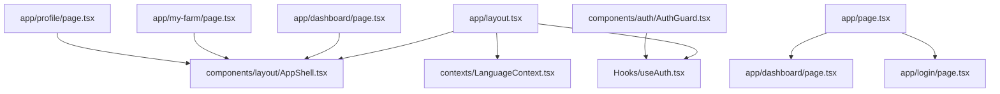
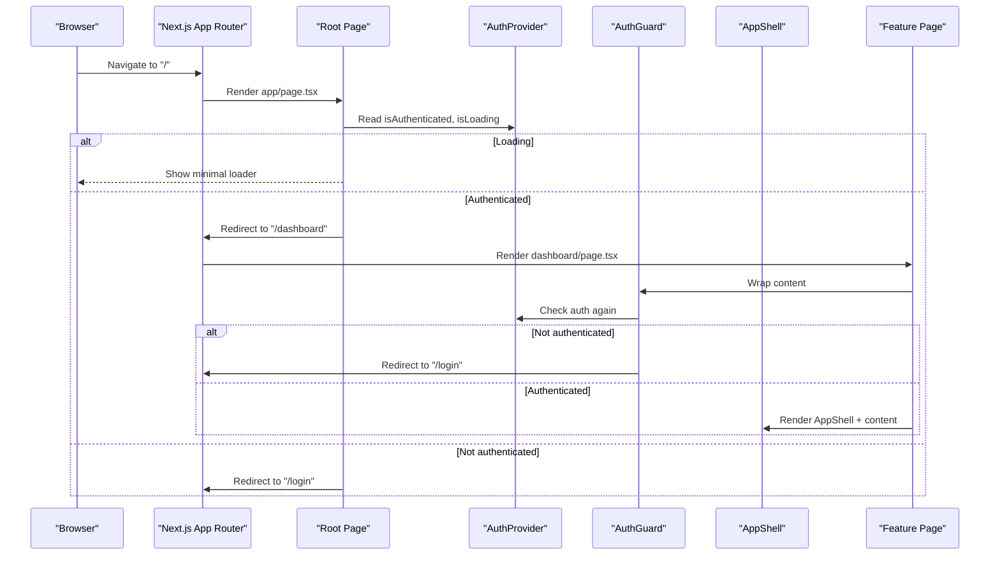
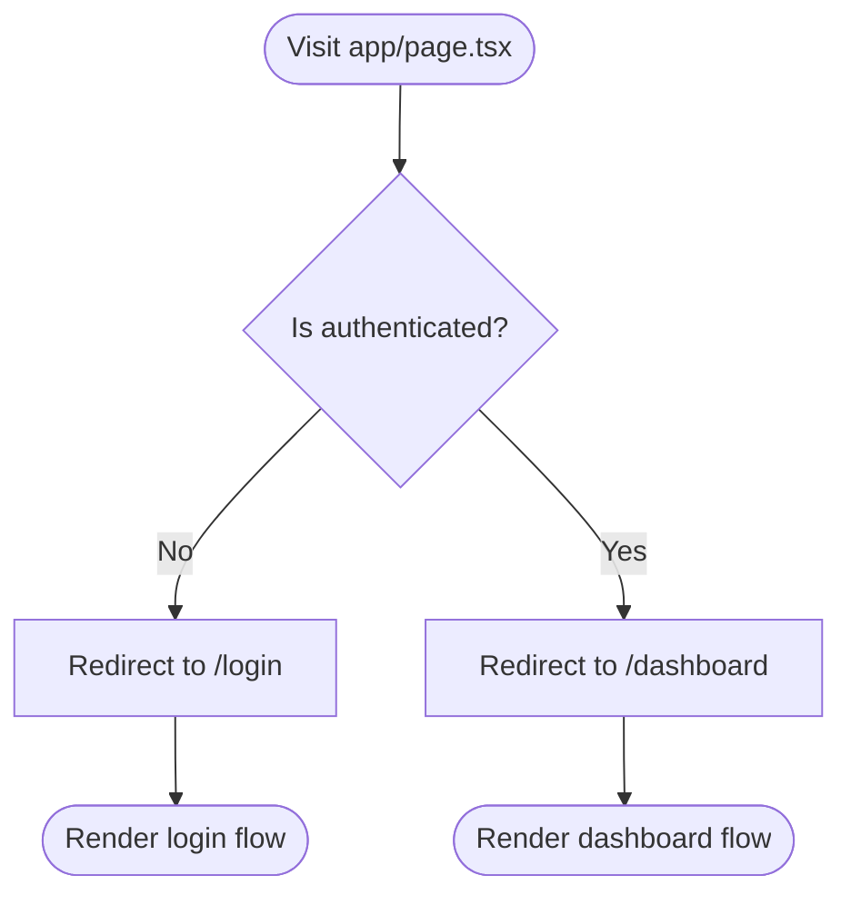
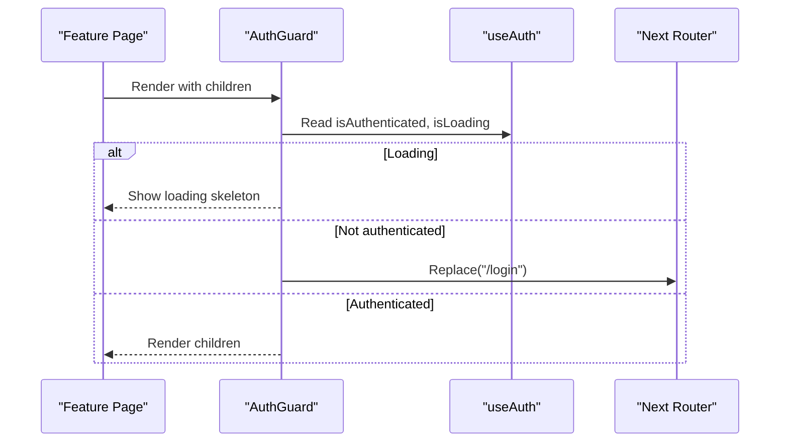
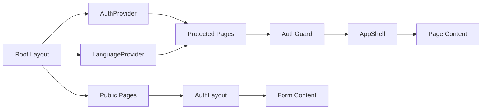
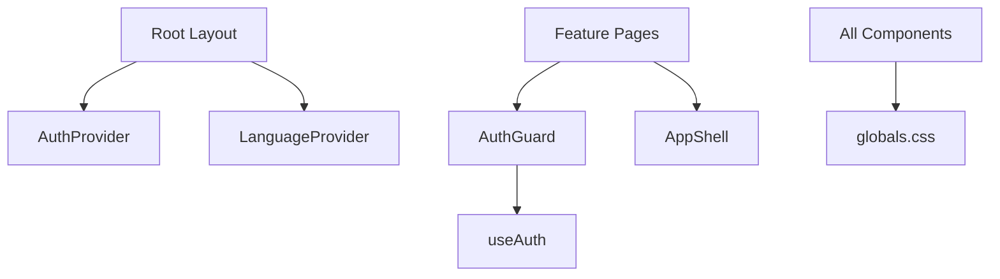

# Application Structure

<cite>
**Referenced Files in This Document**
- [layout.tsx](file://Frontend/greenflora/app/layout.tsx)
- [page.tsx](file://Frontend/greenflora/app/page.tsx)
- [globals.css](file://Frontend/greenflora/app/globals.css)
- [next.config.ts](file://Frontend/greenflora/next.config.ts)
- [AuthGuard.tsx](file://Frontend/greenflora/components/auth/AuthGuard.tsx)
- [useAuth.tsx](file://Frontend/greenflora/Hooks/useAuth.tsx)
- [LanguageContext.tsx](file://Frontend/greenflora/contexts/LanguageContext.tsx)
- [AppShell.tsx](file://Frontend/greenflora/components/layout/AppShell.tsx)
- [AuthLayout.tsx](file://Frontend/greenflora/components/layout/AuthLayout.tsx)
- [dashboard/page.tsx](file://Frontend/greenflora/app/dashboard/page.tsx)
- [login/page.tsx](file://Frontend/greenflora/app/login/page.tsx)
- [my-farm/page.tsx](file://Frontend/greenflora/app/my-farm/page.tsx)
- [profile/page.tsx](file://Frontend/greenflora/app/profile/page.tsx)
</cite>

## Table of Contents
1. Introduction
2. Project Structure
3. Core Components
4. Architecture Overview
5. Detailed Component Analysis
6. Dependency Analysis
7. Performance Considerations
8. Troubleshooting Guide
9. Conclusion

## Introduction
This document explains the Green-Flora Next.js application structure with a focus on the App Router configuration, root layout setup (metadata and providers), global CSS styling, page-based routing, protected routes via authentication guards, component hierarchy from the root layout down to feature pages, file organization patterns, naming conventions, and how context providers and theme configuration are initialized at the root level.

## Project Structure
Green-Flora uses the Next.js App Router under the app directory. Each route is a folder containing a page.tsx file. Shared UI lives under components, hooks under Hooks, contexts under contexts, services under services, types under types, and utilities under lib. The root layout wraps all pages with providers and global styles.

**Diagram sources**
- [layout.tsx:23-67](file://Frontend/greenflora/app/layout.tsx#L23-L67)
- [page.tsx:15-22](file://Frontend/greenflora/app/page.tsx#L15-L22)
- [dashboard/page.tsx:95-97](file://Frontend/greenflora/app/dashboard/page.tsx#L95-L97)
- [my-farm/page.tsx:249-251](file://Frontend/greenflora/app/my-farm/page.tsx#L249-L251)
- [profile/page.tsx:44-46](file://Frontend/greenflora/app/profile/page.tsx#L44-L46)
- [AppShell.tsx:12-35](file://Frontend/greenflora/components/layout/AppShell.tsx#L12-L35)
- [LanguageContext.tsx:24-57](file://Frontend/greenflora/contexts/LanguageContext.tsx#L24-L57)
- [useAuth.tsx:46-127](file://Frontend/greenflora/Hooks/useAuth.tsx#L46-L127)
- [AuthGuard.tsx:37-58](file://Frontend/greenflora/components/auth/AuthGuard.tsx#L37-L58)

**Section sources**
- [layout.tsx:1-95](file://Frontend/greenflora/app/layout.tsx#L1-L95)
- [page.tsx:1-35](file://Frontend/greenflora/app/page.tsx#L1-L35)
- [next.config.ts:1-8](file://Frontend/greenflora/next.config.ts#L1-L8)

## Core Components
- Root Layout: Initializes fonts, injects scripts for Google Translate, sets base body classes, and wraps children with AuthProvider and LanguageProvider.
- Global Styles: Central design tokens, Tailwind v4 theme integration, animations, and language-specific typography rules.
- Authentication Provider: Manages user session, token persistence, login/signup/logout, and exposes isAuthenticated and isLoading.
- Language Context: Persists and toggles language (English/Urdu), applies RTL when needed, and provides translation lookup.
- AuthGuard: Client-side route protection that redirects unauthenticated users to /login and shows loading while deciding.
- AppShell: Common shell for authenticated pages with Sidebar and TopBar; renders main content area.
- AuthLayout: Full-screen nature-themed layout used by login/signup pages.

**Section sources**
- [layout.tsx:23-95](file://Frontend/greenflora/app/layout.tsx#L23-L95)
- [globals.css:1-175](file://Frontend/greenflora/app/globals.css#L1-L175)
- [useAuth.tsx:46-127](file://Frontend/greenflora/Hooks/useAuth.tsx#L46-L127)
- [LanguageContext.tsx:24-66](file://Frontend/greenflora/contexts/LanguageContext.tsx#L24-L66)
- [AuthGuard.tsx:37-58](file://Frontend/greenflora/components/auth/AuthGuard.tsx#L37-L58)
- [AppShell.tsx:12-35](file://Frontend/greenflora/components/layout/AppShell.tsx#L12-L35)
- [AuthLayout.tsx:78-171](file://Frontend/greenflora/components/layout/AuthLayout.tsx#L78-L171)

## Architecture Overview
The application bootstraps with the root layout, which loads fonts, global CSS, and providers. The root page redirects based on authentication state. Protected pages wrap their content with AuthGuard and render inside AppShell. Public pages like login use AuthLayout.

**Diagram sources**
- [page.tsx:15-22](file://Frontend/greenflora/app/page.tsx#L15-L22)
- [dashboard/page.tsx:95-97](file://Frontend/greenflora/app/dashboard/page.tsx#L95-L97)
- [AuthGuard.tsx:37-58](file://Frontend/greenflora/components/auth/AuthGuard.tsx#L37-L58)
- [AppShell.tsx:12-35](file://Frontend/greenflora/components/layout/AppShell.tsx#L12-L35)

## Detailed Component Analysis

### Root Layout and Providers
- Fonts: Loads Geist Sans/Mono and Noto Nastaliq Urdu with CSS variables for theming.
- Scripts: Injects a monkey-patch to prevent React DOM crashes caused by Google Translate and initializes the translate widget after interactive.
- Providers: Wraps children with AuthProvider and LanguageProvider so all pages can access auth and language state.
- Body: Sets base background and text colors using design tokens.

**Section sources**
- [layout.tsx:1-95](file://Frontend/greenflora/app/layout.tsx#L1-L95)

### Global CSS and Theme Configuration
- Design Tokens: Defines green, earth, neutral, surface, accent, shadow, and radius tokens as CSS custom properties.
- Tailwind Integration: Maps tokens to Tailwind v4 theme values for colors, shadows, radii, and fonts.
- Base Styles: Applies font family, antialiasing, and ensures proper scrolling behavior.
- Language Support: Adds .urdu-mode and html[lang="ur"] rules for RTL and Nastaliq line-height.
- Animations: Provides reusable keyframes and utility classes for fade, slide, pulse, weather effects, and reduced motion support.
- Map Overrides: Styles Leaflet containers, markers, popups, and controls to match the design system.

**Section sources**
- [globals.css:1-175](file://Frontend/greenflora/app/globals.css#L1-L175)
- [globals.css:177-256](file://Frontend/greenflora/app/globals.css#L177-L256)
- [globals.css:258-302](file://Frontend/greenflora/app/globals.css#L258-L302)
- [globals.css:304-367](file://Frontend/greenflora/app/globals.css#L304-L367)
- [globals.css:369-424](file://Frontend/greenflora/app/globals.css#L369-L424)
- [globals.css:426-500](file://Frontend/greenflora/app/globals.css#L426-L500)

### Routing and Page-Based Navigation
- Root Page: Uses client-side navigation to redirect to /dashboard if authenticated or /login otherwise, showing a minimal loader during decision.
- Feature Pages: Each feature has its own folder under app with a page.tsx implementing the route. Examples include dashboard, my-farm, profile, crop-doctor, market, profit-calculator, weather, login, signup.
- Public vs Protected: Login/signup are public and use AuthLayout. All other feature pages typically wrap content with AuthGuard and AppShell.

**Diagram sources**
- [page.tsx:15-22](file://Frontend/greenflora/app/page.tsx#L15-L22)

**Section sources**
- [page.tsx:1-35](file://Frontend/greenflora/app/page.tsx#L1-L35)
- [dashboard/page.tsx:1-238](file://Frontend/greenflora/app/dashboard/page.tsx#L1-L238)
- [my-farm/page.tsx:1-694](file://Frontend/greenflora/app/my-farm/page.tsx#L1-L694)
- [profile/page.tsx:1-132](file://Frontend/greenflora/app/profile/page.tsx#L1-L132)
- [login/page.tsx:1-141](file://Frontend/greenflora/app/login/page.tsx#L1-L141)

### Authentication Guards and Protected Routes
- AuthGuard: Renders a loading screen while checking auth state; redirects to /login if not authenticated; otherwise renders children.
- useAuth: Provides user, isAuthenticated, isLoading, and actions (login, signup, logout). Restores session on mount using stored tokens and refresh logic.
- Usage Pattern: Feature pages wrap their content with AuthGuard before rendering AppShell and page-specific UI.

**Diagram sources**
- [AuthGuard.tsx:37-58](file://Frontend/greenflora/components/auth/AuthGuard.tsx#L37-L58)
- [useAuth.tsx:46-127](file://Frontend/greenflora/Hooks/useAuth.tsx#L46-L127)

**Section sources**
- [AuthGuard.tsx:1-59](file://Frontend/greenflora/components/auth/AuthGuard.tsx#L1-L59)
- [useAuth.tsx:1-141](file://Frontend/greenflora/Hooks/useAuth.tsx#L1-L141)
- [dashboard/page.tsx:95-97](file://Frontend/greenflora/app/dashboard/page.tsx#L95-L97)
- [my-farm/page.tsx:249-251](file://Frontend/greenflora/app/my-farm/page.tsx#L249-L251)
- [profile/page.tsx:44-46](file://Frontend/greenflora/app/profile/page.tsx#L44-L46)

### Component Hierarchy
- Root Layout -> Providers (Auth, Language) -> Children
- Feature Pages -> AuthGuard -> AppShell -> Page Content
- Public Pages (login/signup) -> AuthLayout -> Form Content

**Diagram sources**
- [layout.tsx:23-67](file://Frontend/greenflora/app/layout.tsx#L23-L67)
- [AppShell.tsx:12-35](file://Frontend/greenflora/components/layout/AppShell.tsx#L12-L35)
- [AuthGuard.tsx:37-58](file://Frontend/greenflora/components/auth/AuthGuard.tsx#L37-L58)
- [AuthLayout.tsx:78-171](file://Frontend/greenflora/components/layout/AuthLayout.tsx#L78-L171)

### File Organization Patterns and Naming Conventions
- app/: Route segments per feature (e.g., dashboard, my-farm, profile, crop-doctor, market, weather, profit-calculator, login, signup). Each contains page.tsx.
- components/: Organized by feature folders (assistant, cropDoctor, dashboard, fields, farm, layout, map, market, profile, ui, weather). Shared UI lives under ui/.
- Hooks/: Custom hooks grouped by domain (useAuth, useFarmer, useFields, useWeather, etc.).
- contexts/: Global contexts (LanguageContext).
- services/: API clients per domain (AuthAPI, FarmerAPI, FieldAPI, MarketAPI, WeatherAPI, etc.).
- types/: TypeScript interfaces per domain.
- lib/: Utilities (marketUtils, translations, weatherUtils, dataStates).
- Naming: PascalCase for components and hooks; kebab-case for directories; clear separation of concerns by feature.

**Section sources**
- [AppShell.tsx:12-35](file://Frontend/greenflora/components/layout/AppShell.tsx#L12-L35)
- [AuthGuard.tsx:1-59](file://Frontend/greenflora/components/auth/AuthGuard.tsx#L1-L59)
- [useAuth.tsx:1-141](file://Frontend/greenflora/Hooks/useAuth.tsx#L1-L141)
- [LanguageContext.tsx:1-66](file://Frontend/greenflora/contexts/LanguageContext.tsx#L1-L66)

### Context Providers, Theme Configuration, and Global State Initialization
- Context Providers:
  - AuthProvider: Initializes session from stored tokens, handles refresh, exposes user and actions.
  - LanguageProvider: Persists language preference, toggles RTL, and provides translation function.
- Theme Configuration:
  - CSS custom properties define design tokens.
  - Tailwind v4 @theme maps tokens to theme values for consistent usage across components.
- Global State Initialization:
  - Root layout mounts providers once, ensuring all pages have access to auth and language state without re-initialization.

**Section sources**
- [layout.tsx:23-67](file://Frontend/greenflora/app/layout.tsx#L23-L67)
- [useAuth.tsx:46-127](file://Frontend/greenflora/Hooks/useAuth.tsx#L46-L127)
- [LanguageContext.tsx:24-66](file://Frontend/greenflora/contexts/LanguageContext.tsx#L24-L66)
- [globals.css:1-175](file://Frontend/greenflora/app/globals.css#L1-L175)

## Dependency Analysis
- Root layout depends on fonts, scripts, and providers.
- Feature pages depend on AppShell and AuthGuard for layout and protection.
- AuthGuard depends on useAuth for authentication state.
- LanguageContext affects global DOM attributes and classes for language switching.
- Global CSS influences all components through Tailwind theme mapping.

**Diagram sources**
- [layout.tsx:23-67](file://Frontend/greenflora/app/layout.tsx#L23-L67)
- [AuthGuard.tsx:37-58](file://Frontend/greenflora/components/auth/AuthGuard.tsx#L37-L58)
- [useAuth.tsx:46-127](file://Frontend/greenflora/Hooks/useAuth.tsx#L46-L127)
- [AppShell.tsx:12-35](file://Frontend/greenflora/components/layout/AppShell.tsx#L12-L35)
- [globals.css:1-175](file://Frontend/greenflora/app/globals.css#L1-L175)

**Section sources**
- [layout.tsx:23-67](file://Frontend/greenflora/app/layout.tsx#L23-L67)
- [AuthGuard.tsx:37-58](file://Frontend/greenflora/components/auth/AuthGuard.tsx#L37-L58)
- [useAuth.tsx:46-127](file://Frontend/greenflora/Hooks/useAuth.tsx#L46-L127)
- [AppShell.tsx:12-35](file://Frontend/greenflora/components/layout/AppShell.tsx#L12-L35)
- [globals.css:1-175](file://Frontend/greenflora/app/globals.css#L1-L175)

## Performance Considerations
- Use client-only features judiciously: Only pages requiring interactivity declare "use client".
- Defer heavy scripts: Google Translate script loads after interactive to avoid blocking initial render.
- Minimize re-renders: Providers memoize context values where possible; guards show skeletons to avoid layout shifts.
- Leverage Tailwind v4 theme: Consistent tokens reduce style duplication and improve build performance.
- Reduced motion: Respect prefers-reduced-motion to improve accessibility and performance on low-end devices.

[No sources needed since this section provides general guidance]

## Troubleshooting Guide
- Hydration Warnings: Suppress hydration warnings in root layout for third-party scripts; ensure client-only code runs only on the client.
- Google Translate Conflicts: The injected monkey-patch prevents DOM manipulation conflicts; verify the script loads after interactive.
- Auth Redirect Loops: Ensure AuthGuard checks both isLoading and isAuthenticated; confirm router.replace is called correctly.
- Language Switching Issues: Confirm LanguageProvider updates document.documentElement.lang and dir; check urdu-mode class toggling.
- Map Styling Problems: Verify Leaflet overrides in globals.css apply to containers and controls; ensure z-index and border-radius tokens are used.

**Section sources**
- [layout.tsx:34-91](file://Frontend/greenflora/app/layout.tsx#L34-L91)
- [AuthGuard.tsx:37-58](file://Frontend/greenflora/components/auth/AuthGuard.tsx#L37-L58)
- [LanguageContext.tsx:24-66](file://Frontend/greenflora/contexts/LanguageContext.tsx#L24-L66)
- [globals.css:369-424](file://Frontend/greenflora/app/globals.css#L369-L424)

## Conclusion
Green-Flora’s Next.js application follows a clean App Router structure with a robust root layout that initializes providers and global styles. Protected routes are enforced via AuthGuard, while public flows use AuthLayout. The design system is centralized in globals.css with Tailwind v4 integration, enabling consistent theming and animations. Context providers manage authentication and language globally, ensuring scalable and maintainable feature development.