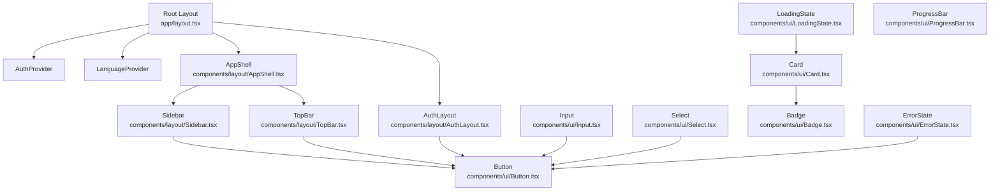
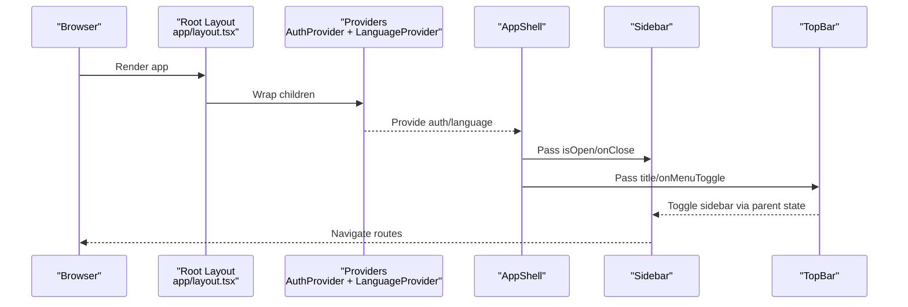
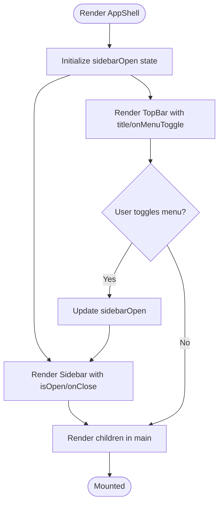
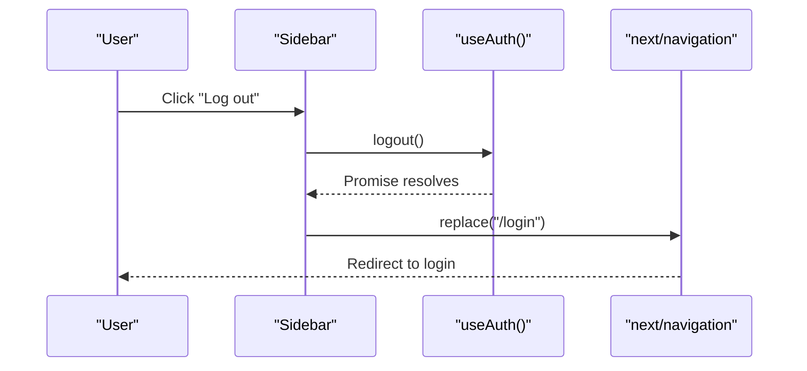
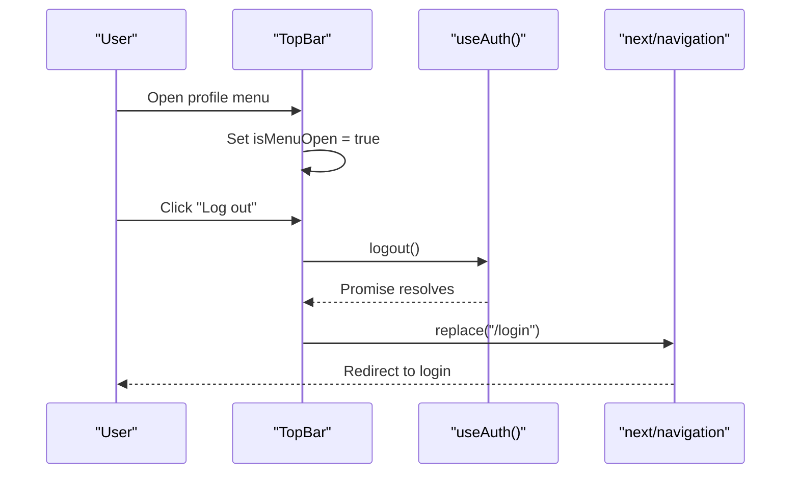
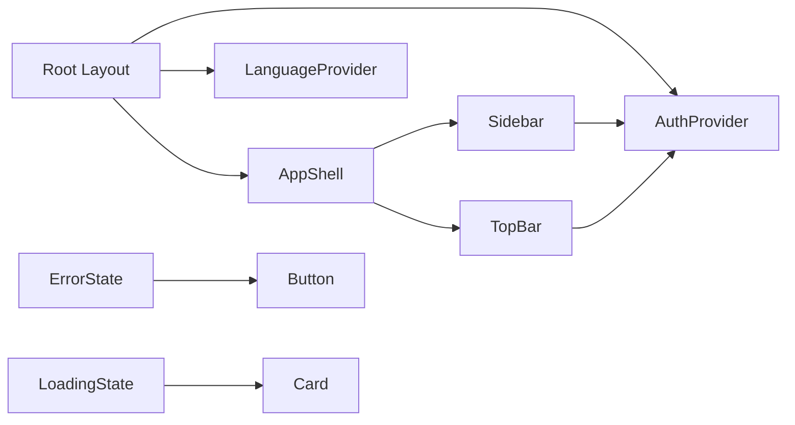

# Component Hierarchy

<cite>
**Referenced Files in This Document**
- [AppShell.tsx](file://Frontend/greenflora/components/layout/AppShell.tsx)
- [Sidebar.tsx](file://Frontend/greenflora/components/layout/Sidebar.tsx)
- [TopBar.tsx](file://Frontend/greenflora/components/layout/TopBar.tsx)
- [AuthLayout.tsx](file://Frontend/greenflora/components/layout/AuthLayout.tsx)
- [Button.tsx](file://Frontend/greenflora/components/ui/Button.tsx)
- [Card.tsx](file://Frontend/greenflora/components/ui/Card.tsx)
- [Input.tsx](file://Frontend/greenflora/components/ui/Input.tsx)
- [Select.tsx](file://Frontend/greenflora/components/ui/Select.tsx)
- [Badge.tsx](file://Frontend/greenflora/components/ui/Badge.tsx)
- [LoadingState.tsx](file://Frontend/greenflora/components/ui/LoadingState.tsx)
- [ErrorState.tsx](file://Frontend/greenflora/components/ui/ErrorState.tsx)
- [ProgressBar.tsx](file://Frontend/greenflora/components/ui/ProgressBar.tsx)
- [LanguageContext.tsx](file://Frontend/greenflora/contexts/LanguageContext.tsx)
- [layout.tsx](file://Frontend/greenflora/app/layout.tsx)
</cite>

## Table of Contents
1. Introduction
2. Project Structure
3. Core Components
4. Architecture Overview
5. Detailed Component Analysis
6. Dependency Analysis
7. Performance Considerations
8. Troubleshooting Guide
9. Conclusion

## Introduction
This document explains Green-Flora’s React component hierarchy with a focus on the application shell and navigation (AppShell, Sidebar, TopBar), the reusable UI component library (Button, Card, Input, Select, Badge, LoadingState, ErrorState, ProgressBar), composition patterns, prop usage versus context, feature-domain organization, styling with Tailwind CSS, and accessibility practices across the component tree. It also provides diagrams to visualize relationships and data flows.

## Project Structure
Green-Flora organizes components by domain:
- Layout components under components/layout provide the app shell and authentication layouts.
- Reusable UI primitives live under components/ui.
- Feature-specific components are grouped in their own folders (e.g., dashboard, fields, market).
- Global contexts reside in contexts (e.g., LanguageContext).
- The Next.js root layout wraps providers for auth and language.

**Diagram sources**
- [layout.tsx:23-67](file://Frontend/greenflora/app/layout.tsx#L23-L67)
- [AppShell.tsx:12-35](file://Frontend/greenflora/components/layout/AppShell.tsx#L12-L35)
- [Sidebar.tsx:71-188](file://Frontend/greenflora/components/layout/Sidebar.tsx#L71-L188)
- [TopBar.tsx:26-166](file://Frontend/greenflora/components/layout/TopBar.tsx#L26-L166)
- [AuthLayout.tsx:78-170](file://Frontend/greenflora/components/layout/AuthLayout.tsx#L78-L170)
- [Button.tsx:30-75](file://Frontend/greenflora/components/ui/Button.tsx#L30-L75)
- [Card.tsx:25-39](file://Frontend/greenflora/components/ui/Card.tsx#L25-L39)
- [Input.tsx:9-47](file://Frontend/greenflora/components/ui/Input.tsx#L9-L47)
- [Select.tsx:16-66](file://Frontend/greenflora/components/ui/Select.tsx#L16-L66)
- [Badge.tsx:18-31](file://Frontend/greenflora/components/ui/Badge.tsx#L18-L31)
- [LoadingState.tsx:45-56](file://Frontend/greenflora/components/ui/LoadingState.tsx#L45-L56)
- [ErrorState.tsx:11-39](file://Frontend/greenflora/components/ui/ErrorState.tsx#L11-L39)
- [ProgressBar.tsx:9-50](file://Frontend/greenflora/components/ui/ProgressBar.tsx#L9-L50)

**Section sources**
- [layout.tsx:23-67](file://Frontend/greenflora/app/layout.tsx#L23-L67)
- [AppShell.tsx:12-35](file://Frontend/greenflora/components/layout/AppShell.tsx#L12-L35)
- [Sidebar.tsx:71-188](file://Frontend/greenflora/components/layout/Sidebar.tsx#L71-L188)
- [TopBar.tsx:26-166](file://Frontend/greenflora/components/layout/TopBar.tsx#L26-L166)
- [AuthLayout.tsx:78-170](file://Frontend/greenflora/components/layout/AuthLayout.tsx#L78-L170)

## Core Components
- AppShell: Provides the main application chrome with a responsive sidebar and top bar, and a centered content area. It manages sidebar open state and passes it down to Sidebar and TopBar.
- Sidebar: Renders navigation links, highlights the active route, supports mobile overlay, and includes logout.
- TopBar: Displays page title, mobile menu toggle, and a user profile dropdown with actions including logout.
- AuthLayout: Full-screen layout for login/signup pages with decorative background and a centered card container.

Key props and responsibilities:
- AppShellProps: children, title.
- SidebarProps: isOpen, onClose.
- TopBarProps: title, onMenuToggle.
- AuthLayout: children.

Styling approach:
- All layout components use Tailwind utility classes for spacing, colors, typography, and responsive behavior.
- Consistent color tokens (e.g., surface-primary, primary-*) and rounded corners via custom utilities (e.g., rounded-button, rounded-card).

Accessibility highlights:
- Semantic HTML elements (aside, nav, header, button).
- ARIA attributes for menus and overlays (aria-label, aria-expanded, role="menu", role="menuitem").
- Keyboard support for closing menus (Escape key) and focus management via visible outlines.

**Section sources**
- [AppShell.tsx:7-35](file://Frontend/greenflora/components/layout/AppShell.tsx#L7-L35)
- [Sidebar.tsx:22-69](file://Frontend/greenflora/components/layout/Sidebar.tsx#L22-L69)
- [TopBar.tsx:10-13](file://Frontend/greenflora/components/layout/TopBar.tsx#L10-L13)
- [AuthLayout.tsx:78-170](file://Frontend/greenflora/components/layout/AuthLayout.tsx#L78-L170)

## Architecture Overview
The root layout wraps the app with providers for authentication and language. Pages render within either the authenticated shell or the auth layout depending on the route.

**Diagram sources**
- [layout.tsx:23-67](file://Frontend/greenflora/app/layout.tsx#L23-L67)
- [AppShell.tsx:12-35](file://Frontend/greenflora/components/layout/AppShell.tsx#L12-L35)
- [Sidebar.tsx:71-188](file://Frontend/greenflora/components/layout/Sidebar.tsx#L71-L188)
- [TopBar.tsx:26-166](file://Frontend/greenflora/components/layout/TopBar.tsx#L26-L166)

## Detailed Component Analysis

### Application Shell: AppShell
- Purpose: Orchestrates the global layout, managing sidebar visibility and delegating rendering to Sidebar and TopBar while providing a responsive content area.
- Composition: Composes Sidebar and TopBar; passes title to TopBar and sidebar toggle callback to both.
- Styling: Uses Tailwind for min-height, background, margin offsets on desktop, and responsive padding.
- Accessibility: Wraps content in semantic main element; relies on child components for accessible controls.

**Diagram sources**
- [AppShell.tsx:12-35](file://Frontend/greenflora/components/layout/AppShell.tsx#L12-L35)

**Section sources**
- [AppShell.tsx:7-35](file://Frontend/greenflora/components/layout/AppShell.tsx#L7-L35)

### Navigation: Sidebar
- Purpose: Provides primary navigation, active link highlighting, mobile overlay, and logout action.
- Data flow: Uses router hooks to detect active path; calls logout from auth context and navigates to login.
- Styling: Fixed drawer on mobile, persistent on desktop; uses gradients and transitions for active states.
- Accessibility: aria-label for navigation, close button label, keyboard-friendly interactions.

**Diagram sources**
- [Sidebar.tsx:71-86](file://Frontend/greenflora/components/layout/Sidebar.tsx#L71-L86)

**Section sources**
- [Sidebar.tsx:22-188](file://Frontend/greenflora/components/layout/Sidebar.tsx#L22-L188)

### Header: TopBar
- Purpose: Shows page title, mobile menu toggle, and user profile dropdown with actions.
- Interactions: Dropdown opens/closes via click outside and Escape key; triggers logout and redirects to login.
- Styling: Sticky header with backdrop blur; gradient avatar initials; animated chevron.
- Accessibility: aria-haspopup, aria-expanded, role="menu", role="menuitem", focus-visible rings.

**Diagram sources**
- [TopBar.tsx:26-68](file://Frontend/greenflora/components/layout/TopBar.tsx#L26-L68)

**Section sources**
- [TopBar.tsx:10-166](file://Frontend/greenflora/components/layout/TopBar.tsx#L10-L166)

### Authentication Layout: AuthLayout
- Purpose: Full-screen layout for login/signup with decorative background and centered form card.
- Composition: Accepts children (forms) and renders them inside a styled card.
- Styling: Layered gradients, radial light spots, animated SVG leaves, grass silhouette at bottom.
- Accessibility: Decorative SVGs marked aria-hidden; semantic structure for forms provided by children.

**Section sources**
- [AuthLayout.tsx:78-170](file://Frontend/greenflora/components/layout/AuthLayout.tsx#L78-L170)

### UI Library: Button
- Props: children, variant (primary, secondary, ghost, danger), size (sm, md, lg), isLoading, disabled, className, plus all standard button attributes.
- Behavior: Disables when isLoading or disabled; shows spinner when loading.
- Styling: Variant and size style maps; consistent focus ring and transition.
- Accessibility: Spinner marked aria-hidden; respects disabled state.

Usage example reference:
- See [Button.tsx:30-75](file://Frontend/greenflora/components/ui/Button.tsx#L30-L75) for implementation details.

**Section sources**
- [Button.tsx:1-75](file://Frontend/greenflora/components/ui/Button.tsx#L1-L75)

### UI Library: Card
- Props: children, variant (default, elevated, outlined), className, padding (none, sm, md, lg).
- Behavior: Applies variant-based backgrounds/shadows/borders and padding.
- Styling: Uses custom rounded-card and surface tokens.

Usage example reference:
- See [Card.tsx:25-39](file://Frontend/greenflora/components/ui/Card.tsx#L25-L39) for implementation details.

**Section sources**
- [Card.tsx:1-39](file://Frontend/greenflora/components/ui/Card.tsx#L1-L39)

### UI Library: Input
- Props: label, error, hint, id, className, plus all standard input attributes.
- Behavior: Associates label with htmlFor; shows error message if present; otherwise shows hint.
- Styling: Focus ring with primary color; error border in danger color.
- Accessibility: Label association via htmlFor; error text visually distinct.

Usage example reference:
- See [Input.tsx:9-47](file://Frontend/greenflora/components/ui/Input.tsx#L9-L47) for implementation details.

**Section sources**
- [Input.tsx:1-47](file://Frontend/greenflora/components/ui/Input.tsx#L1-L47)

### UI Library: Select
- Props: label, error, hint, options (array of {value, label}), placeholder, id, className, plus standard select attributes.
- Behavior: Renders optional placeholder and option list; mirrors Input’s error/hint pattern.
- Styling: Matches Input focus and error styles.
- Accessibility: Label association via htmlFor; clear visual feedback.

Usage example reference:
- See [Select.tsx:16-66](file://Frontend/greenflora/components/ui/Select.tsx#L16-L66) for implementation details.

**Section sources**
- [Select.tsx:1-66](file://Frontend/greenflora/components/ui/Select.tsx#L1-L66)

### UI Library: Badge
- Props: children, variant (default, success, warning, danger, info, neutral), className.
- Behavior: Inline label with semantic color coding.
- Styling: Rounded-badge and color variants.

Usage example reference:
- See [Badge.tsx:18-31](file://Frontend/greenflora/components/ui/Badge.tsx#L18-L31) for implementation details.

**Section sources**
- [Badge.tsx:1-31](file://Frontend/greenflora/components/ui/Badge.tsx#L1-31)

### UI Library: LoadingState
- Exports: Default LoadingState with message and skeleton components for cards/stats.
- Behavior: Shows spinner and message; skeletons mimic content shape.
- Styling: Uses animation classes for pulse/spin effects.

Usage example reference:
- See [LoadingState.tsx:45-56](file://Frontend/greenflora/components/ui/LoadingState.tsx#L45-L56) for default export.

**Section sources**
- [LoadingState.tsx:1-56](file://Frontend/greenflora/components/ui/LoadingState.tsx#L1-L56)

### UI Library: ErrorState
- Props: message, onRetry, retryLabel, className.
- Behavior: Displays alert with optional retry button using Button.
- Styling: Danger-themed background and border; icon and text contrast.
- Accessibility: role="alert" for screen readers.

Usage example reference:
- See [ErrorState.tsx:11-39](file://Frontend/greenflora/components/ui/ErrorState.tsx#L11-L39) for implementation details.

**Section sources**
- [ErrorState.tsx:1-39](file://Frontend/greenflora/components/ui/ErrorState.tsx#L1-L39)

### UI Library: ProgressBar
- Props: value, max, label, showPercentage, className.
- Behavior: Computes percentage clamped between 0–100; updates width accordingly.
- Styling: Color changes based on thresholds; smooth transition.

Usage example reference:
- See [ProgressBar.tsx:9-50](file://Frontend/greenflora/components/ui/ProgressBar.tsx#L9-L50) for implementation details.

**Section sources**
- [ProgressBar.tsx:1-50](file://Frontend/greenflora/components/ui/ProgressBar.tsx#L1-L50)

### Context Usage: LanguageContext
- Purpose: Provides current language, setters, and translation function t(key). Persists selection in localStorage and sets document direction/lang.
- Integration: Wrapped in root layout; consumed by components needing i18n.
- API: language, setLanguage, toggleLanguage, t.

Usage example reference:
- See [LanguageContext.tsx:24-58](file://Frontend/greenflora/contexts/LanguageContext.tsx#L24-L58) for provider implementation.

**Section sources**
- [LanguageContext.tsx:1-66](file://Frontend/greenflora/contexts/LanguageContext.tsx#L1-L66)

## Dependency Analysis
- Provider layering: Root layout composes AuthProvider and LanguageProvider around all pages.
- Shell dependencies: AppShell depends on Sidebar and TopBar; TopBar and Sidebar depend on auth context for logout.
- UI composition: ErrorState composes Button; LoadingState composes Card-like structures; other UI components remain independent.

**Diagram sources**
- [layout.tsx:23-67](file://Frontend/greenflora/app/layout.tsx#L23-L67)
- [AppShell.tsx:12-35](file://Frontend/greenflora/components/layout/AppShell.tsx#L12-L35)
- [Sidebar.tsx:71-86](file://Frontend/greenflora/components/layout/Sidebar.tsx#L71-L86)
- [TopBar.tsx:26-68](file://Frontend/greenflora/components/layout/TopBar.tsx#L26-L68)
- [ErrorState.tsx:11-39](file://Frontend/greenflora/components/ui/ErrorState.tsx#L11-L39)
- [LoadingState.tsx:45-56](file://Frontend/greenflora/components/ui/LoadingState.tsx#L45-L56)
- [Card.tsx:25-39](file://Frontend/greenflora/components/ui/Card.tsx#L25-L39)
- [Button.tsx:30-75](file://Frontend/greenflora/components/ui/Button.tsx#L30-L75)

**Section sources**
- [layout.tsx:23-67](file://Frontend/greenflora/app/layout.tsx#L23-L67)
- [AppShell.tsx:12-35](file://Frontend/greenflora/components/layout/AppShell.tsx#L12-L35)
- [Sidebar.tsx:71-86](file://Frontend/greenflora/components/layout/Sidebar.tsx#L71-L86)
- [TopBar.tsx:26-68](file://Frontend/greenflora/components/layout/TopBar.tsx#L26-L68)
- [ErrorState.tsx:11-39](file://Frontend/greenflora/components/ui/ErrorState.tsx#L11-L39)
- [LoadingState.tsx:45-56](file://Frontend/greenflora/components/ui/LoadingState.tsx#L45-L56)
- [Card.tsx:25-39](file://Frontend/greenflora/components/ui/Card.tsx#L25-L39)
- [Button.tsx:30-75](file://Frontend/greenflora/components/ui/Button.tsx#L30-L75)

## Performance Considerations
- Keep sidebar state local to AppShell to avoid unnecessary re-renders in deeply nested features.
- Use memoization for expensive lists in Sidebar or feature panels if navigation items grow significantly.
- Prefer client-side toggles for dropdowns and overlays to minimize server round-trips.
- Defer heavy third-party scripts (e.g., Google Translate) until after interactive, as done in root layout.

[No sources needed since this section provides general guidance]

## Troubleshooting Guide
- Logout not redirecting: Ensure logout promise resolves before navigation; verify router.replace is called in finally block.
- Dropdown not closing: Confirm event listeners for mousedown and keydown are attached and cleaned up; check that Escape handler runs.
- Form labels not associated: Verify id/name propagation and htmlFor matching in Input and Select.
- Error messages not showing: Ensure error prop is passed and rendered conditionally; confirm aria roles for alerts where applicable.

**Section sources**
- [TopBar.tsx:34-68](file://Frontend/greenflora/components/layout/TopBar.tsx#L34-L68)
- [Input.tsx:9-47](file://Frontend/greenflora/components/ui/Input.tsx#L9-L47)
- [Select.tsx:16-66](file://Frontend/greenflora/components/ui/Select.tsx#L16-L66)
- [ErrorState.tsx:11-39](file://Frontend/greenflora/components/ui/ErrorState.tsx#L11-L39)

## Conclusion
Green-Flora’s component hierarchy centers around a robust application shell (AppShell, Sidebar, TopBar) and a cohesive UI library built with Tailwind CSS. Composition is straightforward: layout components orchestrate navigation and chrome, while feature pages compose UI primitives. Context is used judiciously for cross-cutting concerns like authentication and language, minimizing prop drilling. Accessibility is integrated throughout with semantic markup, ARIA attributes, and keyboard support. This structure supports scalable feature development while maintaining consistency and usability.

[No sources needed since this section summarizes without analyzing specific files]