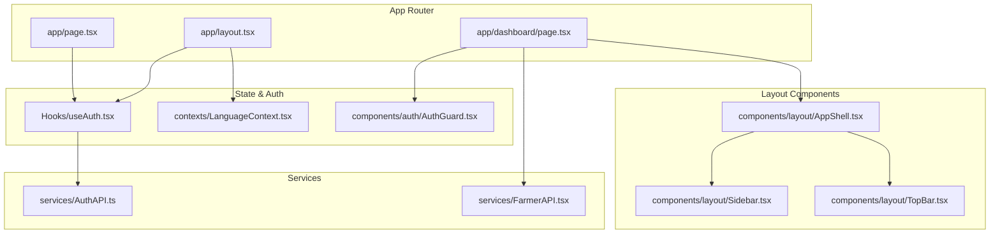
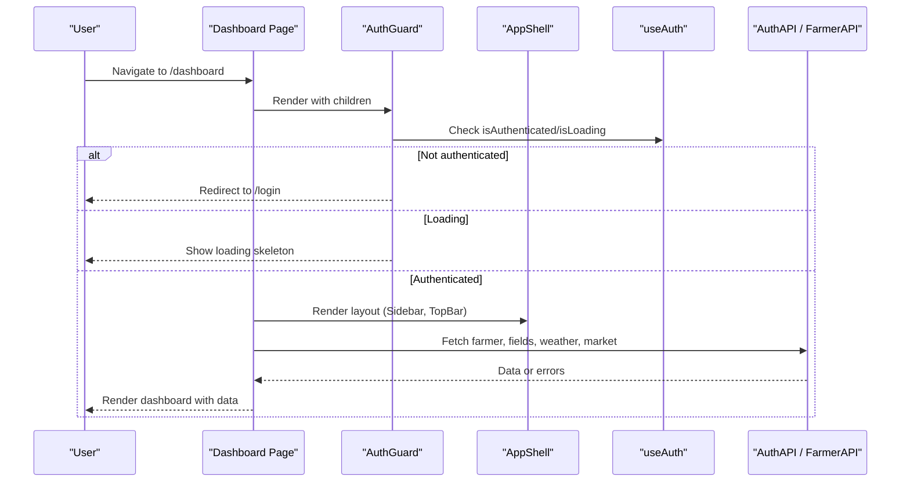
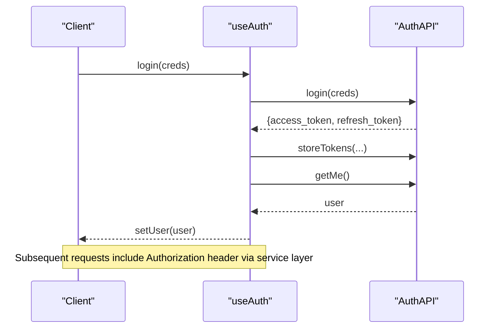
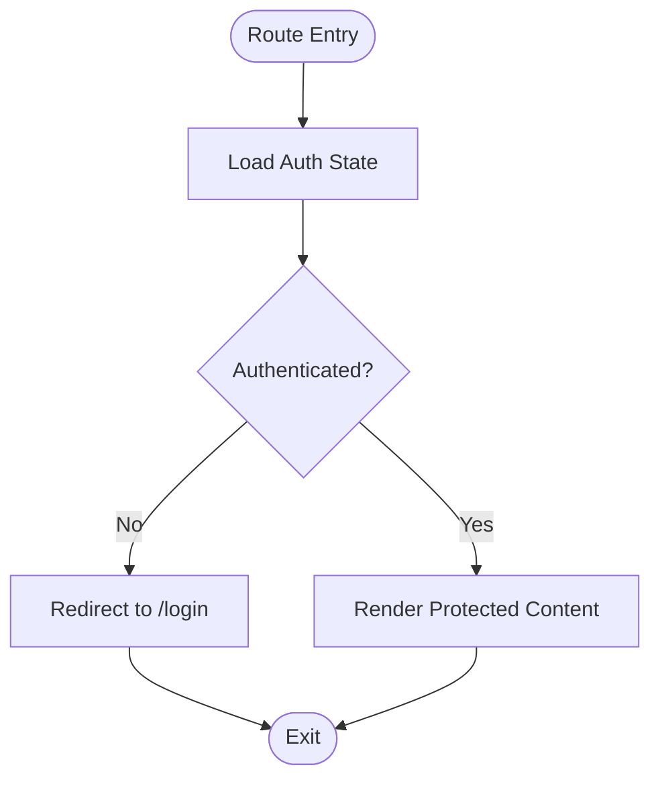
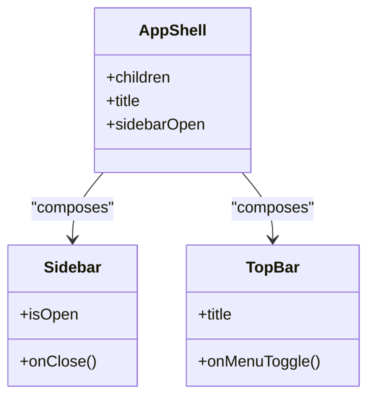
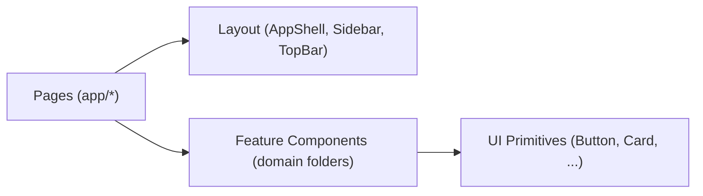
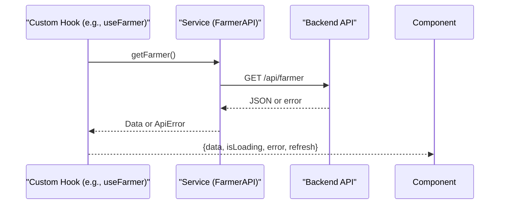
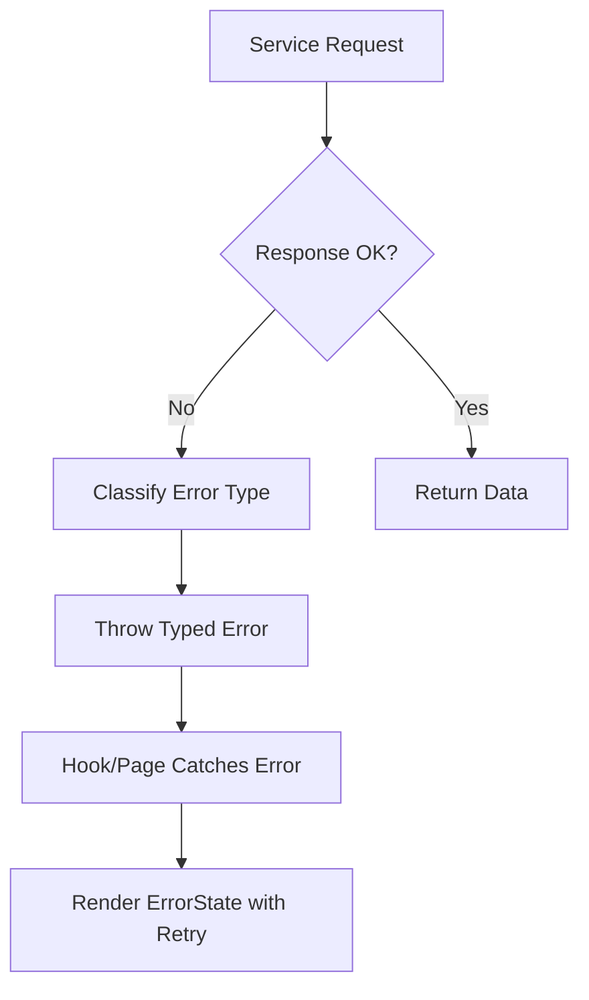
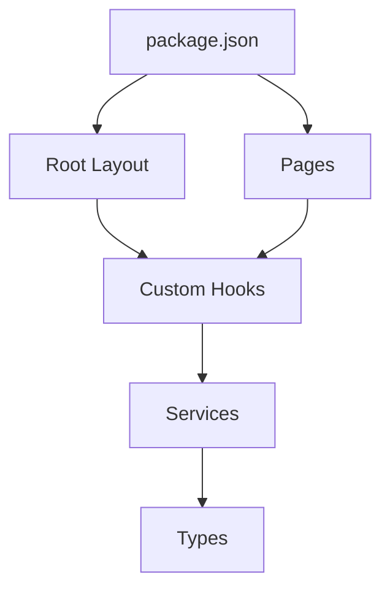

# Frontend Architecture

<cite>
**Referenced Files in This Document**
- [package.json](file://Frontend/greenflora/package.json)
- [README.md](file://Frontend/greenflora/README.md)
- [layout.tsx](file://Frontend/greenflora/app/layout.tsx)
- [page.tsx](file://Frontend/greenflora/app/page.tsx)
- [dashboard/page.tsx](file://Frontend/greenflora/app/dashboard/page.tsx)
- [AppShell.tsx](file://Frontend/greenflora/components/layout/AppShell.tsx)
- [Sidebar.tsx](file://Frontend/greenflora/components/layout/Sidebar.tsx)
- [TopBar.tsx](file://Frontend/greenflora/components/layout/TopBar.tsx)
- [AuthGuard.tsx](file://Frontend/greenflora/components/auth/AuthGuard.tsx)
- [useAuth.tsx](file://Frontend/greenflora/Hooks/useAuth.tsx)
- [LanguageContext.tsx](file://Frontend/greenflora/contexts/LanguageContext.tsx)
- [translations.ts](file://Frontend/greenflora/lib/translations.ts)
- [Button.tsx](file://Frontend/greenflora/components/ui/Button.tsx)
- [Card.tsx](file://Frontend/greenflora/components/ui/Card.tsx)
- [AuthAPI.ts](file://Frontend/greenflora/services/AuthAPI.ts)
- [FarmerAPI.tsx](file://Frontend/greenflora/services/FarmerAPI.tsx)
- [auth.ts](file://Frontend/greenflora/types/auth.ts)
</cite>

## Table of Contents
1. Introduction
2. Project Structure
3. Core Components
4. Architecture Overview
5. Detailed Component Analysis
6. Dependency Analysis
7. Performance Considerations
8. Troubleshooting Guide
9. Conclusion

## Introduction
This document explains the frontend architecture of Green Flora’s Next.js application. It covers the component-based design using React 19 with TypeScript, the separation between pages, components, hooks, and services, and how the Next.js App Router is used for routing and protected routes. It also documents state management via React Context and custom hooks, UI hierarchy from layout to feature components, responsive design with Tailwind CSS, accessibility considerations, client-side routing, data fetching strategies, error handling, and performance optimizations such as code splitting and efficient re-renders.

## Project Structure
The app follows a feature-oriented structure under the Next.js App Router:
- app/: Route segments (pages and layouts). Root layout sets up providers and global styles.
- components/: Reusable UI and layout components grouped by domain (layout, ui, auth, dashboard, fields, market, weather, assistant, cropDoctor, map, profile).
- Hooks/: Custom hooks encapsulating business logic and data fetching (authentication, farmer, fields, weather, market, assistant, government support, location).
- services/: API clients that centralize HTTP calls, token handling, timeouts, and error classification.
- contexts/: Global React contexts (e.g., language).
- lib/: Shared utilities (market utils, translations, data states).
- types/: TypeScript interfaces aligned with backend schemas.

**Diagram sources**
- [layout.tsx:1-95](file://Frontend/greenflora/app/layout.tsx#L1-L95)
- [page.tsx:1-35](file://Frontend/greenflora/app/page.tsx#L1-L35)
- [dashboard/page.tsx:1-238](file://Frontend/greenflora/app/dashboard/page.tsx#L1-L238)
- [AppShell.tsx:1-36](file://Frontend/greenflora/components/layout/AppShell.tsx#L1-L36)
- [Sidebar.tsx:1-188](file://Frontend/greenflora/components/layout/Sidebar.tsx#L1-L188)
- [TopBar.tsx:1-166](file://Frontend/greenflora/components/layout/TopBar.tsx#L1-L166)
- [useAuth.tsx:1-141](file://Frontend/greenflora/Hooks/useAuth.tsx#L1-L141)
- [LanguageContext.tsx:1-66](file://Frontend/greenflora/contexts/LanguageContext.tsx#L1-L66)
- [AuthGuard.tsx:1-59](file://Frontend/greenflora/components/auth/AuthGuard.tsx#L1-L59)
- [AuthAPI.ts:1-179](file://Frontend/greenflora/services/AuthAPI.ts#L1-L179)
- [FarmerAPI.tsx:1-109](file://Frontend/greenflora/services/FarmerAPI.tsx#L1-L109)

**Section sources**
- [README.md:1-37](file://Frontend/greenflora/README.md#L1-L37)
- [package.json:1-32](file://Frontend/greenflora/package.json#L1-L32)

## Core Components
- Root layout: Initializes fonts, injects a script to prevent React DOM crashes with Google Translate, wraps children with authentication and language providers, and configures global body classes.
- Authentication provider and hook: Manages user session, token persistence, login/signup/logout, and restores sessions on mount using refresh tokens when needed.
- Language context: Provides i18n state (English/Urdu), persists selection, toggles RTL direction, and exposes a translation function.
- Layout shell: Composes Sidebar and TopBar around page content; manages sidebar open/close state and responsive offset.
- Protected route guard: Renders loading while determining auth state, redirects unauthenticated users to login, and renders children only when authenticated.
- Dashboard page: Orchestrates multiple data hooks (farmer, fields, weather, market, assistant greeting), composes feature cards, and uses loading/error/empty states.

**Section sources**
- [layout.tsx:1-95](file://Frontend/greenflora/app/layout.tsx#L1-L95)
- [useAuth.tsx:1-141](file://Frontend/greenflora/Hooks/useAuth.tsx#L1-L141)
- [LanguageContext.tsx:1-66](file://Frontend/greenflora/contexts/LanguageContext.tsx#L1-L66)
- [AppShell.tsx:1-36](file://Frontend/greenflora/components/layout/AppShell.tsx#L1-L36)
- [AuthGuard.tsx:1-59](file://Frontend/greenflora/components/auth/AuthGuard.tsx#L1-L59)
- [dashboard/page.tsx:1-238](file://Frontend/greenflora/app/dashboard/page.tsx#L1-L238)

## Architecture Overview
The application uses a layered approach:
- Presentation layer: Pages compose layout and feature components.
- State layer: React Context (auth, language) plus custom hooks encapsulate local and global state.
- Service layer: Centralized API clients handle HTTP requests, headers, timeouts, and errors.
- Routing: Next.js App Router with client-side navigation and guards for protected routes.

**Diagram sources**
- [dashboard/page.tsx:1-238](file://Frontend/greenflora/app/dashboard/page.tsx#L1-L238)
- [AuthGuard.tsx:1-59](file://Frontend/greenflora/components/auth/AuthGuard.tsx#L1-L59)
- [AppShell.tsx:1-36](file://Frontend/greenflora/components/layout/AppShell.tsx#L1-L36)
- [useAuth.tsx:1-141](file://Frontend/greenflora/Hooks/useAuth.tsx#L1-L141)
- [AuthAPI.ts:1-179](file://Frontend/greenflora/services/AuthAPI.ts#L1-L179)
- [FarmerAPI.tsx:1-109](file://Frontend/greenflora/services/FarmerAPI.tsx#L1-L109)

## Detailed Component Analysis

### Authentication Flow
- Provider initializes session on mount by reading stored tokens, calling getMe, and refreshing if necessary.
- Login/Signup store tokens and fetch user profile; Logout clears tokens and resets state.
- Client-side navigation after logout ensures clean redirect.

**Diagram sources**
- [useAuth.tsx:1-141](file://Frontend/greenflora/Hooks/useAuth.tsx#L1-L141)
- [AuthAPI.ts:1-179](file://Frontend/greenflora/services/AuthAPI.ts#L1-L179)

**Section sources**
- [useAuth.tsx:1-141](file://Frontend/greenflora/Hooks/useAuth.tsx#L1-L141)
- [AuthAPI.ts:1-179](file://Frontend/greenflora/services/AuthAPI.ts#L1-L179)
- [auth.ts:1-36](file://Frontend/greenflora/types/auth.ts#L1-L36)

### Protected Routes and Navigation Guards
- Root page redirects based on authentication status.
- AuthGuard prevents rendering protected content until authentication is resolved and redirects unauthenticated users.

**Diagram sources**
- [page.tsx:1-35](file://Frontend/greenflora/app/page.tsx#L1-L35)
- [AuthGuard.tsx:1-59](file://Frontend/greenflora/components/auth/AuthGuard.tsx#L1-L59)

**Section sources**
- [page.tsx:1-35](file://Frontend/greenflora/app/page.tsx#L1-L35)
- [AuthGuard.tsx:1-59](file://Frontend/greenflora/components/auth/AuthGuard.tsx#L1-L59)

### Layout Components (AppShell, Sidebar, TopBar)
- AppShell composes Sidebar and TopBar, managing mobile overlay and desktop offset.
- Sidebar provides navigation links and logout action; highlights active route.
- TopBar shows page title, profile menu, and logout; supports keyboard and click-outside dismissal.

**Diagram sources**
- [AppShell.tsx:1-36](file://Frontend/greenflora/components/layout/AppShell.tsx#L1-L36)
- [Sidebar.tsx:1-188](file://Frontend/greenflora/components/layout/Sidebar.tsx#L1-L188)
- [TopBar.tsx:1-166](file://Frontend/greenflora/components/layout/TopBar.tsx#L1-L166)

**Section sources**
- [AppShell.tsx:1-36](file://Frontend/greenflora/components/layout/AppShell.tsx#L1-L36)
- [Sidebar.tsx:1-188](file://Frontend/greenflora/components/layout/Sidebar.tsx#L1-L188)
- [TopBar.tsx:1-166](file://Frontend/greenflora/components/layout/TopBar.tsx#L1-L166)

### UI Component Hierarchy
- Base UI primitives: Button, Card, Input, Select, Badge, EmptyState, ErrorState, LoadingState.
- Feature-specific components are organized by domain folders (dashboard, fields, market, weather, assistant, cropDoctor, map, profile).
- Pages compose these components to build feature screens.

**Diagram sources**
- [Button.tsx:1-75](file://Frontend/greenflora/components/ui/Button.tsx#L1-L75)
- [Card.tsx:1-39](file://Frontend/greenflora/components/ui/Card.tsx#L1-L39)
- [dashboard/page.tsx:1-238](file://Frontend/greenflora/app/dashboard/page.tsx#L1-L238)

**Section sources**
- [Button.tsx:1-75](file://Frontend/greenflora/components/ui/Button.tsx#L1-L75)
- [Card.tsx:1-39](file://Frontend/greenflora/components/ui/Card.tsx#L1-L39)
- [dashboard/page.tsx:1-238](file://Frontend/greenflora/app/dashboard/page.tsx#L1-L238)

### Responsive Design and Accessibility
- Responsive patterns: Tailwind utility classes control layout shifts (e.g., sidebar offset on md+), grid breakpoints, spacing, and typography scaling.
- Mobile-first behaviors: Sidebar collapses into an overlay on small screens; TopBar includes a hamburger toggle.
- Accessibility: ARIA attributes on menus and buttons, focus-visible rings, semantic roles (menu, menuitem), keyboard support (Escape to close dropdowns), and screen-reader-friendly labels.

**Section sources**
- [Sidebar.tsx:1-188](file://Frontend/greenflora/components/layout/Sidebar.tsx#L1-L188)
- [TopBar.tsx:1-166](file://Frontend/greenflora/components/layout/TopBar.tsx#L1-L166)
- [Button.tsx:1-75](file://Frontend/greenflora/components/ui/Button.tsx#L1-L75)

### Client-Side Routing and Data Fetching
- Routing: Next.js App Router with client-side navigation via next/navigation. Root page redirects based on auth state; protected pages use AuthGuard.
- Data fetching: Custom hooks call service functions which perform fetch with timeouts and error classification. Hooks expose loading, error, and refresh actions.

**Diagram sources**
- [FarmerAPI.tsx:1-109](file://Frontend/greenflora/services/FarmerAPI.tsx#L1-L109)

**Section sources**
- [dashboard/page.tsx:1-238](file://Frontend/greenflora/app/dashboard/page.tsx#L1-L238)
- [FarmerAPI.tsx:1-109](file://Frontend/greenflora/services/FarmerAPI.tsx#L1-L109)

### Error Handling and Boundaries
- Service layer throws typed errors (network, timeout, validation, server) with status codes for consistent handling.
- Hooks catch errors and expose them to components; pages render ErrorState with retry actions.
- Auth flow handles expired tokens by attempting refresh and clearing tokens on failure.

**Diagram sources**
- [AuthAPI.ts:1-179](file://Frontend/greenflora/services/AuthAPI.ts#L1-L179)
- [FarmerAPI.tsx:1-109](file://Frontend/greenflora/services/FarmerAPI.tsx#L1-L109)
- [dashboard/page.tsx:1-238](file://Frontend/greenflora/app/dashboard/page.tsx#L1-L238)

**Section sources**
- [AuthAPI.ts:1-179](file://Frontend/greenflora/services/AuthAPI.ts#L1-L179)
- [FarmerAPI.tsx:1-109](file://Frontend/greenflora/services/FarmerAPI.tsx#L1-L109)
- [dashboard/page.tsx:1-238](file://Frontend/greenflora/app/dashboard/page.tsx#L1-L238)

## Dependency Analysis
- package.json declares React 19, Next.js 16, Tailwind CSS v4, and libraries for maps and charts.
- The root layout depends on font providers and scripts; pages depend on layout and feature components; hooks depend on services; services depend on environment variables and shared types.

**Diagram sources**
- [package.json:1-32](file://Frontend/greenflora/package.json#L1-L32)
- [layout.tsx:1-95](file://Frontend/greenflora/app/layout.tsx#L1-L95)
- [useAuth.tsx:1-141](file://Frontend/greenflora/Hooks/useAuth.tsx#L1-L141)
- [AuthAPI.ts:1-179](file://Frontend/greenflora/services/AuthAPI.ts#L1-L179)
- [auth.ts:1-36](file://Frontend/greenflora/types/auth.ts#L1-L36)

**Section sources**
- [package.json:1-32](file://Frontend/greenflora/package.json#L1-L32)

## Performance Considerations
- Code splitting: Next.js automatically splits code per route; keep heavy features (maps, charts) within their route modules to benefit from lazy loading.
- Efficient re-renders: Use memoization in hooks where appropriate; pass stable props; avoid unnecessary state updates.
- Data fetching: Centralized services reduce duplicate fetches; hooks expose refresh actions to minimize redundant network calls.
- Assets and fonts: Fonts are preloaded via next/font; third-party scripts load after interactive to avoid blocking.
- UI responsiveness: Tailwind utility classes enable lightweight responsive behavior without heavy media queries.

[No sources needed since this section provides general guidance]

## Troubleshooting Guide
- Authentication issues:
  - If session restore fails, ensure refresh token exists; otherwise tokens are cleared and user redirected to login.
  - Verify environment variable for API base URL is set correctly.
- Network errors:
  - Requests have a timeout; check connectivity and backend availability.
  - Errors are classified; surface user-friendly messages via ErrorState.
- Language switching:
  - Ensure localStorage contains a valid language key; document.documentElement.lang and dir update accordingly.
- UI interactions:
  - Dropdowns close on Escape or outside clicks; verify event listeners are attached and removed properly.

**Section sources**
- [useAuth.tsx:1-141](file://Frontend/greenflora/Hooks/useAuth.tsx#L1-L141)
- [AuthAPI.ts:1-179](file://Frontend/greenflora/services/AuthAPI.ts#L1-L179)
- [FarmerAPI.tsx:1-109](file://Frontend/greenflora/services/FarmerAPI.tsx#L1-L109)
- [LanguageContext.tsx:1-66](file://Frontend/greenflora/contexts/LanguageContext.tsx#L1-L66)
- [TopBar.tsx:1-166](file://Frontend/greenflora/components/layout/TopBar.tsx#L1-L166)

## Conclusion
Green Flora’s frontend leverages a clear separation of concerns: pages orchestrate features, layout components provide consistent chrome, custom hooks encapsulate state and data fetching, and services standardize API interactions. The Next.js App Router enables efficient routing with client-side guards for protected areas. Tailwind CSS delivers responsive design, and accessibility is integrated throughout. The architecture supports maintainability, scalability, and performance through code splitting, centralized error handling, and efficient re-render patterns.

[No sources needed since this section summarizes without analyzing specific files]