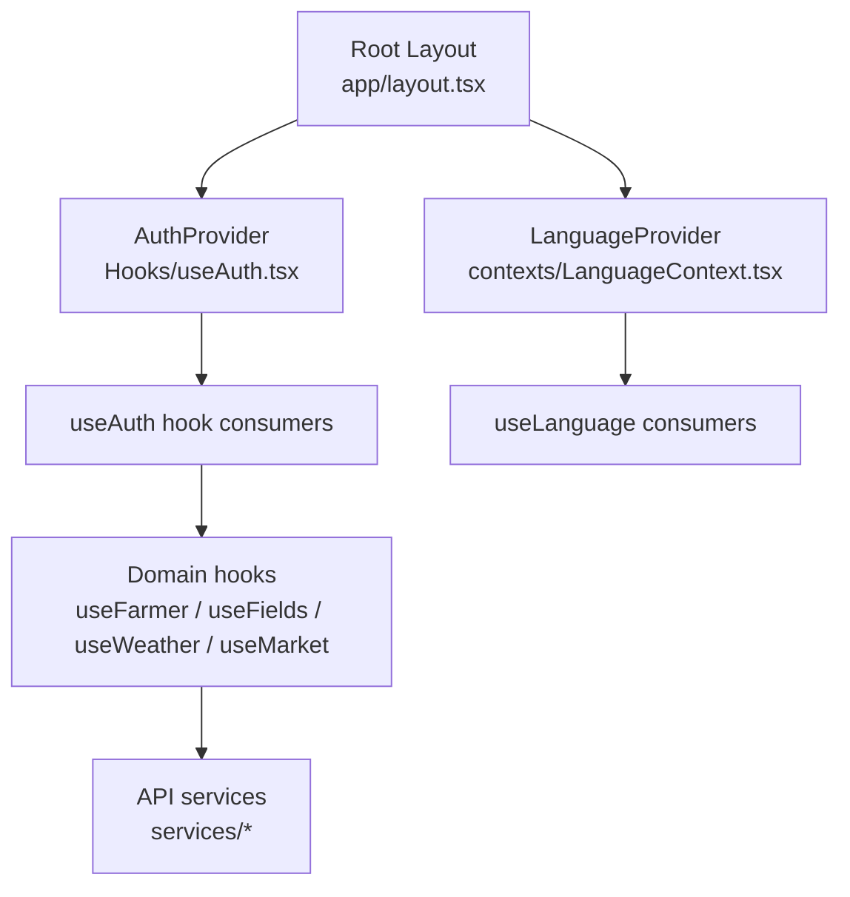
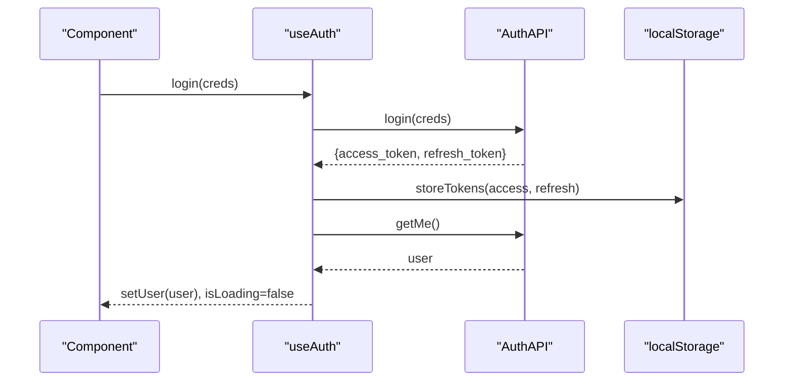
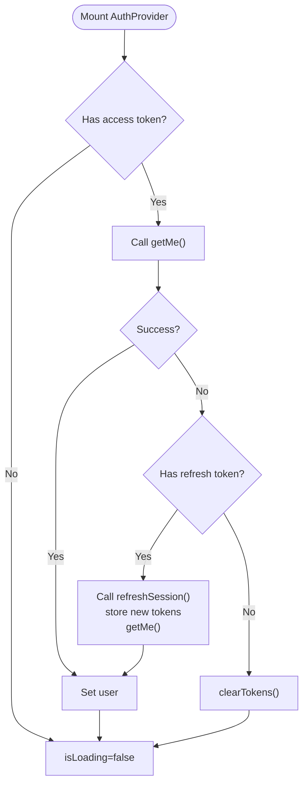
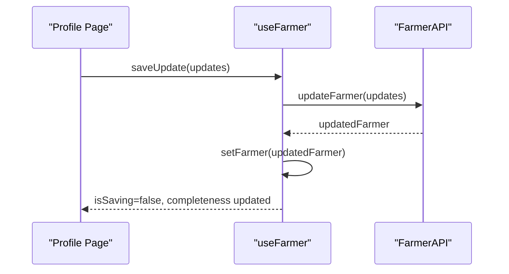
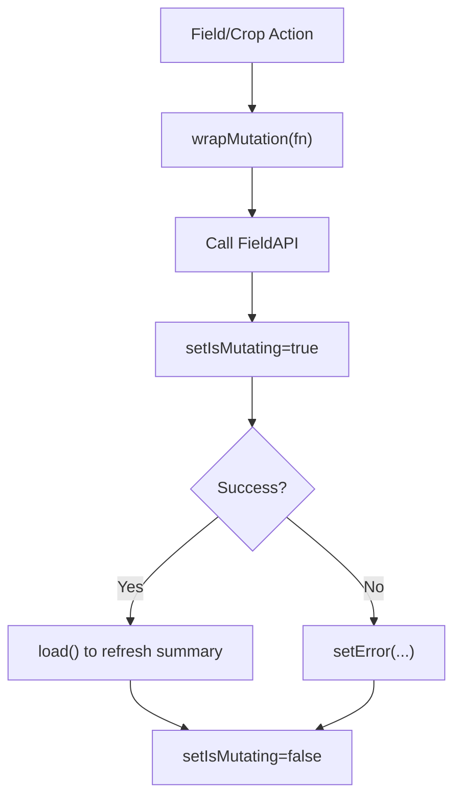
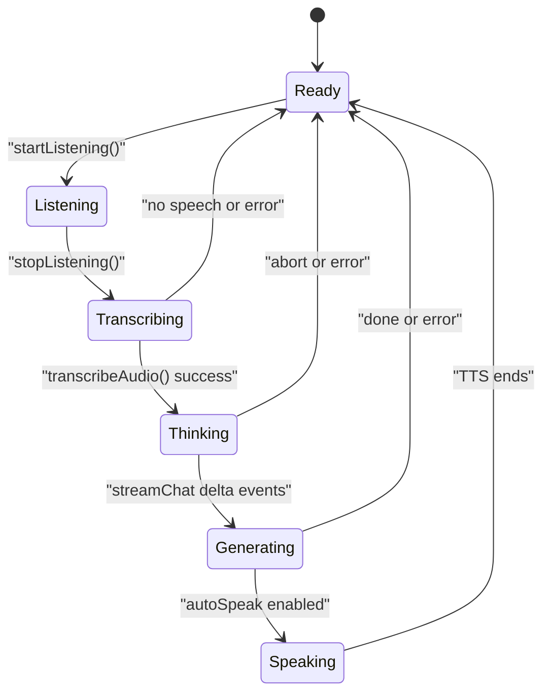
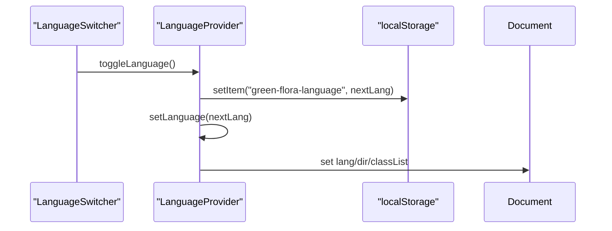
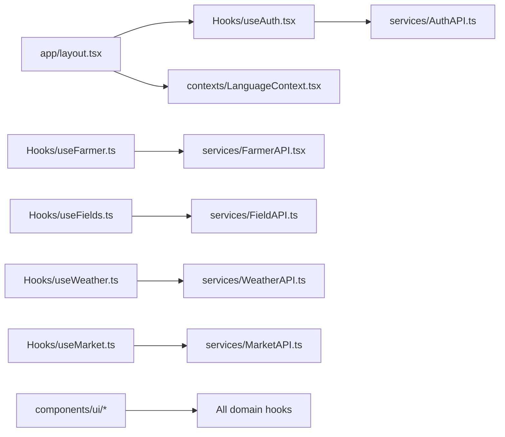

# State Management

<cite>
**Referenced Files in This Document**
- [useAuth.tsx](file://Frontend/greenflora/Hooks/useAuth.tsx)
- [LanguageContext.tsx](file://Frontend/greenflora/contexts/LanguageContext.tsx)
- [useFarmer.ts](file://Frontend/greenflora/Hooks/useFarmer.ts)
- [useFields.ts](file://Frontend/greenflora/Hooks/useFields.ts)
- [useAssistant.ts](file://Frontend/greenflora/Hooks/useAssistant.ts)
- [useWeather.ts](file://Frontend/greenflora/Hooks/useWeather.ts)
- [useMarket.ts](file://Frontend/greenflora/Hooks/useMarket.ts)
- [dataStates.ts](file://Frontend/greenflora/lib/dataStates.ts)
- [translations.ts](file://Frontend/greenflora/lib/translations.ts)
- [AuthAPI.ts](file://Frontend/greenflora/services/AuthAPI.ts)
- [layout.tsx](file://Frontend/greenflora/app/layout.tsx)
- [LoadingState.tsx](file://Frontend/greenflora/components/ui/LoadingState.tsx)
- [ErrorState.tsx](file://Frontend/greenflora/components/ui/ErrorState.tsx)
</cite>

## Table of Contents
1. Introduction
2. Project Structure
3. Core Components
4. Architecture Overview
5. Detailed Component Analysis
6. Dependency Analysis
7. Performance Considerations
8. Troubleshooting Guide
9. Conclusion

## Introduction
This document explains Green-Flora’s state management approach built on React Context and custom hooks. It covers:
- Authentication state with useAuth for sessions, tokens, and user lifecycle
- Domain-specific hooks useFarmer and useFields for farmer profiles and field data
- Internationalization via LanguageContext and translations
- Patterns for local component state, server state synchronization, error handling, and loading states
- Performance considerations including memoization, re-render optimization, and efficient updates

## Project Structure
Green-Flora organizes state logic into reusable hooks under Hooks/, shared contexts under contexts/, API clients under services/, and UI primitives under components/ui/. The root layout wraps the app with providers to make global state available throughout the tree.

**Diagram sources**
- [layout.tsx:23-67](file://Frontend/greenflora/app/layout.tsx#L23-L67)
- [useAuth.tsx:46-128](file://Frontend/greenflora/Hooks/useAuth.tsx#L46-L128)
- [LanguageContext.tsx:24-58](file://Frontend/greenflora/contexts/LanguageContext.tsx#L24-L58)

**Section sources**
- [layout.tsx:23-67](file://Frontend/greenflora/app/layout.tsx#L23-L67)

## Core Components
- Auth provider and hook manage authentication state, token persistence, session restoration, and logout.
- Language provider manages current language, persists preference, applies RTL/LTR direction, and exposes a translation function.
- Domain hooks encapsulate server state (loading, error, data), expose refresh actions, and handle mutations with optimistic or post-mutation refresh patterns.
- Shared utilities provide safe display helpers and profile completeness calculation.

Key responsibilities:
- Centralize side effects and network calls inside hooks
- Keep UI components free of imperative fetch logic
- Provide consistent loading/error UX across features

**Section sources**
- [useAuth.tsx:31-140](file://Frontend/greenflora/Hooks/useAuth.tsx#L31-L140)
- [LanguageContext.tsx:15-66](file://Frontend/greenflora/contexts/LanguageContext.tsx#L15-L66)
- [useFarmer.ts:20-87](file://Frontend/greenflora/Hooks/useFarmer.ts#L20-L87)
- [useFields.ts:25-158](file://Frontend/greenflora/Hooks/useFields.ts#L25-L158)
- [dataStates.ts:9-53](file://Frontend/greenflora/lib/dataStates.ts#L9-L53)

## Architecture Overview
The application uses a layered architecture:
- Providers at the root supply global context (auth, language)
- Custom hooks own feature-level state and orchestrate API calls
- Services abstract HTTP requests, errors, and token handling
- UI components consume hooks and render based on state

**Diagram sources**
- [useAuth.tsx:90-103](file://Frontend/greenflora/Hooks/useAuth.tsx#L90-L103)
- [AuthAPI.ts:150-178](file://Frontend/greenflora/services/AuthAPI.ts#L150-L178)

**Section sources**
- [useAuth.tsx:46-128](file://Frontend/greenflora/Hooks/useAuth.tsx#L46-L128)
- [AuthAPI.ts:72-137](file://Frontend/greenflora/services/AuthAPI.ts#L72-L137)

## Detailed Component Analysis

### Authentication with useAuth
- Provides user, loading, isAuthenticated, and actions: login, signup, logout
- On mount, restores session by reading stored tokens, calling getMe, and refreshing if needed
- Stores tokens exclusively through AuthAPI; never touches storage directly in the hook
- Memoizes context value to minimize re-renders

**Diagram sources**
- [useAuth.tsx:50-88](file://Frontend/greenflora/Hooks/useAuth.tsx#L50-L88)
- [AuthAPI.ts:157-178](file://Frontend/greenflora/services/AuthAPI.ts#L157-L178)

**Section sources**
- [useAuth.tsx:46-140](file://Frontend/greenflora/Hooks/useAuth.tsx#L46-L140)
- [AuthAPI.ts:28-46](file://Frontend/greenflora/services/AuthAPI.ts#L28-L46)

### Farmer Profile with useFarmer
- Loads farmer profile once on mount; exposes refresh and saveUpdate
- Tracks loading, saving, error, and calculates completeness using shared utility
- Updates local state after successful mutation

**Diagram sources**
- [useFarmer.ts:57-76](file://Frontend/greenflora/Hooks/useFarmer.ts#L57-L76)
- [dataStates.ts:43-53](file://Frontend/greenflora/lib/dataStates.ts#L43-L53)

**Section sources**
- [useFarmer.ts:34-87](file://Frontend/greenflora/Hooks/useFarmer.ts#L34-L87)
- [dataStates.ts:9-53](file://Frontend/greenflora/lib/dataStates.ts#L9-L53)

### Fields and Crop Cycles with useFields
- Manages farm summary (fields + crop distribution) and CRUD for fields and crop cycles
- Uses a wrapMutation helper to centralize mutating state and then refreshes summary
- Exposes isMutating flag for UI feedback during any mutation

**Diagram sources**
- [useFields.ts:74-143](file://Frontend/greenflora/Hooks/useFields.ts#L74-L143)

**Section sources**
- [useFields.ts:51-158](file://Frontend/greenflora/Hooks/useFields.ts#L51-L158)

### Assistant Chat and Voice with useAssistant
- Implements a phase machine: ready → listening → transcribing → thinking → generating → speaking → ready
- Streams assistant replies and supports voice capture, transcription, and TTS playback
- Handles failures gracefully: transcription/TTS errors do not block text flow; chat errors are attached per message with retry

**Diagram sources**
- [useAssistant.ts:42-49](file://Frontend/greenflora/Hooks/useAssistant.ts#L42-L49)
- [useAssistant.ts:285-455](file://Frontend/greenflora/Hooks/useAssistant.ts#L285-L455)

**Section sources**
- [useAssistant.ts:160-657](file://Frontend/greenflora/Hooks/useAssistant.ts#L160-L657)

### Weather Data with useWeather
- Fetches weather for given coordinates; returns data, loading, error, and refresh
- Skips fetching when coordinates are missing; sets empty state accordingly

**Section sources**
- [useWeather.ts:21-57](file://Frontend/greenflora/Hooks/useWeather.ts#L21-L57)

### Market Data with useMarket
- useMarketCommodities loads available commodities and availability flag
- useMarketOverview caches results keyed by commodity+market filters and guards against out-of-order responses using request IDs

**Section sources**
- [useMarket.ts:33-64](file://Frontend/greenflora/Hooks/useMarket.ts#L33-L64)
- [useMarket.ts:80-134](file://Frontend/greenflora/Hooks/useMarket.ts#L80-L134)

### Internationalization with LanguageContext
- Persists selected language in localStorage
- Applies lang and dir attributes and CSS class for RTL support
- Provides t(key) to resolve localized strings from translations

**Diagram sources**
- [LanguageContext.tsx:24-58](file://Frontend/greenflora/contexts/LanguageContext.tsx#L24-L58)
- [translations.ts:1-32](file://Frontend/greenflora/lib/translations.ts#L1-L32)

**Section sources**
- [LanguageContext.tsx:15-66](file://Frontend/greenflora/contexts/LanguageContext.tsx#L15-L66)
- [translations.ts:1-32](file://Frontend/greenflora/lib/translations.ts#L1-L32)

## Dependency Analysis
- Root layout composes providers: AuthProvider wraps LanguageProvider so auth can be used anywhere, while language is also globally available.
- Hooks depend on services for network operations; services centralize error mapping and token injection.
- UI components rely on hooks for state and use shared LoadingState/ErrorState for consistent UX.

**Diagram sources**
- [layout.tsx:63-67](file://Frontend/greenflora/app/layout.tsx#L63-L67)
- [useAuth.tsx:24-26](file://Frontend/greenflora/Hooks/useAuth.tsx#L24-L26)
- [useFarmer.ts:14-18](file://Frontend/greenflora/Hooks/useFarmer.ts#L14-L18)
- [useFields.ts:13-23](file://Frontend/greenflora/Hooks/useFields.ts#L13-L23)
- [useWeather.ts:10-12](file://Frontend/greenflora/Hooks/useWeather.ts#L10-L12)
- [useMarket.ts:15-23](file://Frontend/greenflora/Hooks/useMarket.ts#L15-L23)

**Section sources**
- [layout.tsx:63-67](file://Frontend/greenflora/app/layout.tsx#L63-L67)

## Performance Considerations
- Memoization
  - useAuth memoizes context value to avoid unnecessary re-renders when only stable functions are passed down.
  - useFarmer computes completeness with useMemo to avoid recalculations on unrelated updates.
- Efficient updates
  - useFields centralizes mutation state with wrapMutation and refreshes once after each mutation to keep UI consistent.
  - useMarketOverview uses a request ID guard to ignore stale responses when filters change rapidly.
- Streaming and incremental updates
  - useAssistant streams deltas and updates messages incrementally, minimizing perceived latency.
- External snapshots
  - useAssistant reads microphone capability via an external snapshot to avoid hydration mismatches and unnecessary re-renders.
- Token and language persistence
  - Tokens and language preference are persisted to reduce redundant network calls and improve startup performance.

[No sources needed since this section provides general guidance]

## Troubleshooting Guide
Common issues and how the code handles them:
- Authentication
  - Expired access token triggers refresh flow; on failure, tokens are cleared and user logged out.
  - Network or timeout errors are wrapped in typed errors for better UX.
- Farmer and Fields
  - Errors during load/save are surfaced to users with friendly messages; UI can offer retry via exposed refresh actions.
- Assistant
  - Transcription failures show a notice but allow typing; TTS failures fail quietly without breaking text reply; streaming interruptions mark messages as retryable.
- Weather and Market
  - Missing coordinates short-circuit weather fetch; market overview ignores outdated responses to prevent flicker.

Patterns to follow:
- Always expose refresh actions from hooks to enable retry flows
- Use LoadingState and ErrorState components for consistent UX
- Keep side effects isolated in hooks; let components stay presentational

**Section sources**
- [useAuth.tsx:50-88](file://Frontend/greenflora/Hooks/useAuth.tsx#L50-L88)
- [AuthAPI.ts:72-137](file://Frontend/greenflora/services/AuthAPI.ts#L72-L137)
- [useFarmer.ts:40-68](file://Frontend/greenflora/Hooks/useFarmer.ts#L40-L68)
- [useFields.ts:57-143](file://Frontend/greenflora/Hooks/useFields.ts#L57-L143)
- [useAssistant.ts:221-255](file://Frontend/greenflora/Hooks/useAssistant.ts#L221-L255)
- [useWeather.ts:29-50](file://Frontend/greenflora/Hooks/useWeather.ts#L29-L50)
- [useMarket.ts:99-127](file://Frontend/greenflora/Hooks/useMarket.ts#L99-L127)
- [LoadingState.tsx:45-56](file://Frontend/greenflora/components/ui/LoadingState.tsx#L45-L56)
- [ErrorState.tsx:11-38](file://Frontend/greenflora/components/ui/ErrorState.tsx#L11-L38)

## Conclusion
Green-Flora’s state management combines React Context for global concerns (authentication, language) with custom hooks for domain-specific server state. This pattern yields:
- Clear separation of concerns between UI and data flow
- Consistent loading and error handling across features
- Robust session management with token refresh
- Scalable internationalization with persistent preferences
- Performant updates via memoization, streaming, and request guards

Adopting these patterns ensures maintainability, resilience, and a smooth user experience as the application grows.