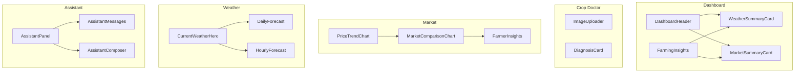
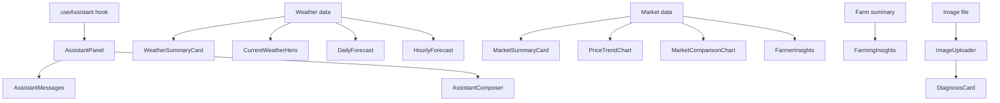
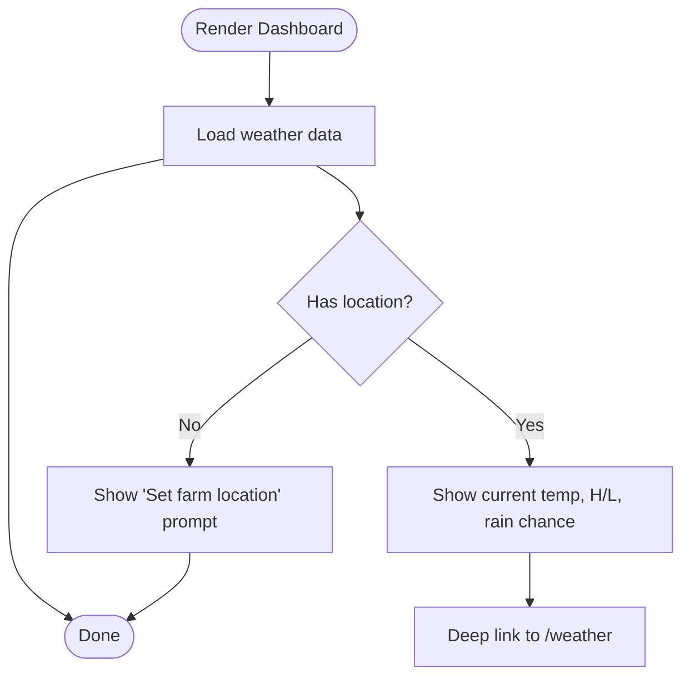
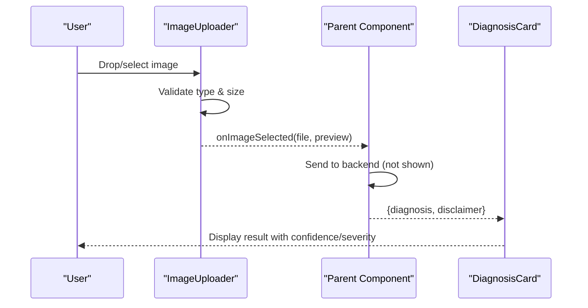
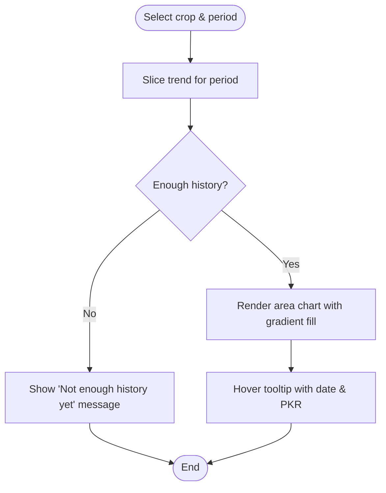
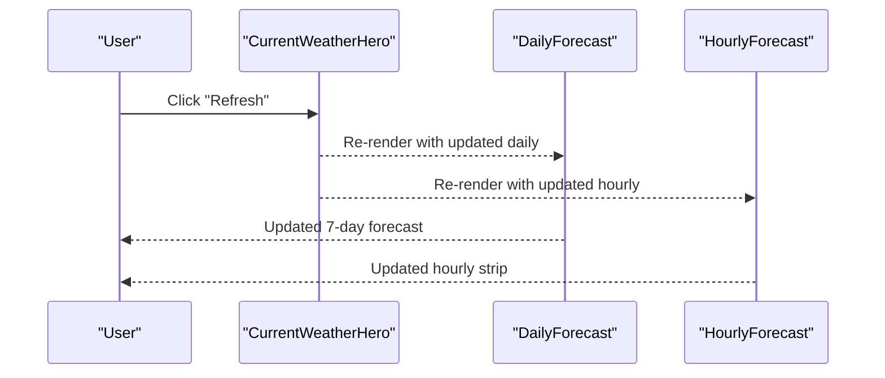
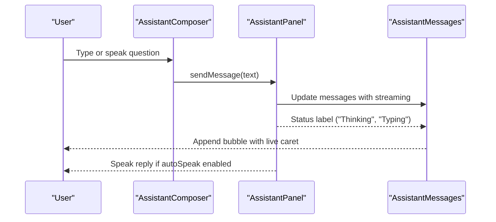
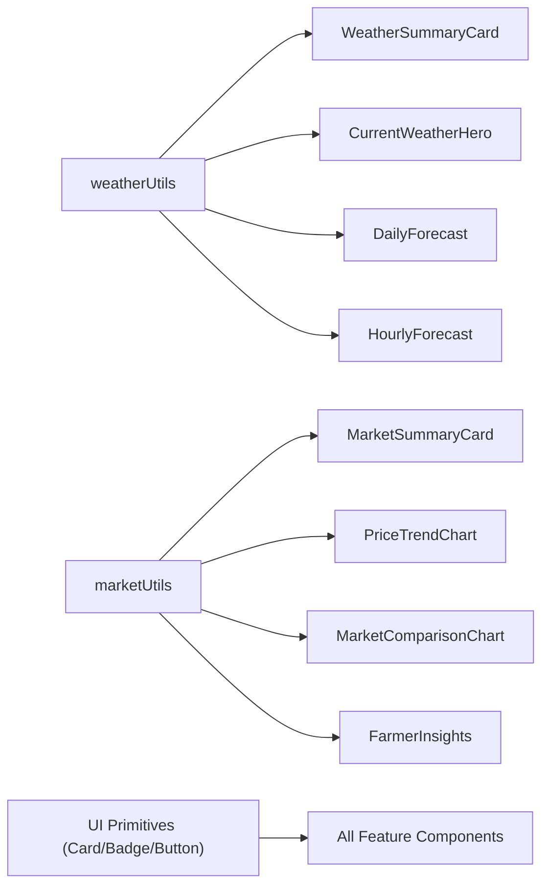

# UI Components

<cite>
**Referenced Files in This Document**
- [DashboardHeader.tsx](file://Frontend/greenflora/components/dashboard/DashboardHeader.tsx)
- [WeatherSummaryCard.tsx](file://Frontend/greenflora/components/dashboard/WeatherSummaryCard.tsx)
- [MarketSummaryCard.tsx](file://Frontend/greenflora/components/dashboard/MarketSummaryCard.tsx)
- [FarmingInsights.tsx](file://Frontend/greenflora/components/dashboard/FarmingInsights.tsx)
- [ImageUploader.tsx](file://Frontend/greenflora/components/cropDoctor/ImageUploader.tsx)
- [DiagnosisCard.tsx](file://Frontend/greenflora/components/cropDoctor/DiagnosisCard.tsx)
- [PriceTrendChart.tsx](file://Frontend/greenflora/components/market/PriceTrendChart.tsx)
- [MarketComparisonChart.tsx](file://Frontend/greenflora/components/market/MarketComparisonChart.tsx)
- [FarmerInsights.tsx](file://Frontend/greenflora/components/market/FarmerInsights.tsx)
- [CurrentWeatherHero.tsx](file://Frontend/greenflora/components/weather/CurrentWeatherHero.tsx)
- [DailyForecast.tsx](file://Frontend/greenflora/components/weather/DailyForecast.tsx)
- [HourlyForecast.tsx](file://Frontend/greenflora/components/weather/HourlyForecast.tsx)
- [AssistantPanel.tsx](file://Frontend/greenflora/components/assistant/AssistantPanel.tsx)
- [AssistantMessages.tsx](file://Frontend/greenflora/components/assistant/AssistantMessages.tsx)
- [AssistantComposer.tsx](file://Frontend/greenflora/components/assistant/AssistantComposer.tsx)
</cite>

## Table of Contents
1. Introduction
2. Project Structure
3. Core Components
4. Architecture Overview
5. Detailed Component Analysis
6. Dependency Analysis
7. Performance Considerations
8. Troubleshooting Guide
9. Conclusion

## Introduction
This document provides comprehensive, feature-focused documentation for Green-Flora’s UI components. It covers:
- Dashboard components for farm overview, weather summary, and market insights
- Crop Doctor interface for image upload and diagnosis display
- Market analysis components including price charts and trend visualizations
- Weather interface components showing forecasts and agricultural alerts
- Assistant chat interface for conversational AI interaction

It includes usage examples, customization options, and responsive design patterns to help developers integrate and extend these components effectively.

## Project Structure
Green-Flora organizes UI by feature under Frontend/greenflora/components:
- dashboard: hero header, insight cards, weather and market summaries
- cropDoctor: image uploader and diagnosis card
- market: price trends, comparisons, and farmer insights
- weather: current conditions hero, daily and hourly forecasts
- assistant: panel, messages, and composer for voice/text chat

**Diagram sources**
- [DashboardHeader.tsx:1-238](file://Frontend/greenflora/components/dashboard/DashboardHeader.tsx#L1-L238)
- [WeatherSummaryCard.tsx:1-125](file://Frontend/greenflora/components/dashboard/WeatherSummaryCard.tsx#L1-L125)
- [MarketSummaryCard.tsx:1-90](file://Frontend/greenflora/components/dashboard/MarketSummaryCard.tsx#L1-L90)
- [FarmingInsights.tsx:1-345](file://Frontend/greenflora/components/dashboard/FarmingInsights.tsx#L1-L345)
- [ImageUploader.tsx:1-195](file://Frontend/greenflora/components/cropDoctor/ImageUploader.tsx#L1-L195)
- [DiagnosisCard.tsx:1-193](file://Frontend/greenflora/components/cropDoctor/DiagnosisCard.tsx#L1-L193)
- [PriceTrendChart.tsx:1-223](file://Frontend/greenflora/components/market/PriceTrendChart.tsx#L1-L223)
- [MarketComparisonChart.tsx:1-202](file://Frontend/greenflora/components/market/MarketComparisonChart.tsx#L1-L202)
- [FarmerInsights.tsx:1-64](file://Frontend/greenflora/components/market/FarmerInsights.tsx#L1-L64)
- [CurrentWeatherHero.tsx:1-115](file://Frontend/greenflora/components/weather/CurrentWeatherHero.tsx#L1-L115)
- [DailyForecast.tsx:1-105](file://Frontend/greenflora/components/weather/DailyForecast.tsx#L1-L105)
- [HourlyForecast.tsx:1-80](file://Frontend/greenflora/components/weather/HourlyForecast.tsx#L1-L80)
- [AssistantPanel.tsx:1-179](file://Frontend/greenflora/components/assistant/AssistantPanel.tsx#L1-L179)
- [AssistantMessages.tsx:1-233](file://Frontend/greenflora/components/assistant/AssistantMessages.tsx#L1-L233)
- [AssistantComposer.tsx:1-164](file://Frontend/greenflora/components/assistant/AssistantComposer.tsx#L1-L164)

**Section sources**
- [DashboardHeader.tsx:1-238](file://Frontend/greenflora/components/dashboard/DashboardHeader.tsx#L1-L238)
- [WeatherSummaryCard.tsx:1-125](file://Frontend/greenflora/components/dashboard/WeatherSummaryCard.tsx#L1-L125)
- [MarketSummaryCard.tsx:1-90](file://Frontend/greenflora/components/dashboard/MarketSummaryCard.tsx#L1-L90)
- [FarmingInsights.tsx:1-345](file://Frontend/greenflora/components/dashboard/FarmingInsights.tsx#L1-L345)
- [ImageUploader.tsx:1-195](file://Frontend/greenflora/components/cropDoctor/ImageUploader.tsx#L1-L195)
- [DiagnosisCard.tsx:1-193](file://Frontend/greenflora/components/cropDoctor/DiagnosisCard.tsx#L1-L193)
- [PriceTrendChart.tsx:1-223](file://Frontend/greenflora/components/market/PriceTrendChart.tsx#L1-L223)
- [MarketComparisonChart.tsx:1-202](file://Frontend/greenflora/components/market/MarketComparisonChart.tsx#L1-L202)
- [FarmerInsights.tsx:1-64](file://Frontend/greenflora/components/market/FarmerInsights.tsx#L1-L64)
- [CurrentWeatherHero.tsx:1-115](file://Frontend/greenflora/components/weather/CurrentWeatherHero.tsx#L1-L115)
- [DailyForecast.tsx:1-105](file://Frontend/greenflora/components/weather/DailyForecast.tsx#L1-L105)
- [HourlyForecast.tsx:1-80](file://Frontend/greenflora/components/weather/HourlyForecast.tsx#L1-L80)
- [AssistantPanel.tsx:1-179](file://Frontend/greenflora/components/assistant/AssistantPanel.tsx#L1-L179)
- [AssistantMessages.tsx:1-233](file://Frontend/greenflora/components/assistant/AssistantMessages.tsx#L1-L233)
- [AssistantComposer.tsx:1-164](file://Frontend/greenflora/components/assistant/AssistantComposer.tsx#L1-L164)

## Core Components
- Dashboard Header: Rotating hero with bilingual scenes and date; supports RTL alignment for Urdu mode.
- Weather Summary Card: Compact view of current temperature, high/low, rain chance; deep links to full weather page.
- Market Summary Card: Latest AMIS price for the farmer’s crop; deep links to market page.
- Farming Insights: Three insight cards (weather, crops, market) built from live data with graceful fallbacks.

Usage examples:
- Pass weather and market props to WeatherSummaryCard and MarketSummaryCard to render localized summaries.
- Compose FarmingInsights with weather, farm summary, and commodity data to show contextual advice.

Customization options:
- DashboardHeader accepts farmerName, greeting, and isDemo flags; scene rotation interval and language filtering are internal.
- WeatherSummaryCard and MarketSummaryCard accept loading/error states and data availability flags.

Responsive design patterns:
- Cards use flexible grids and truncation for long text.
- Hero uses gradient overlays and adaptive typography across breakpoints.

**Section sources**
- [DashboardHeader.tsx:19-238](file://Frontend/greenflora/components/dashboard/DashboardHeader.tsx#L19-L238)
- [WeatherSummaryCard.tsx:18-125](file://Frontend/greenflora/components/dashboard/WeatherSummaryCard.tsx#L18-L125)
- [MarketSummaryCard.tsx:19-90](file://Frontend/greenflora/components/dashboard/MarketSummaryCard.tsx#L19-L90)
- [FarmingInsights.tsx:22-345](file://Frontend/greenflora/components/dashboard/FarmingInsights.tsx#L22-L345)

## Architecture Overview
The UI follows a component-driven architecture where each feature group composes smaller presentational components. Data flows from hooks/services into typed props, and components render stateful UI with consistent styling primitives.

**Diagram sources**
- [AssistantPanel.tsx:1-179](file://Frontend/greenflora/components/assistant/AssistantPanel.tsx#L1-L179)
- [AssistantMessages.tsx:1-233](file://Frontend/greenflora/components/assistant/AssistantMessages.tsx#L1-L233)
- [AssistantComposer.tsx:1-164](file://Frontend/greenflora/components/assistant/AssistantComposer.tsx#L1-L164)
- [WeatherSummaryCard.tsx:1-125](file://Frontend/greenflora/components/dashboard/WeatherSummaryCard.tsx#L1-L125)
- [CurrentWeatherHero.tsx:1-115](file://Frontend/greenflora/components/weather/CurrentWeatherHero.tsx#L1-L115)
- [DailyForecast.tsx:1-105](file://Frontend/greenflora/components/weather/DailyForecast.tsx#L1-L105)
- [HourlyForecast.tsx:1-80](file://Frontend/greenflora/components/weather/HourlyForecast.tsx#L1-L80)
- [MarketSummaryCard.tsx:1-90](file://Frontend/greenflora/components/dashboard/MarketSummaryCard.tsx#L1-L90)
- [PriceTrendChart.tsx:1-223](file://Frontend/greenflora/components/market/PriceTrendChart.tsx#L1-L223)
- [MarketComparisonChart.tsx:1-202](file://Frontend/greenflora/components/market/MarketComparisonChart.tsx#L1-L202)
- [FarmerInsights.tsx:1-64](file://Frontend/greenflora/components/market/FarmerInsights.tsx#L1-L64)
- [ImageUploader.tsx:1-195](file://Frontend/greenflora/components/cropDoctor/ImageUploader.tsx#L1-L195)
- [DiagnosisCard.tsx:1-193](file://Frontend/greenflora/components/cropDoctor/DiagnosisCard.tsx#L1-L193)

## Detailed Component Analysis

### Dashboard Components
- DashboardHeader: Rotates through curated scenes with bilingual support and RTL alignment; shows date and bottom message; accessible carousel indicators.
- WeatherSummaryCard: Shows current temp, high/low, rain chance; handles missing location, loading, and error states; links to /weather.
- MarketSummaryCard: Displays latest AMIS price for the farmer’s crop; handles no-data state; links to /market.
- FarmingInsights: Aggregates weather, crops, and market insights with clear fallbacks when data is missing or loading.

Usage examples:
- Render WeatherSummaryCard with weather, isLoading, error, hasLocation to provide quick weather context on the dashboard.
- Render MarketSummaryCard with commodity, isLoading, dataAvailable to reflect AMIS ingestion status.

Customization options:
- DashboardHeader accepts farmerName, greeting, isDemo; scene timing and language filtering are internal.
- Insight cards in FarmingInsights adapt content based on prop presence and values.

Responsive design patterns:
- Cards stack vertically on small screens and align horizontally on larger screens using grid utilities.
- Typography scales with responsive classes; gradients ensure readability over images.

**Diagram sources**
- [WeatherSummaryCard.tsx:45-125](file://Frontend/greenflora/components/dashboard/WeatherSummaryCard.tsx#L45-L125)

**Section sources**
- [DashboardHeader.tsx:19-238](file://Frontend/greenflora/components/dashboard/DashboardHeader.tsx#L19-L238)
- [WeatherSummaryCard.tsx:18-125](file://Frontend/greenflora/components/dashboard/WeatherSummaryCard.tsx#L18-L125)
- [MarketSummaryCard.tsx:19-90](file://Frontend/greenflora/components/dashboard/MarketSummaryCard.tsx#L19-L90)
- [FarmingInsights.tsx:22-345](file://Frontend/greenflora/components/dashboard/FarmingInsights.tsx#L22-L345)

### Crop Doctor Interface
- ImageUploader: Accepts drag-and-drop or file input; validates type and size; previews selected image; supports camera capture; displays errors.
- DiagnosisCard: Presents detected crop, problem type, confidence, severity, symptoms, explanation, category, and disclaimer; highlights low-confidence results.

Usage examples:
- Provide onImageSelected and onClear callbacks to handle uploads and reset state.
- Pass diagnosis and disclaimer to DiagnosisCard to render results.

Customization options:
- ImageUploader exposes disabled state and accepted types/sizes internally; can be extended via props if needed.
- DiagnosisCard maps severity and confidence to badges and colors; can be customized by adjusting mapping logic.

Responsive design patterns:
- Upload area adapts to screen width; preview image scales within container.
- Diagnosis layout uses grid and spacing utilities for clarity on all devices.

**Diagram sources**
- [ImageUploader.tsx:28-107](file://Frontend/greenflora/components/cropDoctor/ImageUploader.tsx#L28-L107)
- [DiagnosisCard.tsx:64-193](file://Frontend/greenflora/components/cropDoctor/DiagnosisCard.tsx#L64-L193)

**Section sources**
- [ImageUploader.tsx:1-195](file://Frontend/greenflora/components/cropDoctor/ImageUploader.tsx#L1-L195)
- [DiagnosisCard.tsx:1-193](file://Frontend/greenflora/components/cropDoctor/DiagnosisCard.tsx#L1-L193)

### Market Analysis Components
- PriceTrendChart: Interactive area chart with period filters (7D/30D/3M/6M); tooltips show formatted date and PKR price; honest empty state when history is limited.
- MarketComparisonChart: Horizontal bar chart comparing prices across markets; highlights highest/lowest; scrollable for many markets.
- FarmerInsights: Displays concise, farmer-friendly insights derived from AMIS data.

Usage examples:
- Provide MarketOverview to PriceTrendChart and MarketComparisonChart to render charts.
- Use FarmerInsights to show actionable takeaways alongside charts.

Customization options:
- Period filter buttons allow switching time ranges; accent color derived from crop name.
- Comparison chart dynamically sizes height based on number of markets.

Responsive design patterns:
- Charts use ResponsiveContainer for fluid sizing.
- Lists scroll horizontally on small screens; labels remain readable.

**Diagram sources**
- [PriceTrendChart.tsx:73-202](file://Frontend/greenflora/components/market/PriceTrendChart.tsx#L73-L202)

**Section sources**
- [PriceTrendChart.tsx:1-223](file://Frontend/greenflora/components/market/PriceTrendChart.tsx#L1-L223)
- [MarketComparisonChart.tsx:1-202](file://Frontend/greenflora/components/market/MarketComparisonChart.tsx#L1-L202)
- [FarmerInsights.tsx:1-64](file://Frontend/greenflora/components/market/FarmerInsights.tsx#L1-L64)

### Weather Interface Components
- CurrentWeatherHero: Hero section with animated icon, prominent temperature, feels-like, location source badge, refresh/change actions.
- DailyForecast: Vertical list of 7-day forecast with min-max temperature bars and precipitation probability.
- HourlyForecast: Horizontal strip of next 24 hours with icons, temperatures, and rain probability indicators.

Usage examples:
- Pass current weather and location details to CurrentWeatherHero; wire onRefresh and onChangeLocation handlers.
- Provide daily and hourly arrays to respective forecast components.

Customization options:
- Hero background gradient adapts to weather condition via utility functions.
- Forecast components highlight “today” or “now” rows for emphasis.

Responsive design patterns:
- Hero stacks vertically on mobile; side-by-side on larger screens.
- Forecast lists use spacing and truncation for readability.

**Diagram sources**
- [CurrentWeatherHero.tsx:25-115](file://Frontend/greenflora/components/weather/CurrentWeatherHero.tsx#L25-L115)
- [DailyForecast.tsx:19-105](file://Frontend/greenflora/components/weather/DailyForecast.tsx#L19-L105)
- [HourlyForecast.tsx:18-80](file://Frontend/greenflora/components/weather/HourlyForecast.tsx#L18-L80)

**Section sources**
- [CurrentWeatherHero.tsx:1-115](file://Frontend/greenflora/components/weather/CurrentWeatherHero.tsx#L1-L115)
- [DailyForecast.tsx:1-105](file://Frontend/greenflora/components/weather/DailyForecast.tsx#L1-L105)
- [HourlyForecast.tsx:1-80](file://Frontend/greenflora/components/weather/HourlyForecast.tsx#L1-L80)

### Assistant Chat Interface
- AssistantPanel: Orchestrates conversation state, phase indicators, voice controls, and auto-speak toggle; wraps messages and composer.
- AssistantMessages: Renders welcome state, message bubbles, streaming indicators, retry on failure, and per-message listen button; RTL-aware.
- AssistantComposer: Input bar with microphone, send/stop behavior adapting to phases; keyboard support and accessibility attributes.

Usage examples:
- Integrate AssistantPanel to embed the AI assistant anywhere; it consumes useAssistant hook for state.
- Use AssistantMessages and AssistantComposer independently if building custom layouts.

Customization options:
- Phase labels and voice notice are configurable via hook; panel exposes autoSpeak toggle and clear conversation.
- Composer placeholder and max length are set internally; can be extended via props if needed.

Responsive design patterns:
- Messages container scrolls and sticks to bottom while reading new content.
- Composer adapts to narrow screens with compact controls.

**Diagram sources**
- [AssistantPanel.tsx:29-179](file://Frontend/greenflora/components/assistant/AssistantPanel.tsx#L29-L179)
- [AssistantMessages.tsx:99-233](file://Frontend/greenflora/components/assistant/AssistantMessages.tsx#L99-L233)
- [AssistantComposer.tsx:33-164](file://Frontend/greenflora/components/assistant/AssistantComposer.tsx#L33-L164)

**Section sources**
- [AssistantPanel.tsx:1-179](file://Frontend/greenflora/components/assistant/AssistantPanel.tsx#L1-L179)
- [AssistantMessages.tsx:1-233](file://Frontend/greenflora/components/assistant/AssistantMessages.tsx#L1-L233)
- [AssistantComposer.tsx:1-164](file://Frontend/greenflora/components/assistant/AssistantComposer.tsx#L1-L164)

## Dependency Analysis
- Shared utilities:
  - Weather info and formatting used by weather and dashboard components.
  - Market formatting and crop accent helpers used by market components.
- UI primitives:
  - Card, Badge, Button, ProgressBar reused across features for consistency.
- Data flow:
  - Hooks provide state and actions; components remain presentational.

**Diagram sources**
- [WeatherSummaryCard.tsx:1-125](file://Frontend/greenflora/components/dashboard/WeatherSummaryCard.tsx#L1-L125)
- [CurrentWeatherHero.tsx:1-115](file://Frontend/greenflora/components/weather/CurrentWeatherHero.tsx#L1-L115)
- [DailyForecast.tsx:1-105](file://Frontend/greenflora/components/weather/DailyForecast.tsx#L1-L105)
- [HourlyForecast.tsx:1-80](file://Frontend/greenflora/components/weather/HourlyForecast.tsx#L1-L80)
- [MarketSummaryCard.tsx:1-90](file://Frontend/greenflora/components/dashboard/MarketSummaryCard.tsx#L1-L90)
- [PriceTrendChart.tsx:1-223](file://Frontend/greenflora/components/market/PriceTrendChart.tsx#L1-L223)
- [MarketComparisonChart.tsx:1-202](file://Frontend/greenflora/components/market/MarketComparisonChart.tsx#L1-L202)
- [FarmerInsights.tsx:1-64](file://Frontend/greenflora/components/market/FarmerInsights.tsx#L1-L64)

**Section sources**
- [WeatherSummaryCard.tsx:1-125](file://Frontend/greenflora/components/dashboard/WeatherSummaryCard.tsx#L1-L125)
- [MarketSummaryCard.tsx:1-90](file://Frontend/greenflora/components/dashboard/MarketSummaryCard.tsx#L1-L90)
- [PriceTrendChart.tsx:1-223](file://Frontend/greenflora/components/market/PriceTrendChart.tsx#L1-L223)
- [MarketComparisonChart.tsx:1-202](file://Frontend/greenflora/components/market/MarketComparisonChart.tsx#L1-L202)
- [CurrentWeatherHero.tsx:1-115](file://Frontend/greenflora/components/weather/CurrentWeatherHero.tsx#L1-L115)
- [DailyForecast.tsx:1-105](file://Frontend/greenflora/components/weather/DailyForecast.tsx#L1-L105)
- [HourlyForecast.tsx:1-80](file://Frontend/greenflora/components/weather/HourlyForecast.tsx#L1-L80)
- [FarmerInsights.tsx:1-64](file://Frontend/greenflora/components/market/FarmerInsights.tsx#L1-L64)

## Performance Considerations
- Avoid unnecessary re-renders by memoizing computed chart data and slices.
- Use responsive containers for charts to prevent layout thrashing on resize.
- Prefer skeleton loaders for perceived performance during data fetching.
- Limit heavy computations in render paths; offload to useMemo where applicable.

[No sources needed since this section provides general guidance]

## Troubleshooting Guide
- Weather unavailable:
  - Ensure location is set; check network requests; surface user-friendly prompts to open the weather page.
- No market data:
  - Handle cases where AMIS pipeline hasn’t ingested data; show informative placeholders.
- Low confidence diagnosis:
  - Prompt users to upload clearer images; display warnings and guidance.
- Assistant voice issues:
  - Surface notices when mic is blocked or transcription fails; keep typing functional.

**Section sources**
- [WeatherSummaryCard.tsx:45-78](file://Frontend/greenflora/components/dashboard/WeatherSummaryCard.tsx#L45-L78)
- [MarketSummaryCard.tsx:44-55](file://Frontend/greenflora/components/dashboard/MarketSummaryCard.tsx#L44-L55)
- [DiagnosisCard.tsx:141-155](file://Frontend/greenflora/components/cropDoctor/DiagnosisCard.tsx#L141-L155)
- [AssistantPanel.tsx:150-162](file://Frontend/greenflora/components/assistant/AssistantPanel.tsx#L150-L162)

## Conclusion
Green-Flora’s UI components are modular, accessible, and responsive, designed to deliver actionable insights across farming domains. By composing presentational components with typed props and leveraging shared utilities, teams can quickly build consistent experiences for dashboards, crop diagnostics, market analytics, weather forecasting, and conversational assistance.

[No sources needed since this section summarizes without analyzing specific files]