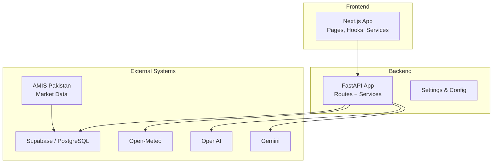
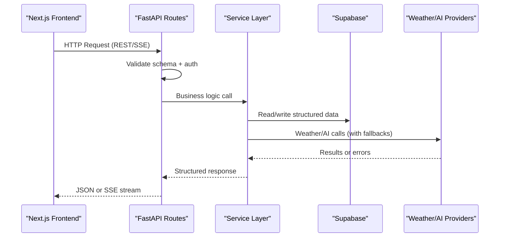
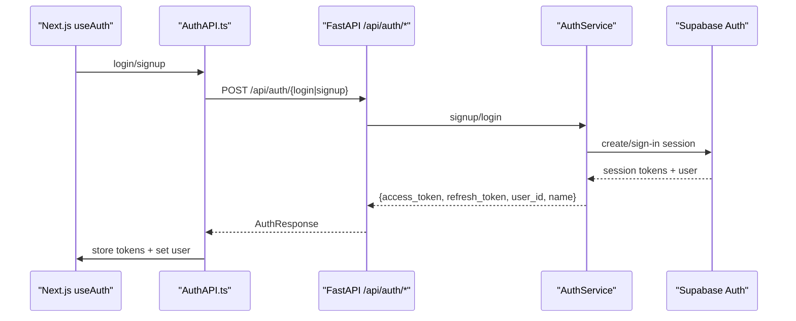
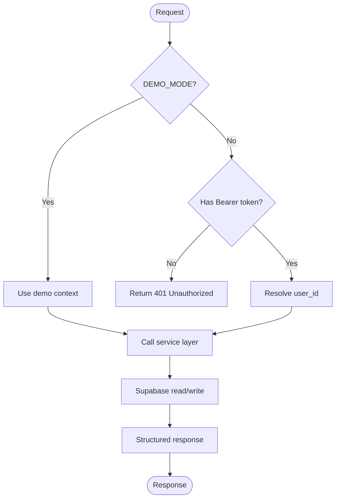
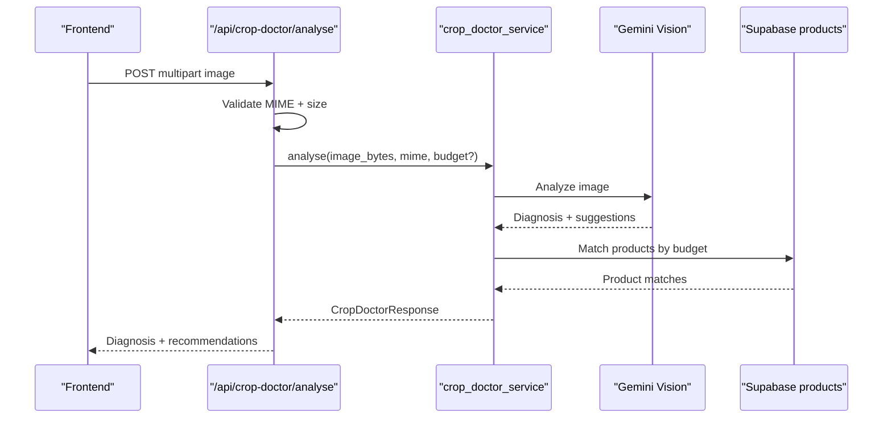
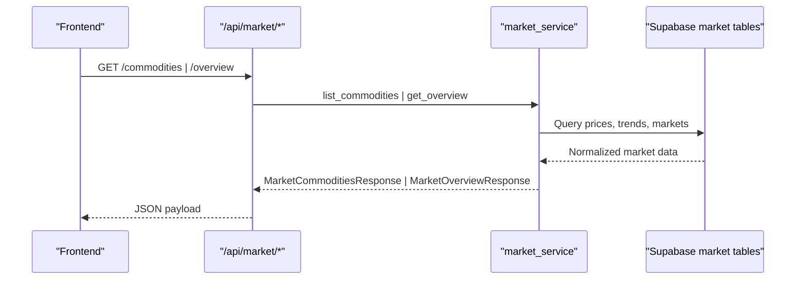
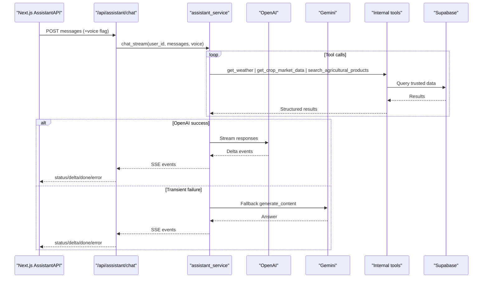
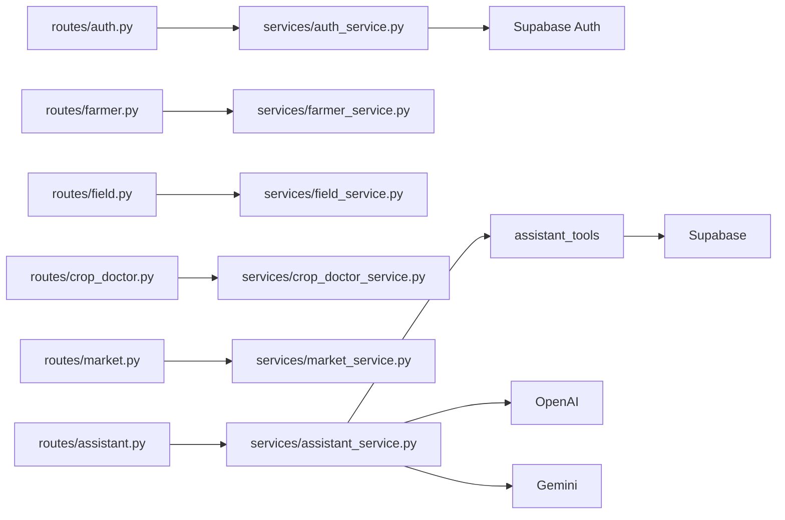

# System Architecture

<cite>
**Referenced Files in This Document**
- [architechture.md](file://architechture.md)
- [project-context.md](file://project-context.md)
- [Backend/main.py](file://Backend/main.py)
- [Backend/config/settings.py](file://Backend/config/settings.py)
- [Backend/routes/auth.py](file://Backend/routes/auth.py)
- [Backend/routes/farmer.py](file://Backend/routes/farmer.py)
- [Backend/routes/field.py](file://Backend/routes/field.py)
- [Backend/routes/crop_doctor.py](file://Backend/routes/crop_doctor.py)
- [Backend/routes/market.py](file://Backend/routes/market.py)
- [Backend/routes/assistant.py](file://Backend/routes/assistant.py)
- [Backend/services/auth_service.py](file://Backend/services/auth_service.py)
- [Backend/services/assistant_service.py](file://Backend/services/assistant_service.py)
- [Frontend/greenflora/services/AuthAPI.ts](file://Frontend/greenflora/services/AuthAPI.ts)
- [Frontend/greenflora/services/AssistantAPI.ts](file://Frontend/greenflora/services/AssistantAPI.ts)
- [Frontend/greenflora/Hooks/useAuth.tsx](file://Frontend/greenflora/Hooks/useAuth.tsx)
</cite>

## Table of Contents
1. Introduction
2. Project Structure
3. Core Components
4. Architecture Overview
5. Detailed Component Analysis
6. Dependency Analysis
7. Performance Considerations
8. Troubleshooting Guide
9. Conclusion
10. Appendices

## Introduction
Green Flora is a full-stack smart agriculture platform for Pakistani farmers. It combines a Next.js frontend with a FastAPI backend that orchestrates data from Supabase, weather services, and AI providers to deliver farmer dashboards, market intelligence, field operations, crop doctor analysis, and an AI assistant with voice support. The system emphasizes clear API boundaries, reliable data sources, and graceful fallbacks when external services are unavailable.

## Project Structure
The repository is organized into three primary layers:
- Frontend (Next.js): User interfaces, hooks, and client-side API clients.
- Backend (FastAPI): REST endpoints, service layer, configuration, and integrations.
- External systems: Supabase database, Open-Meteo weather, OpenAI/Gemini AI, and scheduled market-data ingestion via GitHub Actions.

**Diagram sources**
- [Backend/main.py:15-47](file://Backend/main.py#L15-L47)
- [Backend/config/settings.py:48-122](file://Backend/config/settings.py#L48-L122)
- [architechture.md:37-55](file://architechture.md#L37-L55)

**Section sources**
- [architechture.md:37-55](file://architechture.md#L37-L55)
- [Backend/main.py:15-47](file://Backend/main.py#L15-L47)
- [Backend/config/settings.py:48-122](file://Backend/config/settings.py#L48-L122)

## Core Components
- Authentication: Secure signup/login/refresh/logout and current user retrieval via Supabase Auth.
- Farmer Management: Profile and dashboard summary endpoints with optional demo mode.
- Field Operations: CRUD for fields and crop cycles with farm ownership enforcement.
- Crop Doctor: Image upload validation and Gemini-based diagnosis with budget-aware product recommendations.
- Market Data: Public endpoints for commodities and detailed market overview; backed by AMIS ingestion pipeline.
- Assistant: Streaming chat over SSE, speech-to-text, text-to-speech, and localized greeting; tool-calling against internal data and web search.

Key responsibilities and boundaries are enforced through thin routes, Pydantic schemas, and dedicated service modules.

**Section sources**
- [Backend/routes/auth.py:1-132](file://Backend/routes/auth.py#L1-L132)
- [Backend/routes/farmer.py:1-161](file://Backend/routes/farmer.py#L1-L161)
- [Backend/routes/field.py:1-287](file://Backend/routes/field.py#L1-L287)
- [Backend/routes/crop_doctor.py:1-125](file://Backend/routes/crop_doctor.py#L1-L125)
- [Backend/routes/market.py:1-108](file://Backend/routes/market.py#L1-L108)
- [Backend/routes/assistant.py:1-208](file://Backend/routes/assistant.py#L1-L208)

## Architecture Overview
The application follows a microservice-inspired modular architecture within a single FastAPI process:
- Routes define clear API boundaries per domain (auth, farmer, field, crop-doctor, market, assistant).
- Services encapsulate business logic and external integrations.
- Configuration centralizes environment variables and feature toggles (e.g., demo mode).
- Frontend communicates via REST and SSE, keeping secrets server-side.

**Diagram sources**
- [Backend/main.py:15-47](file://Backend/main.py#L15-L47)
- [Backend/routes/assistant.py:68-112](file://Backend/routes/assistant.py#L68-L112)
- [Backend/services/assistant_service.py:175-287](file://Backend/services/assistant_service.py#L175-L287)

**Section sources**
- [architechture.md:262-300](file://architechture.md#L262-L300)
- [Backend/main.py:15-47](file://Backend/main.py#L15-L47)

## Detailed Component Analysis

### Authentication Flow
Authentication uses Supabase Auth with token refresh and session restoration on the frontend.

**Diagram sources**
- [Frontend/greenflora/Hooks/useAuth.tsx:50-96](file://Frontend/greenflora/Hooks/useAuth.tsx#L50-L96)
- [Frontend/greenflora/services/AuthAPI.ts:143-179](file://Frontend/greenflora/services/AuthAPI.ts#L143-L179)
- [Backend/routes/auth.py:68-132](file://Backend/routes/auth.py#L68-L132)
- [Backend/services/auth_service.py:51-154](file://Backend/services/auth_service.py#L51-L154)

**Section sources**
- [Backend/routes/auth.py:1-132](file://Backend/routes/auth.py#L1-L132)
- [Backend/services/auth_service.py:1-193](file://Backend/services/auth_service.py#L1-L193)
- [Frontend/greenflora/services/AuthAPI.ts:1-179](file://Frontend/greenflora/services/AuthAPI.ts#L1-L179)
- [Frontend/greenflora/Hooks/useAuth.tsx:1-141](file://Frontend/greenflora/Hooks/useAuth.tsx#L1-L141)

### Farmer and Field Operations
Farmer profile and field management enforce optional demo mode and authenticated access in live mode.

**Diagram sources**
- [Backend/routes/farmer.py:50-68](file://Backend/routes/farmer.py#L50-L68)
- [Backend/routes/field.py:51-66](file://Backend/routes/field.py#L51-L66)

**Section sources**
- [Backend/routes/farmer.py:1-161](file://Backend/routes/farmer.py#L1-L161)
- [Backend/routes/field.py:1-287](file://Backend/routes/field.py#L1-L287)

### Crop Doctor Analysis
Crop Doctor validates image uploads, resolves farmer budget if available, and delegates to Gemini for diagnosis and recommendations.

**Diagram sources**
- [Backend/routes/crop_doctor.py:48-125](file://Backend/routes/crop_doctor.py#L48-L125)

**Section sources**
- [Backend/routes/crop_doctor.py:1-125](file://Backend/routes/crop_doctor.py#L1-L125)

### Market Intelligence
Market endpoints expose public commodity lists and detailed overviews sourced from Supabase tables populated by the AMIS ingestion pipeline.

**Diagram sources**
- [Backend/routes/market.py:38-108](file://Backend/routes/market.py#L38-L108)

**Section sources**
- [Backend/routes/market.py:1-108](file://Backend/routes/market.py#L1-L108)
- [architechture.md:480-504](file://architechture.md#L480-L504)

### AI Assistant (Streaming Chat, Voice, Greeting)
The assistant streams responses via Server-Sent Events, supports transcription and TTS, and falls back to Gemini when OpenAI fails transiently.

**Diagram sources**
- [Backend/routes/assistant.py:68-112](file://Backend/routes/assistant.py#L68-L112)
- [Backend/services/assistant_service.py:175-287](file://Backend/services/assistant_service.py#L175-L287)
- [Backend/services/assistant_service.py:293-425](file://Backend/services/assistant_service.py#L293-L425)
- [Backend/services/assistant_service.py:431-540](file://Backend/services/assistant_service.py#L431-L540)

**Section sources**
- [Backend/routes/assistant.py:1-208](file://Backend/routes/assistant.py#L1-L208)
- [Backend/services/assistant_service.py:1-926](file://Backend/services/assistant_service.py#L1-L926)
- [Frontend/greenflora/services/AssistantAPI.ts:1-386](file://Frontend/greenflora/services/AssistantAPI.ts#L1-L386)

## Dependency Analysis
- Route-to-service coupling: Each route module depends on a corresponding service module and shared schemas.
- External dependencies: Supabase (database and auth), Open-Meteo (weather), OpenAI (primary AI), Gemini (fallback AI), AMIS (market data via scheduled ingestion).
- Configuration: Centralized settings control feature flags, CORS, provider keys, and model selection.

**Diagram sources**
- [Backend/main.py:41-47](file://Backend/main.py#L41-L47)
- [Backend/routes/auth.py:1-132](file://Backend/routes/auth.py#L1-L132)
- [Backend/routes/assistant.py:1-208](file://Backend/routes/assistant.py#L1-L208)
- [Backend/services/assistant_service.py:1-926](file://Backend/services/assistant_service.py#L1-L926)

**Section sources**
- [Backend/main.py:15-47](file://Backend/main.py#L15-L47)
- [Backend/config/settings.py:48-122](file://Backend/config/settings.py#L48-L122)

## Performance Considerations
- Streaming responses: Assistant chat uses SSE to reduce perceived latency and improve UX.
- Provider timeouts: Configurable streaming and audio timeouts prevent long hangs.
- Tool budgets: Limited tool hops avoid excessive external calls and keep responses responsive.
- Local calculations: Profit calculator runs client-side to avoid network overhead.
- Caching: Short-lived greeting cache reduces utility model usage.

[No sources needed since this section provides general guidance]

## Troubleshooting Guide
Common issues and handling strategies:
- Authentication failures: Service maps known errors to 400/503; frontend classifies and surfaces friendly messages.
- Market data unavailability: Routes return 503 with details; callers can retry or degrade gracefully.
- AI provider outages: Assistant falls back to Gemini; UI shows status events and offers retries.
- Image upload errors: Crop Doctor validates MIME types and size limits; returns precise error codes.
- Network/timeouts: Frontend enforces request timeouts and converts transport errors to user-friendly messages.

**Section sources**
- [Backend/routes/auth.py:45-61](file://Backend/routes/auth.py#L45-L61)
- [Backend/routes/market.py:87-108](file://Backend/routes/market.py#L87-L108)
- [Backend/routes/crop_doctor.py:60-125](file://Backend/routes/crop_doctor.py#L60-L125)
- [Backend/services/assistant_service.py:175-287](file://Backend/services/assistant_service.py#L175-L287)
- [Frontend/greenflora/services/AuthAPI.ts:72-137](file://Frontend/greenflora/services/AuthAPI.ts#L72-L137)
- [Frontend/greenflora/services/AssistantAPI.ts:231-305](file://Frontend/greenflora/services/AssistantAPI.ts#L231-L305)

## Conclusion
Green Flora’s architecture cleanly separates concerns across a Next.js frontend, a modular FastAPI backend, and external services. Clear API boundaries, robust error handling, and provider fallbacks ensure reliability. The system prioritizes data integrity, targeted AI workloads, and farmer-friendly interactions while remaining deployable on cloud platforms with managed database and external APIs.

[No sources needed since this section summarizes without analyzing specific files]

## Appendices

### Infrastructure Requirements
- Database: Supabase/PostgreSQL for structured application data and market tables.
- AI Services: OpenAI (primary reasoning and speech), Gemini (fallback), utility models for lightweight tasks.
- Weather: Open-Meteo for current conditions and forecasts.
- Market Data: AMIS Pakistan via scheduled GitHub Actions ingestion into Supabase.
- Deployment: Cloud-hosted Next.js and FastAPI; environment variables for secrets; CORS configured for frontend origins.

**Section sources**
- [architechture.md:758-787](file://architechture.md#L758-L787)
- [Backend/config/settings.py:61-114](file://Backend/config/settings.py#L61-L114)
- [project-context.md:247-265](file://project-context.md#L247-L265)