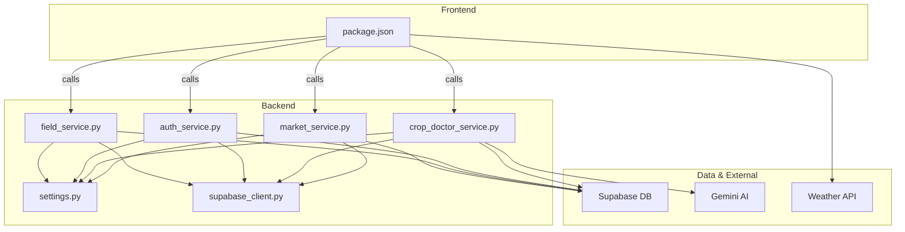
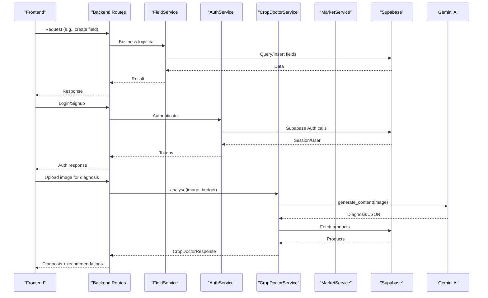
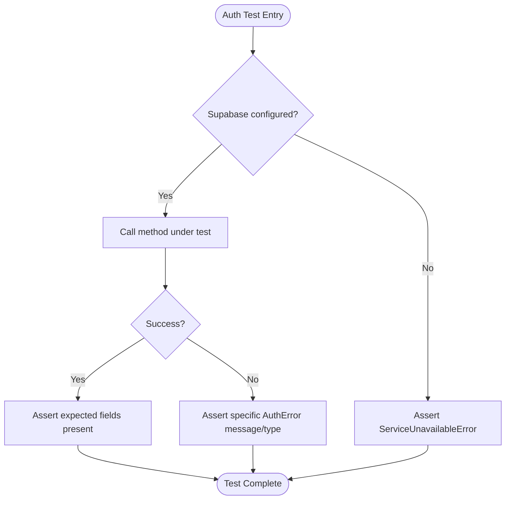
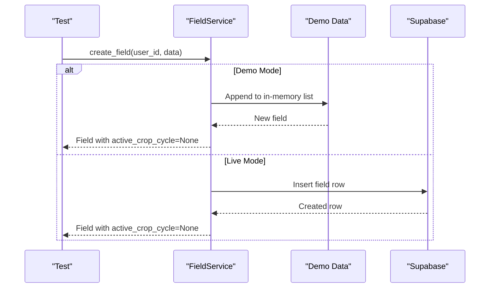
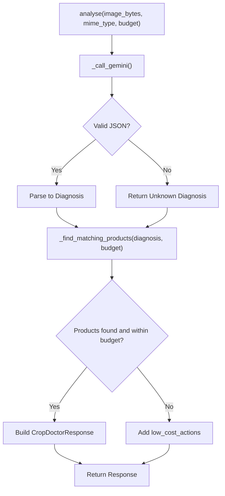
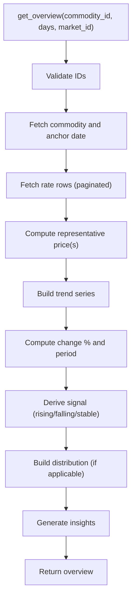
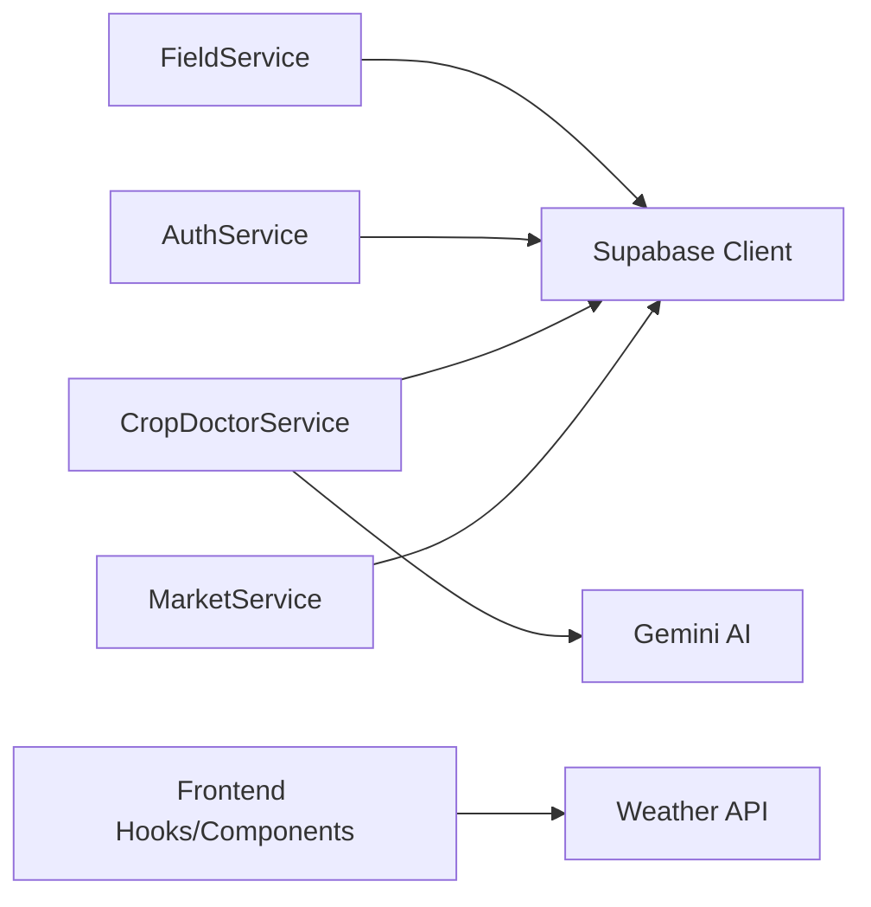

# Testing Strategy

<cite>
**Referenced Files in This Document**
- [Backend/test_field_flow.py](file://Backend/test_field_flow.py)
- [Backend/services/field_service.py](file://Backend/services/field_service.py)
- [Backend/services/auth_service.py](file://Backend/services/auth_service.py)
- [Backend/services/crop_doctor_service.py](file://Backend/services/crop_doctor_service.py)
- [Backend/services/market_service.py](file://Backend/services/market_service.py)
- [Backend/config/settings.py](file://Backend/config/settings.py)
- [Backend/config/supabase_client.py](file://Backend/config/supabase_client.py)
- [Frontend/greenflora/package.json](file://Frontend/greenflora/package.json)
- [Scraper/requirements.txt](file://Scraper/requirements.txt)
- [requirements.txt](file://requirements.txt)
</cite>

## Table of Contents
1. Introduction
2. Project Structure
3. Core Components
4. Architecture Overview
5. Detailed Component Analysis
6. Dependency Analysis
7. Performance Considerations
8. Troubleshooting Guide
9. Conclusion
10. Appendices

## Introduction
This document defines the testing strategy for Green-Flora across backend services and frontend application. It covers unit tests for business logic, integration tests for API endpoints, mock strategies for external dependencies (AI services and weather APIs), test data management, environment setup, continuous integration practices, examples for critical features (authentication, crop doctor analysis, market data processing), best practices, coverage targets, debugging techniques, and performance/load testing guidance.

## Project Structure
Green-Flora is a full-stack application:
- Backend: Python FastAPI-style services with Supabase as the database and optional AI integrations.
- Frontend: Next.js application with React components and hooks.
- Scraper: AMIS market data ingestion pipeline feeding Supabase tables used by the Market Intelligence feature.

**Diagram sources**
- [Backend/services/field_service.py:1-120](file://Backend/services/field_service.py#L1-L120)
- [Backend/services/auth_service.py:1-60](file://Backend/services/auth_service.py#L1-L60)
- [Backend/services/crop_doctor_service.py:1-140](file://Backend/services/crop_doctor_service.py#L1-L140)
- [Backend/services/market_service.py:1-70](file://Backend/services/market_service.py#L1-L70)
- [Backend/config/settings.py](file://Backend/config/settings.py)
- [Backend/config/supabase_client.py](file://Backend/config/supabase_client.py)
- [Frontend/greenflora/package.json:1-32](file://Frontend/greenflora/package.json#L1-L32)

**Section sources**
- [Backend/services/field_service.py:1-120](file://Backend/services/field_service.py#L1-L120)
- [Backend/services/auth_service.py:1-60](file://Backend/services/auth_service.py#L1-L60)
- [Backend/services/crop_doctor_service.py:1-140](file://Backend/services/crop_doctor_service.py#L1-L140)
- [Backend/services/market_service.py:1-70](file://Backend/services/market_service.py#L1-L70)
- [Frontend/greenflora/package.json:1-32](file://Frontend/greenflora/package.json#L1-L32)

## Core Components
- Field Service: Manages fields, crop cycles, and farm summaries; supports demo mode via in-memory data when configured.
- Auth Service: Handles signup, login, token refresh, and user lookup via Supabase Auth; raises explicit errors when unconfigured.
- Crop Doctor Service: Orchestrates image analysis with Gemini, product matching from Supabase, budget filtering, and low-cost fallback actions.
- Market Service: Reads AMIS-ingested data from Supabase to provide commodity lists, price trends, signals, and insights with caching.

Testing implications:
- Each service has clear boundaries and external dependencies that should be mocked or stubbed in tests.
- Demo mode in field service enables deterministic unit tests without live DB.
- Market service uses caches and pagination; tests must validate both cache behavior and DB interactions.

**Section sources**
- [Backend/services/field_service.py:89-120](file://Backend/services/field_service.py#L89-L120)
- [Backend/services/auth_service.py:24-60](file://Backend/services/auth_service.py#L24-L60)
- [Backend/services/crop_doctor_service.py:118-166](file://Backend/services/crop_doctor_service.py#L118-L166)
- [Backend/services/market_service.py:47-70](file://Backend/services/market_service.py#L47-L70)

## Architecture Overview
The backend exposes services consumed by routes and the frontend. Services interact with Supabase and optionally Gemini AI. The market feature depends on an AMIS scraper populating Supabase tables.

**Diagram sources**
- [Backend/services/field_service.py:327-395](file://Backend/services/field_service.py#L327-L395)
- [Backend/services/auth_service.py:51-125](file://Backend/services/auth_service.py#L51-L125)
- [Backend/services/crop_doctor_service.py:131-205](file://Backend/services/crop_doctor_service.py#L131-L205)
- [Backend/services/market_service.py:59-152](file://Backend/services/market_service.py#L59-L152)

## Detailed Component Analysis

### Authentication Testing
Focus areas:
- Unit tests for AuthService methods: signup, login, refresh, get_user_from_token, logout.
- Error paths: invalid credentials, expired tokens, unconfigured client.
- Integration tests: End-to-end flows through routes using test clients; assert status codes and payloads.

Mock strategy:
- Mock Supabase Auth client to simulate success/failure scenarios without network calls.
- Validate error types raised by AuthService (e.g., ServiceUnavailableError, AuthError).

Example test cases:
- Successful signup returns access_token, refresh_token, user_id, name, is_new=True.
- Duplicate contact raises AuthError with descriptive message.
- Login with wrong password raises AuthError.
- Refresh with invalid token raises AuthError.
- Logout succeeds even if underlying call fails (best-effort).

**Diagram sources**
- [Backend/services/auth_service.py:39-60](file://Backend/services/auth_service.py#L39-L60)
- [Backend/services/auth_service.py:51-125](file://Backend/services/auth_service.py#L51-L125)

**Section sources**
- [Backend/services/auth_service.py:24-193](file://Backend/services/auth_service.py#L24-L193)

### Field Management Testing
Focus areas:
- Unit tests for FieldService CRUD operations and ownership checks.
- Demo mode tests to avoid DB dependency; verify in-memory state changes.
- Integration tests against Supabase with test fixtures and cleanup.

Mock strategy:
- Use settings.demo_mode to run tests against in-memory data.
- For DB-backed tests, use transactional test databases or fixture seeding and teardown.

Example test cases:
- Create field in demo mode returns new field with active_crop_cycle=None.
- Update field updates only provided keys and preserves others.
- Delete field removes associated crop cycles in demo mode.
- Ownership verification raises RuntimeError when field does not belong to user’s farm.
- Farm summary aggregates fields, totals, and crop distribution correctly.

**Diagram sources**
- [Backend/services/field_service.py:336-359](file://Backend/services/field_service.py#L336-L359)
- [Backend/services/field_service.py:379-395](file://Backend/services/field_service.py#L379-L395)

**Section sources**
- [Backend/services/field_service.py:89-395](file://Backend/services/field_service.py#L89-L395)
- [Backend/test_field_flow.py:1-87](file://Backend/test_field_flow.py#L1-L87)

### Crop Doctor Analysis Testing
Focus areas:
- Unit tests for Gemini prompt parsing and Diagnosis object construction.
- Product matching logic: category mapping, keyword extraction, scoring, budget filtering.
- Low-cost fallback actions selection based on problem type.

Mock strategy:
- Mock Gemini API calls to return controlled JSON responses (valid and invalid).
- Mock Supabase queries for agricultural_products to control product sets and prices.
- Validate edge cases: missing budget, zero budget, unknown problem types.

Example test cases:
- Analyse with valid image returns Diagnosis with correct fields and confidence.
- Non-JSON Gemini response yields low-confidence Unknown diagnosis.
- Product matching filters by category and scores by keywords; returns top results.
- Budget context marks fits_budget correctly; zero budget excludes paid products.
- Low-cost actions returned when no suitable products or budget mismatch.

**Diagram sources**
- [Backend/services/crop_doctor_service.py:131-205](file://Backend/services/crop_doctor_service.py#L131-L205)
- [Backend/services/crop_doctor_service.py:264-339](file://Backend/services/crop_doctor_service.py#L264-L339)
- [Backend/services/crop_doctor_service.py:409-416](file://Backend/services/crop_doctor_service.py#L409-L416)

**Section sources**
- [Backend/services/crop_doctor_service.py:118-435](file://Backend/services/crop_doctor_service.py#L118-L435)

### Market Data Processing Testing
Focus areas:
- Unit tests for representative price calculation, trend building, change computation, signal generation.
- Cache behavior for commodities and markets map; ensure TTL and refresh semantics.
- Integration tests validating data integrity rules: no fabricated prices/trends/signals.

Mock strategy:
- Mock Supabase queries to return controlled datasets for commodities, markets, and crop_market_rates.
- Verify pagination and caps are respected during scans.

Example test cases:
- list_commodities returns items with latest_date, latest_price, markets_reporting; data_available flag reflects presence of data.
- get_overview computes current_price, spread, trend, and insights strictly from real rows.
- Change computation falls back gracefully when insufficient history; signal thresholds applied correctly.
- Distribution requires at least two markets with positive quantities; otherwise returns None.

**Diagram sources**
- [Backend/services/market_service.py:158-343](file://Backend/services/market_service.py#L158-L343)
- [Backend/services/market_service.py:361-393](file://Backend/services/market_service.py#L361-L393)
- [Backend/services/market_service.py:419-468](file://Backend/services/market_service.py#L419-L468)
- [Backend/services/market_service.py:474-517](file://Backend/services/market_service.py#L474-L517)
- [Backend/services/market_service.py:523-593](file://Backend/services/market_service.py#L523-L593)

**Section sources**
- [Backend/services/market_service.py:47-653](file://Backend/services/market_service.py#L47-L653)

### Frontend Testing Strategy
Current project configuration shows no test framework installed in package.json. Recommended approach:
- Install a testing framework compatible with Next.js and React (e.g., Vitest or Jest with React Testing Library).
- Add scripts to package.json for running tests and generating coverage reports.

Coverage requirements:
- Aim for high branch and line coverage for hooks and utilities.
- Enforce minimum coverage thresholds in CI to prevent regressions.

Component testing:
- Render UI components in isolation; assert structure and interactions.
- Mock external services (APIs, weather) to control responses.

Hook testing:
- Test custom hooks (e.g., authentication, market, weather) by simulating data states and side effects.
- Validate state transitions and error handling paths.

Integration tests:
- Simulate user workflows across pages (login → dashboard → crop doctor → market).
- Use test clients to make requests to backend endpoints or mock them entirely.

**Section sources**
- [Frontend/greenflora/package.json:1-32](file://Frontend/greenflora/package.json#L1-L32)

## Dependency Analysis
Key dependencies and their roles:
- Supabase client: Used by all backend services for data access; must be mocked or configured in tests.
- Settings module: Controls demo mode and API keys; essential for test environment configuration.
- Gemini AI: Used by Crop Doctor; must be mocked to avoid network calls and ensure deterministic outputs.
- Weather API: Consumed by frontend; should be mocked in component/hook tests.

**Diagram sources**
- [Backend/services/field_service.py:23-25](file://Backend/services/field_service.py#L23-L25)
- [Backend/services/auth_service.py:17-19](file://Backend/services/auth_service.py#L17-L19)
- [Backend/services/crop_doctor_service.py:22-25](file://Backend/services/crop_doctor_service.py#L22-L25)
- [Backend/services/market_service.py:31-31](file://Backend/services/market_service.py#L31-L31)

**Section sources**
- [Backend/config/settings.py](file://Backend/config/settings.py)
- [Backend/config/supabase_client.py](file://Backend/config/supabase_client.py)
- [Backend/services/crop_doctor_service.py:118-140](file://Backend/services/crop_doctor_service.py#L118-L140)

## Performance Considerations
- Market Service caching: Tests should validate cache hit/miss behavior and TTL expiration.
- Pagination and caps: Ensure tests cover boundary conditions for page sizes and maximum row limits.
- Database query efficiency: Prefer minimal selects and proper ordering; test with realistic dataset sizes.
- Frontend rendering: Avoid unnecessary re-renders in component tests; use stable keys and memoization where appropriate.

[No sources needed since this section provides general guidance]

## Troubleshooting Guide
Common issues and resolutions:
- Unconfigured Supabase: Services raise explicit errors; tests should assert these error types and messages.
- Gemini API failures: Crop Doctor handles non-JSON responses gracefully; tests should verify fallback behavior.
- Missing market data: Market Service returns empty results; tests should assert honest empty states and insights.
- Demo mode inconsistencies: Field Service demo mode maintains in-memory state; ensure tests reset state between runs.

Debugging techniques:
- Enable logging in tests to capture service-level warnings and exceptions.
- Use assertion libraries to inspect intermediate structures (e.g., Diagnosis, CropDoctorResponse).
- Isolate failing tests by mocking external dependencies to reduce flakiness.

**Section sources**
- [Backend/services/auth_service.py:24-60](file://Backend/services/auth_service.py#L24-L60)
- [Backend/services/crop_doctor_service.py:207-258](file://Backend/services/crop_doctor_service.py#L207-L258)
- [Backend/services/market_service.py:59-152](file://Backend/services/market_service.py#L59-L152)

## Conclusion
Green-Flora’s testing strategy emphasizes isolated unit tests for business logic, robust integration tests for API endpoints, and comprehensive mocks for external dependencies. Field Service demo mode simplifies deterministic testing, while Market Service caching and data integrity rules require careful validation. Frontend testing should adopt a modern framework to cover components, hooks, and user workflows. Continuous integration should enforce coverage thresholds and run both backend and frontend tests reliably.

[No sources needed since this section summarizes without analyzing specific files]

## Appendices

### Test Environment Setup
- Backend:
  - Configure SUPABASE_URL and SUPABASE_SERVICE_KEY for integration tests.
  - Set DEMO_MODE=true for unit tests using Field Service demo data.
  - Set GEMINI_API_KEY for Crop Doctor tests requiring AI calls; otherwise mock Gemini.
- Frontend:
  - Install a testing framework and configure it in package.json.
  - Mock external APIs (weather, backend) using test utilities.

**Section sources**
- [Backend/config/settings.py](file://Backend/config/settings.py)
- [Backend/config/supabase_client.py](file://Backend/config/supabase_client.py)
- [Backend/services/crop_doctor_service.py:121-125](file://Backend/services/crop_doctor_service.py#L121-L125)
- [Frontend/greenflora/package.json:1-32](file://Frontend/greenflora/package.json#L1-L32)

### Continuous Integration Testing
- Run backend unit tests with demo mode enabled.
- Execute integration tests against a test Supabase instance.
- Run frontend tests with mocked services and assertions on coverage.
- Fail CI if coverage drops below thresholds or tests fail.

[No sources needed since this section provides general guidance]

### Example Test Cases Summary
- Authentication:
  - Signup success and duplicate contact error.
  - Login with invalid credentials.
  - Token refresh failure.
- Field Management:
  - Create/update/delete fields in demo mode.
  - Ownership verification errors.
  - Farm summary aggregation correctness.
- Crop Doctor:
  - Valid and invalid Gemini responses.
  - Product matching and budget filtering.
  - Low-cost fallback actions.
- Market Data:
  - Commodities listing with data availability flags.
  - Overview computations: price, trend, signal, insights.
  - Distribution and cache behavior.

**Section sources**
- [Backend/services/auth_service.py:51-193](file://Backend/services/auth_service.py#L51-L193)
- [Backend/services/field_service.py:327-545](file://Backend/services/field_service.py#L327-L545)
- [Backend/services/crop_doctor_service.py:131-435](file://Backend/services/crop_doctor_service.py#L131-L435)
- [Backend/services/market_service.py:59-653](file://Backend/services/market_service.py#L59-L653)