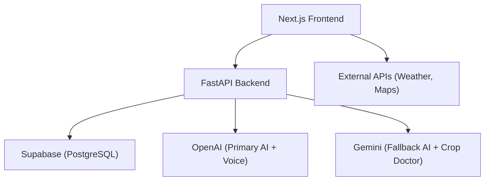
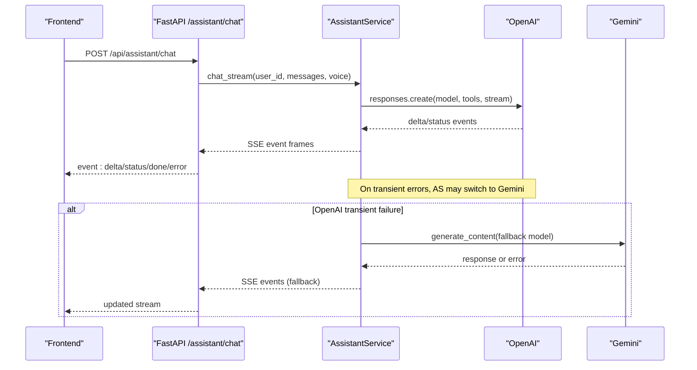
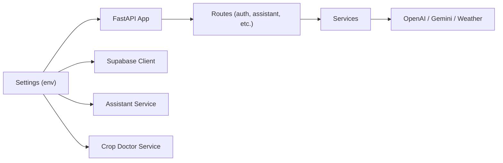

# Troubleshooting Guide

<cite>
**Referenced Files in This Document**
- [main.py](file://Backend/main.py)
- [settings.py](file://Backend/config/settings.py)
- [supabase_client.py](file://Backend/config/supabase_client.py)
- [auth_service.py](file://Backend/services/auth_service.py)
- [assistant_service.py](file://Backend/services/assistant_service.py)
- [crop_doctor_service.py](file://Backend/services/crop_doctor_service.py)
- [assistant.py](file://Backend/routes/assistant.py)
- [auth.py](file://Backend/routes/auth.py)
- [AuthAPI.ts](file://Frontend/greenflora/services/AuthAPI.ts)
- [FarmerAPI.tsx](file://Frontend/greenflora/services/FarmerAPI.tsx)
- [AssistantAPI.ts](file://Frontend/greenflora/services/AssistantAPI.ts)
- [ErrorState.tsx](file://Frontend/greenflora/components/ui/ErrorState.tsx)
- [package.json](file://Frontend/greenflora/package.json)
- [README.md](file://README.md)
</cite>

## Table of Contents
1. Introduction
2. Project Structure
3. Core Components
4. Architecture Overview
5. Detailed Component Analysis
6. Dependency Analysis
7. Performance Considerations
8. Troubleshooting Guide
9. Conclusion
10. Appendices

## Introduction
This guide helps you diagnose and resolve common issues in Green Flora across setup, backend configuration, AI integrations, and frontend behavior. It focuses on:
- API key configuration errors
- Database connection issues
- Environment variable misconfigurations
- AI service integration failures (Gemini, OpenAI)
- Frontend rendering problems, API call failures, and state management conflicts
- Log analysis techniques, error message interpretation, and diagnostic commands
- Known limitations, workarounds for edge cases, and escalation procedures
- Step-by-step resolution guides with before-and-after examples

## Project Structure
Green Flora is a full-stack application:
- Backend: FastAPI server exposing REST endpoints and streaming SSE for the assistant
- Frontend: Next.js app consuming backend APIs and external services (weather, maps)
- Integrations: Supabase for auth/data, Gemini for image analysis and fallback AI, OpenAI for primary AI and voice features

**Diagram sources**
- [main.py:15-57](file://Backend/main.py#L15-L57)
- [settings.py:48-122](file://Backend/config/settings.py#L48-L122)
- [supabase_client.py:19-47](file://Backend/config/supabase_client.py#L19-L47)
- [assistant_service.py:106-127](file://Backend/services/assistant_service.py#L106-L127)
- [crop_doctor_service.py:118-126](file://Backend/services/crop_doctor_service.py#L118-L126)

**Section sources**
- [main.py:15-57](file://Backend/main.py#L15-L57)
- [settings.py:48-122](file://Backend/config/settings.py#L48-L122)
- [supabase_client.py:19-47](file://Backend/config/supabase_client.py#L19-L47)
- [package.json:1-32](file://Frontend/greenflora/package.json#L1-L32)
- [README.md:53-70](file://README.md#L53-L70)

## Core Components
- Configuration: Centralized environment settings for API keys, CORS, database, and AI models
- Authentication: Supabase-based auth with token refresh and user lookup
- Assistant: Streaming chat via SSE with OpenAI primary and Gemini fallback; speech-to-text and text-to-speech
- Crop Doctor: Image analysis via Gemini with product recommendations from Supabase
- Frontend Services: Unified request helpers with timeouts, auth headers, and typed errors

Key responsibilities and failure points are isolated to specific modules, enabling targeted troubleshooting.

**Section sources**
- [settings.py:48-122](file://Backend/config/settings.py#L48-L122)
- [auth_service.py:32-192](file://Backend/services/auth_service.py#L32-L192)
- [assistant_service.py:106-800](file://Backend/services/assistant_service.py#L106-L800)
- [crop_doctor_service.py:118-435](file://Backend/services/crop_doctor_service.py#L118-L435)
- [AuthAPI.ts:72-139](file://Frontend/greenflora/services/AuthAPI.ts#L72-L139)
- [FarmerAPI.tsx:42-91](file://Frontend/greenflora/services/FarmerAPI.tsx#L42-L91)
- [AssistantAPI.ts:50-84](file://Frontend/greenflora/services/AssistantAPI.ts#L50-L84)

## Architecture Overview
The assistant flow uses Server-Sent Events to stream status, deltas, and completion events. The backend orchestrates provider selection and tool execution while sanitizing streamed content for safe UI consumption.

**Diagram sources**
- [assistant.py:68-112](file://Backend/routes/assistant.py#L68-L112)
- [assistant_service.py:175-287](file://Backend/services/assistant_service.py#L175-L287)
- [assistant_service.py:293-425](file://Backend/services/assistant_service.py#L293-L425)
- [assistant_service.py:431-540](file://Backend/services/assistant_service.py#L431-L540)

## Detailed Component Analysis

### Configuration and Environment Variables
- Centralized settings load environment variables at startup and expose them to all modules
- Common pitfalls:
  - Missing or incorrect API keys (OpenAI, Gemini, Supabase)
  - Wrong CORS origins causing browser network errors
  - Demo mode enabled when production data is expected

Resolution steps:
- Ensure required keys are set in the backend environment file
- Verify CORS includes your frontend origin
- Confirm demo mode behavior aligns with deployment intent

Before/After example:
- Before: CORS_ORIGINS missing or wrong → browser blocks requests
- After: CORS_ORIGINS includes http://localhost:3000 → requests succeed

**Section sources**
- [settings.py:24-122](file://Backend/config/settings.py#L24-L122)
- [main.py:21-28](file://Backend/main.py#L21-L28)

### Database and Supabase Connection
- Supabase client initializes only if URL and service key are present
- HTTPX client configured with HTTP/1.1 and explicit timeouts to avoid socket errors
- Symptoms of misconfiguration:
  - Auth endpoints return service unavailable
  - Product lookups return empty results
  - Token validation fails

Resolution steps:
- Set SUPABASE_URL and SUPABASE_SERVICE_KEY
- Validate connectivity by calling /health and checking Supabase-dependent endpoints
- Inspect logs for Supabase initialization warnings

Before/After example:
- Before: supabase is None → auth returns 503
- After: supabase initialized → login succeeds and returns tokens

**Section sources**
- [supabase_client.py:19-47](file://Backend/config/supabase_client.py#L19-L47)
- [auth_service.py:39-47](file://Backend/services/auth_service.py#L39-L47)
- [crop_doctor_service.py:280-283](file://Backend/services/crop_doctor_service.py#L280-L283)

### Authentication Flow and Errors
- Frontend stores access and refresh tokens and attaches Authorization headers where needed
- Backend routes map service exceptions to appropriate HTTP statuses
- Common errors:
  - Invalid credentials
  - Expired session requiring refresh
  - Network or timeout errors

Resolution steps:
- Check token presence and validity in localStorage
- Use refresh endpoint when session expires
- Inspect error type classification in frontend services

Before/After example:
- Before: 401 without refresh → stuck on login
- After: refreshSession called → new tokens stored and requests proceed

**Section sources**
- [AuthAPI.ts:25-46](file://Frontend/greenflora/services/AuthAPI.ts#L25-L46)
- [AuthAPI.ts:72-139](file://Frontend/greenflora/services/AuthAPI.ts#L72-L139)
- [auth.py:45-61](file://Backend/routes/auth.py#L45-L61)
- [auth_service.py:110-154](file://Backend/services/auth_service.py#L110-L154)

### AI Assistant: OpenAI Primary and Gemini Fallback
- Chat streams SSE events with status, delta, done, and error types
- Transient errors (timeout, rate limit, 5xx) trigger fallback to Gemini
- Tool calls execute internal functions (weather, market, products) and can mark web search usage
- Speech features require OpenAI keys and models configured

Resolution steps:
- Verify OPENAI_API_KEY and model settings
- If rate limited or timed out, confirm fallback to Gemini occurs and retryable flag is set
- For transcription/TTS failures, check audio size limits and supported formats

Before/After example:
- Before: OpenAI rate limit → stream ends with error
- After: Gemini fallback activated → answer completes via backup provider

**Section sources**
- [assistant_service.py:175-287](file://Backend/services/assistant_service.py#L175-L287)
- [assistant_service.py:293-425](file://Backend/services/assistant_service.py#L293-L425)
- [assistant_service.py:431-540](file://Backend/services/assistant_service.py#L431-L540)
- [assistant_service.py:591-677](file://Backend/services/assistant_service.py#L591-L677)
- [assistant.py:68-112](file://Backend/routes/assistant.py#L68-L112)

### Crop Doctor: Image Analysis and Recommendations
- Sends image to Gemini with structured prompt to produce JSON diagnosis
- Queries Supabase for matching agricultural products based on problem category
- Applies budget filtering and provides low-cost actions when paid options are unsuitable

Resolution steps:
- Ensure GEMINI_API_KEY is set
- Validate image MIME type and size
- Confirm Supabase has agricultural_products table populated
- Review parsing fallbacks for non-JSON responses

Before/After example:
- Before: No Gemini key → runtime error
- After: Gemini configured → diagnosis returned with recommendations

**Section sources**
- [crop_doctor_service.py:118-165](file://Backend/services/crop_doctor_service.py#L118-L165)
- [crop_doctor_service.py:171-205](file://Backend/services/crop_doctor_service.py#L171-L205)
- [crop_doctor_service.py:207-258](file://Backend/services/crop_doctor_service.py#L207-L258)
- [crop_doctor_service.py:264-339](file://Backend/services/crop_doctor_service.py#L264-L339)

### Frontend Error Handling and Rendering
- Shared error components display friendly messages with retry actions
- Request helpers classify errors into network, timeout, validation, server, and auth categories
- Timeout handling prevents hanging UI during slow or unresponsive backends

Resolution steps:
- Use ErrorState component to show actionable messages
- Inspect error.type to determine retry strategy
- Adjust REQUEST_TIMEOUT_MS if legitimate long-running operations time out prematurely

Before/After example:
- Before: Generic network error shown → no guidance
- After: Specific timeout or auth error → user prompted to retry or re-authenticate

**Section sources**
- [ErrorState.tsx:1-38](file://Frontend/greenflora/components/ui/ErrorState.tsx#L1-L38)
- [AuthAPI.ts:107-133](file://Frontend/greenflora/services/AuthAPI.ts#L107-L133)
- [FarmerAPI.tsx:61-89](file://Frontend/greenflora/services/FarmerAPI.tsx#L61-L89)
- [AssistantAPI.ts:50-84](file://Frontend/greenflora/services/AssistantAPI.ts#L50-L84)

## Dependency Analysis

**Diagram sources**
- [settings.py:48-122](file://Backend/config/settings.py#L48-L122)
- [main.py:15-57](file://Backend/main.py#L15-L57)
- [supabase_client.py:19-47](file://Backend/config/supabase_client.py#L19-L47)
- [assistant_service.py:106-127](file://Backend/services/assistant_service.py#L106-L127)
- [crop_doctor_service.py:118-126](file://Backend/services/crop_doctor_service.py#L118-L126)

**Section sources**
- [settings.py:48-122](file://Backend/config/settings.py#L48-L122)
- [main.py:15-57](file://Backend/main.py#L15-L57)

## Performance Considerations
- Streaming responses reduce perceived latency for AI answers
- Timeouts are explicitly set for Supabase HTTP client and AI audio endpoints
- Tool budgets prevent excessive function-call loops in assistant flows
- Frontend request timeouts balance responsiveness with reliability

Recommendations:
- Monitor X-Process-Time header for slow endpoints
- Tune AI_STREAM_TIMEOUT_SECONDS and AI_AUDIO_TIMEOUT_SECONDS based on workload
- Avoid large audio uploads exceeding transcription limits

[No sources needed since this section provides general guidance]

## Troubleshooting Guide

### Setup Issues

#### API Key Configuration Errors
Symptoms:
- AI assistant not responding or returning “not configured”
- Crop doctor failing to analyze images
- Voice features unavailable

Checklist:
- Confirm OPENAI_API_KEY and GEMINI_API_KEY are set
- Verify model names match available providers
- Ensure CORS_ORIGINS includes your frontend origin

Resolution steps:
- Add missing keys to backend environment
- Restart backend to reload settings
- Test assistant greeting and crop doctor upload

Before/After example:
- Before: Missing GEMINI_API_KEY → crop doctor raises runtime error
- After: GEMINI_API_KEY set → diagnosis returned successfully

**Section sources**
- [settings.py:70-114](file://Backend/config/settings.py#L70-L114)
- [assistant_service.py:106-127](file://Backend/services/assistant_service.py#L106-L127)
- [crop_doctor_service.py:118-126](file://Backend/services/crop_doctor_service.py#L118-L126)

#### Database Connection Issues
Symptoms:
- Auth endpoints return service unavailable
- Product recommendations empty
- User profile loading fails

Checklist:
- Ensure SUPABASE_URL and SUPABASE_SERVICE_KEY are correct
- Validate Supabase project is active and accessible
- Check HTTP/1.1 configuration and timeouts

Resolution steps:
- Update Supabase credentials
- Call /health to verify backend readiness
- Re-attempt login and data retrieval

Before/After example:
- Before: supabase None → 503 on auth
- After: supabase initialized → login returns tokens

**Section sources**
- [supabase_client.py:19-47](file://Backend/config/supabase_client.py#L19-L47)
- [auth_service.py:39-47](file://Backend/services/auth_service.py#L39-L47)

#### Environment Variable Misconfigurations
Symptoms:
- CORS errors in browser console
- Unexpected demo mode behavior
- Incorrect AI model selection

Checklist:
- Review DEMO_MODE, CORS_ORIGINS, and AI model variables
- Confirm .env file location and format
- Validate that settings are loaded at startup

Resolution steps:
- Correct variable values and restart backend
- Clear browser cache if CORS changes cause cached failures

Before/After example:
- Before: CORS_ORIGINS excludes localhost:3000 → blocked requests
- After: CORS_ORIGINS includes localhost:3000 → requests succeed

**Section sources**
- [settings.py:55-68](file://Backend/config/settings.py#L55-L68)
- [main.py:21-28](file://Backend/main.py#L21-L28)

### AI Service Integration Failures

#### Gemini API Errors
Symptoms:
- Crop doctor fails to parse response
- Fallback activation but still errors

Checklist:
- Validate image MIME type and size
- Confirm GEMINI_API_KEY is set
- Inspect logs for non-JSON responses

Resolution steps:
- Retry with clearer image
- Review parsing fallbacks and adjust prompts if necessary

Before/After example:
- Before: Non-JSON response → Unknown diagnosis
- After: Clean JSON → accurate diagnosis with severity

**Section sources**
- [crop_doctor_service.py:171-205](file://Backend/services/crop_doctor_service.py#L171-L205)
- [crop_doctor_service.py:207-258](file://Backend/services/crop_doctor_service.py#L207-L258)

#### OpenAI Authentication Issues
Symptoms:
- Assistant returns “not configured” or authentication errors
- Transcription/TTS fail

Checklist:
- Ensure OPENAI_API_KEY is set
- Verify model names for main, utility, transcribe, and TTS
- Check rate limits and quotas

Resolution steps:
- Add or rotate API key
- Reduce concurrent requests if rate-limited
- Use fallback to Gemini temporarily

Before/After example:
- Before: Invalid key → assistant error
- After: Valid key → streaming answer delivered

**Section sources**
- [assistant_service.py:106-127](file://Backend/services/assistant_service.py#L106-L127)
- [assistant_service.py:293-425](file://Backend/services/assistant_service.py#L293-L425)

#### Rate Limiting Problems
Symptoms:
- Stream interrupted mid-answer
- Error events with retryable flag

Checklist:
- Monitor backend logs for rate limit exceptions
- Adjust timeouts and consider increasing provider quotas

Resolution steps:
- Implement retry logic on frontend for retryable errors
- Switch to Gemini fallback automatically handled by backend

Before/After example:
- Before: Rate limit → incomplete answer
- After: Fallback activated → answer completed via Gemini

**Section sources**
- [assistant_service.py:228-287](file://Backend/services/assistant_service.py#L228-L287)
- [assistant_service.py:347-367](file://Backend/services/assistant_service.py#L347-L367)

### Frontend Issues

#### Component Rendering Problems
Symptoms:
- ErrorState displayed unexpectedly
- Loading states persist indefinitely

Checklist:
- Verify API responses and error classifications
- Ensure proper error handling in hooks and components
- Check for network or timeout errors

Resolution steps:
- Use ErrorState with retry handlers
- Adjust timeouts for long-running operations
- Validate data shapes before rendering

Before/After example:
- Before: Generic error → confusing message
- After: Specific timeout → clear retry instruction

**Section sources**
- [ErrorState.tsx:1-38](file://Frontend/greenflora/components/ui/ErrorState.tsx#L1-L38)
- [AuthAPI.ts:107-133](file://Frontend/greenflora/services/AuthAPI.ts#L107-L133)

#### API Call Failures
Symptoms:
- Network errors or timeouts
- Auth failures due to missing or expired tokens

Checklist:
- Confirm API_BASE_URL and CORS settings
- Ensure Authorization header included for protected endpoints
- Inspect error.type for classification

Resolution steps:
- Refresh session on 401/403
- Increase REQUEST_TIMEOUT_MS if needed
- Validate backend health via /health

Before/After example:
- Before: 401 without refresh → stuck
- After: Refresh invoked → tokens renewed and requests proceed

**Section sources**
- [AuthAPI.ts:72-139](file://Frontend/greenflora/services/AuthAPI.ts#L72-L139)
- [FarmerAPI.tsx:42-91](file://Frontend/greenflora/services/FarmerAPI.tsx#L42-L91)

#### State Management Conflicts
Symptoms:
- Inconsistent UI state after retries
- Duplicate or stale data displayed

Checklist:
- Ensure abort controllers cancel in-flight requests
- Validate state updates only on successful responses
- Debounce rapid retries to avoid race conditions

Resolution steps:
- Cancel previous requests before starting new ones
- Reset state on error paths
- Use consistent loading flags per operation

Before/After example:
- Before: Rapid retries → overlapping responses corrupt state
- After: Cancellation and reset → stable UI state

**Section sources**
- [AuthAPI.ts:72-139](file://Frontend/greenflora/services/AuthAPI.ts#L72-L139)
- [FarmerAPI.tsx:42-91](file://Frontend/greenflora/services/FarmerAPI.tsx#L42-L91)

### Log Analysis Techniques
- Backend logging:
  - Inspect warnings for Gemini SDK availability and tool failures
  - Check unexpected exceptions in assistant and crop doctor flows
- Frontend logs:
  - Capture error.type and status for classification
  - Record timing and payload sizes for performance diagnostics

Diagnostic commands:
- Backend health: GET /health
- Check process time: inspect X-Process-Time header
- Validate CORS: observe browser network tab for blocked requests

**Section sources**
- [assistant_service.py:118-127](file://Backend/services/assistant_service.py#L118-L127)
- [assistant_service.py:556-585](file://Backend/services/assistant_service.py#L556-L585)
- [main.py:31-38](file://Backend/main.py#L31-L38)

### Known Limitations and Workarounds
- Gemini search + function tools combination may be rejected; backend retries with data tools only
- Audio transcription size limit enforced; keep recordings under one minute
- Greeting generation falls back to hardcoded messages if AI unavailable

Workarounds:
- Use smaller audio files or split long inputs
- Accept fallback greetings during AI outages
- Retry failed operations marked as retryable

**Section sources**
- [assistant_service.py:475-483](file://Backend/services/assistant_service.py#L475-L483)
- [assistant_service.py:599-604](file://Backend/services/assistant_service.py#L599-L604)
- [assistant_service.py:683-735](file://Backend/services/assistant_service.py#L683-L735)

### Escalation Procedures
- If AI providers consistently fail:
  - Rotate API keys and verify quotas
  - Enable Gemini fallback and monitor success rates
- If Supabase remains unreachable:
  - Validate credentials and network policies
  - Temporarily enable demo mode to continue development
- For persistent frontend errors:
  - Reproduce with minimal steps and capture logs
  - Isolate whether issue is network, auth, or data shape mismatch

[No sources needed since this section summarizes without analyzing specific files]

## Conclusion
Green Flora’s architecture isolates configuration, authentication, AI orchestration, and frontend concerns, enabling precise troubleshooting. By validating environment variables, monitoring logs, and leveraging built-in fallbacks and error classifications, most issues can be resolved quickly. For complex or recurring problems, follow the escalation steps and use the provided diagnostic commands to identify root causes efficiently.

[No sources needed since this section summarizes without analyzing specific files]

## Appendices

### Quick Reference: Common Endpoints and Behaviors
- Health check: GET /health
- Assistant chat: POST /api/assistant/chat (SSE stream)
- Transcription: POST /api/assistant/transcribe (multipart audio)
- Text-to-speech: POST /api/assistant/speak (MP3 audio)
- Greeting: GET /api/assistant/greeting

**Section sources**
- [main.py:50-52](file://Backend/main.py#L50-L52)
- [assistant.py:68-112](file://Backend/routes/assistant.py#L68-L112)
- [assistant.py:119-173](file://Backend/routes/assistant.py#L119-L173)
- [assistant.py:180-208](file://Backend/routes/assistant.py#L180-L208)