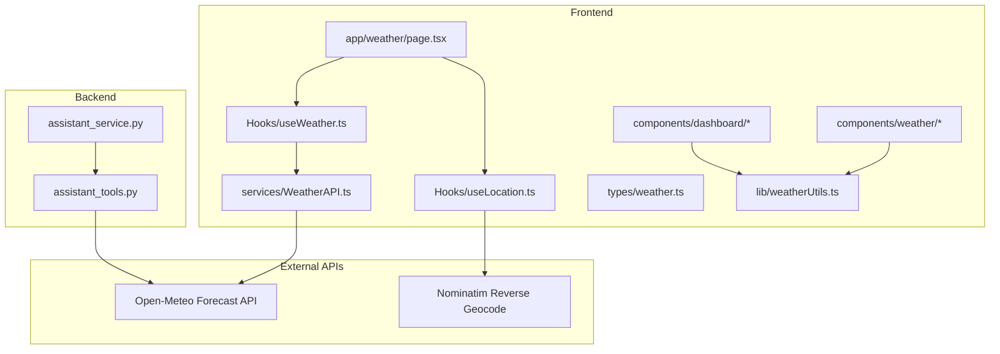
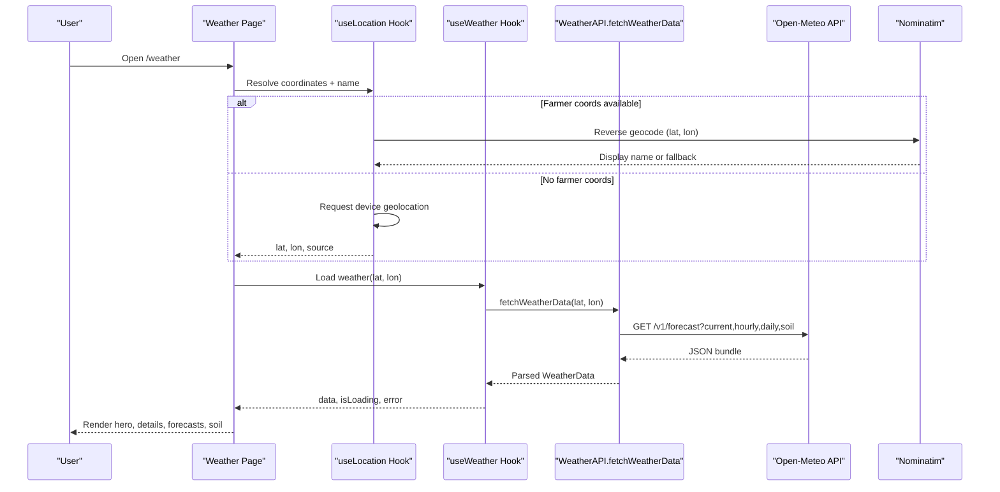
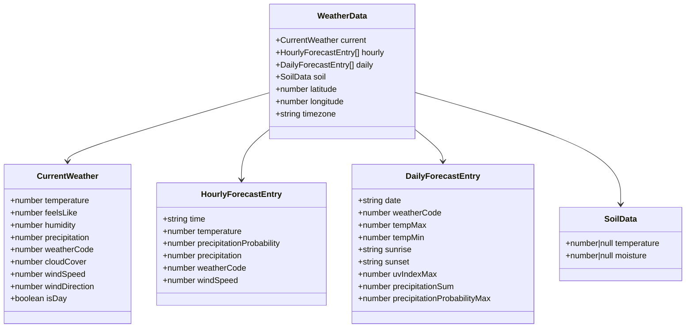
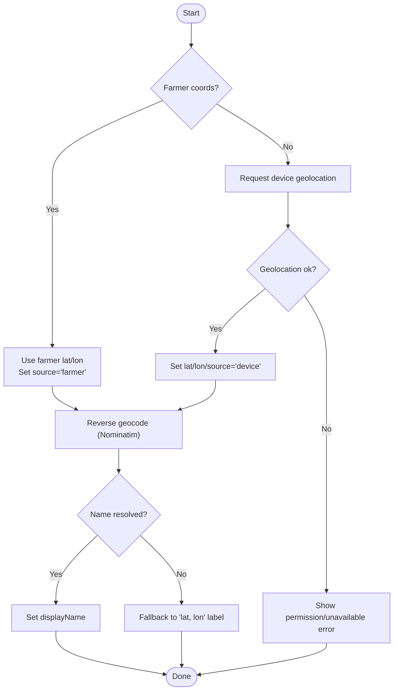
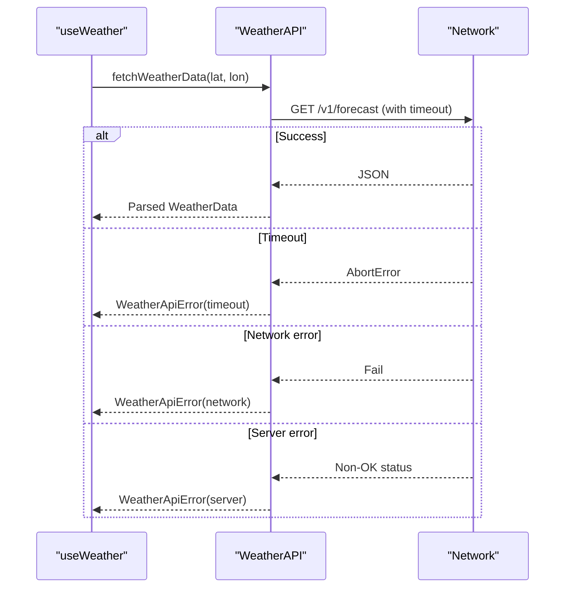
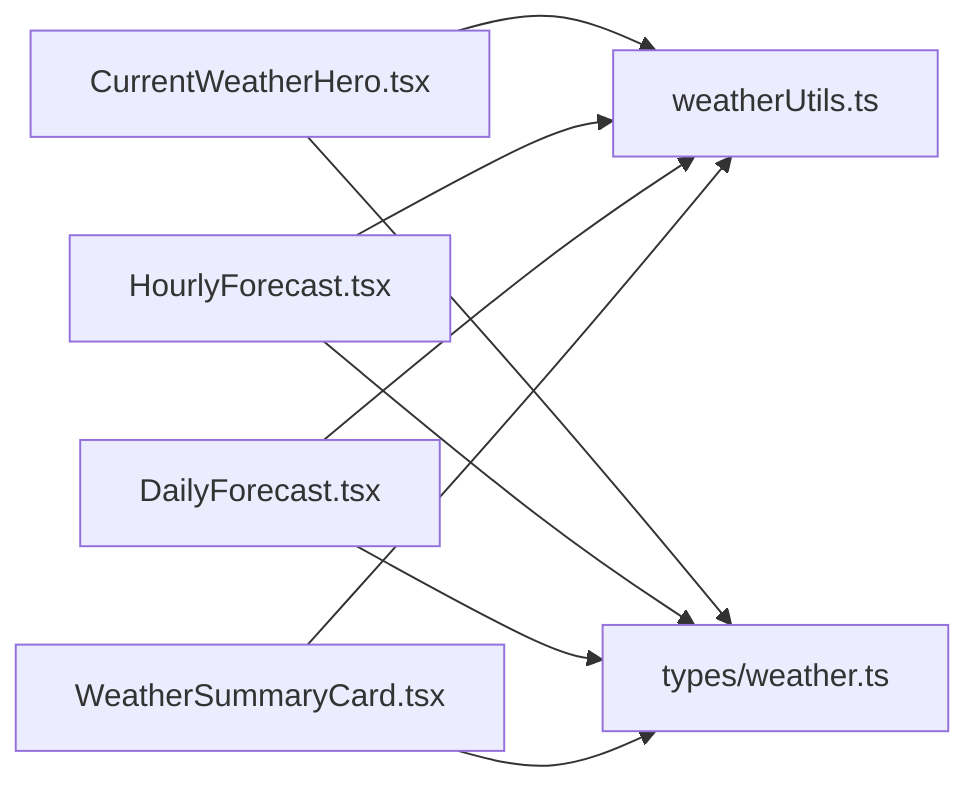
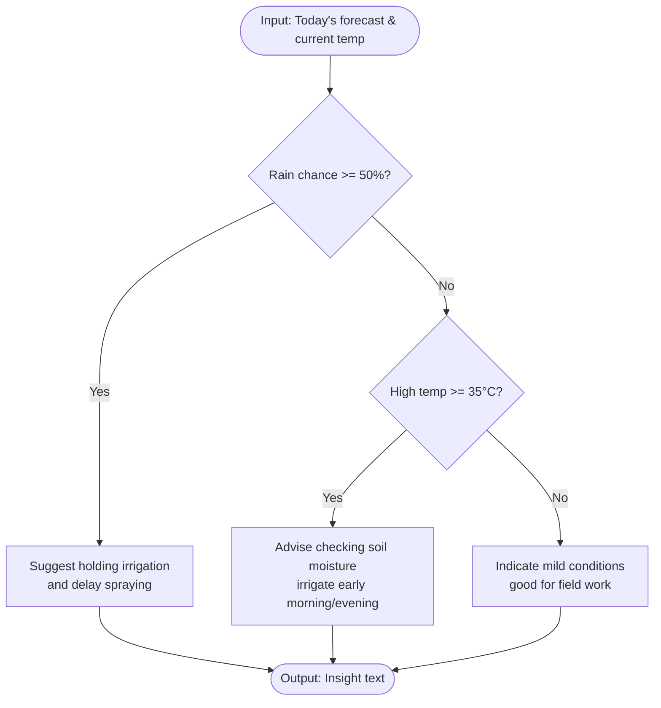
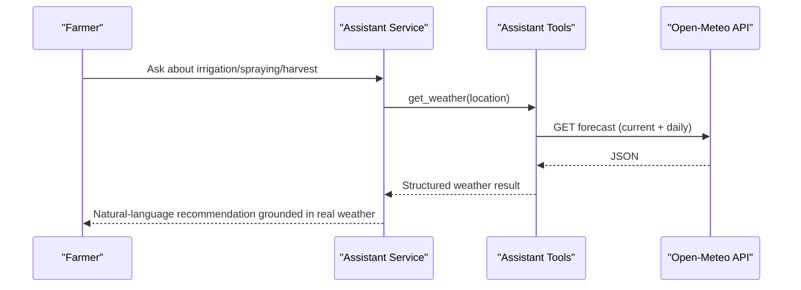
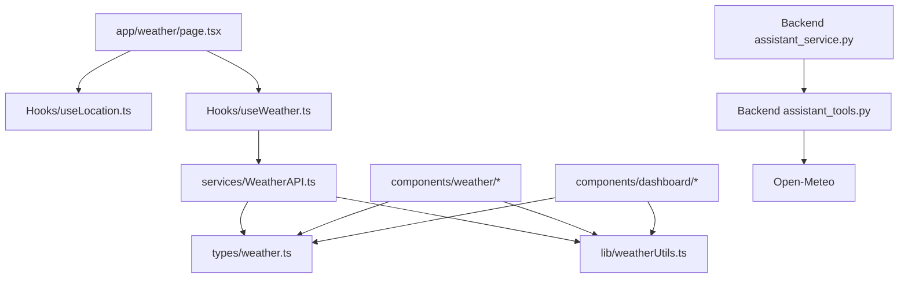

# Weather Integration

<cite>
**Referenced Files in This Document**
- [WeatherAPI.ts](file://Frontend/greenflora/services/WeatherAPI.ts)
- [useWeather.ts](file://Frontend/greenflora/Hooks/useWeather.ts)
- [weather.ts](file://Frontend/greenflora/types/weather.ts)
- [weatherUtils.ts](file://Frontend/greenflora/lib/weatherUtils.ts)
- [page.tsx](file://Frontend/greenflora/app/weather/page.tsx)
- [CurrentWeatherHero.tsx](file://Frontend/greenflora/components/weather/CurrentWeatherHero.tsx)
- [HourlyForecast.tsx](file://Frontend/greenflora/components/weather/HourlyForecast.tsx)
- [DailyForecast.tsx](file://Frontend/greenflora/components/weather/DailyForecast.tsx)
- [WeatherSummaryCard.tsx](file://Frontend/greenflora/components/dashboard/WeatherSummaryCard.tsx)
- [FarmingInsights.tsx](file://Frontend/greenflora/components/dashboard/FarmingInsights.tsx)
- [useLocation.ts](file://Frontend/greenflora/Hooks/useLocation.ts)
- [assistant_tools.py](file://Backend/services/assistant_tools.py)
- [assistant_service.py](file://Backend/services/assistant_service.py)
</cite>

## Table of Contents
1. Introduction
2. Project Structure
3. Core Components
4. Architecture Overview
5. Detailed Component Analysis
6. Dependency Analysis
7. Performance Considerations
8. Troubleshooting Guide
9. Conclusion

## Introduction
This document explains Green-Flora’s weather integration with the Open-Meteo API and how weather data is transformed into actionable agricultural recommendations across the frontend and backend. It covers:
- Location-based queries using farmer profile coordinates or device geolocation, with reverse geocoding for human-readable location names.
- Data fetching from Open-Meteo, including current conditions, hourly forecast (24 hours), daily forecast (7 days), and soil metrics.
- Transformation of raw API responses into application-specific types consumed by UI components.
- Frontend components that display current conditions, forecasts, and soil insights.
- Backend assistant integration that uses weather to provide contextual farming advice.
- Error handling strategies for network issues and timeouts, plus offline fallbacks in the UI.

## Project Structure
The weather feature spans several layers:
- Types define the internal shapes for weather data and map to Open-Meteo response fields.
- A service layer calls Open-Meteo and Nominatim, handles timeouts, and parses responses.
- React hooks encapsulate loading, error, and refresh logic for weather and location resolution.
- The weather page orchestrates location resolution and renders multiple weather components.
- Dashboard and insight cards reuse weather data to present concise summaries and recommendations.
- Backend assistant tools call Open-Meteo to support conversational weather-aware guidance.

**Diagram sources**
- [page.tsx:41-66](file://Frontend/greenflora/app/weather/page.tsx#L41-L66)
- [useLocation.ts:49-163](file://Frontend/greenflora/Hooks/useLocation.ts#L49-L163)
- [useWeather.ts:21-56](file://Frontend/greenflora/Hooks/useWeather.ts#L21-L56)
- [WeatherAPI.ts:141-222](file://Frontend/greenflora/services/WeatherAPI.ts#L141-L222)
- [assistant_tools.py:255-319](file://Backend/services/assistant_tools.py#L255-L319)
- [assistant_service.py:880-903](file://Backend/services/assistant_service.py#L880-L903)

**Section sources**
- [page.tsx:41-66](file://Frontend/greenflora/app/weather/page.tsx#L41-L66)
- [useLocation.ts:49-163](file://Frontend/greenflora/Hooks/useLocation.ts#L49-L163)
- [useWeather.ts:21-56](file://Frontend/greenflora/Hooks/useWeather.ts#L21-L56)
- [WeatherAPI.ts:141-222](file://Frontend/greenflora/services/WeatherAPI.ts#L141-L222)
- [assistant_tools.py:255-319](file://Backend/services/assistant_tools.py#L255-L319)
- [assistant_service.py:880-903](file://Backend/services/assistant_service.py#L880-L903)

## Core Components
- Weather data model: Internal interfaces describe current conditions, hourly/daily forecasts, soil metrics, and metadata like timezone and coordinates.
- Weather API client: Single request fetches current, hourly, daily, and soil data; includes timeout and error classification.
- Location resolver: Uses farmer profile coordinates first, then device geolocation; reverse geocodes to a readable name via Nominatim.
- Weather hook: Encapsulates loading/error/refresh lifecycle for weather data based on resolved coordinates.
- Presentation utilities: Maps WMO codes to labels/categories, formats times and days, computes UV and soil moisture labels.
- UI components: Hero card for current conditions, horizontal hourly strip, vertical 7-day list, and dashboard summary cards.
- Assistant integration: Backend tool fetches weather for conversational recommendations and enforces data integrity rules.

**Section sources**
- [weather.ts:9-60](file://Frontend/greenflora/types/weather.ts#L9-L60)
- [WeatherAPI.ts:141-222](file://Frontend/greenflora/services/WeatherAPI.ts#L141-L222)
- [useLocation.ts:49-163](file://Frontend/greenflora/Hooks/useLocation.ts#L49-L163)
- [useWeather.ts:21-56](file://Frontend/greenflora/Hooks/useWeather.ts#L21-L56)
- [weatherUtils.ts:14-285](file://Frontend/greenflora/lib/weatherUtils.ts#L14-L285)
- [CurrentWeatherHero.tsx:25-113](file://Frontend/greenflora/components/weather/CurrentWeatherHero.tsx#L25-L113)
- [HourlyForecast.tsx:18-79](file://Frontend/greenflora/components/weather/HourlyForecast.tsx#L18-L79)
- [DailyForecast.tsx:19-104](file://Frontend/greenflora/components/weather/DailyForecast.tsx#L19-L104)
- [WeatherSummaryCard.tsx:37-124](file://Frontend/greenflora/components/dashboard/WeatherSummaryCard.tsx#L37-L124)
- [assistant_tools.py:255-319](file://Backend/services/assistant_tools.py#L255-L319)
- [assistant_service.py:880-903](file://Backend/services/assistant_service.py#L880-L903)

## Architecture Overview
The system follows a clear separation of concerns:
- Location resolution determines coordinates and a human-readable place name.
- Weather data is fetched once per coordinate set, parsed into typed structures, and cached in component state.
- UI components consume the typed data to render visuals and insights.
- The assistant tool independently fetches weather for conversational use, adhering to strict data integrity guidelines.

**Diagram sources**
- [page.tsx:41-66](file://Frontend/greenflora/app/weather/page.tsx#L41-L66)
- [useLocation.ts:49-163](file://Frontend/greenflora/Hooks/useLocation.ts#L49-L163)
- [useWeather.ts:21-56](file://Frontend/greenflora/Hooks/useWeather.ts#L21-L56)
- [WeatherAPI.ts:141-222](file://Frontend/greenflora/services/WeatherAPI.ts#L141-L222)

## Detailed Component Analysis

### Weather Data Model and Parsing
- Types define clean interfaces for current, hourly, daily, and soil data, plus an interface mapping the raw Open-Meteo response.
- The parser converts arrays and nested objects into aligned arrays of entries keyed by time/date, and extracts the latest valid soil values.

**Diagram sources**
- [weather.ts:9-60](file://Frontend/greenflora/types/weather.ts#L9-L60)

**Section sources**
- [weather.ts:9-60](file://Frontend/greenflora/types/weather.ts#L9-L60)
- [weather.ts:82-123](file://Frontend/greenflora/types/weather.ts#L82-L123)
- [WeatherAPI.ts:224-290](file://Frontend/greenflora/services/WeatherAPI.ts#L224-L290)

### Location Resolution and Reverse Geocoding
- Priority: farmer profile coordinates → device geolocation.
- Reverse geocoding via Nominatim produces a locality, district/province/country, and a formatted display name; falls back to coordinate string if unavailable.
- The hook tracks loading states and prevents stale updates using a request ID reference.

**Diagram sources**
- [useLocation.ts:49-163](file://Frontend/greenflora/Hooks/useLocation.ts#L49-L163)
- [WeatherAPI.ts:35-68](file://Frontend/greenflora/services/WeatherAPI.ts#L35-L68)

**Section sources**
- [useLocation.ts:49-163](file://Frontend/greenflora/Hooks/useLocation.ts#L49-L163)
- [WeatherAPI.ts:35-68](file://Frontend/greenflora/services/WeatherAPI.ts#L35-L68)

### Weather Fetching and Error Handling
- A single request retrieves current, hourly (24h), daily (7d), and soil metrics.
- Timeouts are enforced with AbortController; non-ok responses are wrapped into typed errors; network/timeout/server failures are distinguished.
- The hook surfaces loading, error, and refresh capabilities to the UI.

**Diagram sources**
- [useWeather.ts:21-56](file://Frontend/greenflora/Hooks/useWeather.ts#L21-L56)
- [WeatherAPI.ts:141-222](file://Frontend/greenflora/services/WeatherAPI.ts#L141-L222)

**Section sources**
- [useWeather.ts:21-56](file://Frontend/greenflora/Hooks/useWeather.ts#L21-L56)
- [WeatherAPI.ts:141-222](file://Frontend/greenflora/services/WeatherAPI.ts#L141-L222)

### Frontend Weather Components
- CurrentWeatherHero: Displays large temperature, condition label, animated icon, location badge, and actions (change location, refresh).
- HourlyForecast: Horizontal strip showing next 24 hours with icons, temperatures, and rain probability bars.
- DailyForecast: Vertical 7-day list with min/max temperature bars and precipitation probabilities.
- WeatherSummaryCard: Compact dashboard card linking to full weather page; shows current temp, today’s high/low, and rain chance.

**Diagram sources**
- [CurrentWeatherHero.tsx:25-113](file://Frontend/greenflora/components/weather/CurrentWeatherHero.tsx#L25-L113)
- [HourlyForecast.tsx:18-79](file://Frontend/greenflora/components/weather/HourlyForecast.tsx#L18-L79)
- [DailyForecast.tsx:19-104](file://Frontend/greenflora/components/weather/DailyForecast.tsx#L19-L104)
- [WeatherSummaryCard.tsx:37-124](file://Frontend/greenflora/components/dashboard/WeatherSummaryCard.tsx#L37-L124)
- [weatherUtils.ts:14-285](file://Frontend/greenflora/lib/weatherUtils.ts#L14-L285)
- [weather.ts:9-60](file://Frontend/greenflora/types/weather.ts#L9-L60)

**Section sources**
- [CurrentWeatherHero.tsx:25-113](file://Frontend/greenflora/components/weather/CurrentWeatherHero.tsx#L25-L113)
- [HourlyForecast.tsx:18-79](file://Frontend/greenflora/components/weather/HourlyForecast.tsx#L18-L79)
- [DailyForecast.tsx:19-104](file://Frontend/greenflora/components/weather/DailyForecast.tsx#L19-L104)
- [WeatherSummaryCard.tsx:37-124](file://Frontend/greenflora/components/dashboard/WeatherSummaryCard.tsx#L37-L124)

### Agricultural Recommendation Engine
- Dashboard insights derive simple, actionable guidance from real-time weather:
  - If rain chance is high, suggest holding irrigation and delaying spraying.
  - If highs are very hot, advise checking soil moisture and irrigating at cooler times.
  - Otherwise, indicate favorable conditions for field work.
- These rules are implemented in the dashboard insight builder and rely on the first day’s forecast and current temperature.

**Diagram sources**
- [FarmingInsights.tsx:33-54](file://Frontend/greenflora/components/dashboard/FarmingInsights.tsx#L33-L54)

**Section sources**
- [FarmingInsights.tsx:33-54](file://Frontend/greenflora/components/dashboard/FarmingInsights.tsx#L33-L54)

### Assistant Integration
- The backend assistant tool calls Open-Meteo to retrieve current and 7-day forecast data for the farmer’s saved location.
- The assistant service prompt instructs the model to always use get_weather for decisions about spraying, irrigation, sowing, or harvesting, and to never invent data.
- Errors are handled gracefully, returning availability flags and messages when weather cannot be retrieved.

**Diagram sources**
- [assistant_tools.py:255-319](file://Backend/services/assistant_tools.py#L255-L319)
- [assistant_service.py:880-903](file://Backend/services/assistant_service.py#L880-L903)

**Section sources**
- [assistant_tools.py:255-319](file://Backend/services/assistant_tools.py#L255-L319)
- [assistant_service.py:880-903](file://Backend/services/assistant_service.py#L880-L903)

## Dependency Analysis
- The weather page depends on location and weather hooks to resolve inputs and load data.
- UI components depend on shared utilities for WMO code mapping and formatting.
- The backend assistant depends on the same Open-Meteo endpoint but serves conversational contexts rather than UI rendering.

**Diagram sources**
- [page.tsx:41-66](file://Frontend/greenflora/app/weather/page.tsx#L41-L66)
- [useLocation.ts:49-163](file://Frontend/greenflora/Hooks/useLocation.ts#L49-L163)
- [useWeather.ts:21-56](file://Frontend/greenflora/Hooks/useWeather.ts#L21-L56)
- [WeatherAPI.ts:141-222](file://Frontend/greenflora/services/WeatherAPI.ts#L141-L222)
- [weatherUtils.ts:14-285](file://Frontend/greenflora/lib/weatherUtils.ts#L14-L285)
- [assistant_tools.py:255-319](file://Backend/services/assistant_tools.py#L255-L319)
- [assistant_service.py:880-903](file://Backend/services/assistant_service.py#L880-L903)

**Section sources**
- [page.tsx:41-66](file://Frontend/greenflora/app/weather/page.tsx#L41-L66)
- [useLocation.ts:49-163](file://Frontend/greenflora/Hooks/useLocation.ts#L49-L163)
- [useWeather.ts:21-56](file://Frontend/greenflora/Hooks/useWeather.ts#L21-L56)
- [WeatherAPI.ts:141-222](file://Frontend/greenflora/services/WeatherAPI.ts#L141-L222)
- [weatherUtils.ts:14-285](file://Frontend/greenflora/lib/weatherUtils.ts#L14-L285)
- [assistant_tools.py:255-319](file://Backend/services/assistant_tools.py#L255-L319)
- [assistant_service.py:880-903](file://Backend/services/assistant_service.py#L880-L903)

## Performance Considerations
- Single combined Open-Meteo request reduces round-trips by fetching current, hourly, daily, and soil data together.
- Hourly forecast is limited to 24 entries starting from the current hour to minimize payload size.
- UI state caching occurs in React hooks; each component holds its own data and loading/error states.
- Timeouts prevent long hangs: 15 seconds for weather requests and 8 seconds for reverse geocoding.
- Recommendations: consider adding client-side caching (e.g., in-memory cache keyed by coordinates) and debouncing rapid refreshes if needed.

[No sources needed since this section provides general guidance]

## Troubleshooting Guide
Common issues and their handling:
- Network errors: Caught and converted to a typed error; UI displays an error state with retry option.
- Timeouts: AbortController triggers a timeout error; user sees a friendly message and can retry.
- Server errors: Non-ok HTTP responses are captured and surfaced with context.
- Location permission denied: The location hook sets an error and offers to re-prompt or direct users to update farm location in profile.
- Missing location: Dashboard and weather pages show prompts to set farm location or enable device location.

**Section sources**
- [WeatherAPI.ts:195-222](file://Frontend/greenflora/services/WeatherAPI.ts#L195-L222)
- [useWeather.ts:38-50](file://Frontend/greenflora/Hooks/useWeather.ts#L38-L50)
- [useLocation.ts:96-132](file://Frontend/greenflora/Hooks/useLocation.ts#L96-L132)
- [page.tsx:103-160](file://Frontend/greenflora/app/weather/page.tsx#L103-L160)
- [WeatherSummaryCard.tsx:45-78](file://Frontend/greenflora/components/dashboard/WeatherSummaryCard.tsx#L45-L78)

## Conclusion
Green-Flora’s weather integration combines robust data fetching, clean type-driven transformation, and intuitive UI components to deliver accurate, actionable weather information for farmers. Location resolution ensures relevance, while error handling and fallbacks maintain resilience. The assistant integrates weather into conversational advice, ensuring decisions around irrigation, spraying, and harvesting are grounded in real-time conditions. Future enhancements could include client-side caching, richer alerting, and expanded soil analytics.