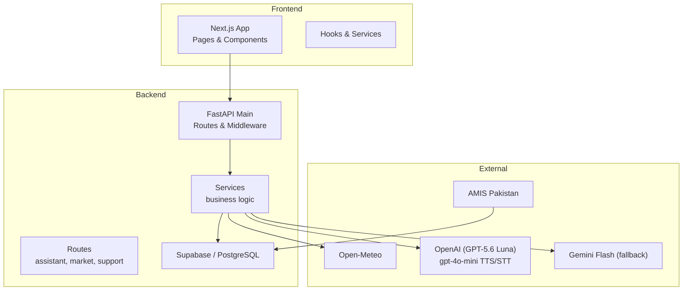
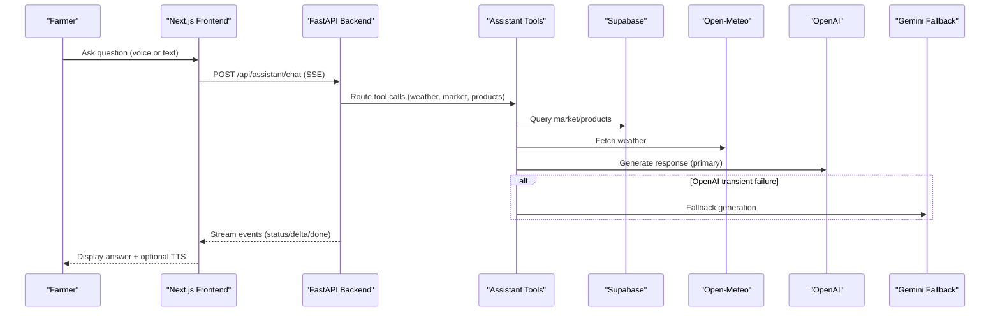
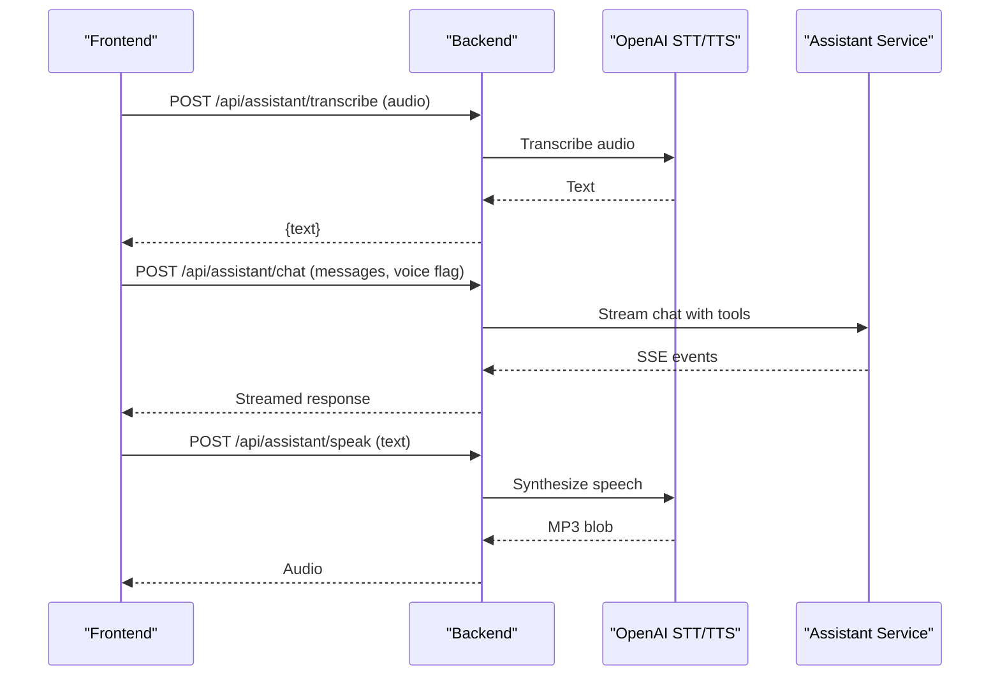
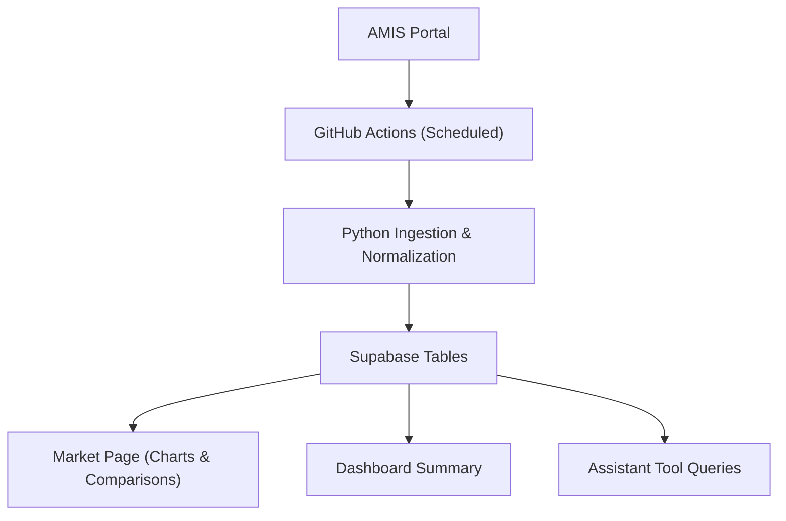
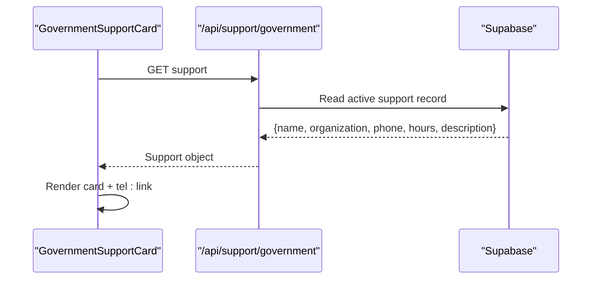
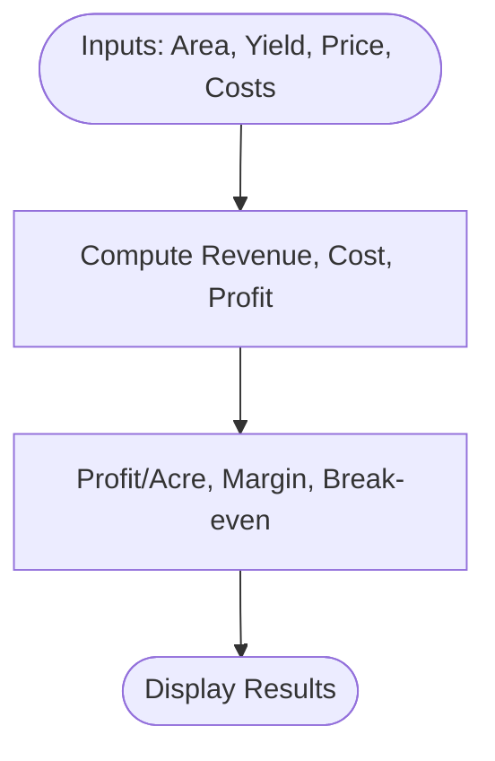
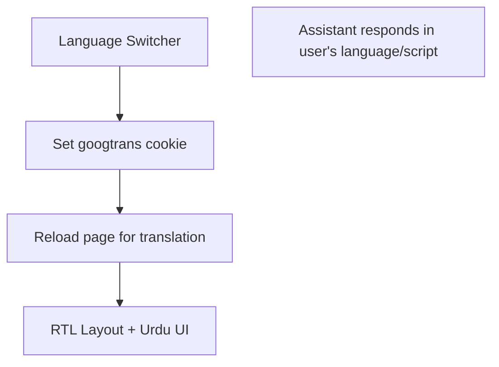
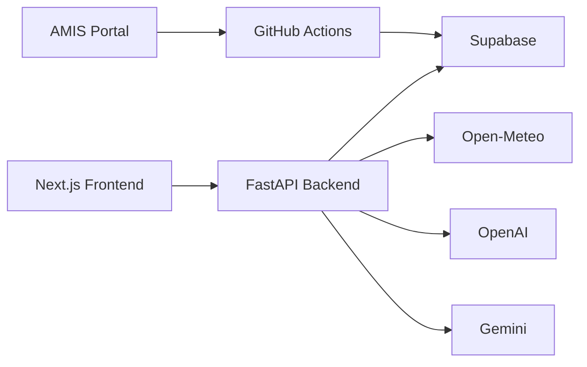

# Project Overview

<cite>
**Referenced Files in This Document**
- [README.md](file://README.md)
- [project-context.md](file://project-context.md)
- [architechture.md](file://architechture.md)
- [Backend/main.py](file://Backend/main.py)
- [Backend/routes/assistant.py](file://Backend/routes/assistant.py)
- [Backend/routes/market.py](file://Backend/routes/market.py)
- [Backend/routes/support.py](file://Backend/routes/support.py)
- [Frontend/greenflora/app/page.tsx](file://Frontend/greenflora/app/page.tsx)
- [Frontend/greenflora/components/LanguageSwitcher.tsx](file://Frontend/greenflora/components/LanguageSwitcher.tsx)
- [Frontend/greenflora/components/dashboard/GovernmentSupportCard.tsx](file://Frontend/greenflora/components/dashboard/GovernmentSupportCard.tsx)
- [Frontend/greenflora/app/profit-calculator/page.tsx](file://Frontend/greenflora/app/profit-calculator/page.tsx)
</cite>

## Table of Contents
1. Introduction
2. Project Structure
3. Core Components
4. Architecture Overview
5. Detailed Component Analysis
6. Dependency Analysis
7. Performance Considerations
8. Troubleshooting Guide
9. Conclusion

## Introduction
Green Flora is an intelligent, voice-first agricultural platform built for Pakistani farmers to bridge the technology gap with practical AI-powered tools and real-time data. The mission is to consolidate fragmented information—weather, market prices, farm economics, and government support—into one accessible dashboard that works across literacy levels and language preferences.

Key value propositions:
- AI assistant with voice interaction to answer farming questions in English, Urdu, or Roman Urdu
- Real-time market rates sourced from AMIS (Agriculture Marketing Information Service) via automated ingestion
- Weather-based insights using Open-Meteo to inform planting, irrigation, and risk decisions
- Profit calculator for deterministic farm-economics planning
- Direct access to government agricultural helplines and support services

Target audience:
- Smallholder and commercial farmers in Pakistan who need reliable, localized information and simple interfaces
- Users with varying literacy levels who benefit from voice-first interactions and clear visual dashboards

Technology stack overview:
- Frontend: Next.js, React, TypeScript, Tailwind CSS, Recharts
- Backend: Python FastAPI with REST APIs and Server-Sent Events for streaming responses
- Database: Supabase (PostgreSQL) for user profiles, market trends, and structured reference data
- AI: OpenAI Responses API (GPT-5.6 Luna) as primary model; Gemini Flash fallback; gpt-4o-mini for utility tasks including transcription and text-to-speech
- Data integrations: Open-Meteo for weather; AMIS Pakistan for market prices; hosted web search when internal data is insufficient

Accessibility and language:
- Voice-first assistant reduces typing barriers and supports mixed-language input
- Language switcher enables Urdu mode with right-to-left layout and Google Translate integration
- Assistant responds in the same language/script as the farmer’s latest message

**Section sources**
- [README.md:1-70](file://README.md#L1-L70)
- [project-context.md:6-14](file://project-context.md#L6-L14)
- [project-context.md:103-145](file://project-context.md#L103-L145)
- [project-context.md:200-265](file://project-context.md#L200-L265)
- [project-context.md:302-323](file://project-context.md#L302-L323)
- [architechture.md:1-27](file://architechture.md#L1-L27)

## Project Structure
The repository is organized into three main layers:
- Frontend (Next.js app): pages, components, hooks, services, types, and UI utilities
- Backend (FastAPI): routes, services, schemas, models, config, and dependencies
- Scraper: scheduled AMIS market-data ingestion pipeline

**Diagram sources**
- [architechture.md:1-27](file://architechture.md#L1-L27)
- [Backend/main.py:1-57](file://Backend/main.py#L1-L57)

**Section sources**
- [architechture.md:95-149](file://architechture.md#L95-L149)
- [architechture.md:150-189](file://architechture.md#L150-L189)
- [architechture.md:303-349](file://architechture.md#L303-L349)

## Core Components
- AI Assistant: tool-calling orchestration with weather, market, product lookup, and web search; SSE streaming; voice transcription and synthesis
- Market Intelligence: AMIS ingestion via GitHub Actions; normalized tables; current prices, trends, comparisons, and dashboard summaries
- Weather Insights: Open-Meteo integration delivering current conditions and 7-day forecasts used by UI and assistant tools
- Government Support: active helpline details served from database; direct call action via tel: links
- Profit Calculator: deterministic, client-side calculations for revenue, cost, profit, margin, break-even price

**Section sources**
- [Backend/routes/assistant.py:1-21](file://Backend/routes/assistant.py#L1-L21)
- [Backend/routes/market.py:1-16](file://Backend/routes/market.py#L1-L16)
- [Backend/routes/support.py:1-14](file://Backend/routes/support.py#L1-L14)
- [Frontend/greenflora/app/profit-calculator/page.tsx:35-100](file://Frontend/greenflora/app/profit-calculator/page.tsx#L35-L100)
- [project-context.md:80-101](file://project-context.md#L80-L101)
- [project-context.md:170-191](file://project-context.md#L170-L191)

## Architecture Overview
Green Flora follows a practical full-stack design:
- Frontend renders pages and collects inputs; handles loading/error states; records microphone audio; plays synthesized speech
- Backend validates requests, orchestrates external services, and streams assistant responses
- Database stores verified structured data (market, products, profiles); no vector DB required for core operation
- Scheduled ingestion updates market data independently of AI availability

**Diagram sources**
- [architechture.md:442-581](file://architechture.md#L442-L581)
- [Backend/routes/assistant.py:68-112](file://Backend/routes/assistant.py#L68-L112)

**Section sources**
- [architechture.md:33-74](file://architechture.md#L33-L74)
- [architechture.md:480-504](file://architechture.md#L480-L504)

## Detailed Component Analysis

### AI Assistant and Voice Interaction
- Streaming chat endpoint returns SSE events for status, deltas, completion, and errors
- Transcription endpoint converts recorded audio to text using OpenAI STT
- Text-to-speech endpoint returns MP3 audio for assistant replies
- Voice flow integrates with the same assistant tools and data sources as text chat

**Diagram sources**
- [Backend/routes/assistant.py:68-173](file://Backend/routes/assistant.py#L68-L173)
- [project-context.md:433-447](file://project-context.md#L433-L447)

**Section sources**
- [Backend/routes/assistant.py:1-21](file://Backend/routes/assistant.py#L1-L21)
- [Backend/routes/assistant.py:68-112](file://Backend/routes/assistant.py#L68-L112)
- [Backend/routes/assistant.py:119-173](file://Backend/routes/assistant.py#L119-L173)
- [project-context.md:130-145](file://project-context.md#L130-L145)

### Market Intelligence
- Public endpoints list commodities and provide a comprehensive overview per crop
- Data comes from AMIS via scheduled ingestion; includes current price, change, signals, trends, and distributions
- Assistant queries the same database to avoid hallucinated prices

**Diagram sources**
- [architechture.md:480-504](file://architechture.md#L480-L504)
- [Backend/routes/market.py:38-108](file://Backend/routes/market.py#L38-L108)

**Section sources**
- [Backend/routes/market.py:1-16](file://Backend/routes/market.py#L1-L16)
- [Backend/routes/market.py:38-108](file://Backend/routes/market.py#L38-L108)
- [project-context.md:80-101](file://project-context.md#L80-L101)

### Government Support Access
- Dashboard card displays active government helpline info fetched from the database
- Call Now button opens mobile dialer via tel: link constructed from stored phone number
- Endpoints return support record and availability flags without authentication

**Diagram sources**
- [Backend/routes/support.py:32-57](file://Backend/routes/support.py#L32-L57)
- [Frontend/greenflora/components/dashboard/GovernmentSupportCard.tsx:61-129](file://Frontend/greenflora/components/dashboard/GovernmentSupportCard.tsx#L61-L129)

**Section sources**
- [Backend/routes/support.py:1-14](file://Backend/routes/support.py#L1-L14)
- [Backend/routes/support.py:32-57](file://Backend/routes/support.py#L32-L57)
- [Frontend/greenflora/components/dashboard/GovernmentSupportCard.tsx:1-129](file://Frontend/greenflora/components/dashboard/GovernmentSupportCard.tsx#L1-L129)

### Profit Calculator
- Deterministic, client-side calculations based on farmer inputs
- Computes total production, expected revenue, total cost, estimated profit, profit per acre, profit margin, and break-even price
- No API or AI dependency ensures fast, predictable results

**Diagram sources**
- [Frontend/greenflora/app/profit-calculator/page.tsx:35-100](file://Frontend/greenflora/app/profit-calculator/page.tsx#L35-L100)
- [project-context.md:351-386](file://project-context.md#L351-L386)

**Section sources**
- [Frontend/greenflora/app/profit-calculator/page.tsx:21-100](file://Frontend/greenflora/app/profit-calculator/page.tsx#L21-L100)
- [project-context.md:170-191](file://project-context.md#L170-L191)
- [project-context.md:351-386](file://project-context.md#L351-L386)

### Accessibility and Language
- Language switcher toggles Urdu mode with RTL layout and Google Translate cookie
- Assistant matches language/script of the latest message and supports mixed input
- Voice layer provides speech-to-text and text-to-speech to reduce literacy barriers

**Diagram sources**
- [Frontend/greenflora/components/LanguageSwitcher.tsx:5-51](file://Frontend/greenflora/components/LanguageSwitcher.tsx#L5-L51)
- [project-context.md:302-323](file://project-context.md#L302-L323)

**Section sources**
- [Frontend/greenflora/components/LanguageSwitcher.tsx:1-51](file://Frontend/greenflora/components/LanguageSwitcher.tsx#L1-L51)
- [project-context.md:302-323](file://project-context.md#L302-L323)

## Dependency Analysis
- Frontend depends on backend REST/SSE endpoints for assistant, market, and support features
- Backend depends on Supabase for persistent data, Open-Meteo for weather, OpenAI for primary LLM and audio utilities, and Gemini for fallback
- Scheduled ingestion pipeline depends on AMIS and writes to Supabase independently of runtime services

**Diagram sources**
- [architechture.md:1-27](file://architechture.md#L1-L27)
- [architechture.md:480-504](file://architechture.md#L480-L504)

**Section sources**
- [Backend/main.py:1-57](file://Backend/main.py#L1-L57)
- [architechture.md:150-189](file://architechture.md#L150-L189)

## Performance Considerations
- Use SSE for assistant streaming to improve perceived responsiveness
- Keep deterministic calculations (profit calculator) client-side to avoid network latency and API costs
- Separate market data ingestion from runtime to ensure consistent pricing regardless of AI availability
- Prefer trusted internal data over web search to minimize token usage and maintain accuracy

[No sources needed since this section provides general guidance]

## Troubleshooting Guide
- Assistant chat stream failures: service layer emits friendly error events; frontend should retry or prompt user
- Transcription failures: return 400 or 503 with clear messages; allow typed input as fallback
- TTS failures: return 503; written answers remain available
- Market data unavailability: endpoints return 503 with “temporarily unavailable”; UI shows fallback state
- Government support unavailability: UI shows fallback card; no hard failures

**Section sources**
- [Backend/routes/assistant.py:91-112](file://Backend/routes/assistant.py#L91-L112)
- [Backend/routes/assistant.py:119-173](file://Backend/routes/assistant.py#L119-L173)
- [Backend/routes/market.py:51-108](file://Backend/routes/market.py#L51-L108)
- [Backend/routes/support.py:45-57](file://Backend/routes/support.py#L45-L57)

## Conclusion
Green Flora delivers a focused, farmer-centric platform that consolidates essential agricultural information and AI assistance into a single, accessible interface. By combining voice-first interaction, real-time market data from AMIS, weather insights, deterministic profit calculations, and direct government support, it addresses the specific needs of Pakistani farmers across literacy and language barriers. The architecture prioritizes reliability, data integrity, and simplicity while leveraging modern cloud AI and managed databases to scale sustainably.

[No sources needed since this section summarizes without analyzing specific files]